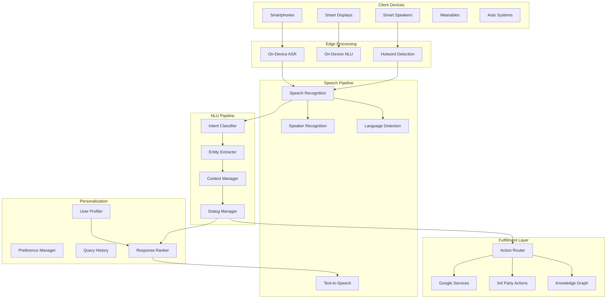

# Google Assistant: Detailed System Design

## Problem Statement

Design a comprehensive voice assistant platform that provides:
- Real-time speech recognition and synthesis
- Natural language understanding with context awareness
- Multi-turn conversation handling
- Integration with thousands of third-party services
- Multi-modal interactions (voice, text, visual)
- Personalized responses based on user context
- Support for 100+ languages

## Scale Requirements

- **Users**: 500M+ monthly active users
- **Queries**: 10B+ voice queries per day (115K QPS peak)
- **Languages**: 100+ languages and dialects
- **Integrations**: 10K+ third-party actions
- **Devices**: 1B+ devices (phones, speakers, displays)
- **Latency**: <500ms end-to-end response time
- **Availability**: 99.99% uptime

## System Architecture

### High-Level Components



## Core Components Design

### 1. Speech Recognition Pipeline

```python
class SpeechRecognitionPipeline:
    def __init__(self):
        self.acoustic_model = AcousticModel()
        self.language_model = LanguageModel()
        self.voice_activity_detector = VAD()
        self.feature_extractor = FeatureExtractor()
        
    async def process_audio_stream(self, audio_stream, user_context):
        # Step 1: Voice Activity Detection
        speech_segments = []
        async for chunk in audio_stream:
            if self.voice_activity_detector.is_speech(chunk):
                speech_segments.append(chunk)
            elif speech_segments:
                # End of utterance detected
                break
        
        # Step 2: Feature extraction
        features = self.feature_extractor.extract_features(
            audio_data=speech_segments,
            sample_rate=16000
        )
        
        # Step 3: Acoustic modeling
        phoneme_probabilities = await self.acoustic_model.decode(features)
        
        # Step 4: Language modeling with beam search
        hypotheses = await self.beam_search_decode(
            phoneme_probs=phoneme_probabilities,
            language_model=self.get_personalized_lm(user_context),
            beam_width=10
        )
        
        # Step 5: Contextual reranking
        best_hypothesis = await self.rerank_hypotheses(
            hypotheses=hypotheses,
            user_context=user_context
        )
        
        return TranscriptionResult(
            text=best_hypothesis.text,
            confidence=best_hypothesis.confidence,
            alternatives=hypotheses[:3],
            language=best_hypothesis.detected_language
        )
    
    async def beam_search_decode(self, phoneme_probs, language_model, beam_width):
        beams = [Beam(text="", score=0.0)]
        
        for time_step in phoneme_probs:
            new_beams = []
            
            for beam in beams:
                # Extend each beam with possible next words
                for word, acoustic_score in self.get_word_candidates(time_step):
                    lm_score = language_model.score_sequence(
                        beam.text + " " + word
                    )
                    
                    new_beam = Beam(
                        text=beam.text + " " + word,
                        score=beam.score + acoustic_score + lm_score
                    )
                    new_beams.append(new_beam)
            
            # Keep top beams
            beams = sorted(new_beams, key=lambda b: b.score, reverse=True)[:beam_width]
        
        return beams

class StreamingASR:
    def __init__(self):
        self.encoder = StreamingEncoder()
        self.decoder = StreamingDecoder()
        self.buffer = AudioBuffer()
        
    async def stream_recognize(self, audio_stream):
        async for chunk in audio_stream:
            self.buffer.add(chunk)
            
            # Process when we have enough audio
            if self.buffer.duration_ms >= 100:  # 100ms chunks
                features = self.extract_streaming_features(self.buffer)
                
                # Streaming encode
                encoder_state = await self.encoder.encode_chunk(
                    features=features,
                    previous_state=self.encoder.get_state()
                )
                
                # Streaming decode
                partial_result = await self.decoder.decode_partial(
                    encoder_output=encoder_state,
                    previous_hypothesis=self.decoder.get_hypothesis()
                )
                
                yield StreamingResult(
                    transcript=partial_result.text,
                    is_final=partial_result.is_endpoint,
                    confidence=partial_result.confidence
                )
                
                if partial_result.is_endpoint:
                    self.reset_streaming_state()
```

### 2. Natural Language Understanding

```python
class NLUPipeline:
    def __init__(self):
        self.intent_classifier = IntentClassifier()
        self.entity_extractor = EntityExtractor()
        self.dependency_parser = DependencyParser()
        self.coreference_resolver = CoreferenceResolver()
        
    async def understand(self, utterance, conversation_context):
        # Step 1: Tokenization and preprocessing
        tokens = self.tokenize(utterance)
        
        # Step 2: Multi-task prediction
        nlu_features = await self.extract_features(
            tokens=tokens,
            context=conversation_context
        )
        
        # Step 3: Intent classification
        intent_results = await self.intent_classifier.classify(
            features=nlu_features,
            previous_intents=conversation_context.intent_history
        )
        
        # Step 4: Entity extraction
        entities = await self.entity_extractor.extract(
            tokens=tokens,
            features=nlu_features,
            intent=intent_results.top_intent
        )
        
        # Step 5: Coreference resolution
        resolved_entities = await self.coreference_resolver.resolve(
            entities=entities,
            context=conversation_context,
            utterance=utterance
        )
        
        # Step 6: Semantic parsing
        semantic_frame = await self.parse_semantics(
            intent=intent_results.top_intent,
            entities=resolved_entities,
            parse_tree=await self.dependency_parser.parse(tokens)
        )
        
        return NLUResult(
            intent=intent_results.top_intent,
            intent_confidence=intent_results.confidence,
            entities=resolved_entities,
            semantic_frame=semantic_frame,
            ambiguities=self.detect_ambiguities(intent_results, entities)
        )

class IntentClassifier:
    def __init__(self):
        self.bert_encoder = BertEncoder()
        self.intent_heads = self.load_intent_heads()
        self.hierarchical_classifier = HierarchicalIntentClassifier()
        
    async def classify(self, features, previous_intents):
        # BERT encoding
        embeddings = await self.bert_encoder.encode(features.tokens)
        
        # Hierarchical classification
        # First, broad category (e.g., "media", "productivity", "smart_home")
        category = await self.hierarchical_classifier.classify_category(
            embeddings=embeddings,
            context_features=features.context_embedding
        )
        
        # Then, specific intent within category
        intent_logits = await self.intent_heads[category].predict(embeddings)
        
        # Apply conversational context
        context_adjusted_logits = self.apply_context_bias(
            logits=intent_logits,
            previous_intents=previous_intents,
            transition_model=self.intent_transition_model
        )
        
        # Get top intents with scores
        top_intents = self.get_top_k_intents(
            logits=context_adjusted_logits,
            k=5
        )
        
        return IntentClassificationResult(
            top_intent=top_intents[0],
            alternatives=top_intents[1:],
            confidence=self.calculate_confidence(context_adjusted_logits)
        )
```

### 3. Context Management

```python
class ContextManager:
    def __init__(self):
        self.conversation_store = ConversationStore()
        self.context_encoder = ContextEncoder()
        self.relevance_scorer = RelevanceScorer()
        
    async def get_context(self, user_id, session_id):
        # Retrieve conversation history
        conversation = await self.conversation_store.get_conversation(
            user_id=user_id,
            session_id=session_id
        )
        
        # Extract relevant context
        context = ConversationContext(
            turns=conversation.recent_turns[-10:],  # Last 10 turns
            entities=self.extract_salient_entities(conversation),
            user_preferences=await self.get_user_preferences(user_id),
            device_context=await self.get_device_context(session_id),
            temporal_context=self.get_temporal_context(),
            location_context=await self.get_location_context(user_id)
        )
        
        # Encode context for downstream use
        context.embedding = await self.context_encoder.encode(context)
        
        return context
    
    async def update_context(self, context, nlu_result, response):
        # Add new turn to conversation
        new_turn = ConversationTurn(
            utterance=nlu_result.original_text,
            intent=nlu_result.intent,
            entities=nlu_result.entities,
            response=response,
            timestamp=datetime.now()
        )
        
        context.turns.append(new_turn)
        
        # Update entity tracking
        for entity in nlu_result.entities:
            self.update_entity_salience(context, entity)
        
        # Detect topic shifts
        if self.detect_topic_shift(context.turns):
            context.mark_topic_boundary()
        
        # Persist updated context
        await self.conversation_store.update_conversation(
            user_id=context.user_id,
            session_id=context.session_id,
            turns=context.turns
        )
        
        return context

class EntitySalienceTracker:
    def __init__(self):
        self.salience_scores = {}
        self.decay_factor = 0.9
        
    def update_salience(self, entities, mentioned_entities):
        # Decay existing scores
        for entity_id in self.salience_scores:
            self.salience_scores[entity_id] *= self.decay_factor
        
        # Boost mentioned entities
        for entity in mentioned_entities:
            entity_id = self.get_entity_id(entity)
            self.salience_scores[entity_id] = (
                self.salience_scores.get(entity_id, 0) + 1.0
            )
        
        # Remove low salience entities
        self.salience_scores = {
            k: v for k, v in self.salience_scores.items() 
            if v > 0.1
        }
    
    def get_salient_entities(self, top_k=5):
        return sorted(
            self.salience_scores.items(),
            key=lambda x: x[1],
            reverse=True
        )[:top_k]
```

### 4. Dialog Management

```python
class DialogManager:
    def __init__(self):
        self.policy_network = DialogPolicyNetwork()
        self.template_generator = ResponseTemplateGenerator()
        self.clarification_detector = ClarificationDetector()
        
    async def manage_dialog(self, nlu_result, context):
        # Check if clarification needed
        if self.clarification_detector.needs_clarification(nlu_result):
            return await self.generate_clarification_request(
                ambiguities=nlu_result.ambiguities,
                context=context
            )
        
        # Determine dialog act
        dialog_act = await self.policy_network.predict_act(
            intent=nlu_result.intent,
            entities=nlu_result.entities,
            context=context,
            fulfillment_constraints=await self.get_constraints(nlu_result)
        )
        
        # Handle multi-turn scenarios
        if dialog_act.requires_followup:
            return await self.handle_multi_turn(
                dialog_act=dialog_act,
                context=context
            )
        
        # Generate response frame
        response_frame = await self.generate_response_frame(
            dialog_act=dialog_act,
            nlu_result=nlu_result,
            context=context
        )
        
        return response_frame
    
    async def handle_multi_turn(self, dialog_act, context):
        if dialog_act.type == 'slot_filling':
            # Identify missing required slots
            missing_slots = self.identify_missing_slots(
                required_slots=dialog_act.required_slots,
                filled_slots=dialog_act.filled_slots
            )
            
            # Generate prompt for next required slot
            return self.generate_slot_prompt(
                slot=missing_slots[0],
                context=context
            )
            
        elif dialog_act.type == 'confirmation':
            # Generate confirmation request
            return self.generate_confirmation(
                action=dialog_act.action_to_confirm,
                entities=dialog_act.entities_to_confirm
            )
            
        elif dialog_act.type == 'disambiguation':
            # Present options to user
            return self.generate_disambiguation(
                options=dialog_act.ambiguous_options,
                context=context
            )

class ResponseGenerator:
    def __init__(self):
        self.template_engine = TemplateEngine()
        self.neural_generator = NeuralResponseGenerator()
        self.personality_model = PersonalityModel()
        
    async def generate_response(self, response_frame, user_profile):
        # Determine generation strategy
        if response_frame.use_template:
            base_response = await self.template_engine.fill_template(
                template_id=response_frame.template_id,
                slots=response_frame.slots
            )
        else:
            # Neural generation for open-ended responses
            base_response = await self.neural_generator.generate(
                intent=response_frame.intent,
                context=response_frame.context,
                constraints=response_frame.constraints
            )
        
        # Apply personality and user preferences
        personalized_response = await self.personality_model.adapt_response(
            response=base_response,
            user_preferences=user_profile.communication_style,
            formality_level=user_profile.formality_preference
        )
        
        # Add contextual markers (e.g., "By the way", "Also")
        final_response = self.add_discourse_markers(
            response=personalized_response,
            context=response_frame.context
        )
        
        return final_response
```

### 5. Action Fulfillment

```python
class ActionRouter:
    def __init__(self):
        self.action_registry = ActionRegistry()
        self.capability_matcher = CapabilityMatcher()
        self.auth_manager = AuthManager()
        
    async def route_request(self, intent, entities, user_context):
        # Find capable providers
        providers = await self.capability_matcher.find_providers(
            intent=intent,
            required_entities=entities,
            user_location=user_context.location
        )
        
        # Rank providers
        ranked_providers = await self.rank_providers(
            providers=providers,
            user_preferences=user_context.preferences,
            quality_scores=await self.get_provider_quality_scores(providers)
        )
        
        # Try providers in order
        for provider in ranked_providers:
            try:
                # Check authentication
                if provider.requires_auth:
                    auth_token = await self.auth_manager.get_token(
                        user_id=user_context.user_id,
                        provider_id=provider.id
                    )
                    if not auth_token:
                        continue
                
                # Execute action
                result = await self.execute_action(
                    provider=provider,
                    intent=intent,
                    entities=entities,
                    auth_token=auth_token
                )
                
                if result.success:
                    return result
                    
            except ProviderException as e:
                # Log and try next provider
                await self.log_provider_error(provider.id, e)
                continue
        
        # Fallback response
        return self.generate_fallback_response(intent, entities)

class ThirdPartyActionExecutor:
    def __init__(self):
        self.timeout_ms = 2000  # 2 second timeout
        self.circuit_breaker = CircuitBreaker()
        
    async def execute(self, provider, request):
        # Check circuit breaker
        if self.circuit_breaker.is_open(provider.id):
            raise ProviderUnavailableError(f"Provider {provider.id} circuit open")
        
        try:
            # Build provider-specific request
            provider_request = await self.build_provider_request(
                provider=provider,
                intent=request.intent,
                entities=request.entities,
                session_id=request.session_id
            )
            
            # Execute with timeout
            response = await asyncio.wait_for(
                self.call_provider_api(provider, provider_request),
                timeout=self.timeout_ms / 1000
            )
            
            # Validate response
            validated_response = await self.validate_response(
                provider=provider,
                response=response
            )
            
            # Update circuit breaker
            self.circuit_breaker.record_success(provider.id)
            
            return ActionResult(
                success=True,
                provider_id=provider.id,
                response=validated_response
            )
            
        except asyncio.TimeoutError:
            self.circuit_breaker.record_failure(provider.id)
            raise ProviderTimeoutError(f"Provider {provider.id} timed out")
        except Exception as e:
            self.circuit_breaker.record_failure(provider.id)
            raise
```

### 6. Text-to-Speech Generation

```python
class TextToSpeechPipeline:
    def __init__(self):
        self.text_analyzer = TextAnalyzer()
        self.prosody_predictor = ProsodyPredictor()
        self.acoustic_model = TacotronModel()
        self.vocoder = WaveGlowVocoder()
        
    async def synthesize_speech(self, text, voice_settings, context):
        # Step 1: Text analysis and normalization
        analyzed_text = await self.text_analyzer.analyze(
            text=text,
            language=voice_settings.language,
            expand_abbreviations=True,
            convert_numbers=True
        )
        
        # Step 2: Predict prosody (pitch, duration, emphasis)
        prosody_features = await self.prosody_predictor.predict(
            text=analyzed_text,
            emotion=context.desired_emotion,
            speaking_rate=voice_settings.speed
        )
        
        # Step 3: Generate mel-spectrogram
        mel_spectrogram = await self.acoustic_model.generate_mel(
            phonemes=analyzed_text.phonemes,
            prosody=prosody_features,
            speaker_embedding=voice_settings.speaker_embedding
        )
        
        # Step 4: Neural vocoding
        audio_waveform = await self.vocoder.generate_audio(
            mel_spectrogram=mel_spectrogram,
            sample_rate=24000
        )
        
        # Step 5: Post-processing
        processed_audio = await self.post_process_audio(
            audio=audio_waveform,
            target_loudness=voice_settings.loudness,
            noise_gate=True
        )
        
        return SpeechResult(
            audio_data=processed_audio,
            duration_ms=len(processed_audio) / 24,
            visemes=self.generate_visemes(analyzed_text.phonemes)
        )

class StreamingTTS:
    def __init__(self):
        self.chunk_size = 5  # words
        self.lookahead = 10  # words
        
    async def stream_synthesize(self, text_stream):
        buffer = []
        
        async for text_chunk in text_stream:
            buffer.extend(text_chunk.split())
            
            while len(buffer) >= self.chunk_size + self.lookahead:
                # Process chunk with lookahead for better prosody
                synthesis_chunk = ' '.join(buffer[:self.chunk_size])
                lookahead_context = ' '.join(buffer[self.chunk_size:self.chunk_size + self.lookahead])
                
                # Generate audio for chunk
                audio_chunk = await self.synthesize_chunk(
                    text=synthesis_chunk,
                    following_context=lookahead_context
                )
                
                yield audio_chunk
                
                # Remove processed words
                buffer = buffer[self.chunk_size:]
        
        # Process remaining buffer
        if buffer:
            final_audio = await self.synthesize_chunk(' '.join(buffer), "")
            yield final_audio
```

## Infrastructure Design

### 1. Global Request Routing

```python
class GlobalRequestRouter:
    def __init__(self):
        self.edge_locations = self.load_edge_locations()
        self.load_balancer = GeoLoadBalancer()
        self.latency_predictor = LatencyPredictor()
        
    async def route_request(self, request, user_location):
        # Find optimal edge location
        edge_scores = []
        for edge in self.edge_locations:
            score = await self.calculate_edge_score(
                edge=edge,
                user_location=user_location,
                current_load=await self.get_edge_load(edge),
                capabilities=edge.available_models
            )
            edge_scores.append((edge, score))
        
        # Select best edge
        best_edge = max(edge_scores, key=lambda x: x[1])[0]
        
        # Route to edge
        return await self.route_to_edge(request, best_edge)
    
    async def calculate_edge_score(self, edge, user_location, current_load, capabilities):
        # Network latency
        network_latency = self.latency_predictor.predict(
            source=user_location,
            destination=edge.location
        )
        
        # Processing capacity
        capacity_score = 1.0 - (current_load / edge.max_capacity)
        
        # Model availability
        model_score = 1.0 if request.required_models.issubset(capabilities) else 0.5
        
        # Combined score
        return (
            0.5 * (100 / network_latency) +  # Lower latency is better
            0.3 * capacity_score +
            0.2 * model_score
        )
```

### 2. Model Serving Infrastructure

```python
class ModelServingCluster:
    def __init__(self):
        self.model_instances = {}
        self.gpu_pool = GPUResourcePool()
        self.model_cache = ModelCache()
        
    async def serve_prediction(self, model_name, input_data, priority='normal'):
        # Get or load model
        model = await self.get_model_instance(model_name)
        
        # Allocate GPU resources
        gpu_allocation = await self.gpu_pool.allocate(
            model_requirements=model.gpu_requirements,
            priority=priority
        )
        
        try:
            # Run inference
            with gpu_allocation:
                result = await model.predict(
                    input_data=input_data,
                    gpu_device=gpu_allocation.device_id
                )
            
            return result
            
        finally:
            # Release GPU resources
            await self.gpu_pool.release(gpu_allocation)
    
    async def get_model_instance(self, model_name):
        if model_name not in self.model_instances:
            # Check cache
            cached_model = await self.model_cache.get(model_name)
            if cached_model:
                self.model_instances[model_name] = cached_model
            else:
                # Load from storage
                model = await self.load_model_from_storage(model_name)
                self.model_instances[model_name] = model
                await self.model_cache.put(model_name, model)
        
        return self.model_instances[model_name]

class ModelVersionManager:
    def __init__(self):
        self.version_map = {}
        self.canary_rollout = CanaryRollout()
        
    async def get_model_version(self, model_name, user_id):
        # Check if user is in canary
        if self.canary_rollout.is_user_in_canary(user_id, model_name):
            return self.version_map[model_name]['canary']
        else:
            return self.version_map[model_name]['stable']
```

### 3. Storage Architecture

```sql
-- User profiles (Spanner)
CREATE TABLE user_profiles (
    user_id STRING(36) NOT NULL,
    voice_id STRING(36),
    preferred_language STRING(10),
    formality_level STRING(20),
    
    -- Preferences
    music_service STRING(50),
    default_calendar STRING(50),
    home_location GEOGRAPHY,
    work_location GEOGRAPHY,
    
    -- Privacy settings
    voice_match_enabled BOOL,
    personal_results_enabled BOOL,
    
    -- Usage patterns
    most_used_features JSON,
    query_patterns JSON,
    
    created_at TIMESTAMP,
    updated_at TIMESTAMP,
) PRIMARY KEY (user_id);

-- Conversation history (Bigtable)
Row Key: {user_id}#{session_id}#{timestamp}
Column Families:
- utterance: text, audio_url, language, confidence
- nlu: intent, entities, semantic_frame
- response: text, audio_url, action_taken, provider_used
- context: device_type, location, time_of_day

-- Model registry (Firestore)
{
  "model_id": "tts-waveglow-v2",
  "model_type": "tts_vocoder",
  "version": "2.1.0",
  "serving_config": {
    "gpu_required": true,
    "memory_gb": 4,
    "batch_size": 16
  },
  "metrics": {
    "latency_p50_ms": 45,
    "latency_p99_ms": 120,
    "quality_score": 0.94
  }
}
```

## Performance Optimizations

### 1. Edge Computing

```python
class EdgeInference:
    def __init__(self):
        self.edge_models = {
            'hotword': self.load_hotword_model(),
            'common_intents': self.load_common_intents_model(),
            'number_parser': self.load_number_parser()
        }
        
    async def process_on_edge(self, audio_data):
        # Hotword detection always on edge
        if not await self.detect_hotword(audio_data):
            return None
        
        # Try common intent matching on edge
        edge_result = await self.try_edge_inference(audio_data)
        
        if edge_result and edge_result.confidence > 0.95:
            # High confidence edge result
            return edge_result
        else:
            # Fall back to cloud
            return await self.forward_to_cloud(audio_data, edge_result)
    
    async def try_edge_inference(self, audio_data):
        # Limited ASR on edge
        transcript = await self.edge_models['common_intents'].transcribe(
            audio_data,
            vocabulary_limit=1000  # Common words only
        )
        
        # Match against common patterns
        for pattern in self.common_patterns:
            if match := pattern.match(transcript):
                return EdgeInferenceResult(
                    intent=pattern.intent,
                    entities=match.groups(),
                    confidence=pattern.confidence
                )
        
        return None
```

### 2. Caching Strategy

```python
class AssistantCache:
    def __init__(self):
        self.response_cache = ResponseCache()
        self.tts_cache = TTSCache()
        self.nlu_cache = NLUCache()
        
    async def get_cached_response(self, query, context):
        # Generate cache key
        cache_key = self.generate_cache_key(
            query=query,
            relevant_context=self.extract_cache_relevant_context(context)
        )
        
        # Check response cache
        cached = await self.response_cache.get(cache_key)
        if cached and not self.is_stale(cached, context):
            return cached
        
        return None
    
    def generate_cache_key(self, query, relevant_context):
        # Normalize query
        normalized_query = self.normalize_query(query)
        
        # Include relevant context
        context_features = {
            'language': relevant_context.language,
            'location_type': self.generalize_location(relevant_context.location),
            'time_category': self.categorize_time(relevant_context.time),
            'device_type': relevant_context.device_type
        }
        
        return hashlib.sha256(
            f"{normalized_query}:{json.dumps(context_features)}".encode()
        ).hexdigest()
```

### 3. Batching and Pipelining

```python
class InferenceBatcher:
    def __init__(self):
        self.batch_queue = asyncio.Queue()
        self.batch_size = 32
        self.max_wait_ms = 10
        
    async def batch_inference_loop(self):
        while True:
            batch = []
            deadline = time.time() + self.max_wait_ms / 1000
            
            # Collect requests until batch full or timeout
            while len(batch) < self.batch_size and time.time() < deadline:
                try:
                    timeout = deadline - time.time()
                    request = await asyncio.wait_for(
                        self.batch_queue.get(),
                        timeout=max(0, timeout)
                    )
                    batch.append(request)
                except asyncio.TimeoutError:
                    break
            
            if batch:
                # Process batch
                results = await self.process_batch(batch)
                
                # Return results to waiters
                for request, result in zip(batch, results):
                    request.future.set_result(result)
```

## Security and Privacy

### 1. Voice Authentication

```python
class VoiceAuthentication:
    def __init__(self):
        self.speaker_encoder = SpeakerEncoder()
        self.anti_spoofing = AntiSpoofingDetector()
        
    async def verify_speaker(self, audio_data, claimed_user_id):
        # Anti-spoofing check
        spoofing_score = await self.anti_spoofing.detect(audio_data)
        if spoofing_score > 0.5:
            return AuthResult(authenticated=False, reason="potential_spoofing")
        
        # Extract speaker embedding
        speaker_embedding = await self.speaker_encoder.encode(audio_data)
        
        # Compare with enrolled voice
        enrolled_embedding = await self.get_enrolled_embedding(claimed_user_id)
        if not enrolled_embedding:
            return AuthResult(authenticated=False, reason="not_enrolled")
        
        # Calculate similarity
        similarity = self.calculate_cosine_similarity(
            speaker_embedding,
            enrolled_embedding
        )
        
        # Dynamic threshold based on security requirements
        threshold = await self.get_security_threshold(claimed_user_id)
        
        return AuthResult(
            authenticated=similarity > threshold,
            confidence=similarity,
            reason="voice_match" if similarity > threshold else "voice_mismatch"
        )
```

### 2. Privacy-Preserving Analytics

```python
class PrivacyAnalytics:
    def __init__(self):
        self.differential_privacy = DifferentialPrivacy(epsilon=1.0)
        self.k_anonymity = KAnonymity(k=100)
        
    async def log_query_analytics(self, query_data):
        # Remove PII
        sanitized_data = self.sanitize_query_data(query_data)
        
        # Apply k-anonymity
        if not self.k_anonymity.is_k_anonymous(sanitized_data):
            # Generalize data until k-anonymous
            sanitized_data = self.k_anonymity.generalize(sanitized_data)
        
        # Add noise for differential privacy
        noisy_data = self.differential_privacy.add_noise(sanitized_data)
        
        # Log sanitized data
        await self.analytics_logger.log(noisy_data)
```

## Monitoring and Debugging

### Key Metrics

```yaml
quality_metrics:
  - word_error_rate
  - intent_accuracy
  - response_relevance_score
  - user_satisfaction_rating
  - task_completion_rate

performance_metrics:
  - end_to_end_latency_p50
  - end_to_end_latency_p99
  - asr_latency
  - nlu_latency
  - tts_latency
  - fulfillment_latency

system_metrics:
  - queries_per_second
  - model_inference_qps
  - cache_hit_rate
  - edge_offload_rate
  - gpu_utilization

reliability_metrics:
  - availability_percentage
  - error_rate_by_component
  - timeout_rate
  - fallback_response_rate
```

### Conversation Debugging

```python
class ConversationDebugger:
    def __init__(self):
        self.trace_store = TraceStore()
        
    async def trace_conversation(self, session_id):
        # Collect all events for session
        events = await self.trace_store.get_session_events(session_id)
        
        # Build conversation flow
        trace = ConversationTrace(
            session_id=session_id,
            events=[
                {
                    'timestamp': event.timestamp,
                    'type': event.type,
                    'component': event.component,
                    'input': event.input_data,
                    'output': event.output_data,
                    'latency_ms': event.latency_ms,
                    'errors': event.errors
                }
                for event in events
            ]
        )
        
        # Identify issues
        issues = self.diagnose_issues(trace)
        
        return ConversationDebugReport(
            trace=trace,
            issues=issues,
            recommendations=self.generate_recommendations(issues)
        )
```

## Disaster Recovery

### Multi-Region Failover

```python
class MultiRegionAssistant:
    def __init__(self):
        self.regions = ['us-central', 'us-east', 'eu-west', 'asia-northeast']
        self.health_checker = HealthChecker()
        
    async def handle_request_with_failover(self, request):
        # Determine primary region
        primary_region = self.get_closest_region(request.location)
        
        # Try primary region
        try:
            if await self.health_checker.is_healthy(primary_region):
                return await self.process_in_region(request, primary_region)
        except RegionUnavailableError:
            pass
        
        # Failover to next closest healthy region
        for region in self.get_failover_regions(primary_region):
            try:
                if await self.health_checker.is_healthy(region):
                    return await self.process_in_region(request, region)
            except RegionUnavailableError:
                continue
        
        # All regions failed
        return self.generate_offline_response()
```

## Summary

This Google Assistant design handles billions of daily queries through:

1. **Efficient speech pipeline** with streaming ASR and edge processing
2. **Advanced NLU** with context awareness and multi-turn dialog management
3. **Flexible fulfillment** supporting thousands of third-party integrations
4. **Personalized responses** based on user preferences and history
5. **Global infrastructure** with edge computing and intelligent routing
6. **Privacy-first design** with on-device processing and voice authentication

The system achieves <500ms response times while maintaining high accuracy across 100+ languages.