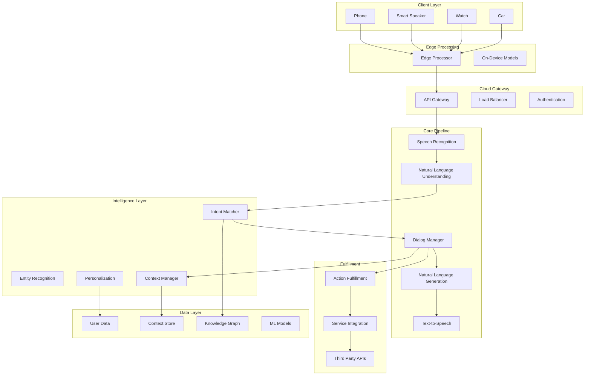

# Design Google Assistant


## Problem Statement

"Design a voice-activated AI assistant that can understand natural language, maintain conversational context, integrate with thousands of services, and respond in real-time across billions of devices."

## Overview

Google Assistant is an AI-powered virtual assistant available on 1+ billion devices, processing natural language queries in 30+ languages while maintaining context and integrating with thousands of third-party services.

## Scale Metrics

```
Usage Scale:
- Active users: 500+ million monthly
- Languages: 30+
- Countries: 90+
- Device types: 10,000+

Performance:
- Voice latency: <1 second e2e
- Text response: <500ms
- Context retention: 10 minutes
- Accuracy: 95%+ for common queries
```

## System Architecture



## Core Components Design

### 1. Speech Recognition Pipeline

```python
class SpeechRecognitionPipeline:
    def process_audio(self, audio_stream):
# 1. Audio preprocessing
        processed_audio = self.preprocess_audio(
            audio_stream,
            noise_reduction=True,
            normalization=True
        )
        
# 2. Feature extraction
        features = self.extract_features(processed_audio)
        
# 3. Acoustic model
        phonemes = self.acoustic_model.predict(features)
        
# 4. Language model
        text_candidates = self.language_model.decode(phonemes)
        
# 5. Contextual rescoring
        best_transcript = self.rescore_with_context(
            text_candidates,
            user_context=self.get_user_context()
        )
        
        return {
            'transcript': best_transcript,
            'confidence': self.calculate_confidence(best_transcript),
            'alternatives': text_candidates[:3]
        }
```

### 2. Natural Language Understanding

```python
class NLUPipeline:
    def understand(self, text, context):
# 1. Tokenization and normalization
        tokens = self.tokenize(text)
        
# 2. Intent classification
        intent_scores = self.intent_classifier.predict(tokens)
        intent = self.select_intent(intent_scores, context)
        
# 3. Entity extraction
        entities = self.entity_extractor.extract(tokens, intent)
        
# 4. Slot filling
        slots = self.fill_slots(intent, entities, context)
        
# 5. Disambiguation
        if self.needs_disambiguation(slots):
            clarification = self.generate_clarification(slots)
            return {'needs_clarification': True, 'question': clarification}
        
        return {
            'intent': intent,
            'entities': entities,
            'slots': slots,
            'confidence': self.calculate_nlu_confidence(intent_scores)
        }

class IntentClassifier:
    def __init__(self):
        self.bert_model = load_pretrained_bert()
        self.intent_head = IntentClassificationHead()
        
    def predict(self, tokens):
# BERT embeddings
        embeddings = self.bert_model(tokens)
        
# Intent classification
        intent_logits = self.intent_head(embeddings)
        
        return softmax(intent_logits)
```

### 3. Dialog Management

```python
class DialogManager:
    def __init__(self):
        self.context_store = ContextStore()
        self.policy_network = DialogPolicyNetwork()
        
    def manage_dialog(self, nlu_output, user_id):
# 1. Load conversation context
        context = self.context_store.get(user_id)
        
# 2. Update context with new turn
        context.add_turn(nlu_output)
        
# 3. Determine dialog act
        dialog_act = self.policy_network.predict(
            current_intent=nlu_output['intent'],
            context=context,
            slots=nlu_output['slots']
        )
        
# 4. Execute action
        if dialog_act.type == 'FULFILL':
            result = self.fulfill_action(dialog_act, context)
        elif dialog_act.type == 'CLARIFY':
            result = self.request_clarification(dialog_act)
        elif dialog_act.type == 'CONFIRM':
            result = self.request_confirmation(dialog_act)
        
# 5. Update context
        context.add_system_turn(result)
        self.context_store.save(user_id, context)
        
        return result

class ConversationContext:
    def __init__(self):
        self.turns = []
        self.entities = {}
        self.active_intent = None
        self.timestamp = time.time()
        
    def add_turn(self, turn):
        self.turns.append(turn)
        self.update_entities(turn['entities'])
        self.active_intent = turn['intent']
        self.timestamp = time.time()
        
    def is_expired(self):
        return time.time() - self.timestamp > 600  # 10 minutes
```

### 4. Action Fulfillment

```python
class ActionFulfillment:
    def __init__(self):
        self.action_registry = ActionRegistry()
        self.service_client = ServiceClient()
        
    def fulfill(self, intent, slots, context):
# 1. Find appropriate action
        action = self.action_registry.find_action(intent)
        
# 2. Validate parameters
        if not self.validate_slots(action, slots):
            return self.request_missing_slots(action, slots)
        
# 3. Check permissions
        if not self.check_permissions(action, context.user_id):
            return self.request_permission(action)
        
# 4. Execute action
        try:
            if action.is_internal:
                result = self.execute_internal(action, slots)
            else:
                result = self.execute_external(action, slots)
                
            return self.format_response(result)
            
        except Exception as e:
            return self.handle_error(e, action)
    
    def execute_external(self, action, slots):
# Call third-party service
        request = self.build_request(action, slots)
        response = self.service_client.call(
            action.endpoint,
            request,
            timeout=action.timeout
        )
        return self.parse_response(response, action)
```

### 5. Multi-Device Synchronization

```python
class DeviceSyncManager:
    def __init__(self):
        self.device_registry = DeviceRegistry()
        self.sync_queue = Queue()
        
    def handle_request(self, request, device_id):
# 1. Check device capabilities
        device = self.device_registry.get(device_id)
        
# 2. Route to appropriate device if needed
        if self.should_handoff(request, device):
            target_device = self.find_best_device(request)
            return self.handoff_to_device(request, target_device)
        
# 3. Process on current device
        response = self.process_request(request)
        
# 4. Sync state across devices
        self.sync_state({
            'user_id': request.user_id,
            'context': request.context,
            'timestamp': time.time()
        })
        
        return response
    
    def sync_state(self, state):
# Push to all user's devices
        devices = self.device_registry.get_user_devices(state['user_id'])
        for device in devices:
            self.sync_queue.push({
                'device_id': device.id,
                'state': state,
                'action': 'UPDATE_CONTEXT'
            })
```

## Data Models

### User Profile
```protobuf
message UserProfile {
    string user_id = 1;
    repeated string languages = 2;
    Location home_location = 3;
    Location work_location = 4;
    repeated DeviceInfo devices = 5;
    Preferences preferences = 6;
    repeated string linked_services = 7;
}

message ConversationTurn {
    string turn_id = 1;
    string user_id = 2;
    string device_id = 3;
    int64 timestamp = 4;
    string raw_text = 5;
    Intent intent = 6;
    repeated Entity entities = 7;
    string response = 8;
    float confidence = 9;
}
```

### Knowledge Graph Integration
```python
class KnowledgeGraphConnector:
    def enrich_query(self, query, entities):
# Connect to Google's Knowledge Graph
        kg_entities = []
        
        for entity in entities:
# Lookup entity in KG
            kg_result = self.kg_client.search(
                query=entity.value,
                types=entity.possible_types,
                limit=5
            )
            
            if kg_result:
                kg_entities.append({
                    'original': entity,
                    'kg_id': kg_result[0].id,
                    'kg_types': kg_result[0].types,
                    'kg_properties': kg_result[0].properties
                })
        
        return kg_entities
```

## Performance Optimizations

### 1. Edge Computing
```python
class EdgeProcessor:
    def __init__(self):
        self.local_models = {
            'wake_word': WakeWordDetector(),
            'common_commands': LocalCommandModel(),
            'speech_recognition': CompactASRModel()
        }
        
    def process_locally(self, audio):
# Try local processing first
        if self.can_process_locally(audio):
            result = self.local_models['common_commands'].process(audio)
            if result.confidence > 0.9:
                return result
        
# Fall back to cloud
        return self.send_to_cloud(audio)
```

### 2. Response Caching
```python
class ResponseCache:
    def __init__(self):
        self.cache = LRU(maxsize=10000)
        self.personal_cache = {}  # Per-user caches
        
    def get_response(self, intent, slots, user_id):
# Check if response can be cached
        if not self.is_cacheable(intent):
            return None
            
# Generate cache key
        cache_key = self.generate_key(intent, slots)
        
# Check personal cache first
        if user_id in self.personal_cache:
            response = self.personal_cache[user_id].get(cache_key)
            if response and not response.is_expired():
                return response
        
# Check global cache
        return self.cache.get(cache_key)
```

### 3. Parallel Processing
```python
async def process_request_parallel(request):
# Run independent components in parallel
    tasks = [
        speech_recognition(request.audio),
        fetch_user_context(request.user_id),
        check_device_capabilities(request.device_id),
        prefetch_likely_actions(request.partial_transcript)
    ]
    
    results = await asyncio.gather(*tasks)
    transcript, context, capabilities, likely_actions = results
    
# Continue with NLU using all information
    return await process_nlu(transcript, context, capabilities)
```

## Privacy and Security

### On-Device Processing
```python
class PrivacyPreservingAssistant:
    def __init__(self):
        self.on_device_intents = [
            'set_alarm', 'set_timer', 'play_music',
            'call_contact', 'send_message'
        ]
        
    def should_process_locally(self, intent):
        return (
            intent in self.on_device_intents or
            self.user_preferences.get('prefer_local') or
            self.is_sensitive_data(intent)
        )
    
    def federated_learning_update(self):
# Contribute to model improvement without sending data
        local_gradients = self.compute_local_gradients()
        encrypted_gradients = self.encrypt_gradients(local_gradients)
        self.send_encrypted_update(encrypted_gradients)
```

## Monitoring and Analytics

### Key Metrics
```
User Experience:
- End-to-end latency
- Recognition accuracy
- Intent classification accuracy
- Task completion rate
- User satisfaction (implicit/explicit)

System Performance:
- ASR latency
- NLU processing time
- Action fulfillment success rate
- Third-party API latency
- Cache hit rates

Quality Metrics:
- False wake rate
- Misunderstanding rate
- Clarification rate
- Fallback rate
```

## Interview Tips

1. **Start with the voice pipeline** - ASR → NLU → DM → TTS
2. **Emphasize latency** - Every millisecond counts
3. **Discuss context management** - Key for conversations
4. **Consider privacy** - On-device vs cloud trade-offs
5. **Address scale** - Billions of queries across devices

## Common Follow-up Questions

### Q1: "How do you handle multiple languages?"
**Answer:**
- Language detection at audio level
- Multilingual models
- Language-specific acoustic models
- Transfer learning for low-resource languages

### Q2: "How do you maintain context across devices?"
**Answer:**
- Centralized context store
- Device handoff protocols
- Sync via user account
- Capability-aware routing

### Q3: "How do you improve accuracy over time?"
**Answer:**
- User feedback signals
- Active learning
- A/B testing responses
- Federated learning for privacy

[Return to Google Interview Guide](google-interviews/index.md)