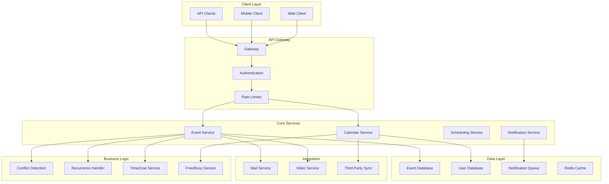

# Design Google Calendar

## Problem Statement

"Design a calendar application that can handle billions of events, support complex recurring patterns, manage scheduling across time zones, and provide real-time synchronization across devices."

## Overview

Google Calendar is a time-management and scheduling service used by billions of users worldwide, handling complex scheduling scenarios, time zone conversions, and real-time collaboration features.

## Scale Metrics

```
Scale Numbers:
- Active users: 1.5+ billion
- Events created: 1+ billion/day
- Calendar queries: 10+ billion/day
- Notification sent: 5+ billion/day

Performance Requirements:
- Event creation: <100ms
- Calendar load: <500ms
- Sync latency: <1 second
- Notification delivery: <30 seconds
```

## System Architecture



## Core Components Design

### 1. Event Data Model

```protobuf
message Event {
    string event_id = 1;
    string calendar_id = 2;
    string organizer_id = 3;
    
    EventDetails details = 4;
    TimeInfo time_info = 5;
    RecurrenceRule recurrence = 6;
    repeated Attendee attendees = 7;
    repeated Reminder reminders = 8;
    
    int64 created_at = 9;
    int64 updated_at = 10;
    int32 version = 11;  // For optimistic locking
}

message TimeInfo {
    int64 start_time = 1;
    int64 end_time = 2;
    string timezone = 3;
    bool all_day = 4;
}

message RecurrenceRule {
    RecurrenceType type = 1;  // DAILY, WEEKLY, MONTHLY, YEARLY
    int32 interval = 2;
    repeated int32 by_day = 3;  // For WEEKLY
    int32 by_month_day = 4;     // For MONTHLY
    int64 until = 5;            // End date
    int32 count = 6;            // Number of occurrences
    repeated int64 exceptions = 7;  // Deleted instances
    repeated Event modifications = 8; // Modified instances
}
```

### 2. Event Storage System

```python
class EventStorage:
    def __init__(self):
        self.event_db = Spanner()  # For consistency
        self.cache = Redis()       # For performance
        
    def create_event(self, event):
        # 1. Validate event
        if not self.validate_event(event):
            raise ValidationError()
        
        # 2. Check conflicts
        conflicts = self.check_conflicts(event)
        if conflicts and not event.force_create:
            return {'error': 'conflicts', 'conflicts': conflicts}
        
        # 3. Store event
        with self.event_db.transaction() as txn:
            # Store main event
            txn.insert('events', event.to_dict())
            
            # Update attendee calendars
            for attendee in event.attendees:
                self.add_to_attendee_calendar(txn, attendee, event)
            
            # Store recurrence expansion
            if event.recurrence:
                self.store_recurrence_instances(txn, event)
            
            txn.commit()
        
        # 4. Invalidate caches
        self.invalidate_caches(event)
        
        # 5. Trigger notifications
        self.queue_notifications(event)
        
        return {'event_id': event.event_id, 'status': 'created'}
    
    def store_recurrence_instances(self, txn, event):
        # Pre-compute instances for efficient querying
        instances = self.expand_recurrence(
            event.recurrence,
            event.time_info,
            limit=365  # One year ahead
        )
        
        for instance in instances:
            txn.insert('event_instances', {
                'event_id': event.event_id,
                'instance_date': instance.date,
                'start_time': instance.start_time,
                'end_time': instance.end_time
            })
```

### 3. Conflict Detection

```python
class ConflictDetector:
    def check_conflicts(self, new_event, user_id):
        # 1. Get user's events in time range
        existing_events = self.get_events_in_range(
            user_id,
            new_event.start_time,
            new_event.end_time
        )
        
        conflicts = []
        for event in existing_events:
            if self.events_overlap(new_event, event):
                # Check if it's a real conflict
                if not self.is_ignorable_conflict(new_event, event):
                    conflicts.append({
                        'event_id': event.event_id,
                        'title': event.title,
                        'time': event.time_info
                    })
        
        return conflicts
    
    def events_overlap(self, event1, event2):
        # Handle timezone conversion
        e1_start = self.to_utc(event1.start_time, event1.timezone)
        e1_end = self.to_utc(event1.end_time, event1.timezone)
        e2_start = self.to_utc(event2.start_time, event2.timezone)
        e2_end = self.to_utc(event2.end_time, event2.timezone)
        
        return not (e1_end <= e2_start or e1_start >= e2_end)
    
    def is_ignorable_conflict(self, event1, event2):
        # Some conflicts are okay
        return (
            event1.is_tentative or event2.is_tentative or
            event1.is_free_time or event2.is_free_time or
            event1.calendar_id != event2.calendar_id  # Different calendars
        )
```

### 4. Recurrence Handler

```python
class RecurrenceHandler:
    def expand_recurrence(self, rule, base_event, start_date, end_date):
        instances = []
        current_date = base_event.start_time
        
        while current_date <= end_date and len(instances) < rule.count:
            # Check if this instance is valid
            if self.matches_rule(current_date, rule):
                # Check if not in exceptions
                if current_date not in rule.exceptions:
                    # Check for modifications
                    modified = self.get_modification(rule, current_date)
                    if modified:
                        instances.append(modified)
                    else:
                        instances.append(self.create_instance(
                            base_event, current_date
                        ))
            
            # Move to next potential instance
            current_date = self.next_occurrence(current_date, rule)
            
            if rule.until and current_date > rule.until:
                break
        
        return instances
    
    def matches_rule(self, date, rule):
        if rule.type == 'WEEKLY':
            return date.weekday() in rule.by_day
        elif rule.type == 'MONTHLY':
            return date.day == rule.by_month_day
        elif rule.type == 'YEARLY':
            return (date.month == rule.by_month and 
                    date.day == rule.by_month_day)
        return True  # DAILY
```

### 5. Free/Busy Service

```python
class FreeBusyService:
    def get_free_busy(self, user_ids, start_time, end_time):
        free_busy_map = {}
        
        # Parallel fetch for all users
        with ThreadPoolExecutor(max_workers=10) as executor:
            futures = {}
            for user_id in user_ids:
                future = executor.submit(
                    self.get_user_busy_times,
                    user_id, start_time, end_time
                )
                futures[future] = user_id
            
            for future in as_completed(futures):
                user_id = futures[future]
                busy_times = future.result()
                free_busy_map[user_id] = busy_times
        
        return free_busy_map
    
    def find_common_free_time(self, user_ids, duration, constraints):
        # Get all busy times
        free_busy = self.get_free_busy(
            user_ids,
            constraints.start_date,
            constraints.end_date
        )
        
        # Find common free slots
        free_slots = []
        current_time = constraints.start_date
        
        while current_time < constraints.end_date:
            slot_end = current_time + duration
            
            # Check if slot works for all users
            if self.is_slot_free_for_all(
                free_busy, current_time, slot_end
            ):
                # Check additional constraints
                if self.meets_constraints(current_time, slot_end, constraints):
                    free_slots.append({
                        'start': current_time,
                        'end': slot_end,
                        'score': self.score_slot(current_time, constraints)
                    })
            
            current_time += timedelta(minutes=30)  # 30-min granularity
        
        # Sort by score (preference)
        return sorted(free_slots, key=lambda x: x['score'], reverse=True)
```

### 6. Notification Service

```python
class NotificationService:
    def __init__(self):
        self.queue = PubSub()
        self.scheduler = CronScheduler()
        
    def schedule_notifications(self, event):
        for reminder in event.reminders:
            notification_time = event.start_time - reminder.minutes_before * 60
            
            # Schedule notification
            job = {
                'type': 'event_reminder',
                'event_id': event.event_id,
                'user_id': event.organizer_id,
                'attendee_ids': [a.id for a in event.attendees],
                'reminder_type': reminder.type,
                'scheduled_time': notification_time
            }
            
            if notification_time > time.now():
                self.scheduler.schedule(job, notification_time)
            else:
                # Send immediately if in the past
                self.send_notification(job)
    
    def send_notification(self, job):
        # Route to appropriate channel
        if job['reminder_type'] == 'EMAIL':
            self.send_email_reminder(job)
        elif job['reminder_type'] == 'PUSH':
            self.send_push_notification(job)
        elif job['reminder_type'] == 'SMS':
            self.send_sms_reminder(job)
```

## Performance Optimizations

### 1. Caching Strategy

```python
class CalendarCache:
    def __init__(self):
        self.redis = Redis()
        self.local_cache = LRU(1000)
        
    def get_calendar_view(self, user_id, start_date, end_date):
        # Try local cache first
        cache_key = f"cal:{user_id}:{start_date}:{end_date}"
        cached = self.local_cache.get(cache_key)
        if cached:
            return cached
        
        # Try Redis
        cached = self.redis.get(cache_key)
        if cached:
            self.local_cache.put(cache_key, cached)
            return cached
        
        # Fetch from database
        events = self.fetch_events(user_id, start_date, end_date)
        
        # Cache with appropriate TTL
        ttl = self.calculate_ttl(start_date, end_date)
        self.redis.setex(cache_key, ttl, events)
        self.local_cache.put(cache_key, events)
        
        return events
```

### 2. Time Zone Optimization

```python
class TimeZoneService:
    def __init__(self):
        # Pre-load common timezone data
        self.tz_cache = self.load_timezone_data()
        self.dst_cache = {}  # Daylight saving time cache
        
    def convert_to_user_timezone(self, utc_time, user_timezone):
        # Fast path for common conversions
        if user_timezone in self.tz_cache:
            return self.fast_convert(utc_time, user_timezone)
        
        # Slow path for complex conversions
        return self.full_convert(utc_time, user_timezone)
    
    def bulk_convert(self, events, target_timezone):
        # Optimize bulk conversions
        converted = []
        tz_offset = self.get_offset(target_timezone)
        
        for event in events:
            converted.append({
                **event,
                'display_time': event['utc_time'] + tz_offset
            })
        
        return converted
```

## Scalability Considerations

### Database Sharding

```python
class EventSharding:
    def get_shard(self, user_id):
        # Shard by user for better locality
        return hash(user_id) % self.num_shards
    
    def store_event(self, event):
        # Primary shard for organizer
        primary_shard = self.get_shard(event.organizer_id)
        self.shards[primary_shard].store(event)
        
        # Secondary indexes for attendees
        for attendee in event.attendees:
            attendee_shard = self.get_shard(attendee.id)
            if attendee_shard != primary_shard:
                self.shards[attendee_shard].store_reference(event)
```

### Real-time Sync

```python
class SyncEngine:
    def __init__(self):
        self.websocket_server = WebSocketServer()
        self.change_stream = ChangeStream()
        
    def sync_calendar_changes(self, user_id, changes):
        # Get all user's devices
        devices = self.get_user_devices(user_id)
        
        # Push changes to all devices
        for device in devices:
            if self.websocket_server.is_connected(device.id):
                self.websocket_server.send(device.id, {
                    'type': 'calendar_update',
                    'changes': changes
                })
            else:
                # Queue for later delivery
                self.queue_offline_sync(device.id, changes)
```

## Interview Tips

1. **Start with the data model** - Events and recurrence are complex
2. **Address time zones early** - Critical for global calendar
3. **Discuss conflict detection** - Core scheduling feature
4. **Consider scale** - Billions of events and queries
5. **Don't forget integrations** - Email, video calls, etc.

## Common Follow-up Questions

### Q1: "How do you handle recurring events efficiently?"
**Answer:**
- Pre-expand instances for common queries
- Lazy evaluation for far future
- Cache expanded instances
- Handle exceptions and modifications

### Q2: "How do you implement calendar sharing?"
**Answer:**
- ACL-based permissions
- Different permission levels (view, edit, manage)
- Efficient permission checks
- Privacy controls

### Q3: "How do you handle meeting room scheduling?"
**Answer:**
- Resource calendars
- Automatic conflict prevention
- Approval workflows
- Integration with building systems

[Return to Google Interview Guide](./index.md)