# Google Design Patterns & Anti-Patterns

## Introduction

Google's engineering culture has produced distinctive patterns for building systems that operate at planetary scale. This guide covers the patterns that demonstrate Google-style thinking, the anti-patterns to avoid, and the trade-off frameworks that guide architectural decisions.

## Google Design Patterns

### 1. The "Shard Everything" Pattern

**Definition**: Partition data and workload across multiple independent units from day one.


**Key Principles**:
- **Consistent Hashing**: Use for dynamic shard assignment
- **Shard Key Selection**: Choose keys that distribute load evenly
- **Cross-Shard Operations**: Minimize or batch them
- **Resharding Strategy**: Plan for growth from the beginning

**Implementation Example**:
```python
class ShardRouter:
    def __init__(self, num_shards=128):
        self.num_shards = num_shards
        self.virtual_nodes = 150  # For consistent hashing
        
    def get_shard(self, key):
        # Consistent hashing with virtual nodes
        hash_value = hashlib.md5(key.encode()).hexdigest()
        shard_id = int(hash_value, 16) % self.num_shards
        return f"shard_{shard_id}"
    
    def get_multiple_shards(self, keys):
        # Batch operations by shard
        shard_map = defaultdict(list)
        for key in keys:
            shard = self.get_shard(key)
            shard_map[shard].append(key)
        return shard_map
```

### 2. The "Cache at Every Layer" Pattern

**Definition**: Implement caching at multiple levels to minimize latency and reduce load.


**Cache Hierarchy**:
1. **Browser Cache**: Static assets, API responses
2. **CDN Cache**: Geographic distribution
3. **Application Cache**: Computed results, sessions
4. **Database Cache**: Query results, prepared statements
5. **Hardware Cache**: CPU cache, SSD cache

**Implementation Strategy**:
```python
class MultiLayerCache:
    def __init__(self):
        self.l1_cache = {}  # In-process memory
        self.l2_cache = RedisCache()  # Distributed cache
        self.l3_cache = CDNCache()  # Edge cache
        
    async def get(self, key, compute_fn):
        # L1: Check in-process cache
        if key in self.l1_cache:
            return self.l1_cache[key]
        
        # L2: Check distributed cache
        value = await self.l2_cache.get(key)
        if value:
            self.l1_cache[key] = value
            return value
        
        # L3: Check CDN cache
        value = await self.l3_cache.get(key)
        if value:
            await self.populate_lower_caches(key, value)
            return value
        
        # Compute and populate all layers
        value = await compute_fn()
        await self.populate_all_caches(key, value)
        return value
```

### 3. The "Graceful Degradation" Pattern

**Definition**: Design systems to maintain partial functionality when components fail.


**Degradation Strategies**:
- **Feature Flags**: Disable non-essential features
- **Circuit Breakers**: Prevent cascade failures
- **Fallback Data**: Serve stale but functional data
- **Reduced Functionality**: Disable resource-intensive operations

**Implementation**:
```python
class GracefulService:
    def __init__(self):
        self.health_checker = HealthChecker()
        self.circuit_breaker = CircuitBreaker()
        
    async def get_recommendations(self, user_id):
        # Try primary ML-based recommendations
        if self.circuit_breaker.is_open('ml_service'):
            return await self.get_fallback_recommendations(user_id)
        
        try:
            recommendations = await self.ml_service.get_recommendations(user_id)
            self.circuit_breaker.record_success('ml_service')
            return recommendations
        except Exception as e:
            self.circuit_breaker.record_failure('ml_service')
            
            # Fallback to simpler algorithm
            return await self.get_fallback_recommendations(user_id)
    
    async def get_fallback_recommendations(self, user_id):
        # Simple popularity-based recommendations
        return await self.cache.get_popular_items(category=user_id % 10)
```

### 4. The "Progressive Enhancement" Pattern

**Definition**: Start with basic functionality and progressively add features based on capabilities.


**Progressive Loading Strategy**:
```javascript
// Progressive Web App Example
class ProgressiveLoader {
    async init() {
        // Level 1: Basic functionality
        this.renderBasicUI();
        
        // Level 2: Enhanced functionality
        if ('serviceWorker' in navigator) {
            await this.registerServiceWorker();
        }
        
        // Level 3: Rich features
        if (this.hasGoodConnection()) {
            await this.loadRichFeatures();
        }
        
        // Level 4: Optimal experience
        if (this.hasHighEndDevice()) {
            await this.enableAdvancedFeatures();
        }
    }
    
    hasGoodConnection() {
        const connection = navigator.connection;
        return !connection || connection.effectiveType === '4g';
    }
}
```

### 5. The "Canary Deployment" Pattern

**Definition**: Roll out changes incrementally with automatic rollback capabilities.


**Canary Implementation**:
```python
class CanaryDeployment:
    def __init__(self):
        self.metrics_collector = MetricsCollector()
        self.rollout_percentage = 0
        
    async def should_use_canary(self, user_id):
        if self.rollout_percentage == 0:
            return False
        
        # Consistent assignment based on user ID
        user_hash = hash(user_id) % 100
        return user_hash < self.rollout_percentage
    
    async def evaluate_canary_health(self):
        metrics = await self.metrics_collector.get_canary_metrics()
        
        if metrics.error_rate > 0.05:  # 5% error threshold
            await self.rollback()
            return False
        
        if metrics.p99_latency > 200:  # 200ms threshold
            await self.rollback()
            return False
        
        return True
    
    async def progressive_rollout(self):
        stages = [1, 5, 10, 25, 50, 100]
        
        for percentage in stages:
            self.rollout_percentage = percentage
            await asyncio.sleep(3600)  # Wait 1 hour
            
            if not await self.evaluate_canary_health():
                break
```

### 6. The "Feature Flags" Pattern

**Definition**: Control feature availability without code deployment.


**Feature Flag Implementation**:
```python
class FeatureFlagService:
    def __init__(self):
        self.flags = {}
        self.user_overrides = {}
        self.cohort_rules = {}
        
    def is_enabled(self, flag_name, user_context):
        # Check user-specific override
        if user_context.user_id in self.user_overrides.get(flag_name, {}):
            return self.user_overrides[flag_name][user_context.user_id]
        
        # Check cohort rules
        for rule in self.cohort_rules.get(flag_name, []):
            if self.evaluate_rule(rule, user_context):
                return rule.enabled
        
        # Default flag value
        return self.flags.get(flag_name, False)
    
    def evaluate_rule(self, rule, context):
        if rule.type == 'percentage':
            user_hash = hash(context.user_id) % 100
            return user_hash < rule.percentage
        
        if rule.type == 'property':
            return getattr(context, rule.property) == rule.value
        
        if rule.type == 'date_range':
            return rule.start_date <= datetime.now() <= rule.end_date
```

### 7. The "Data Pipeline" Pattern

**Definition**: Build streaming data processing systems with clear stages and error handling.


**Pipeline Implementation**:
```python
class DataPipeline:
    def __init__(self):
        self.stages = []
        self.error_handler = ErrorHandler()
        
    def add_stage(self, stage):
        self.stages.append(stage)
        return self
    
    async def process(self, data_stream):
        async for batch in data_stream:
            try:
                result = batch
                
                for stage in self.stages:
                    result = await stage.process(result)
                    
                    # Checkpoint after each stage
                    await self.checkpoint(stage.name, result)
                
                await self.output(result)
                
            except Exception as e:
                await self.error_handler.handle(e, batch)
    
    async def checkpoint(self, stage_name, data):
        # Enable restart from any stage
        await self.state_store.save(f"checkpoint_{stage_name}", data)
```

### 8. The "ML Integration" Pattern

**Definition**: Seamlessly integrate machine learning models into production systems.


**ML Integration Best Practices**:
```python
class MLServiceIntegration:
    def __init__(self):
        self.model_cache = ModelCache()
        self.feature_store = FeatureStore()
        self.monitor = ModelMonitor()
        
    async def predict(self, request):
        # Feature engineering with caching
        features = await self.get_features(request)
        
        # Model versioning
        model = await self.get_model(request.model_version)
        
        # Prediction with timeout
        try:
            prediction = await asyncio.wait_for(
                model.predict(features),
                timeout=0.050  # 50ms SLA
            )
            
            # Monitor prediction
            await self.monitor.record(features, prediction)
            
            return prediction
            
        except asyncio.TimeoutError:
            # Fallback to simple rules
            return self.rule_based_prediction(features)
    
    async def get_features(self, request):
        # Parallel feature fetching
        features = await asyncio.gather(
            self.feature_store.get_user_features(request.user_id),
            self.feature_store.get_context_features(request.context),
            self.feature_store.get_item_features(request.item_id)
        )
        return self.combine_features(*features)
```

## Google Anti-Patterns to Avoid

### 1. Single Points of Failure

**Anti-Pattern**: Relying on a single component for critical functionality.

```mermaid
graph TB
    subgraph "❌ Bad: Single Point of Failure"
        Users1[Users] --> Single[Single Database]
        Single --> Failure[💥 System Down]
    end
    
    subgraph "✅ Good: No Single Points"
        Users2[Users] --> LB[Load Balancer]
        LB --> DB1[Primary]
        LB --> DB2[Replica 1]
        LB --> DB3[Replica 2]
        
        DB1 -.-> DB2
        DB1 -.-> DB3
    end
```



**How to Avoid**:
- Always have N+2 redundancy
- Use leader election for coordination
- Implement health checks and automatic failover
- Test failure scenarios regularly

### 2. Synchronous Everything

**Anti-Pattern**: Making all operations synchronous and blocking.

```python
# ❌ Bad: Synchronous chain
def process_order(order):
    # Each step blocks the next
    user = get_user(order.user_id)  # 50ms
    payment = process_payment(order)  # 200ms
    inventory = update_inventory(order)  # 100ms
    notification = send_notification(user)  # 150ms
    return create_response(payment, inventory)  # Total: 500ms

# ✅ Good: Asynchronous where possible
async def process_order(order):
    # Parallel operations
    user_future = get_user_async(order.user_id)
    payment_future = process_payment_async(order)
    inventory_future = update_inventory_async(order)
    
    # Wait for critical path only
    payment = await payment_future
    inventory = await inventory_future
    
    # Fire and forget for non-critical
    asyncio.create_task(send_notification_async(await user_future))
    
    return create_response(payment, inventory)  # Total: 200ms
```

### 3. Monolithic Services

**Anti-Pattern**: Building large, tightly coupled services.


**Service Decomposition Strategy**:
- Domain boundaries
- Data ownership
- Team ownership
- Deployment independence
- Failure isolation

### 4. Manual Scaling

**Anti-Pattern**: Requiring human intervention for scaling.

```yaml
# ✅ Good: Automated scaling configuration
apiVersion: autoscaling/v2
kind: HorizontalPodAutoscaler
metadata:
  name: api-hpa
spec:
  scaleTargetRef:
    apiVersion: apps/v1
    kind: Deployment
    name: api-deployment
  minReplicas: 3
  maxReplicas: 100
  metrics:
  - type: Resource
    resource:
      name: cpu
      target:
        type: Utilization
        averageUtilization: 70
  - type: Resource
    resource:
      name: memory
      target:
        type: Utilization
        averageUtilization: 80
  - type: Pods
    pods:
      metric:
        name: rps_per_pod
      target:
        type: AverageValue
        averageValue: "1000"
  behavior:
    scaleUp:
      stabilizationWindowSeconds: 30
      policies:
      - type: Percent
        value: 100
        periodSeconds: 60
    scaleDown:
      stabilizationWindowSeconds: 300
      policies:
      - type: Percent
        value: 10
        periodSeconds: 60
```

### 5. Hardcoded Configuration

**Anti-Pattern**: Embedding configuration in code.

```python
# ❌ Bad: Hardcoded values
class PaymentService:
    def __init__(self):
        self.api_key = "sk_live_abc123"  # Never do this!
        self.timeout = 30
        self.retry_count = 3
        self.base_url = "https://api.payment.com"

# ✅ Good: External configuration
class PaymentService:
    def __init__(self, config):
        self.config = config
        self.api_key = self.get_secret('payment_api_key')
        
    def get_secret(self, key):
        # Use secret management service
        return SecretManager.get_secret(key)
    
    @property
    def timeout(self):
        return self.config.get('payment.timeout', 30)
    
    @property
    def retry_count(self):
        return self.config.get('payment.retry_count', 3)
```

### 6. Ignoring Cost at Scale

**Anti-Pattern**: Designing without considering cost implications.


**Cost-Aware Design**:
```python
class CostOptimizedStorage:
    def __init__(self):
        self.hot_storage = FastSSD()  # $0.20/GB
        self.warm_storage = StandardDisk()  # $0.05/GB
        self.cold_storage = ObjectStorage()  # $0.01/GB
        
    async def store(self, data, access_pattern):
        if access_pattern == 'frequent':
            return await self.hot_storage.store(data)
        elif access_pattern == 'occasional':
            return await self.warm_storage.store(data)
        else:
            compressed = self.compress(data)
            return await self.cold_storage.store(compressed)
    
    def estimate_monthly_cost(self, gb_hot, gb_warm, gb_cold):
        return (gb_hot * 0.20 + gb_warm * 0.05 + gb_cold * 0.01)
```

## Google-Specific Trade-offs

### 1. Consistency vs Availability (Google's Approach)

Google's philosophy: **"Choose consistency, engineer for availability"**


**Implementation Strategy**:
```python
class ConsistentHighlyAvailable:
    def __init__(self):
        self.regions = ['us-east', 'us-west', 'europe', 'asia']
        self.quorum_size = len(self.regions) // 2 + 1
        
    async def write(self, key, value):
        # Write to quorum of regions
        write_tasks = [
            self.write_to_region(region, key, value)
            for region in self.regions
        ]
        
        results = await asyncio.gather(*write_tasks, return_exceptions=True)
        successful_writes = sum(1 for r in results if not isinstance(r, Exception))
        
        if successful_writes >= self.quorum_size:
            return True
        else:
            raise QuorumNotAchieved()
    
    async def read(self, key):
        # Read from quorum for consistency
        read_tasks = [
            self.read_from_region(region, key)
            for region in self.regions
        ]
        
        results = await asyncio.gather(*read_tasks, return_exceptions=True)
        
        # Return most recent value from quorum
        valid_results = [r for r in results if not isinstance(r, Exception)]
        if len(valid_results) >= self.quorum_size:
            return max(valid_results, key=lambda x: x.timestamp).value
        else:
            raise QuorumNotAchieved()
```

### 2. Latency vs Accuracy

**Trade-off Framework**:


**Decision Matrix**:
| Use Case | Latency Target | Accuracy Target | Solution |
|----------|---------------|-----------------|----------|
| Search Suggestions | <50ms | 80% | Prefix cache + popular queries |
| Search Results | <200ms | 95% | Tiered ranking (fast first, refine later) |
| Ad Targeting | <100ms | 90% | Pre-computed segments + real-time features |
| Analytics | <5s | 99.9% | Exact computation with sampling fallback |

### 3. Storage vs Compute

**Google's Principle**: "Storage is cheap, compute is expensive at scale"

```python
class StorageVsComputeOptimizer:
    def __init__(self):
        self.storage_cost_per_gb = 0.02  # $/GB/month
        self.compute_cost_per_hour = 0.50  # $/CPU-hour
        
    def should_precompute(self, 
                         computation_time_seconds,
                         result_size_mb,
                         access_frequency_per_month):
        # Cost of computing on-demand
        compute_cost = (computation_time_seconds / 3600) * \
                      self.compute_cost_per_hour * \
                      access_frequency_per_month
        
        # Cost of storing precomputed results
        storage_cost = (result_size_mb / 1024) * self.storage_cost_per_gb
        
        return storage_cost < compute_cost
    
    def optimization_strategy(self, workload):
        if workload.is_deterministic and workload.access_pattern == 'frequent':
            return 'PRECOMPUTE_AND_STORE'
        elif workload.result_size > 1024:  # 1GB
            return 'COMPUTE_ON_DEMAND'
        else:
            return 'HYBRID_WITH_CACHE'
```

### 4. Simplicity vs Features

**Google's Approach**: Start simple, iterate based on data


**Feature Decision Framework**:
1. **Does it solve a real user problem?** (User research)
2. **What's the implementation cost?** (Engineering estimate)
3. **What's the operational cost?** (SRE review)
4. **Can we measure success?** (Metrics definition)
5. **Can we roll back?** (Feature flag requirement)

### 5. Global vs Regional

**Decision Tree**:


## Architecture Decision Framework

### Pattern Selection Decision Tree

```mermaid
graph TB
    Problem[Problem Space]
    
    Scale{Scale Requirements}
    Latency{Latency Requirements}
    Consistency{Consistency Needs}
    
    Problem --> Scale
    
    Scale -->|Billions of requests| Shard[Sharding Pattern]
    Scale -->|Millions of requests| Cache[Caching Pattern]
    
    Scale --> Latency
    
    Latency -->|<100ms global| CDN[CDN + Edge Computing]
    Latency -->|<10ms regional| Regional[Regional Deployment]
    
    Latency --> Consistency
    
    Consistency -->|Strong| Consensus[Consensus Protocols]
    Consistency -->|Eventual| Async[Async Replication]
```



### Cost Analysis Framework

```python
class CostAnalyzer:
    def analyze_pattern(self, pattern, scale):
        costs = {
            'sharding': {
                'development': 'high',
                'operational': 'medium',
                'scaling': 'linear'
            },
            'caching': {
                'development': 'low',
                'operational': 'low',
                'scaling': 'sub-linear'
            },
            'multi_region': {
                'development': 'medium',
                'operational': 'high',
                'scaling': 'linear'
            }
        }
        
        return self.calculate_tco(costs[pattern], scale)
    
    def calculate_tco(self, cost_profile, scale):
        # Total Cost of Ownership calculation
        dev_cost = self.dev_cost_map[cost_profile['development']]
        ops_cost = self.ops_cost_map[cost_profile['operational']] * 12  # Annual
        scale_cost = self.scale_cost(cost_profile['scaling'], scale)
        
        return {
            'year_1': dev_cost + ops_cost + scale_cost,
            'year_2': ops_cost + scale_cost * 1.5,
            'year_3': ops_cost + scale_cost * 2.0
        }
```

### Migration Strategy Template


**Migration Checklist**:
- [ ] Data migration strategy defined
- [ ] Rollback plan documented
- [ ] Performance benchmarks established
- [ ] Monitoring and alerts configured
- [ ] Team trained on new pattern
- [ ] Customer communication plan
- [ ] Post-migration cleanup scheduled

## Key Takeaways

### Google's Engineering Principles

1. **Design for 10x growth**: Every system should handle 10x current load
2. **Fail gracefully**: Partial availability > complete failure
3. **Measure everything**: Data-driven decisions only
4. **Automate operations**: Humans handle exceptions, not routine
5. **Global thinking**: Consider planetary scale from day one

### Pattern Selection Guidelines

| Pattern | When to Use | When to Avoid |
|---------|------------|---------------|
| Sharding | Data > single machine capacity | Strong consistency needed across shards |
| Caching | Read-heavy workloads | Frequently changing data |
| Graceful Degradation | User-facing services | Data pipelines |
| Progressive Enhancement | Web applications | Backend services |
| Canary Deployment | All production changes | Emergency hotfixes |
| Feature Flags | All new features | Infrastructure changes |

### Anti-Pattern Recognition

**Red Flags in Design Reviews**:
- "We'll add redundancy later"
- "This service does everything"
- "We'll scale manually"
- "The config is in the code"
- "We don't need to monitor that"
- "Cost optimization comes later"

### Success Metrics

**Google-Style KPIs**:
- **Availability**: 99.95% (4 nines) minimum
- **Latency**: P99 < 100ms for user-facing
- **Error Budget**: 0.05% monthly allowance
- **Cost Efficiency**: $/request decreasing over time
- **Developer Velocity**: Deploy multiple times daily

Remember: These patterns evolved from Google's specific needs. Adapt them thoughtfully to your context, always considering the trade-offs between complexity and benefit.