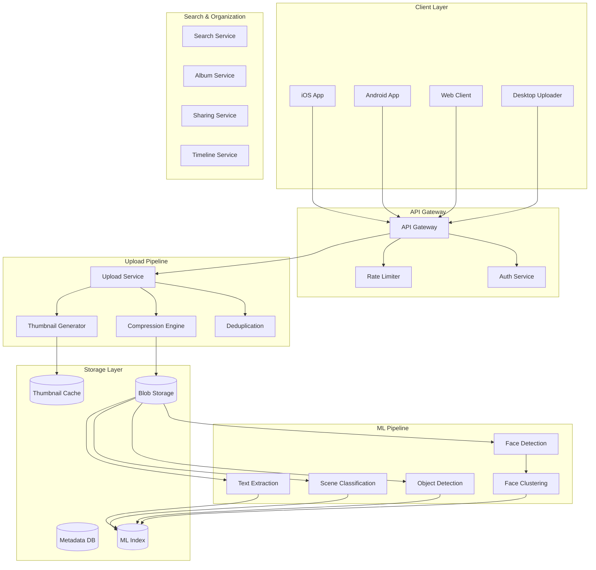

# Google Photos: Detailed System Design

## Problem Statement

Design a comprehensive photo and video storage service that provides:
- Unlimited photo/video backup (with compression)
- Intelligent organization using ML (face recognition, object detection)
- Powerful search capabilities across billions of images
- Seamless sharing and collaboration features
- Multi-device sync with conflict resolution
- Privacy-preserving ML features

## Scale Requirements

- **Users**: 1B+ active users
- **Photos**: 4T+ total photos
- **Daily Uploads**: 1.2B+ photos/videos per day
- **Storage**: 10+ Exabytes total
- **Search QPS**: 100K+ peak
- **ML Processing**: 100M+ images/day for feature extraction
- **Availability**: 99.95% uptime

## System Architecture

### High-Level Components



## Core Components Design

### 1. Photo/Video Upload Pipeline

```python
class PhotoUploadPipeline:
    def __init__(self):
        self.dedup_service = DeduplicationService()
        self.compressor = AdaptiveCompressor()
        self.storage = DistributedBlobStorage()
        self.metadata_db = MetadataService()
        
    async def upload_photo(self, photo_data, user_id, client_metadata):
# Step 1: Client-side deduplication check
        content_hash = self.calculate_hash(photo_data)
        existing_photo = await self.dedup_service.check_duplicate(
            user_id=user_id,
            content_hash=content_hash
        )
        
        if existing_photo:
# Photo already exists, just link to user's library
            await self.link_existing_photo(user_id, existing_photo.photo_id)
            return UploadResult(
                photo_id=existing_photo.photo_id,
                was_duplicate=True
            )
        
# Step 2: Extract metadata
        metadata = self.extract_metadata(photo_data, client_metadata)
        
# Step 3: Compression based on user settings
        compressed_data = await self.compress_photo(
            photo_data=photo_data,
            user_settings=await self.get_user_settings(user_id),
            metadata=metadata
        )
        
# Step 4: Generate multiple resolutions
        variants = await self.generate_variants(compressed_data)
        
# Step 5: Store in distributed blob storage
        storage_result = await self.store_photo_variants(
            original=compressed_data,
            variants=variants,
            replication_factor=3
        )
        
# Step 6: Save metadata
        photo_id = await self.save_metadata(
            user_id=user_id,
            metadata=metadata,
            storage_info=storage_result,
            content_hash=content_hash
        )
        
# Step 7: Trigger async ML processing
        await self.trigger_ml_pipeline(photo_id)
        
        return UploadResult(photo_id=photo_id, was_duplicate=False)
    
    async def compress_photo(self, photo_data, user_settings, metadata):
        if user_settings.quality == 'original':
            return photo_data
        
# Adaptive compression based on content
        compression_params = self.determine_compression_params(
            image_type=metadata.mime_type,
            dimensions=metadata.dimensions,
            has_faces=metadata.quick_face_detection,
            user_tier=user_settings.storage_tier
        )
        
        return self.compressor.compress(
            data=photo_data,
            params=compression_params
        )

class AdaptiveCompressor:
    def compress(self, data, params):
# Use different algorithms based on content
        if params.content_type == 'photo_with_faces':
# Preserve face regions with higher quality
            return self.compress_with_roi_preservation(
                data=data,
                regions_of_interest=params.face_regions,
                quality=params.face_quality
            )
        elif params.content_type == 'screenshot':
# Use PNG for screenshots to preserve text
            return self.compress_png(data, params.png_level)
        else:
# Standard JPEG compression with WebP fallback
            return self.compress_jpeg_or_webp(
                data=data,
                quality=params.quality,
                enable_webp=params.client_supports_webp
            )
```

### 2. Deduplication System

```python
class DeduplicationService:
    def __init__(self):
        self.global_index = GlobalHashIndex()
        self.user_index = UserPhotoIndex()
        
    async def check_duplicate(self, user_id, content_hash):
# Check user's own photos first
        user_duplicate = await self.user_index.find_by_hash(
            user_id=user_id,
            content_hash=content_hash
        )
        
        if user_duplicate:
            return user_duplicate
        
# Check global index for cross-user deduplication
        global_entry = await self.global_index.find_by_hash(content_hash)
        
        if global_entry and global_entry.is_shareable:
# Can reuse storage if photo is shareable
            return PhotoReference(
                photo_id=global_entry.photo_id,
                storage_id=global_entry.storage_id
            )
        
        return None
    
    def calculate_hash(self, photo_data):
# Multi-level hashing for better deduplication
        return {
            'content_hash': self.calculate_content_hash(photo_data),
            'perceptual_hash': self.calculate_perceptual_hash(photo_data),
            'metadata_hash': self.calculate_metadata_hash(photo_data)
        }
    
    def calculate_perceptual_hash(self, photo_data):
# Use pHash for finding similar images
        image = self.decode_image(photo_data)
        return imagehash.phash(image)
```

### 3. Face Recognition Pipeline

```python
class FaceRecognitionPipeline:
    def __init__(self):
        self.face_detector = FaceDetector()
        self.face_encoder = FaceEncoder()
        self.face_clusterer = FaceClusterer()
        self.privacy_filter = PrivacyFilter()
        
    async def process_photo(self, photo_id, photo_data):
# Step 1: Detect faces
        faces = await self.face_detector.detect_faces(photo_data)
        
        if not faces:
            return
        
# Step 2: Extract face embeddings
        face_embeddings = []
        for face in faces:
# Apply privacy-preserving transformations
            private_embedding = self.privacy_filter.transform(
                await self.face_encoder.encode(face)
            )
            face_embeddings.append(private_embedding)
        
# Step 3: Cluster faces for this user
        user_id = await self.get_photo_owner(photo_id)
        clusters = await self.face_clusterer.assign_to_clusters(
            user_id=user_id,
            face_embeddings=face_embeddings
        )
        
# Step 4: Store face metadata
        await self.store_face_data(
            photo_id=photo_id,
            faces=[{
                'bbox': face.bbox,
                'embedding': emb,
                'cluster_id': cluster.id,
                'confidence': cluster.confidence
            } for face, emb, cluster in zip(faces, face_embeddings, clusters)]
        )

class FaceClusterer:
    def __init__(self):
        self.cluster_threshold = 0.6
        self.min_cluster_size = 3
        
    async def assign_to_clusters(self, user_id, face_embeddings):
# Get existing clusters for user
        user_clusters = await self.get_user_clusters(user_id)
        
        assignments = []
        for embedding in face_embeddings:
            best_cluster = None
            best_similarity = 0
            
# Find best matching cluster
            for cluster in user_clusters:
                similarity = self.calculate_similarity(
                    embedding,
                    cluster.centroid
                )
                
                if similarity > best_similarity and similarity > self.cluster_threshold:
                    best_similarity = similarity
                    best_cluster = cluster
            
            if best_cluster:
# Update existing cluster
                await self.update_cluster(best_cluster, embedding)
                assignments.append(ClusterAssignment(
                    cluster_id=best_cluster.id,
                    confidence=best_similarity
                ))
            else:
# Create new cluster if enough similar faces
                new_cluster = await self.try_create_cluster(
                    user_id=user_id,
                    embedding=embedding
                )
                assignments.append(ClusterAssignment(
                    cluster_id=new_cluster.id if new_cluster else None,
                    confidence=0.0
                ))
        
        return assignments
```

### 4. Search Implementation

```python
class PhotoSearchService:
    def __init__(self):
        self.text_index = TextSearchIndex()
        self.visual_index = VisualSearchIndex()
        self.metadata_index = MetadataIndex()
        self.query_parser = QueryParser()
        
    async def search(self, user_id, query, filters=None):
# Parse query to understand intent
        parsed_query = self.query_parser.parse(query)
        
# Determine search strategy
        if parsed_query.has_visual_component:
            return await self.visual_search(
                user_id=user_id,
                query=parsed_query,
                filters=filters
            )
        else:
            return await self.text_search(
                user_id=user_id,
                query=parsed_query,
                filters=filters
            )
    
    async def text_search(self, user_id, parsed_query, filters):
# Multi-index search
        results = []
        
# Search in OCR text
        if parsed_query.has_text:
            ocr_results = await self.text_index.search(
                user_id=user_id,
                text=parsed_query.text_terms,
                limit=100
            )
            results.extend(ocr_results)
        
# Search in object labels
        if parsed_query.has_objects:
            object_results = await self.search_by_objects(
                user_id=user_id,
                objects=parsed_query.object_terms
            )
            results.extend(object_results)
        
# Search in scene classifications
        if parsed_query.has_scenes:
            scene_results = await self.search_by_scenes(
                user_id=user_id,
                scenes=parsed_query.scene_terms
            )
            results.extend(scene_results)
        
# Search by people
        if parsed_query.has_people:
            people_results = await self.search_by_people(
                user_id=user_id,
                people_names=parsed_query.people_terms
            )
            results.extend(people_results)
        
# Merge and rank results
        return self.rank_results(results, parsed_query)
    
    async def visual_search(self, user_id, parsed_query, filters):
# Extract visual features from query
        if parsed_query.reference_image:
            query_features = await self.extract_visual_features(
                parsed_query.reference_image
            )
        else:
# Convert text description to visual features
            query_features = await self.text_to_visual_features(
                parsed_query.visual_description
            )
        
# Approximate nearest neighbor search
        similar_photos = await self.visual_index.search_similar(
            user_id=user_id,
            features=query_features,
            k=100
        )
        
# Re-rank with additional signals
        return self.rerank_visual_results(
            results=similar_photos,
            query=parsed_query,
            user_preferences=await self.get_user_preferences(user_id)
        )

class QueryParser:
    def parse(self, query):
# Use NLP to understand query intent
        tokens = self.tokenize(query)
        
        return ParsedQuery(
            text_terms=self.extract_text_terms(tokens),
            object_terms=self.extract_objects(tokens),
            scene_terms=self.extract_scenes(tokens),
            people_terms=self.extract_people(tokens),
            time_constraints=self.extract_time_constraints(tokens),
            location_constraints=self.extract_locations(tokens),
            has_visual_component=self.detect_visual_intent(query)
        )
```

### 5. Sharing and Collaboration

```python
class SharingService:
    def __init__(self):
        self.access_control = AccessControlService()
        self.notification = NotificationService()
        self.link_generator = SecureLinkGenerator()
        
    async def create_album(self, user_id, album_data):
# Create album with privacy settings
        album = await self.create_album_entry(
            owner_id=user_id,
            title=album_data.title,
            privacy=album_data.privacy_setting
        )
        
# Add photos to album
        await self.add_photos_to_album(
            album_id=album.id,
            photo_ids=album_data.photo_ids,
            user_id=user_id
        )
        
# Set up sharing if specified
        if album_data.shared_with:
            await self.share_album(
                album_id=album.id,
                owner_id=user_id,
                recipients=album_data.shared_with,
                permissions=album_data.permissions
            )
        
        return album
    
    async def share_album(self, album_id, owner_id, recipients, permissions):
# Generate sharing link
        share_link = await self.link_generator.generate_secure_link(
            resource_type='album',
            resource_id=album_id,
            permissions=permissions,
            expiry=permissions.link_expiry
        )
        
# Set up access control
        for recipient in recipients:
            await self.access_control.grant_access(
                resource_id=album_id,
                user_id=recipient.user_id,
                permissions=permissions,
                granted_by=owner_id
            )
            
# Send notification
            await self.notification.send_share_notification(
                recipient=recipient,
                sharer=owner_id,
                album_id=album_id,
                share_link=share_link
            )
        
        return share_link

class CollaborativeAlbum:
    async def add_contributor_photo(self, album_id, photo_id, contributor_id):
# Verify contributor has permission
        if not await self.can_contribute(album_id, contributor_id):
            raise PermissionError("User cannot contribute to this album")
        
# Copy photo to album namespace
        album_photo = await self.copy_photo_to_album(
            source_photo_id=photo_id,
            album_id=album_id,
            contributor_id=contributor_id
        )
        
# Notify album members
        await self.notify_new_contribution(
            album_id=album_id,
            photo_id=album_photo.id,
            contributor_id=contributor_id
        )
        
        return album_photo
```

### 6. Multi-Device Sync

```python
class SyncService:
    def __init__(self):
        self.device_registry = DeviceRegistry()
        self.sync_queue = SyncQueue()
        self.conflict_resolver = ConflictResolver()
        
    async def sync_device(self, device_id, last_sync_token):
# Get device info
        device = await self.device_registry.get_device(device_id)
        user_id = device.user_id
        
# Get changes since last sync
        changes = await self.get_changes_since(
            user_id=user_id,
            since_token=last_sync_token,
            device_id=device_id
        )
        
# Handle conflicts
        resolved_changes = []
        for change in changes:
            if change.has_conflict:
                resolved = await self.conflict_resolver.resolve(
                    change=change,
                    device_id=device_id,
                    resolution_strategy=device.conflict_strategy
                )
                resolved_changes.append(resolved)
            else:
                resolved_changes.append(change)
        
# Generate sync response
        sync_response = SyncResponse(
            changes=resolved_changes,
            new_sync_token=self.generate_sync_token(),
            deleted_items=await self.get_deletions(user_id, last_sync_token)
        )
        
# Update device sync state
        await self.update_device_sync_state(
            device_id=device_id,
            sync_token=sync_response.new_sync_token
        )
        
        return sync_response

class ConflictResolver:
    async def resolve(self, change, device_id, resolution_strategy):
        if resolution_strategy == 'last_write_wins':
# Use timestamp to determine winner
            return self.resolve_by_timestamp(change)
        elif resolution_strategy == 'device_priority':
# Give priority to specific device
            return self.resolve_by_device_priority(change, device_id)
        elif resolution_strategy == 'keep_both':
# Create duplicate with different name
            return self.create_conflict_copy(change)
        else:
# Manual resolution required
            return self.mark_for_manual_resolution(change)
```

## Storage Architecture

### 1. Distributed Blob Storage

```python
class DistributedBlobStorage:
    def __init__(self):
        self.storage_nodes = self.discover_storage_nodes()
        self.replication_manager = ReplicationManager()
        self.erasure_coder = ErasureCoding(k=10, m=4)  # 10 data, 4 parity
        
    async def store_photo(self, photo_data, replication_factor=3):
# Choose storage strategy based on size
        if len(photo_data) < 1_000_000:  # < 1MB
            return await self.store_with_replication(
                photo_data, 
                replication_factor
            )
        else:
# Use erasure coding for large files
            return await self.store_with_erasure_coding(photo_data)
    
    async def store_with_erasure_coding(self, photo_data):
# Split into chunks and generate parity
        chunks = self.erasure_coder.encode(photo_data)
        
# Distribute chunks across nodes
        storage_map = {}
        for i, chunk in enumerate(chunks):
            node = self.select_storage_node(
                chunk_index=i,
                existing_nodes=list(storage_map.values())
            )
            
            chunk_id = await node.store_chunk(chunk)
            storage_map[i] = {
                'node_id': node.id,
                'chunk_id': chunk_id,
                'is_parity': i >= self.erasure_coder.k
            }
        
        return StorageResult(
            storage_type='erasure_coded',
            storage_map=storage_map,
            size=len(photo_data)
        )
```

### 2. Metadata Storage Schema

```sql
-- Photo metadata (Spanner)
CREATE TABLE photos (
    photo_id STRING(36) NOT NULL,
    user_id STRING(36) NOT NULL,
    upload_time TIMESTAMP NOT NULL,
    taken_time TIMESTAMP,
    device_id STRING(36),
    
    -- Basic metadata
    filename STRING(255),
    mime_type STRING(50),
    size_bytes INT64,
    width INT32,
    height INT32,
    orientation INT32,
    
    -- Location
    latitude FLOAT64,
    longitude FLOAT64,
    altitude FLOAT64,
    place_id STRING(36),
    
    -- Camera metadata
    camera_make STRING(100),
    camera_model STRING(100),
    focal_length FLOAT32,
    aperture FLOAT32,
    iso INT32,
    shutter_speed STRING(20),
    
    -- Storage info
    storage_tier STRING(20),
    storage_location JSON,
    compression_info JSON,
    
    -- ML features
    ml_features JSON,
    face_regions JSON,
    detected_objects JSON,
    scene_labels JSON,
    ocr_text TEXT,
    
    -- Sharing
    is_shared BOOL,
    share_count INT32,
    
    created_at TIMESTAMP,
    updated_at TIMESTAMP,
) PRIMARY KEY (photo_id),
  INTERLEAVE IN PARENT users ON DELETE CASCADE;

-- Face clusters (Spanner)
CREATE TABLE face_clusters (
    cluster_id STRING(36) NOT NULL,
    user_id STRING(36) NOT NULL,
    cluster_name STRING(100),
    centroid_embedding BYTES,
    photo_count INT32,
    last_seen TIMESTAMP,
    merged_from JSON,  -- Track cluster merges
) PRIMARY KEY (cluster_id);

-- Search index (Bigtable)
Row Key: {user_id}#{search_term}#{photo_id}
Column Families:
- photo: photo_id, timestamp, relevance_score
- context: surrounding_text, object_confidence, scene_confidence
```

## ML Pipeline Architecture

### Feature Extraction Pipeline

```python
class MLFeatureExtraction:
    def __init__(self):
        self.models = {
            'face_detection': self.load_face_model(),
            'object_detection': self.load_object_model(),
            'scene_classification': self.load_scene_model(),
            'text_detection': self.load_ocr_model(),
            'quality_assessment': self.load_quality_model()
        }
        
    async def extract_features(self, photo_id, photo_data):
# Run models in parallel
        results = await asyncio.gather(
            self.detect_faces(photo_data),
            self.detect_objects(photo_data),
            self.classify_scene(photo_data),
            self.extract_text(photo_data),
            self.assess_quality(photo_data),
            return_exceptions=True
        )
        
# Combine results
        features = {
            'faces': results[0] if not isinstance(results[0], Exception) else [],
            'objects': results[1] if not isinstance(results[1], Exception) else [],
            'scenes': results[2] if not isinstance(results[2], Exception) else [],
            'text': results[3] if not isinstance(results[3], Exception) else "",
            'quality': results[4] if not isinstance(results[4], Exception) else {}
        }
        
# Store extracted features
        await self.store_features(photo_id, features)
        
# Update search indices
        await self.update_search_indices(photo_id, features)
        
        return features
```

## Performance Optimizations

### 1. Smart Caching

```python
class PhotoCacheManager:
    def __init__(self):
        self.memory_cache = LRUCache(max_size_gb=10)
        self.ssd_cache = SSDCache(max_size_tb=1)
        self.cdn_cache = CDNCache()
        
    async def get_photo(self, photo_id, resolution='thumbnail'):
# Try memory cache first
        cached = self.memory_cache.get(f"{photo_id}:{resolution}")
        if cached:
            return cached
        
# Try SSD cache
        cached = await self.ssd_cache.get(f"{photo_id}:{resolution}")
        if cached:
            self.memory_cache.put(f"{photo_id}:{resolution}", cached)
            return cached
        
# Check CDN for popular content
        if await self.is_popular_content(photo_id):
            cdn_url = await self.cdn_cache.get_url(photo_id, resolution)
            if cdn_url:
                return RedirectResponse(cdn_url)
        
# Fetch from storage
        photo_data = await self.fetch_from_storage(photo_id, resolution)
        
# Update caches
        await self.update_caches(photo_id, resolution, photo_data)
        
        return photo_data
```

### 2. Predictive Preloading

```python
class PredictivePreloader:
    def __init__(self):
        self.user_model = UserBehaviorModel()
        self.preload_queue = PriorityQueue()
        
    async def predict_next_photos(self, user_id, current_photo_id):
# Get user's viewing patterns
        patterns = await self.user_model.get_patterns(user_id)
        
        predictions = []
        
# Timeline-based prediction
        if patterns.views_chronologically:
            predictions.extend(
                await self.get_adjacent_photos(current_photo_id, count=5)
            )
        
# Album-based prediction
        if patterns.views_by_album:
            predictions.extend(
                await self.get_album_photos(current_photo_id, count=5)
            )
        
# Similar content prediction
        if patterns.views_similar_content:
            predictions.extend(
                await self.get_similar_photos(current_photo_id, count=3)
            )
        
# Queue for preloading
        for photo_id, priority in predictions:
            await self.preload_queue.put(
                PreloadTask(photo_id=photo_id, priority=priority)
            )
```

## Privacy and Security

### 1. Privacy-Preserving ML

```python
class PrivacyPreservingML:
    def __init__(self):
        self.differential_privacy = DifferentialPrivacy(epsilon=1.0)
        self.secure_aggregation = SecureAggregation()
        
    async def train_on_user_data(self, user_photos):
# Local training on device
        local_model_updates = []
        
        for batch in self.batch_photos(user_photos):
# Add noise for differential privacy
            noisy_gradients = self.differential_privacy.add_noise(
                self.compute_gradients(batch)
            )
            local_model_updates.append(noisy_gradients)
        
# Secure aggregation
        aggregated_update = await self.secure_aggregation.aggregate(
            local_updates=local_model_updates,
            min_participants=1000  # Wait for enough users
        )
        
        return aggregated_update
```

### 2. End-to-End Encryption for Shared Albums

```python
class EncryptedSharing:
    def __init__(self):
        self.key_manager = KeyManager()
        
    async def create_encrypted_album(self, user_id, album_data):
# Generate album encryption key
        album_key = self.key_manager.generate_album_key()
        
# Encrypt album metadata
        encrypted_metadata = self.encrypt_metadata(album_data, album_key)
        
# Store encrypted album
        album_id = await self.store_encrypted_album(
            owner_id=user_id,
            encrypted_metadata=encrypted_metadata
        )
        
# Distribute keys to authorized users
        for recipient in album_data.recipients:
            wrapped_key = self.key_manager.wrap_key_for_user(
                album_key=album_key,
                recipient_public_key=recipient.public_key
            )
            await self.store_wrapped_key(
                album_id=album_id,
                user_id=recipient.user_id,
                wrapped_key=wrapped_key
            )
        
        return album_id
```

## Monitoring and Operations

### Key Metrics

```yaml
user_metrics:
  - daily_active_users
  - photos_uploaded_per_user
  - storage_used_per_user
  - search_queries_per_user
  - sharing_rate

system_metrics:
  - upload_success_rate
  - compression_ratio
  - deduplication_rate
  - ml_processing_latency
  - search_latency_p99

storage_metrics:
  - total_storage_used
  - storage_cost_per_photo
  - cache_hit_rate
  - cdn_bandwidth_usage
  - replication_overhead

ml_metrics:
  - face_clustering_accuracy
  - object_detection_precision
  - search_relevance_score
  - processing_throughput
```

## Cost Optimization Strategies

### 1. Intelligent Tiering

```python
class StorageTiering:
    def __init__(self):
        self.tiers = {
            'hot': {'cost_per_gb': 0.023, 'access_time_ms': 10},
            'cool': {'cost_per_gb': 0.01, 'access_time_ms': 100},
            'archive': {'cost_per_gb': 0.004, 'access_time_ms': 3600000}
        }
        
    async def optimize_photo_placement(self, photo_id):
        access_pattern = await self.analyze_access_pattern(photo_id)
        
        if access_pattern.last_access_days > 365:
# Move to archive
            await self.move_to_tier(photo_id, 'archive')
        elif access_pattern.access_frequency < 0.1:
# Move to cool storage
            await self.move_to_tier(photo_id, 'cool')
        else:
# Keep in hot storage
            await self.move_to_tier(photo_id, 'hot')
```

### 2. Smart Compression

```python
class SmartCompression:
    def determine_compression_strategy(self, photo_metadata, user_settings):
        if user_settings.has_unlimited_original_quality:
            return 'original'
        
# Compress more aggressively for rarely accessed photos
        if photo_metadata.predicted_access_frequency < 0.01:
            return 'aggressive'
        
# Preserve quality for photos with faces
        if photo_metadata.has_faces:
            return 'high_quality'
        
# Standard compression for everything else
        return 'standard'
```

## Summary

This Google Photos design handles massive scale through:

1. **Efficient upload pipeline** with client-side deduplication and adaptive compression
2. **Advanced ML capabilities** for face recognition, object detection, and intelligent search
3. **Flexible storage architecture** with erasure coding and intelligent tiering
4. **Privacy-first approach** with on-device processing and encrypted sharing
5. **Smart caching and preloading** for optimal user experience
6. **Cost optimization** through compression and storage tiering

The system scales to handle trillions of photos while maintaining sub-second search latency and providing powerful organization features.