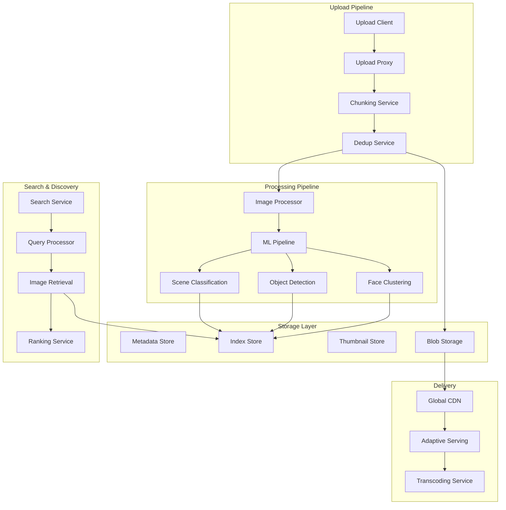

# Design Google Photos

!!! info "Work in Progress"
    This guide is actively being developed. Some sections may be incomplete.

## Problem Statement

"Design a photo storage and sharing service that can handle billions of users uploading trillions of photos, with intelligent organization, search by image content, and efficient storage."

## Overview

Google Photos is a photo sharing and storage service that combines massive scale storage with advanced AI features for organization, search, and editing of photos and videos.

## Scale Metrics

```
Storage Scale:
- Total photos: 4+ trillion
- Daily uploads: 1.2+ billion
- Active users: 1+ billion
- Storage used: Exabytes

Processing:
- Photos analyzed/day: 1+ billion
- Face clusters: Billions
- Search queries/day: 100+ million
- Storage saved via compression: 80%+
```

## System Architecture



## Core Components Design

### 1. Upload and Storage Pipeline

```python
class PhotoUploadService:
    def __init__(self):
        self.chunk_size = 4 * 1024 * 1024  # 4MB chunks
        self.dedup_service = DedupService()
        self.storage_service = StorageService()
        
    def upload_photo(self, photo_data, user_id, metadata):
        # 1. Chunk the photo
        chunks = self.create_chunks(photo_data)
        
        # 2. Deduplicate chunks
        unique_chunks = []
        chunk_refs = []
        
        for chunk in chunks:
            chunk_hash = self.calculate_hash(chunk)
            
            if not self.dedup_service.exists(chunk_hash):
                unique_chunks.append({
                    'hash': chunk_hash,
                    'data': chunk
                })
            chunk_refs.append(chunk_hash)
        
        # 3. Upload unique chunks
        for chunk in unique_chunks:
            self.storage_service.store_chunk(
                chunk['hash'],
                chunk['data']
            )
            self.dedup_service.mark_stored(chunk['hash'])
        
        # 4. Create photo record
        photo_id = generate_uuid()
        photo_record = {
            'photo_id': photo_id,
            'user_id': user_id,
            'chunk_refs': chunk_refs,
            'metadata': metadata,
            'upload_time': time.now(),
            'original_size': len(photo_data),
            'stored_size': sum(len(c['data']) for c in unique_chunks)
        }
        
        # 5. Store metadata
        self.store_photo_metadata(photo_record)
        
        # 6. Queue for processing
        self.queue_for_processing(photo_id)
        
        return photo_id

class DedupService:
    def __init__(self):
        self.bloom_filter = BloomFilter(capacity=10**12, error_rate=0.001)
        self.hash_db = HashDatabase()
        
    def exists(self, chunk_hash):
        # Fast check with Bloom filter
        if chunk_hash not in self.bloom_filter:
            return False
        
        # Accurate check in database
        return self.hash_db.exists(chunk_hash)
    
    def mark_stored(self, chunk_hash):
        self.bloom_filter.add(chunk_hash)
        self.hash_db.insert(chunk_hash)
```

### 2. Image Processing Pipeline

```python
class ImageProcessingPipeline:
    def __init__(self):
        self.processors = [
            ThumbnailGenerator(),
            MetadataExtractor(),
            FaceDetector(),
            ObjectDetector(),
            SceneClassifier(),
            QualityAnalyzer()
        ]
        
    def process_photo(self, photo_id):
        # 1. Load photo
        photo_data = self.load_photo(photo_id)
        photo = Image.open(photo_data)
        
        # 2. Generate versions
        versions = self.generate_versions(photo)
        
        # 3. Run ML pipeline
        ml_results = {}
        for processor in self.processors:
            result = processor.process(photo)
            ml_results[processor.name] = result
        
        # 4. Store results
        self.store_processing_results(photo_id, {
            'versions': versions,
            'ml_results': ml_results,
            'processing_time': time.now()
        })
        
        # 5. Update search index
        self.update_search_index(photo_id, ml_results)
        
        return ml_results
    
    def generate_versions(self, photo):
        versions = {}
        
        # Multiple resolutions for different devices
        resolutions = [
            ('thumbnail', 256),
            ('small', 512),
            ('medium', 1024),
            ('large', 2048),
            ('original', None)
        ]
        
        for name, size in resolutions:
            if size:
                resized = self.resize_image(photo, size)
                versions[name] = self.compress_image(resized)
            else:
                versions[name] = self.compress_image(photo)
        
        return versions
```

### 3. Face Clustering System

```python
class FaceClusteringService:
    def __init__(self):
        self.face_model = FaceEmbeddingModel()
        self.clustering_engine = DBSCANClusterer()
        self.face_db = FaceDatabase()
        
    def process_faces(self, photo_id, detected_faces):
        face_embeddings = []
        
        # 1. Generate embeddings for each face
        for face in detected_faces:
            embedding = self.face_model.get_embedding(face.image)
            face_embeddings.append({
                'photo_id': photo_id,
                'face_id': face.id,
                'bbox': face.bbox,
                'embedding': embedding,
                'quality_score': face.quality_score
            })
        
        # 2. Find or create clusters
        for face_emb in face_embeddings:
            cluster_id = self.find_matching_cluster(
                face_emb['embedding'],
                user_id=self.get_user_id(photo_id)
            )
            
            if not cluster_id:
                # Create new cluster
                cluster_id = self.create_new_cluster(face_emb)
            else:
                # Add to existing cluster
                self.add_to_cluster(cluster_id, face_emb)
        
        # 3. Periodic re-clustering
        if self.should_recluster():
            self.recluster_faces()
    
    def find_matching_cluster(self, embedding, user_id):
        # Get user's face clusters
        clusters = self.face_db.get_user_clusters(user_id)
        
        best_match = None
        best_score = 0
        threshold = 0.7
        
        for cluster in clusters:
            score = self.calculate_similarity(
                embedding,
                cluster.centroid_embedding
            )
            
            if score > threshold and score > best_score:
                best_match = cluster.id
                best_score = score
        
        return best_match
```

### 4. Content-Based Search

```python
class PhotoSearchService:
    def __init__(self):
        self.text_encoder = CLIPTextEncoder()
        self.image_encoder = CLIPImageEncoder()
        self.index = FAISSIndex(dimension=512)
        
    def search_by_text(self, query, user_id, filters=None):
        # 1. Encode query
        query_embedding = self.text_encoder.encode(query)
        
        # 2. Search in user's photos
        candidates = self.index.search(
            query_embedding,
            user_id=user_id,
            k=1000  # Get top 1000 candidates
        )
        
        # 3. Apply filters
        if filters:
            candidates = self.apply_filters(candidates, filters)
        
        # 4. Re-rank with additional signals
        ranked_results = self.rerank_results(
            candidates,
            query,
            user_preferences=self.get_user_preferences(user_id)
        )
        
        return ranked_results[:100]  # Return top 100
    
    def search_by_image(self, image_data, user_id):
        # 1. Extract image features
        image_embedding = self.image_encoder.encode(image_data)
        
        # 2. Find similar images
        similar_images = self.index.search(
            image_embedding,
            user_id=user_id,
            k=100
        )
        
        # 3. Deduplicate near-duplicates
        deduplicated = self.deduplicate_similar(similar_images)
        
        return deduplicated
    
    def build_search_query(self, ml_results):
        # Combine multiple signals for indexing
        features = []
        
        # Visual features
        features.append(ml_results['visual_embedding'])
        
        # Semantic features from detected objects
        for obj in ml_results['objects']:
            features.append(self.text_encoder.encode(obj['label']))
        
        # Scene understanding
        features.append(self.text_encoder.encode(ml_results['scene']))
        
        # Combine features
        combined = self.combine_features(features)
        
        return combined
```

### 5. Storage Optimization

```python
class StorageOptimizer:
    def __init__(self):
        self.compression_service = CompressionService()
        self.tier_manager = StorageTierManager()
        
    def optimize_storage(self, photo_id):
        photo_metadata = self.get_photo_metadata(photo_id)
        
        # 1. Compression decision
        if self.should_compress(photo_metadata):
            compressed = self.compression_service.compress(
                photo_data=self.load_photo(photo_id),
                quality='high',  # Google's "High Quality" option
                preserve_metadata=True
            )
            
            if compressed.size < photo_metadata.size * 0.8:
                self.replace_with_compressed(photo_id, compressed)
        
        # 2. Storage tiering
        access_pattern = self.analyze_access_pattern(photo_id)
        
        if access_pattern.is_cold():
            self.tier_manager.move_to_cold_storage(photo_id)
        elif access_pattern.is_archived():
            self.tier_manager.move_to_archive(photo_id)
    
    def smart_compression(self, image_data):
        # Content-aware compression
        image_analysis = self.analyze_image_content(image_data)
        
        if image_analysis.has_text:
            # Less aggressive compression for text
            return self.compress_for_text(image_data)
        elif image_analysis.is_portrait:
            # Preserve face quality
            return self.compress_portrait(image_data)
        else:
            # Standard compression
            return self.compress_standard(image_data)
```

### 6. Privacy-Preserving Features

```python
class PrivacyManager:
    def __init__(self):
        self.encryption_service = EncryptionService()
        self.permission_manager = PermissionManager()
        
    def handle_face_clustering_privacy(self, user_id):
        user_settings = self.get_privacy_settings(user_id)
        
        if user_settings.face_grouping_enabled:
            # Process faces with user consent
            return self.process_with_consent(user_id)
        else:
            # Skip face processing
            return self.skip_face_processing(user_id)
    
    def share_album(self, album_id, owner_id, recipient_ids):
        # 1. Check sharing permissions
        if not self.can_share(album_id, owner_id):
            raise PermissionError()
        
        # 2. Create sharing tokens
        sharing_tokens = {}
        for recipient_id in recipient_ids:
            token = self.create_sharing_token(
                album_id,
                recipient_id,
                permissions=['view', 'comment']
            )
            sharing_tokens[recipient_id] = token
        
        # 3. Notify recipients
        self.notify_recipients(sharing_tokens)
        
        return sharing_tokens
```

## Data Models

### Photo Metadata
```protobuf
message Photo {
    string photo_id = 1;
    string user_id = 2;
    
    PhotoMetadata metadata = 3;
    repeated ChunkReference chunks = 4;
    repeated PhotoVersion versions = 5;
    
    MLResults ml_results = 6;
    PrivacySettings privacy = 7;
    
    int64 created_at = 8;
    int64 modified_at = 9;
}

message MLResults {
    repeated DetectedFace faces = 1;
    repeated DetectedObject objects = 2;
    string scene_type = 3;
    Location location = 4;
    repeated string tags = 5;
    
    float quality_score = 6;
    bool is_screenshot = 7;
    string dominant_color = 8;
}
```

## Performance Optimizations

### 1. CDN Strategy
```python
class PhotoCDN:
    def serve_photo(self, photo_id, version, device_info):
        # 1. Determine optimal version
        optimal_version = self.select_version(
            requested_version=version,
            device_info=device_info,
            network_info=self.get_network_info()
        )
        
        # 2. Get nearest edge location
        edge_location = self.get_nearest_edge(
            user_location=device_info.location
        )
        
        # 3. Check edge cache
        cached_url = self.check_edge_cache(
            edge_location,
            photo_id,
            optimal_version
        )
        
        if cached_url:
            return cached_url
        
        # 4. Fetch and cache
        return self.fetch_and_cache(
            photo_id,
            optimal_version,
            edge_location
        )
```

### 2. Predictive Caching
```python
class PredictiveCache:
    def prefetch_photos(self, user_id):
        # Predict which photos user will view
        predictions = self.ml_model.predict_next_views(
            user_id=user_id,
            context=self.get_user_context(user_id)
        )
        
        # Prefetch top predictions
        for photo_id, probability in predictions[:20]:
            if probability > 0.7:
                self.cache_photo(photo_id)
```

## Monitoring and Analytics

### Key Metrics
```
Storage Metrics:
- Total storage used
- Deduplication ratio
- Compression savings
- Storage cost per user

Performance Metrics:
- Upload success rate
- Processing latency
- Search response time
- CDN cache hit rate

ML Metrics:
- Face clustering accuracy
- Object detection precision
- Search relevance
- User engagement with ML features
```

## Interview Tips

1. **Start with upload flow** - Chunking and deduplication
2. **Emphasize ML pipeline** - Face clustering, object detection
3. **Discuss storage optimization** - Compression and deduplication
4. **Address privacy concerns** - User consent and data protection
5. **Consider global scale** - CDN and edge computing

## Common Follow-up Questions

### Q1: "How do you handle duplicate photos?"
**Answer:**
- Content-based hashing
- Perceptual hashing for similar images
- User-level deduplication
- Global deduplication for popular images

### Q2: "How do you implement face grouping while preserving privacy?"
**Answer:**
- On-device processing option
- User consent required
- Federated learning for improvements
- No sharing between accounts without permission

### Q3: "How do you handle video storage?"
**Answer:**
- Adaptive bitrate encoding
- Keyframe extraction for search
- Streaming optimization
- Progressive download

[Return to Google Interview Guide](./index.md)