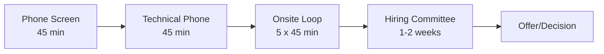

# Google System Design Interview Guide

<h1>🚀 Master Google System Design Interviews</h1>

Comprehensive guide to Google's unique approach to system design interviews

## 📋 Overview

Google system design interviews are known for their emphasis on:
- **Scale**: Designing for billions of users globally
- **Simplicity**: Preferring elegant solutions over complex ones
- **Reliability**: Building systems that never go down
- **Performance**: Meeting strict latency requirements
- **Cost**: Optimizing for efficiency at scale

<h3>🎯 Key Insight</h3>

Google values candidates who can think at planetary scale while keeping designs simple and maintainable. The best solutions often leverage Google's existing infrastructure patterns.

## 🏗️ Google's Infrastructure Philosophy

### Core Design Principles

<h3>1. Start Simple, Scale Incrementally</h3>
<ul>
<li>Begin with MVP (Minimum Viable Product)</li>
<li>Add complexity only when justified by requirements</li>
<li>Document trade-offs at each scaling step</li>
</ul>

<h3>2. Use Proven Patterns</h3>
<ul>
<li>Leverage existing Google infrastructure (Bigtable, Spanner, etc.)</li>
<li>Apply well-tested distributed systems patterns</li>
<li>Avoid reinventing the wheel</li>
</ul>

<h3>3. Design for Failure</h3>
<ul>
<li>Assume everything will fail</li>
<li>Build redundancy at every layer</li>
<li>Plan for graceful degradation</li>
</ul>

<h3>4. Optimize for the Common Case</h3>
<ul>
<li>Make the typical path fast</li>
<li>Handle edge cases separately</li>
<li>Use caching aggressively</li>
</ul>

## 📊 Scale Requirements at Google

<h3>🌍 Typical Google Scale</h3>

<strong>When designing for Google, assume:</strong>

<ul>
<li><strong>Users</strong>: 1-2 billion globally</li>
<li><strong>Requests</strong>: 100K-1M requests/second</li>
<li><strong>Data</strong>: Petabytes to Exabytes</li>
<li><strong>Latency</strong>: &lt;100ms p99</li>
<li><strong>Availability</strong>: 99.99%+ (4 nines)</li>
<li><strong>Geo-distribution</strong>: 20+ regions worldwide</li>
</ul>

## 🔧 Google's Technology Stack

### Storage Systems

| Technology | Use Case | Key Features |
|------------|----------|--------------|
| **Bigtable** | NoSQL at scale | - Petabyte scale - Wide column store - Strong consistency per row |
| **Spanner** | Global RDBMS | - Globally distributed - ACID transactions - External consistency |
| **Colossus** | File storage | - Successor to GFS - Exabyte scale - Powers all Google storage |
| **Firestore** | Document DB | - Real-time sync - Offline support - Mobile-friendly |

### Processing & Compute

| Technology | Use Case | Key Features |
|------------|----------|--------------|
| **MapReduce** | Batch processing | - Parallel processing - Fault tolerant - Simple programming model |
| **Dataflow** | Stream processing | - Unified batch/stream - Auto-scaling - Exactly-once processing |
| **Borg** | Container orchestration | - Cluster management - Resource efficiency - Basis for Kubernetes |
| **Cloud Functions** | Serverless | - Event-driven - Auto-scaling - Pay per execution |

### Networking & Communication

| Technology | Use Case | Key Features |
|------------|----------|--------------|
| **Stubby/gRPC** | RPC framework | - Binary protocol - Streaming support - Multi-language |
| **Andromeda** | SDN | - Virtual networking - Global load balancing - DDoS protection |
| **Maglev** | Load balancing | - Consistent hashing - Connection draining - Health checking |

## 📈 Common Interview Topics

### Most Frequently Asked Systems

📹

<h4>Video Streaming (YouTube)</h4>

CDN, adaptive bitrate, recommendation engine

🗺️

<h4>Maps & Navigation</h4>

Geospatial indexing, route calculation, real-time traffic

📧

<h4>Email Service (Gmail)</h4>

Spam detection, search, massive storage

🔍

<h4>Search Engine</h4>

Web crawling, indexing, ranking, instant results

📝

<h4>Collaborative Docs</h4>

Real-time sync, conflict resolution, offline support

💬

<h4>Chat/Messaging</h4>

Real-time delivery, end-to-end encryption, presence

☁️

<h4>Cloud Storage (Drive)</h4>

File sync, sharing, versioning, deduplication

📱

<h4>App Store (Play Store)</h4>

App distribution, updates, ratings, recommendations

### Key Design Patterns to Master

1. **Sharding & Partitioning**
   - Consistent hashing
   - Range-based sharding
   - Geographic partitioning

2. **Caching Strategies**
   - Multi-level caching
   - Cache warming
   - Cache invalidation

3. **Data Consistency**
   - Eventual consistency
   - Strong consistency
   - Tunable consistency

4. **Load Balancing**
   - Round robin
   - Least connections
   - Geographic routing

5. **Service Mesh**
   - Service discovery
   - Circuit breaking
   - Request routing

## 🎯 Evaluation Criteria

### What Google Interviewers Look For

<h3>Core Evaluation Dimensions</h3>
<table>
<tr>
<th>Dimension</th>
<th>What They Assess</th>
<th>How to Excel</th>
</tr>
<tr>
<td><strong>Problem Solving</strong></td>
<td>- Requirement gathering - Trade-off analysis - Iterative refinement</td>
<td>- Ask clarifying questions - State assumptions clearly - Consider multiple approaches</td>
</tr>
<tr>
<td><strong>Technical Depth</strong></td>
<td>- System components - Data flow - Technology choices</td>
<td>- Know common patterns - Understand Google tech - Justify decisions</td>
</tr>
<tr>
<td><strong>Scale Awareness</strong></td>
<td>- Capacity planning - Performance optimization - Cost considerations</td>
<td>- Do back-of-envelope math - Identify bottlenecks - Propose optimizations</td>
</tr>
<tr>
<td><strong>Communication</strong></td>
<td>- Clarity of explanation - Diagram quality - Thought process</td>
<td>- Think out loud - Draw clear diagrams - Summarize decisions</td>
</tr>
</table>

### Scoring Rubric (1-4 Scale)

- **4 - Strong Hire**: Exceptional design, deep understanding, clear communication
- **3 - Hire**: Solid design, good trade-offs, adequate communication
- **2 - No Hire**: Major gaps, poor trade-offs, unclear communication
- **1 - Strong No Hire**: Fundamental misunderstanding, no viable solution

## 📚 Must-Read Google Papers

<h3>📖 Essential Reading List</h3>
<ol>
<li><strong>MapReduce (2004)</strong> - Simplified data processing on large clusters</li>
<li><strong>Bigtable (2006)</strong> - Distributed storage system for structured data</li>
<li><strong>Spanner (2012)</strong> - Globally distributed database with external consistency</li>
<li><strong>Dapper (2010)</strong> - Large-scale distributed systems tracing</li>
<li><strong>Borg (2015)</strong> - Large-scale cluster management (Kubernetes predecessor)</li>
</ol>

## 🗺️ Interview Process & Timeline

### Typical Interview Structure

### System Design Round Format (45 minutes)

| Time | Phase | Focus |
|------|-------|-------|
| 0-5 min | **Requirements** | Clarify functional & non-functional requirements |
| 5-10 min | **Estimation** | Back-of-envelope calculations for scale |
| 10-25 min | **High-Level Design** | Draw architecture, explain components |
| 25-35 min | **Deep Dive** | Detail 1-2 components, handle edge cases |
| 35-40 min | **Scale & Optimize** | Discuss bottlenecks, propose improvements |
| 40-45 min | **Wrap Up** | Summarize, answer questions |

## 💡 Pro Tips

<h3>✅ Do's</h3>
<ul>
<li>Start with a simple, working design</li>
<li>Use Google technologies when appropriate</li>
<li>Draw clear, labeled diagrams</li>
<li>Justify every design decision</li>
<li>Consider cost implications</li>
<li>Think about monitoring & debugging</li>
</ul>

<h3>❌ Don'ts</h3>
<ul>
<li>Don't over-engineer from the start</li>
<li>Don't ignore latency requirements</li>
<li>Don't forget about failure modes</li>
<li>Don't skip capacity planning</li>
<li>Don't use technologies you can't explain</li>
<li>Don't forget about data consistency</li>
</ul>

## 📚 Complete Interview Resources

### 🎓 Preparation Materials

<a href="preparation-guide.md" class="pattern-card">

📖

<h4>8-Week Study Guide</h4>

Structured preparation plan with daily tasks

</a>

<a href="common-mistakes.md" class="pattern-card">

❌

<h4>Common Mistakes</h4>

Learn what to avoid in interviews

</a>

<a href="interview-experiences.md" class="pattern-card">

💬

<h4>Interview Experiences & Tips</h4>

Real scenarios, communication strategies, and proven techniques

</a>

<a href="mock-questions.md" class="pattern-card">

💯

<h4>Mock Questions</h4>

20+ Google-specific practice problems

</a>

<a href="evaluation-rubric.md" class="pattern-card">

📊

<h4>Evaluation Rubric</h4>

Comprehensive scoring guide and self-assessment

</a>

### 🚶 Example Walkthroughs

<a href="youtube-walkthrough.md" class="pattern-card">

🎥

<h4>Design YouTube</h4>

Complete 45-minute interview walkthrough

</a>

<a href="maps-walkthrough.md" class="pattern-card">

🗺️

<h4>Design Google Maps</h4>

Geographic systems at planetary scale

</a>

<a href="gmail-walkthrough.md" class="pattern-card">

📧

<h4>Design Gmail</h4>

Email system for billions of users

</a>

### ⚡ Quick References

<a href="scale-cheatsheet.md" class="pattern-card">

📊

<h4>Scale Cheat Sheet</h4>

Google scale numbers & calculations

</a>

<a href="tech-mapping.md" class="pattern-card">

🔧

<h4>Technology Mapping</h4>

When to use what technology

</a>

<a href="time-management.md" class="pattern-card">

⏰

<h4>Time Management</h4>

Optimize your 45 minutes

</a>

### 🔗 Related Resources

<a href="../patterns/index.md" class="pattern-card">

🏗️

<h4>Pattern Library</h4>

Master essential design patterns

</a>

<a href="../case-studies/index.md" class="pattern-card">

📚

<h4>Case Studies</h4>

Learn from real system designs

</a>

<a href="../quantitative/index.md" class="pattern-card">

🧮

<h4>Quantitative Tools</h4>

Master capacity planning math

</a>

## 📌 Quick Reference Card

<h3>Interview Day Checklist</h3>
<ul>
<li>☐ Clarify requirements (functional & non-functional)</li>
<li>☐ Define success metrics (QPS, latency, availability)</li>
<li>☐ Estimate scale (users, data, requests)</li>
<li>☐ Draw high-level architecture</li>
<li>☐ Design data model & API</li>
<li>☐ Address scalability concerns</li>
<li>☐ Discuss failure scenarios</li>
<li>☐ Consider monitoring & alerting</li>
<li>☐ Optimize for performance & cost</li>
<li>☐ Summarize trade-offs made</li>
</ul>

---

<a href="../index.md" class="nav-card">

🏠

<h4>Home</h4>

Back to main page

</a>

<a href="preparation-guide.md" class="nav-card">

📖

<h4>Start Preparing</h4>

Structured study guide

</a>

