# Google System Design Interview Guide

<h1>🚀 Master Google System Design Interviews</h1>

Comprehensive guide to Google's unique approach to system design interviews

## 🎯 Quick Decision Guide

```mermaid
graph TD
    Start["Starting Your Prep Journey"] --> Level{What's Your Level?}
    
    Level -->|New Grad| NG[Focus on Fundamentals]
    Level -->|Mid-Level| ML[Balance Theory & Practice]
    Level -->|Senior+| SR[Deep Dive & Leadership]
    
    NG --> Time1{Time Available?}
    ML --> Time2{Time Available?}
    SR --> Time3{Time Available?}
    
    Time1 -->|< 4 weeks| Express1[Express Track]
    Time1 -->|4-8 weeks| Standard1[Standard Track]
    Time1 -->|> 8 weeks| Deep1[Deep Track]
    
    Time2 -->|< 4 weeks| Express2[Express Track]
    Time2 -->|4-8 weeks| Standard2[Standard Track]
    Time2 -->|> 8 weeks| Deep2[Deep Track]
    
    Time3 -->|< 4 weeks| Express3[Express Track]
    Time3 -->|4-8 weeks| Standard3[Standard Track]
    Time3 -->|> 8 weeks| Deep3[Deep Track]
    
    Express1 --> Plan1["✅ Core Systems Only<br/>✅ 3 Mock Interviews<br/>✅ Cheat Sheets"]
    Standard1 --> Plan2["✅ All Fundamentals<br/>✅ 5 System Designs<br/>✅ 5 Mock Interviews"]
    Deep1 --> Plan3["✅ Read Papers<br/>✅ 10+ Designs<br/>✅ Daily Practice"]
    
    Express2 --> Plan4["✅ Pattern Review<br/>✅ 5 Mock Interviews<br/>✅ Scale Focus"]
    Standard2 --> Plan5["✅ Google Tech Deep Dive<br/>✅ 8 System Designs<br/>✅ Weekly Mocks"]
    Deep2 --> Plan6["✅ Master All Patterns<br/>✅ 15+ Designs<br/>✅ Teach Others"]
    
    Express3 --> Plan7["✅ Leadership Scenarios<br/>✅ Complex Systems<br/>✅ Cost Optimization"]
    Standard3 --> Plan8["✅ Architecture Patterns<br/>✅ Trade-off Analysis<br/>✅ Operational Excellence"]
    Deep3 --> Plan9["✅ Research Papers<br/>✅ Novel Solutions<br/>✅ Mentor Others"]
```

## 📋 Interview Types Comparison

<table>
<thead>
<tr>
<th>Interview Type</th>
<th>Focus Areas</th>
<th>Duration</th>
<th>Key Expectations</th>
<th>Common Topics</th>
</tr>
</thead>
<tbody>
<tr>
<td><strong>Phone Screen</strong></td>
<td>• High-level design • Basic scale awareness • Communication skills</td>
<td>45 min</td>
<td>• Clear thinking • Basic patterns • Ask good questions</td>
<td>• URL shortener • Chat system • Basic storage</td>
</tr>
<tr>
<td><strong>Onsite - Junior</strong></td>
<td>• Fundamentals • Common patterns • Learning ability</td>
<td>45 min × 2</td>
<td>• Solid basics • Growth potential • Coachability</td>
<td>• Social media feed • File storage • Messaging</td>
</tr>
<tr>
<td><strong>Onsite - Senior</strong></td>
<td>• Complex systems • Trade-offs • Leadership</td>
<td>45 min × 2-3</td>
<td>• Deep expertise • Novel solutions • Mentorship</td>
<td>• YouTube • Google Search • AdWords</td>
</tr>
<tr>
<td><strong>Onsite - Staff+</strong></td>
<td>• Architecture • Cross-system design • Organizational impact</td>
<td>60 min × 2-3</td>
<td>• Vision • Innovation • Business sense</td>
<td>• Platform design • Infrastructure • ML systems</td>
</tr>
</tbody>
</table>

## 📊 Success Metrics Dashboard

<h4>Scale Requirements</h4>

1B+ Users

Global reach expected

<h4>Latency Target</h4>

<100ms

P99 for user-facing

<h4>Availability</h4>

99.99%

4 nines minimum

<h4>Design Time</h4>

45 min

Complete solution

<h3>🎯 Key Insight</h3>

Google values candidates who can think at planetary scale while keeping designs simple and maintainable. The best solutions often leverage Google's existing infrastructure patterns.

## 🏗️ Google's Infrastructure Philosophy

### Core Design Principles

<h3>1. Start Simple, Scale Incrementally</h3>
<ul>
<li>Begin with MVP (Minimum Viable Product)</li>
<li>Add complexity only when justified by requirements</li>
<li>Document trade-offs at each scaling step</li>
</ul>

<h3>2. Use Proven Patterns</h3>
<ul>
<li>Leverage existing Google infrastructure (Bigtable, Spanner, etc.)</li>
<li>Apply well-tested distributed systems patterns</li>
<li>Avoid reinventing the wheel</li>
</ul>

<h3>3. Design for Failure</h3>
<ul>
<li>Assume everything will fail</li>
<li>Build redundancy at every layer</li>
<li>Plan for graceful degradation</li>
</ul>

<h3>4. Optimize for the Common Case</h3>
<ul>
<li>Make the typical path fast</li>
<li>Handle edge cases separately</li>
<li>Use caching aggressively</li>
</ul>

## 📊 Scale Requirements at Google

<h3>🌍 Typical Google Scale</h3>

<strong>When designing for Google, assume:</strong>

<ul>
<li><strong>Users</strong>: 1-2 billion globally</li>
<li><strong>Requests</strong>: 100K-1M requests/second</li>
<li><strong>Data</strong>: Petabytes to Exabytes</li>
<li><strong>Latency</strong>: &lt;100ms p99</li>
<li><strong>Availability</strong>: 99.99%+ (4 nines)</li>
<li><strong>Geo-distribution</strong>: 20+ regions worldwide</li>
</ul>

## 🗺️ Visual Preparation Roadmap

## 🧮 Time Allocation Calculator

<h3>Personalized Study Plan Calculator</h3>

<label>Current Level:
<select id="level">
<option value="junior">Junior (0-3 years)</option>
<option value="mid">Mid-level (3-6 years)</option>
<option value="senior">Senior (6+ years)</option>
</select>
</label>
<label>Available Hours/Week:
<input type="number" id="hours" min="5" max="40" value="10">
</label>
<label>Target Date:
<input type="date" id="target-date">
</label>
<button onclick="calculatePlan()">Generate Plan</button>

## 🔧 Google's Technology Stack

### 📊 Technology Selection Matrix

<table>
<thead>
<tr>
<th>Use Case</th>
<th>Best Choice</th>
<th>Alternative</th>
<th>When to Use</th>
<th>Scale Limit</th>
</tr>
</thead>
<tbody>
<tr>
<td><strong>Structured Data</strong></td>
<td>Spanner</td>
<td>Cloud SQL</td>
<td>Global consistency needed</td>
<td>Unlimited</td>
</tr>
<tr>
<td><strong>NoSQL</strong></td>
<td>Bigtable</td>
<td>Firestore</td>
<td>Time-series, high throughput</td>
<td>Petabytes</td>
</tr>
<tr>
<td><strong>Object Storage</strong></td>
<td>Cloud Storage</td>
<td>Persistent Disk</td>
<td>Unstructured data, media</td>
<td>Exabytes</td>
</tr>
<tr>
<td><strong>Caching</strong></td>
<td>Memcached</td>
<td>Redis</td>
<td>Session data, hot data</td>
<td>TB in memory</td>
</tr>
<tr>
<td><strong>Message Queue</strong></td>
<td>Pub/Sub</td>
<td>Cloud Tasks</td>
<td>Async processing</td>
<td>1M msgs/sec</td>
</tr>
<tr>
<td><strong>Stream Processing</strong></td>
<td>Dataflow</td>
<td>Dataproc</td>
<td>Real-time analytics</td>
<td>Unlimited</td>
</tr>
<tr>
<td><strong>Batch Processing</strong></td>
<td>Dataflow</td>
<td>Dataproc</td>
<td>ETL, ML training</td>
<td>Unlimited</td>
</tr>
<tr>
<td><strong>ML Serving</strong></td>
<td>Vertex AI</td>
<td>Cloud Run</td>
<td>Model inference</td>
<td>10K QPS</td>
</tr>
</tbody>
</table>

### Storage Systems

| Technology | Use Case | Key Features |
| **Bigtable** | NoSQL at scale | - Petabyte scale - Wide column store - Strong consistency per row |
| **Spanner** | Global RDBMS | - Globally distributed - ACID transactions - External consistency |
| **Colossus** | File storage | - Successor to GFS - Exabyte scale - Powers all Google storage |
| **Firestore** | Document DB | - Real-time sync - Offline support - Mobile-friendly |

### Processing & Compute

| Technology | Use Case | Key Features |
|------------|----------|--------------|
| **MapReduce** | Batch processing | - Parallel processing - Fault tolerant - Simple programming model |
| **Dataflow** | Stream processing | - Unified batch/stream - Auto-scaling - Exactly-once processing |
| **Borg** | Container orchestration | - Cluster management - Resource efficiency - Basis for Kubernetes |
| **Cloud Functions** | Serverless | - Event-driven - Auto-scaling - Pay per execution |

### Networking & Communication

| Technology | Use Case | Key Features |
|------------|----------|--------------|
| **Stubby/gRPC** | RPC framework | - Binary protocol - Streaming support - Multi-language |
| **Andromeda** | SDN | - Virtual networking - Global load balancing - DDoS protection |
| **Maglev** | Load balancing | - Consistent hashing - Connection draining - Health checking |

## 🎯 Interview Focus Areas by Role

## 📈 Common Interview Topics

### Most Frequently Asked Systems

📹

<h4>Video Streaming (YouTube)</h4>

CDN, adaptive bitrate, recommendation engine

🗺️

<h4>Maps & Navigation</h4>

Geospatial indexing, route calculation, real-time traffic

📧

<h4>Email Service (Gmail)</h4>

Spam detection, search, massive storage

🔍

<h4>Search Engine</h4>

Web crawling, indexing, ranking, instant results

📝

<h4>Collaborative Docs</h4>

Real-time sync, conflict resolution, offline support

💬

<h4>Chat/Messaging</h4>

Real-time delivery, end-to-end encryption, presence

☁️

<h4>Cloud Storage (Drive)</h4>

File sync, sharing, versioning, deduplication

📱

<h4>App Store (Play Store)</h4>

App distribution, updates, ratings, recommendations

### Key Design Patterns to Master

1. **Sharding & Partitioning**
   - Consistent hashing
   - Range-based sharding
   - Geographic partitioning

2. **Caching Strategies**
   - Multi-level caching
   - Cache warming
   - Cache invalidation

3. **Data Consistency**
   - Eventual consistency
   - Strong consistency
   - Tunable consistency

4. **Load Balancing**
   - Round robin
   - Least connections
   - Geographic routing

5. **Service Mesh**
   - Service discovery
   - Circuit breaking
   - Request routing

## 📊 Detailed Scoring Rubric

<table>
<thead>
<tr>
<th>Dimension</th>
<th>1 - Strong No Hire</th>
<th>2 - No Hire</th>
<th>3 - Hire</th>
<th>4 - Strong Hire</th>
</tr>
</thead>
<tbody>
<tr>
<td><strong>Problem Analysis</strong></td>
<td>• Misunderstands problem • No clarifying questions • Wrong assumptions</td>
<td>• Basic understanding • Few questions • Some assumptions stated</td>
<td>• Good understanding • Good questions • Clear assumptions</td>
<td>• Deep insight • Excellent questions • Challenges assumptions</td>
</tr>
<tr>
<td><strong>System Design</strong></td>
<td>• No coherent design • Major components missing • Doesn't work</td>
<td>• Basic design • Some gaps • Would work poorly</td>
<td>• Solid design • All components present • Would work well</td>
<td>• Elegant design • Optimal choices • Production-ready</td>
</tr>
<tr>
<td><strong>Scale Thinking</strong></td>
<td>• Ignores scale • No calculations • Single-server mindset</td>
<td>• Mentions scale • Basic calculations • Some distribution</td>
<td>• Plans for scale • Good calculations • Proper sharding</td>
<td>• Masters scale • Precise calculations • Optimal partitioning</td>
</tr>
<tr>
<td><strong>Trade-offs</strong></td>
<td>• No trade-offs discussed • One-size-fits-all • Inflexible</td>
<td>• Few trade-offs • Basic analysis • Some flexibility</td>
<td>• Good trade-offs • Clear reasoning • Adaptable design</td>
<td>• Excellent analysis • Multiple options • Future-proof</td>
</tr>
<tr>
<td><strong>Communication</strong></td>
<td>• Unclear explanation • No diagrams • Hard to follow</td>
<td>• Basic clarity • Simple diagrams • Some confusion</td>
<td>• Clear communication • Good diagrams • Easy to follow</td>
<td>• Crystal clear • Professional diagrams • Teaches interviewer</td>
</tr>
</tbody>
</table>

## 🎯 Evaluation Criteria

### What Google Interviewers Look For

<h3>Core Evaluation Dimensions</h3>
<table>
<tr>
<th>Dimension</th>
<th>What They Assess</th>
<th>How to Excel</th>
</tr>
<tr>
<td><strong>Problem Solving</strong></td>
<td>- Requirement gathering - Trade-off analysis - Iterative refinement</td>
<td>- Ask clarifying questions - State assumptions clearly - Consider multiple approaches</td>
</tr>
<tr>
<td><strong>Technical Depth</strong></td>
<td>- System components - Data flow - Technology choices</td>
<td>- Know common patterns - Understand Google tech - Justify decisions</td>
</tr>
<tr>
<td><strong>Scale Awareness</strong></td>
<td>- Capacity planning - Performance optimization - Cost considerations</td>
<td>- Do back-of-envelope math - Identify bottlenecks - Propose optimizations</td>
</tr>
<tr>
<td><strong>Communication</strong></td>
<td>- Clarity of explanation - Diagram quality - Thought process</td>
<td>- Think out loud - Draw clear diagrams - Summarize decisions</td>
</tr>
</table>

### Scoring Rubric (1-4 Scale)

- **4 - Strong Hire**: Exceptional design, deep understanding, clear communication
- **3 - Hire**: Solid design, good trade-offs, adequate communication
- **2 - No Hire**: Major gaps, poor trade-offs, unclear communication
- **1 - Strong No Hire**: Fundamental misunderstanding, no viable solution

## 📚 Must-Read Google Papers

<h3>📖 Essential Reading List</h3>
<ol>
<li><strong>MapReduce (2004)</strong> - Simplified data processing on large clusters</li>
<li><strong>Bigtable (2006)</strong> - Distributed storage system for structured data</li>
<li><strong>Spanner (2012)</strong> - Globally distributed database with external consistency</li>
<li><strong>Dapper (2010)</strong> - Large-scale distributed systems tracing</li>
<li><strong>Borg (2015)</strong> - Large-scale cluster management (Kubernetes predecessor)</li>
</ol>

## 🗺️ Interview Process & Timeline

### Typical Interview Structure

### System Design Round Format (45 minutes)

| Time | Phase | Focus |
|------|-------|-------|
| 0-5 min | **Requirements** | Clarify functional & non-functional requirements |
| 5-10 min | **Estimation** | Back-of-envelope calculations for scale |
| 10-25 min | **High-Level Design** | Draw architecture, explain components |
| 25-35 min | **Deep Dive** | Detail 1-2 components, handle edge cases |
| 35-40 min | **Scale & Optimize** | Discuss bottlenecks, propose improvements |
| 40-45 min | **Wrap Up** | Summarize, answer questions |

## 🛠️ Interactive Design Checklist

<h3>Pre-Interview Checklist</h3>

<h4>Technical Preparation</h4>
<label><input type="checkbox"> Reviewed 7 Laws and 5 Pillars</label>
<label><input type="checkbox"> Read 5+ Google papers</label>
<label><input type="checkbox"> Practiced 10+ system designs</label>
<label><input type="checkbox"> Memorized latency numbers</label>
<label><input type="checkbox"> Understood CAP theorem deeply</label>

<h4>Practice & Skills</h4>
<label><input type="checkbox"> Can draw clear architecture diagrams</label>
<label><input type="checkbox"> Comfortable with back-of-envelope math</label>
<label><input type="checkbox"> Practiced time management (45 min)</label>
<label><input type="checkbox"> Done 5+ mock interviews</label>
<label><input type="checkbox"> Received and incorporated feedback</label>

<h4>Interview Day</h4>
<label><input type="checkbox"> Good night's sleep</label>
<label><input type="checkbox"> Quiet environment setup</label>
<label><input type="checkbox"> Drawing tools ready</label>
<label><input type="checkbox"> Water bottle nearby</label>
<label><input type="checkbox"> Positive mindset</label>

## 🔄 Design Process Flowchart

## 💡 Pro Tips

<h3>✅ Do's</h3>
<ul>
<li>Start with a simple, working design</li>
<li>Use Google technologies when appropriate</li>
<li>Draw clear, labeled diagrams</li>
<li>Justify every design decision</li>
<li>Consider cost implications</li>
<li>Think about monitoring & debugging</li>
</ul>

<h3>❌ Don'ts</h3>
<ul>
<li>Don't over-engineer from the start</li>
<li>Don't ignore latency requirements</li>
<li>Don't forget about failure modes</li>
<li>Don't skip capacity planning</li>
<li>Don't use technologies you can't explain</li>
<li>Don't forget about data consistency</li>
</ul>

## 📚 Complete Interview Resources

### 🎓 Preparation Materials

<a href="preparation-guide.md" class="pattern-card">

📖

<h4>8-Week Study Guide</h4>

Structured preparation plan with daily tasks

</a>

<a href="common-mistakes.md" class="pattern-card">

❌

<h4>Common Mistakes</h4>

Learn what to avoid in interviews

</a>

<a href="interview-experiences.md" class="pattern-card">

💬

<h4>Interview Experiences & Tips</h4>

Real scenarios, communication strategies, and proven techniques

</a>

<a href="mock-questions.md" class="pattern-card">

💯

<h4>Mock Questions</h4>

20+ Google-specific practice problems

</a>

<a href="evaluation-rubric.md" class="pattern-card">

📊

<h4>Evaluation Rubric</h4>

Comprehensive scoring guide and self-assessment

</a>

### 🚶 Example Walkthroughs

<a href="youtube-walkthrough.md" class="pattern-card">

🎥

<h4>Design YouTube</h4>

Complete 45-minute interview walkthrough

</a>

<a href="maps-walkthrough.md" class="pattern-card">

🗺️

<h4>Design Google Maps</h4>

Geographic systems at planetary scale

</a>

<a href="gmail-walkthrough.md" class="pattern-card">

📧

<h4>Design Gmail</h4>

Email system for billions of users

</a>

### ⚡ Quick References

<a href="scale-cheatsheet.md" class="pattern-card">

📊

<h4>Scale Cheat Sheet</h4>

Google scale numbers & calculations

</a>

<a href="tech-mapping.md" class="pattern-card">

🔧

<h4>Technology Mapping</h4>

When to use what technology

</a>

<a href="time-management.md" class="pattern-card">

⏰

<h4>Time Management</h4>

Optimize your 45 minutes

</a>

### 🔗 Related Resources

<a href="../patterns/index.md" class="pattern-card">

🏗️

<h4>Pattern Library</h4>

Master essential design patterns

</a>

<a href="../case-studies/index.md" class="pattern-card">

📚

<h4>Case Studies</h4>

Learn from real system designs

</a>

<a href="../quantitative/index.md" class="pattern-card">

🧮

<h4>Quantitative Tools</h4>

Master capacity planning math

</a>

## 📌 Quick Reference Card

<h3>Interview Day Checklist</h3>
<ul>
<li>☐ Clarify requirements (functional & non-functional)</li>
<li>☐ Define success metrics (QPS, latency, availability)</li>
<li>☐ Estimate scale (users, data, requests)</li>
<li>☐ Draw high-level architecture</li>
<li>☐ Design data model & API</li>
<li>☐ Address scalability concerns</li>
<li>☐ Discuss failure scenarios</li>
<li>☐ Consider monitoring & alerting</li>
<li>☐ Optimize for performance & cost</li>
<li>☐ Summarize trade-offs made</li>
</ul>

---

## 📈 Performance Tracking Tool

<h3>Track Your Interview Performance</h3>
<table>
<thead>
<tr>
<th>Date</th>
<th>System</th>
<th>Time Taken</th>
<th>Self Score (1-4)</th>
<th>Areas to Improve</th>
</tr>
</thead>
<tbody>
<tr>
<td><input type="date"></td>
<td><input type="text" placeholder="e.g., YouTube"></td>
<td><input type="text" placeholder="e.g., 45 min"></td>
<td><select><option>1</option><option>2</option><option>3</option><option>4</option></select></td>
<td><input type="text" placeholder="e.g., Scale calculations"></td>
</tr>
<tr>
<td><input type="date"></td>
<td><input type="text"></td>
<td><input type="text"></td>
<td><select><option>1</option><option>2</option><option>3</option><option>4</option></select></td>
<td><input type="text"></td>
</tr>
<tr>
<td><input type="date"></td>
<td><input type="text"></td>
<td><input type="text"></td>
<td><select><option>1</option><option>2</option><option>3</option><option>4</option></select></td>
<td><input type="text"></td>
</tr>
</tbody>
</table>
<button onclick="analyzeProgress()">Analyze Progress</button>

<a href="../index.md" class="nav-card">

🏠

<h4>Home</h4>

Back to main page

</a>

<a href="preparation-guide.md" class="nav-card">

📖

<h4>Start Preparing</h4>

Structured study guide

</a>

