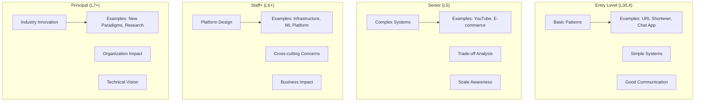
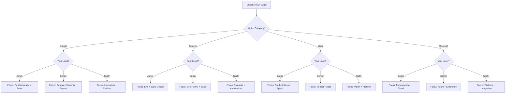
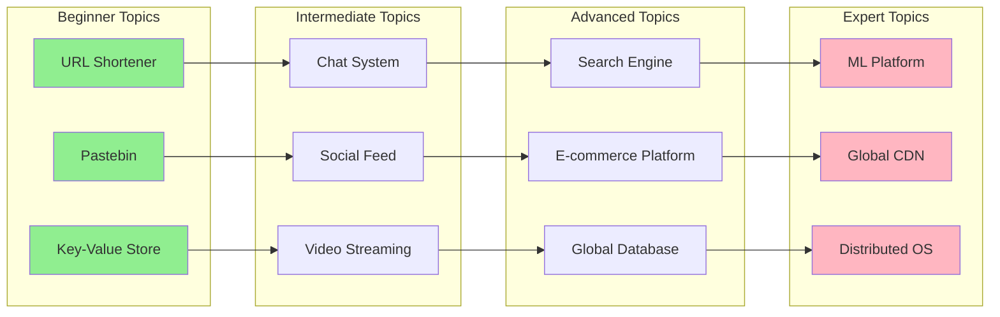
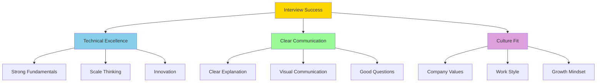

# System Design Interview Comparison Guide

## Company Comparison Matrix

<table class="responsive-table">
<thead>
<tr>
<th>Aspect</th>
<th>Google</th>
<th>Amazon</th>
<th>Meta</th>
<th>Microsoft</th>
<th>Apple</th>
<th>Netflix</th>
</tr>
</thead>
<tbody>
<tr>
<td data-label="Aspect"><strong>Focus</strong></td>
<td data-label="Google">Scale & Simplicity</td>
<td data-label="Amazon">Leadership + Tech</td>
<td data-label="Meta">Product Impact</td>
<td data-label="Microsoft">Platform Design</td>
<td data-label="Apple">User Experience</td>
<td data-label="Netflix">Performance</td>
</tr>
<tr>
<td data-label="Aspect"><strong>Unique Traits</strong></td>
<td data-label="Google">• Planetary scale • Elegant solutions • Infrastructure depth</td>
<td data-label="Amazon">• Customer obsession • Operational rigor • Cost awareness</td>
<td data-label="Meta">• Move fast • Social impact • Data-driven</td>
<td data-label="Microsoft">• Enterprise ready • Developer focused • Cloud native</td>
<td data-label="Apple">• Privacy first • Hardware integration • Ecosystem thinking</td>
<td data-label="Netflix">• Streaming scale • Chaos engineering • A/B testing</td>
</tr>
<tr>
<td data-label="Aspect"><strong>Common Questions</strong></td>
<td data-label="Google">• YouTube • Search • Maps</td>
<td data-label="Amazon">• E-commerce • AWS services • Logistics</td>
<td data-label="Meta">• News Feed • Messenger • Instagram</td>
<td data-label="Microsoft">• Teams • Azure services • Office 365</td>
<td data-label="Apple">• iMessage • iCloud • App Store</td>
<td data-label="Netflix">• Video streaming • Recommendation • CDN design</td>
</tr>
<tr>
<td data-label="Aspect"><strong>Interview Style</strong></td>
<td data-label="Google">Technical depth</td>
<td data-label="Amazon">Behavioral + Tech</td>
<td data-label="Meta">Product + Tech</td>
<td data-label="Microsoft">Balanced</td>
<td data-label="Apple">Excellence focused</td>
<td data-label="Netflix">Deep technical</td>
</tr>
<tr>
<td data-label="Aspect"><strong>Evaluation</strong></td>
<td data-label="Google">• Problem solving • Technical depth • Communication</td>
<td data-label="Amazon">• Leadership principles • Technical skills • Long-term thinking</td>
<td data-label="Meta">• Impact • Execution speed • Innovation</td>
<td data-label="Microsoft">• Collaboration • Technical breadth • Customer focus</td>
<td data-label="Apple">• Attention to detail • Innovation • User empathy</td>
<td data-label="Netflix">• Technical expertise • Performance focus • Data-driven</td>
</tr>
</tbody>
</table>

## Role-Level Expectations

## 🕐 Time Allocation by Company

<table class="responsive-table">
<thead>
<tr>
<th>Phase</th>
<th>Google</th>
<th>Amazon</th>
<th>Meta</th>
<th>Microsoft</th>
</tr>
</thead>
<tbody>
<tr>
<td data-label="Phase"><strong>Requirements</strong></td>
<td data-label="Google">5 min (11%)</td>
<td data-label="Amazon">10 min (20%)</td>
<td data-label="Meta">5 min (11%)</td>
<td data-label="Microsoft">7 min (15%)</td>
</tr>
<tr>
<td data-label="Phase"><strong>Estimation</strong></td>
<td data-label="Google">5 min (11%)</td>
<td data-label="Amazon">5 min (10%)</td>
<td data-label="Meta">3 min (7%)</td>
<td data-label="Microsoft">5 min (11%)</td>
</tr>
<tr>
<td data-label="Phase"><strong>High-Level Design</strong></td>
<td data-label="Google">15 min (33%)</td>
<td data-label="Amazon">15 min (30%)</td>
<td data-label="Meta">20 min (44%)</td>
<td data-label="Microsoft">15 min (33%)</td>
</tr>
<tr>
<td data-label="Phase"><strong>Deep Dive</strong></td>
<td data-label="Google">10 min (22%)</td>
<td data-label="Amazon">10 min (20%)</td>
<td data-label="Meta">10 min (22%)</td>
<td data-label="Microsoft">10 min (22%)</td>
</tr>
<tr>
<td data-label="Phase"><strong>Scale/Optimize</strong></td>
<td data-label="Google">5 min (11%)</td>
<td data-label="Amazon">5 min (10%)</td>
<td data-label="Meta">5 min (11%)</td>
<td data-label="Microsoft">5 min (11%)</td>
</tr>
<tr>
<td data-label="Phase"><strong>Special Focus</strong></td>
<td data-label="Google">5 min - Performance</td>
<td data-label="Amazon">5 min - Operations</td>
<td data-label="Meta">2 min - Metrics</td>
<td data-label="Microsoft">3 min - Integration</td>
</tr>
</tbody>
</table>

## Preparation Strategy Selector

## Difficulty Progression by Topic

## 🛠 Skill Requirements Matrix

<table class="responsive-table">
<thead>
<tr>
<th>Skill Area</th>
<th>L3/L4</th>
<th>L5</th>
<th>L6</th>
<th>L7+</th>
</tr>
</thead>
<tbody>
<tr>
<td data-label="Skill Area"><strong>System Design</strong></td>
<td data-label="L3/L4">✓ Basic patterns ✓ Simple systems ✓ Clear diagrams</td>
<td data-label="L5">✓ Complex systems ✓ Trade-offs ✓ Scale thinking</td>
<td data-label="L6">✓ Platform design ✓ Cross-cutting ✓ Innovation</td>
<td data-label="L7+">✓ Industry leading ✓ Novel solutions ✓ Vision</td>
</tr>
<tr>
<td data-label="Skill Area"><strong>Technical Depth</strong></td>
<td data-label="L3/L4">✓ Data structures ✓ Algorithms ✓ Databases</td>
<td data-label="L5">✓ Distributed systems ✓ Performance ✓ Security</td>
<td data-label="L6">✓ Architecture ✓ ML/AI integration ✓ Research</td>
<td data-label="L7+">✓ Cutting edge ✓ Industry trends ✓ Patents</td>
</tr>
<tr>
<td data-label="Skill Area"><strong>Communication</strong></td>
<td data-label="L3/L4">✓ Clear explanation ✓ Basic diagrams ✓ Answer questions</td>
<td data-label="L5">✓ Persuasive ✓ Professional diagrams ✓ Lead discussion</td>
<td data-label="L6">✓ Executive presence ✓ Teach concepts ✓ Influence</td>
<td data-label="L7+">✓ Thought leader ✓ Industry speaker ✓ Mentor</td>
</tr>
<tr>
<td data-label="Skill Area"><strong>Business Sense</strong></td>
<td data-label="L3/L4">✓ User focus ✓ Basic metrics ✓ Cost awareness</td>
<td data-label="L5">✓ Business metrics ✓ ROI thinking ✓ Market aware</td>
<td data-label="L6">✓ Strategy ✓ Competition ✓ Innovation</td>
<td data-label="L7+">✓ Industry vision ✓ Market maker ✓ Ecosystem</td>
</tr>
</tbody>
</table>

## Success Metrics by Company

<table class="responsive-table">
<thead>
<tr>
<th>Company</th>
<th>Key Success Metrics</th>
<th>Red Flags</th>
<th>Wow Factors</th>
</tr>
</thead>
<tbody>
<tr>
<td data-label="Company"><strong>Google</strong></td>
<td data-label="Key Success Metrics">• Scales to billions • Simple & elegant • Uses Google tech well</td>
<td data-label="Red Flags">• Over-engineering • Ignoring latency • Complex solutions</td>
<td data-label="Wow Factors">• Novel approach • Deep knowledge • Clear thinking</td>
</tr>
<tr>
<td data-label="Company"><strong>Amazon</strong></td>
<td data-label="Key Success Metrics">• Customer focused • Cost conscious • Operationally sound</td>
<td data-label="Red Flags">• Tech over customer • Ignoring cost • No ownership</td>
<td data-label="Wow Factors">• Strong LPs • Frugal innovation • Long-term view</td>
</tr>
<tr>
<td data-label="Company"><strong>Meta</strong></td>
<td data-label="Key Success Metrics">• User impact • Fast iteration • Data-driven</td>
<td data-label="Red Flags">• Slow approach • No metrics • Over-planning</td>
<td data-label="Wow Factors">• Product sense • Growth hacking • Bold ideas</td>
</tr>
<tr>
<td data-label="Company"><strong>Microsoft</strong></td>
<td data-label="Key Success Metrics">• Enterprise ready • Developer friendly • Integrated solution</td>
<td data-label="Red Flags">• Consumer only • Silo thinking • Legacy approach</td>
<td data-label="Wow Factors">• Platform thinking • Cloud expertise • Collaboration</td>
</tr>
</tbody>
</table>

## 🎓 Study Plan Optimizer

<h3>Personalized Study Plan Generator</h3>

<label>Target Company:
<select id="target-company">
<option value="google">Google</option>
<option value="amazon">Amazon</option>
<option value="meta">Meta</option>
<option value="microsoft">Microsoft</option>
</select>
</label>
<label>Current Level:
<select id="current-level">
<option value="junior">Junior (0-3 years)</option>
<option value="senior">Senior (3-6 years)</option>
<option value="staff">Staff (6+ years)</option>
</select>
</label>
<label>Weeks Available:
<input type="number" id="weeks" min="2" max="12" value="6">
</label>
<button onclick="generatePlan()">Generate Custom Plan</button>

## Interview Success Formula

## Quick Reference Cards

<h4>🎯 Google</h4>
<ul>
<li>Think at scale</li>
<li>Keep it simple</li>
<li>Use their tech</li>
<li>Performance matters</li>
<li>Reliability is key</li>
</ul>
<h4>📦 Amazon</h4>
<ul>
<li>Customer first</li>
<li>Show ownership</li>
<li>Be frugal</li>
<li>Think long-term</li>
<li>Dive deep</li>
</ul>
<h4>👥 Meta</h4>
<ul>
<li>Move fast</li>
<li>Impact focused</li>
<li>Data-driven</li>
<li>Bold ideas</li>
<li>User obsessed</li>
</ul>
<h4>🏢 Microsoft</h4>
<ul>
<li>Platform thinking</li>
<li>Developer focus</li>
<li>Enterprise ready</li>
<li>Collaboration</li>
<li>Cloud first</li>
</ul>

