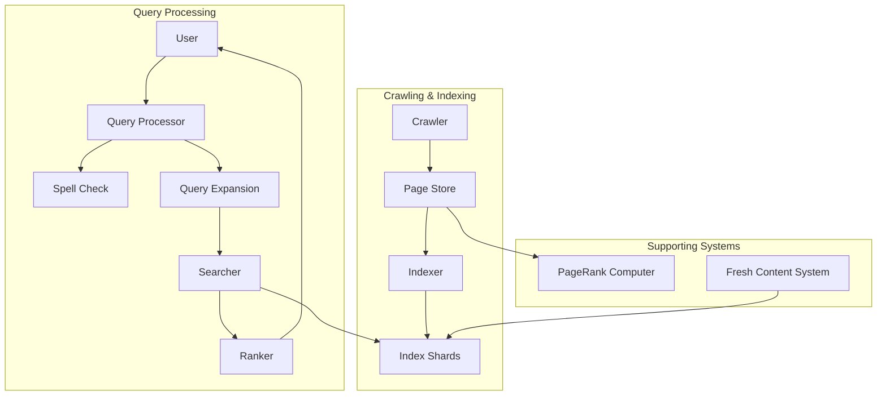
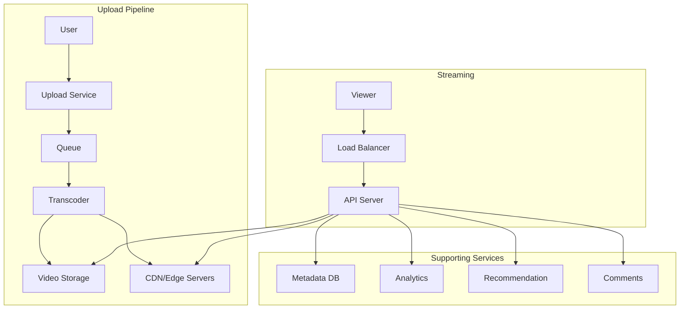
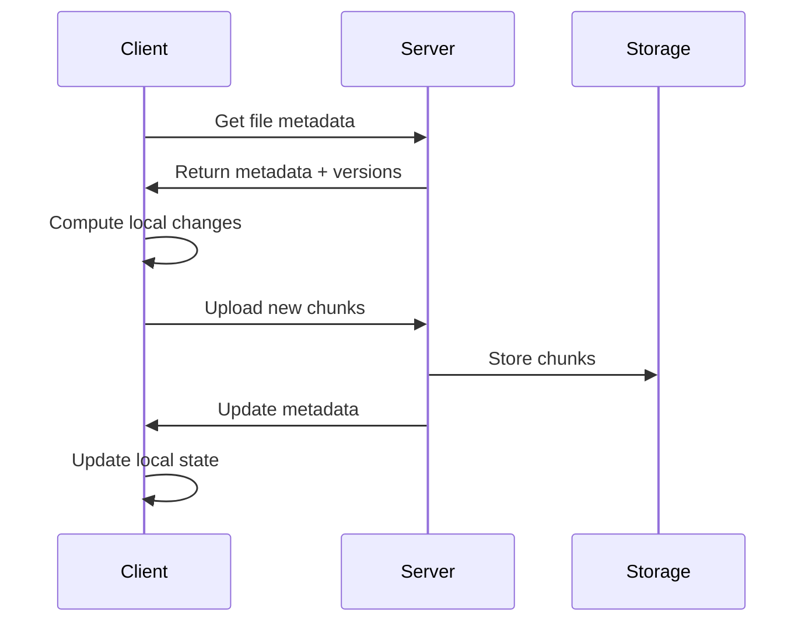
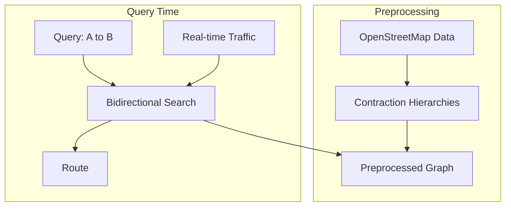
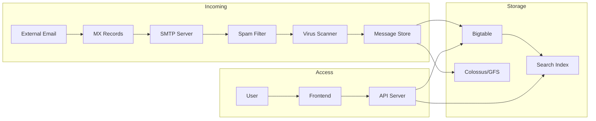
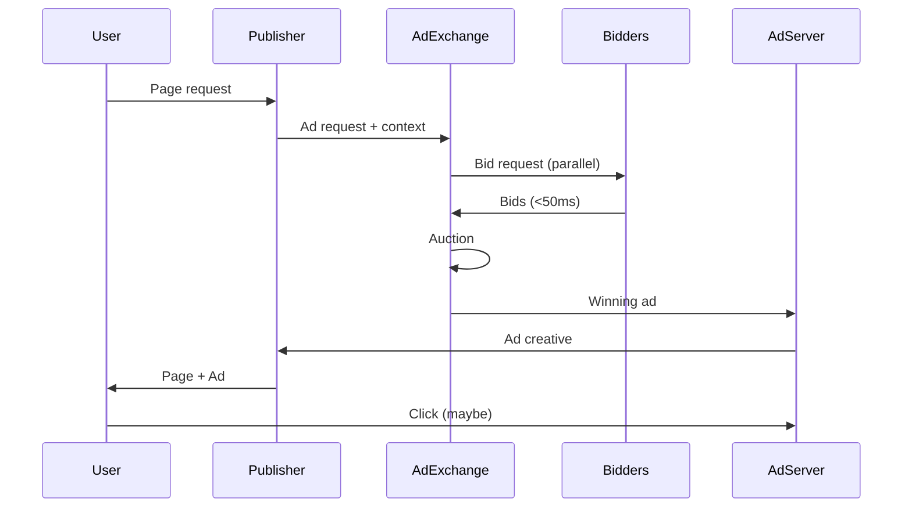
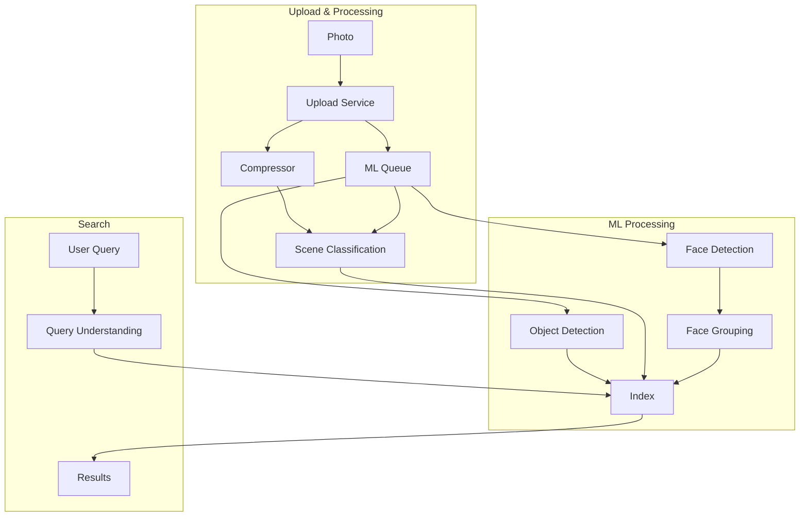
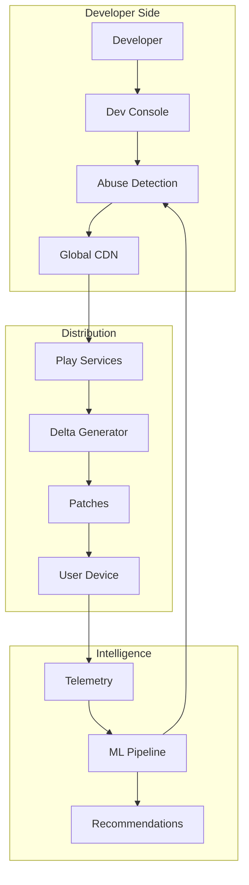
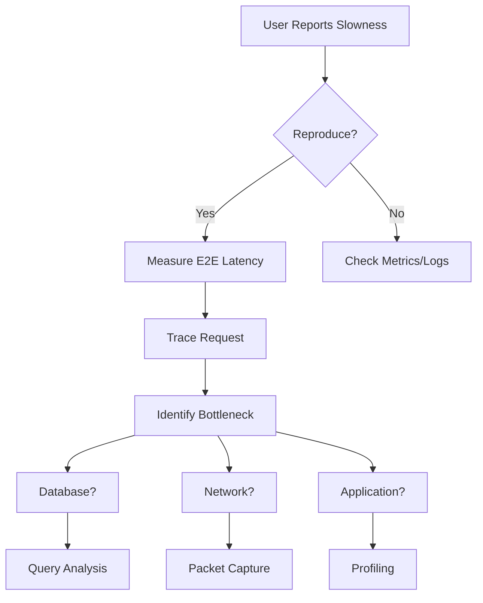

# Google System Design Interview Problems

!!! abstract "How to Use This Guide"

 Each problem includes:
 - Problem statement as given in interviews
 - Clarifying questions to ask
 - Scale calculations
 - Design approach
 - Google-specific considerations
 - Common follow-ups

 Practice these with a timer and whiteboard!

## Classic Google Problems

### 1. Design Google Search

!!! note "Problem Statement"
 "Design a web search engine like Google Search that can index billions of web pages and serve search results with sub-second latency."
 **Key Requirements:**
 - Web crawling and indexing
 - Query processing and ranking
 - Spell correction and suggestions
 - Personalized results
 - Real-time updates for news/trending

**Clarifying Questions:**
- Scale: How many web pages? (Billions)
- Query volume? (70,000 queries/second)
- Latency requirements? (<200ms for 95th percentile)
- Language support? (All major languages)
- Features: Image search? News? Shopping?

**Scale Estimation:**
```
Web Pages: 50 billion pages
Average page size: 100 KB
Total storage: 50B × 100KB = 5 PB (raw HTML)
Index size: ~10% of raw = 500 TB
Query volume: 6B queries/day = 70K QPS
Peak QPS: 140K QPS
```

**High-Level Design:**


**Google-Specific Considerations:**
- Caffeine indexing system for real-time updates
- Knowledge Graph integration
- RankBrain ML ranking
- BERT for query understanding
- Distributed serving with backup requests

### 2. Design YouTube

!!! note "Problem Statement"
 "Design a video sharing platform like YouTube that supports uploading, storing, and streaming videos to billions of users worldwide."
 **Key Requirements:**
 - Video upload and processing
 - Multiple quality transcoding
 - Global video delivery
 - View counting and analytics
 - Comments and interactions
 - Recommendation system

**Scale Estimation:**
```
Users: 2 billion
Videos watched/day: 1 billion
Average video length: 5 minutes
Upload rate: 500 hours/minute
Storage calculation:
- Raw video: 500 hours × 60 min × 5 GB/hour = 150 TB/hour
- After encoding (multiple qualities): 150 TB × 5 = 750 TB/hour
- Yearly storage: 750 TB × 24 × 365 = 6.5 EB/year

Bandwidth calculation:
- 1B views × 5 min × 10 Mbps / 8 = 625 PB/day
- Peak bandwidth: 625 PB / 86400s × 2 = 14.5 Tbps
```

**Architecture Design:**


**Deep Dive Areas:**
- Chunked video upload for reliability
- Adaptive bitrate streaming (DASH/HLS)
- CDN strategy and edge caching
- View count aggregation at scale
- Recommendation ML pipeline

### 3. Design Google Drive

!!! note "Problem Statement"
 "Design a cloud storage service like Google Drive that allows users to store, sync, and share files across multiple devices."
 **Key Requirements:**
 - File upload/download
 - Automatic sync across devices
 - File sharing and permissions
 - Version history
 - Real-time collaboration
 - Mobile and desktop clients

**Key Design Decisions:**

1. **Chunking Strategy:**
```python
# Fixed-size chunking (4MB chunks)
def chunk_file(file_path, chunk_size=4*1024*1024):
 chunks = []
 with open(file_path, 'rb') as f:
 while True:
 chunk = f.read(chunk_size)
 if not chunk:
 break
 chunk_hash = sha256(chunk).hexdigest()
 chunks.append({
 'hash': chunk_hash,
 'size': len(chunk),
 'offset': f.tell() - len(chunk)
 })
 return chunks
```

2. **Sync Protocol:**


3. **Conflict Resolution:**
- Version vectors for tracking changes
- Three-way merge for text files
- Duplicate creation for binary conflicts

### 4. Design Google Maps

!!! note "Problem Statement"
 "Design a mapping service like Google Maps that provides directions, real-time traffic, and location search for billions of users."
 **Key Requirements:**
 - Map rendering at multiple zoom levels
 - Route calculation
 - Real-time traffic updates
 - Location search and geocoding
 - Offline maps
 - Turn-by-turn navigation

**Core Components:**

1. **Map Data Storage:**
```
Tile Pyramid Structure:
- Zoom 0: 1 tile (whole world)
- Zoom 1: 4 tiles
- Zoom 20: 1 trillion tiles
- Each tile: 256×256 pixels

Storage calculation:
- Total tiles: ~4.7 trillion
- Average tile size: 50KB
- Total storage: 235 PB
```

2. **Routing Algorithm:**


3. **Traffic System:**
- Anonymous location data from Android phones
- Traffic speed = distance/time between cell towers
- Historical patterns + real-time updates
- ML predictions for future traffic

### 5. Design Gmail

!!! note "Problem Statement"
 "Design an email service like Gmail that handles billions of emails daily with features like search, spam filtering, and high availability."
 **Key Requirements:**
 - Send/receive emails (SMTP/IMAP)
 - Spam and virus detection
 - Full-text search
 - Labels and filters
 - Attachments up to 25MB
 - 99.9% availability

**Email Flow Architecture:**


**Key Design Points:**
- Bigtable for metadata (fast access)
- GFS/Colossus for email bodies and attachments
- Separate spam scoring pipeline
- Distributed full-text indexing
- Multi-datacenter replication

## Complex System Designs

### 6. Design Google Ads Platform

!!! note "Problem Statement"
 "Design an advertising platform that serves billions of ads daily, handles real-time bidding, and provides analytics to advertisers."
 **Components:**
 - Ad serving system (<100ms latency)
 - Real-time bidding (RTB)
 - Click tracking and attribution
 - Budget pacing
 - Fraud detection
 - Advertiser dashboard

**RTB Flow:**


**Scale Challenges:**
- 100B+ ad requests/day = 1.2M QPS
- <100ms end-to-end latency
- Real-time budget tracking
- Click fraud detection at scale

### 7. Design Google Photos

!!! note "Problem Statement"
 "Design a photo storage service that provides unlimited storage, automatic backup, AI-powered search, and sharing capabilities."
 **Key Features:**
 - Automatic backup from devices
 - Compression without visible quality loss
 - Face recognition and grouping
 - Object/scene recognition
 - Location-based organization
 - Shared albums

**ML Pipeline Architecture:**


**Technical Challenges:**
- Photo compression (WebP, AVIF)
- Privacy-preserving face grouping
- On-device ML for initial processing
- Efficient similarity search
- Cross-user deduplication

### 8. Design Android Play Store

!!! note "Problem Statement"
 "Design an app store that serves billions of Android devices, handles app uploads, updates, and provides personalized recommendations."
 **Requirements:**
 - App upload and review process
 - Binary distribution to 3B+ devices
 - Incremental updates
 - Recommendation system
 - Reviews and ratings
 - Developer console

**Update Distribution System:**


**Key Optimizations:**
- Binary diff for updates (bsdiff)
- Peer-to-peer updates in same network
- Smart update scheduling
- APK splitting by device characteristics

## Interview Tips for Each Problem

!!! info "Pattern Recognition"
 **Storage-Heavy Systems** (Drive, Photos):
 - Focus on chunking and deduplication
 - Discuss consistency vs availability trade-offs
 - Consider sync protocols
 **Latency-Critical Systems** (Search, Maps):
 - Emphasize caching at every level
 - Discuss precomputation strategies
 - Consider edge serving
 **ML-Integrated Systems** (YouTube, Photos):
 - Separate online/offline pipelines
 - Discuss feature storage
 - Consider privacy implications
 **Real-time Systems** (Ads, Maps Traffic):
 - Focus on stream processing
 - Discuss approximation algorithms
 - Consider exactly-once semantics

## Common Follow-up Deep Dives

### 1. "How would you handle a datacenter failure?"

**Expected Discussion Points:**
- Multi-region replication strategy
- Failover mechanisms
- Data consistency during split-brain
- Traffic routing changes
- Recovery procedures

### 2. "How do you ensure data privacy?"

**Key Areas:**
- Encryption at rest and in transit
- Access control and audit logs
- Data residency requirements
- Differential privacy for analytics
- Right to deletion (GDPR)

### 3. "How would you debug slowness?"

**Debugging Approach:**


### 4. "How do you handle 10x growth?"

**Scaling Strategies:**
- Identify bottlenecks via load testing
- Horizontal vs vertical scaling decision
- Caching strategy improvements
- Database sharding approach
- Cost optimization at scale

## Practice Exercises

!!! abstract "Self-Assessment Questions"

 After each practice session, ask yourself:

 1. **Requirements Gathering**
 - Did I ask about scale from the start?
 - Did I clarify functional vs non-functional requirements?
 - Did I identify what's out of scope?

 2. **Estimation**
 - Were my calculations reasonable?
 - Did I identify the main bottlenecks?
 - Did I consider peak vs average load?

 3. **Design**
 - Did I start simple and evolve?
 - Did I draw clear diagrams?
 - Did I consider failures at each level?

 4. **Communication**
 - Did I think out loud?
 - Did I handle hints well?
 - Did I manage time effectively?

 5. **Google-Specific**
 - Did I think at Google scale?
 - Did I consider operational aspects?
 - Did I propose innovative solutions?

## Next Steps

Ready to practice? Here's your action plan:

1. **This Week:** Practice 2 problems from the classic section
2. **Next Week:** Tackle 1 complex system design
3. **Week 3:** Do full mock interviews with timing
4. **Week 4:** Focus on your weak areas

Remember: The goal isn't to memorize solutions but to develop a systematic approach to breaking down and solving large-scale system design problems.

Good luck with your Google interviews!