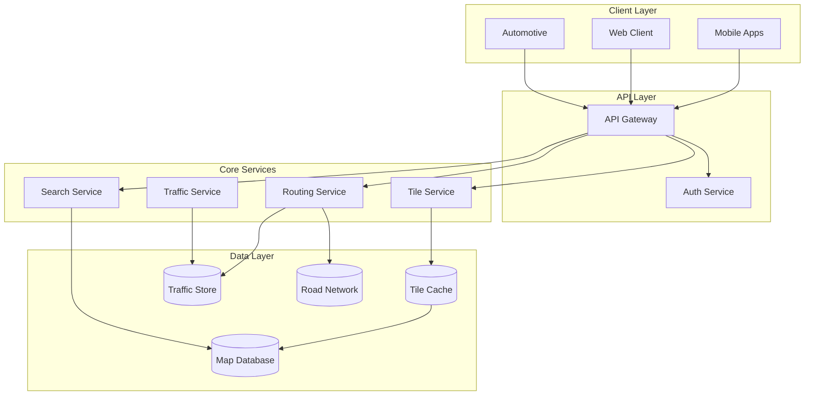
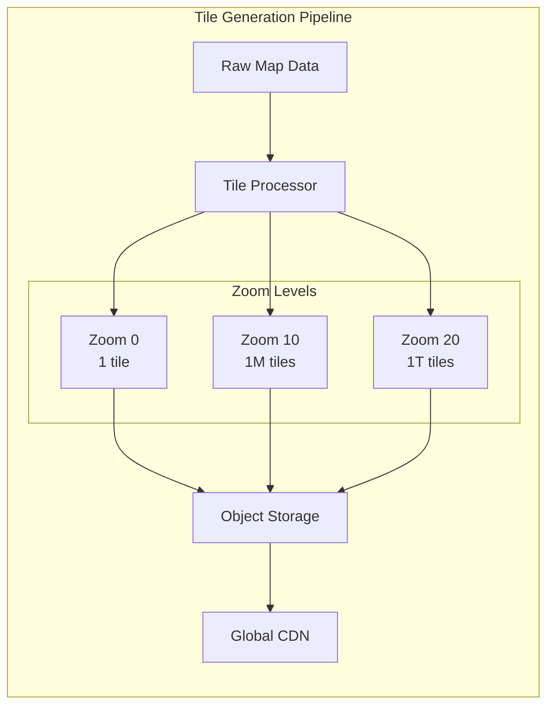
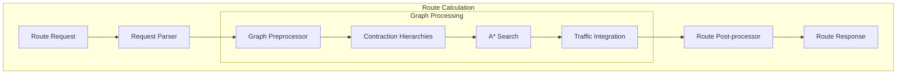
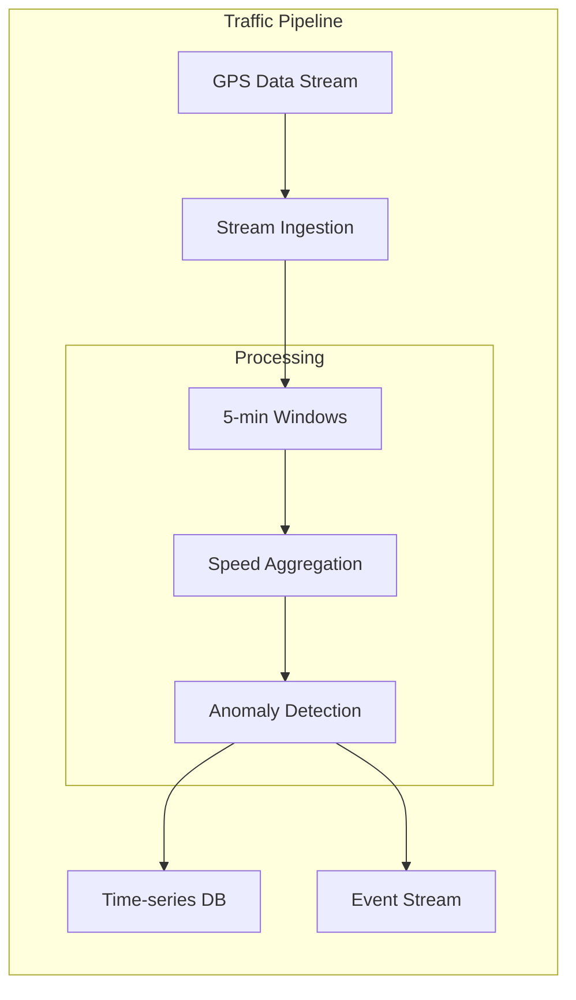
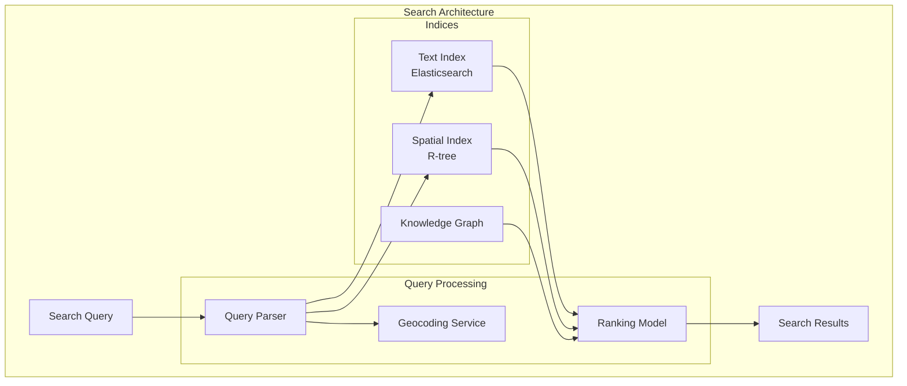
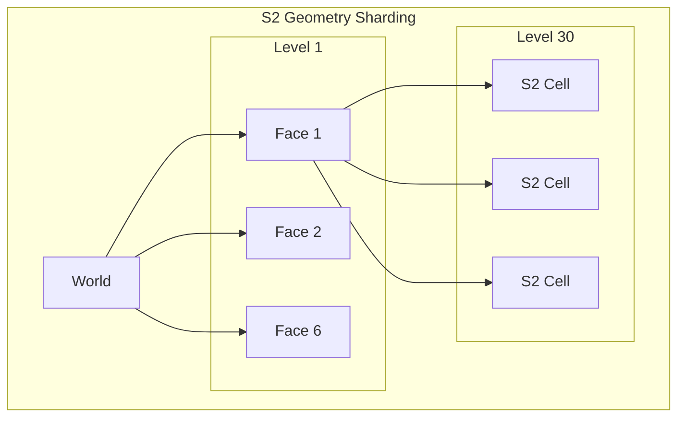
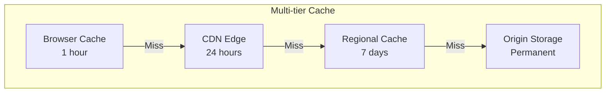
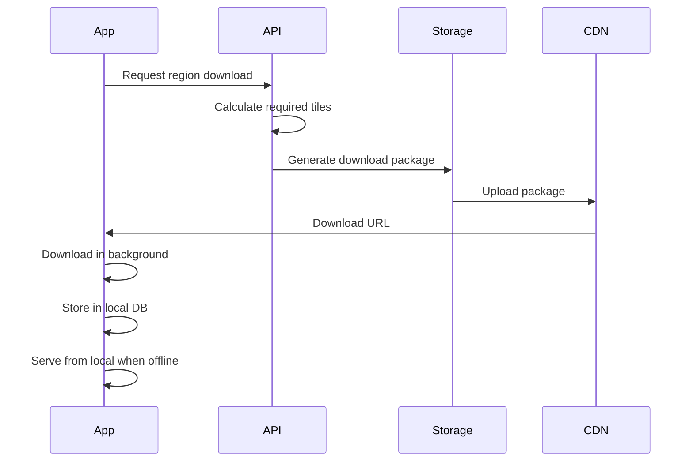
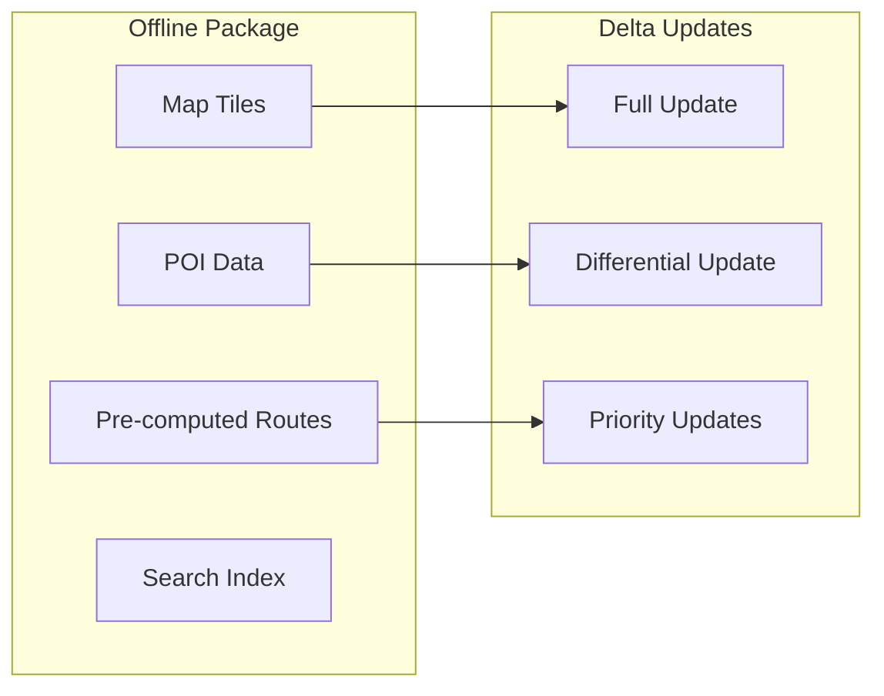

# Google Maps System Design Walkthrough

## Overview

This walkthrough covers designing a Google Maps-like system, focusing on the unique challenges of geographic data, real-time routing, and massive scale location services.

## Interview Timeline


## Phase 1: Requirements & Estimation (8 minutes)

### Clarifying Questions

**Functional Requirements:**
- "Core features to support?" → Map viewing, search, directions
- "Real-time traffic?" → Yes, critical for routing
- "Offline maps?" → Yes, downloadable regions
- "Turn-by-turn navigation?" → Yes, with voice
- "Business listings/reviews?" → Basic POI info only

**Scale Requirements:**
- "How many users?" → 1 billion MAU
- "Requests per second?" → 1M map tile requests/sec
- "Geographic coverage?" → Global, 220 countries
- "Update frequency?" → Roads quarterly, traffic real-time

### Back-of-Envelope Calculations

```
Map Data:
- World map detail: ~100TB base data
- With zoom levels (0-21): 100TB × 4 = 400TB
- POI data: ~10B places × 1KB = 10TB
- Total static data: ~410TB

Traffic Data:
- 100M active drivers
- Location update: every 5 seconds
- Update rate: 20M updates/sec
- Storage: 20M × 100 bytes × 86400 = 170TB/day

Routing Requests:
- 500M routes/day = ~6K/sec average
- Peak: 20K routes/sec
- Each route: ~10KB response
- Bandwidth: 200MB/sec peak
```

## Phase 2: High-Level Architecture (12 minutes)

### System Overview



### Key Design Principles

1. **Hierarchical Data Structure**
   - Quadtree for spatial indexing
   - Multiple zoom levels pre-computed
   - Efficient geographic queries

2. **Separation of Concerns**
   - Static data (maps) vs dynamic (traffic)
   - Different storage and caching strategies
   - Independent scaling

3. **Edge Computing**
   - CDN for map tiles
   - Regional routing engines
   - Localized traffic processing

## Phase 3: Core Components Design (15 minutes)

### Map Tile System



**Tile Addressing:**
```python
def get_tile_url(lat, lng, zoom):
    """Convert lat/lng to tile coordinates"""
    n = 2 ** zoom
    x = int((lng + 180) / 360 * n)
    y = int((1 - log(tan(radians(lat)) + 
            1/cos(radians(lat))) / pi) / 2 * n)
    
    return f"/tiles/{zoom}/{x}/{y}.png"
```

### Routing Engine



**Routing Algorithm Optimization:**
```python
class ContractionHierarchy:
    def preprocess_graph(self, graph):
        """Precompute shortcuts for faster routing"""
# Order nodes by importance
        node_order = self.compute_node_ordering(graph)
        
# Contract nodes and add shortcuts
        for node in node_order:
            shortcuts = self.find_shortcuts(node, graph)
            graph.add_shortcuts(shortcuts)
            graph.mark_contracted(node)
        
        return graph
    
    def bidirectional_search(self, start, end, graph):
        """Fast routing using preprocessed graph"""
        forward_search = AStar(start, graph.forward_graph)
        backward_search = AStar(end, graph.backward_graph)
        
# Meet in the middle
        while not forward_search.meets(backward_search):
            forward_search.expand_next()
            backward_search.expand_next()
        
        return self.reconstruct_path(forward_search, backward_search)
```

### Real-time Traffic System



**Traffic Data Model:**
```sql
-- Using Bigtable for scale
-- Row key: road_segment_id#reversed_timestamp
CREATE TABLE traffic_data (
    row_key STRING,
    speed_mph FLOAT,
    sample_count INT,
    confidence FLOAT,
    incident_flags INT,
    -- Column families for different time granularities
);

-- Spatial index for queries
CREATE TABLE spatial_index (
    geohash STRING,  -- Prefix for range scans
    road_segment_id STRING,
    segment_geometry BYTES,  -- Encoded linestring
    PRIMARY KEY (geohash, road_segment_id)
);
```

### Location Search



## Phase 4: Scale & Performance (7 minutes)

### Geographic Sharding



**Benefits of S2:**
- Hierarchical spatial indexing
- Efficient range queries
- Balanced data distribution
- Works on sphere (no projection distortion)

### Caching Strategy



**Cache Key Design:**
```python
def get_cache_key(tile_type, zoom, x, y, style, language):
# Include all parameters that affect rendering
    return f"{tile_type}:{zoom}:{x}:{y}:{style}:{language}"

def get_traffic_cache_key(segment_id, timestamp):
# Round to 5-minute windows for traffic
    window = timestamp // 300 * 300
    return f"traffic:{segment_id}:{window}"
```

### Offline Maps



## Trade-off Analysis

### Accuracy vs Performance

**Route Calculation:**

Option 1: Exact shortest path
- ✅ Optimal routes
- ❌ 10-100x slower
- Use for: Short distances (<50km)

Option 2: Contraction hierarchies
- ✅ <100ms response time
- ❌ ~2% suboptimal
- Use for: Long distances, real-time nav

### Storage vs Compute

**Map Tiles:**

Option 1: Pre-render all zoom levels
- ✅ Fast serving, predictable latency
- ❌ 400TB storage needed
- Use for: Zoom 0-16 (most common)

Option 2: Dynamic rendering
- ✅ Minimal storage
- ❌ High CPU cost, variable latency
- Use for: Zoom 17-21 (street level)

### Consistency vs Availability

**Traffic Updates:**

Option 1: Strong consistency
- ✅ All users see same traffic
- ❌ Higher latency, lower throughput
- Use for: Incident reports

Option 2: Eventual consistency
- ✅ High throughput, low latency
- ❌ Temporary inconsistencies
- Use for: Speed updates

## Follow-up Questions

### Q: How do you handle privacy?

```python
class LocationPrivacy:
    def anonymize_location(self, lat, lng, precision_meters=100):
        """Reduce location precision for privacy"""
# Add random noise
        noise_lat = random.gauss(0, precision_meters / 111000)
        noise_lng = random.gauss(0, precision_meters / (111000 * cos(lat)))
        
# Snap to grid
        grid_size = precision_meters / 111000
        snapped_lat = round(lat / grid_size) * grid_size
        snapped_lng = round(lng / grid_size) * grid_size
        
        return snapped_lat + noise_lat, snapped_lng + noise_lng
```

### Q: How do you detect traffic jams?

Link to patterns:
- [Event Streaming](../../patterns/event-streaming.md) for real-time processing
- ML Pipeline (Coming Soon) for anomaly detection
- [Time Series](../../patterns/time-series-ids.md) for historical analysis

### Q: How do you handle offline regions?



## Key Metrics to Monitor

1. **Performance Metrics**
   - Tile serving latency: p99 < 100ms
   - Route calculation: p99 < 1s
   - Search latency: p99 < 200ms

2. **Scale Metrics**
   - Tile cache hit rate: >95%
   - Traffic update lag: <30s
   - Storage growth rate

3. **Quality Metrics**
   - Route accuracy vs actual drive time
   - Search relevance scores
   - Map data freshness

## Summary & Best Practices

1. **Geographic systems are unique**
   - Spatial indexing is critical
   - Earth's curvature matters at scale
   - Hierarchical data structures excel

2. **Separate static and dynamic**
   - Maps change slowly, traffic changes fast
   - Different storage and caching strategies
   - Independent scaling requirements

3. **Pre-computation is your friend**
   - Tile pre-rendering for common zooms
   - Contraction hierarchies for routing
   - Offline packages for predictable regions

## Related Patterns & Resources

- Spatial Indexing (Coming Soon) - Quadtrees, R-trees, S2
- [Tile Caching](../../patterns/tile-caching.md) - Map tile optimization
- [Location Privacy](../../patterns/location-privacy.md) - Privacy-preserving techniques
- Real-time Processing (Coming Soon) - Traffic stream processing
- [Google's S2 Library](https://s2geometry.io/) - Spatial indexing at scale