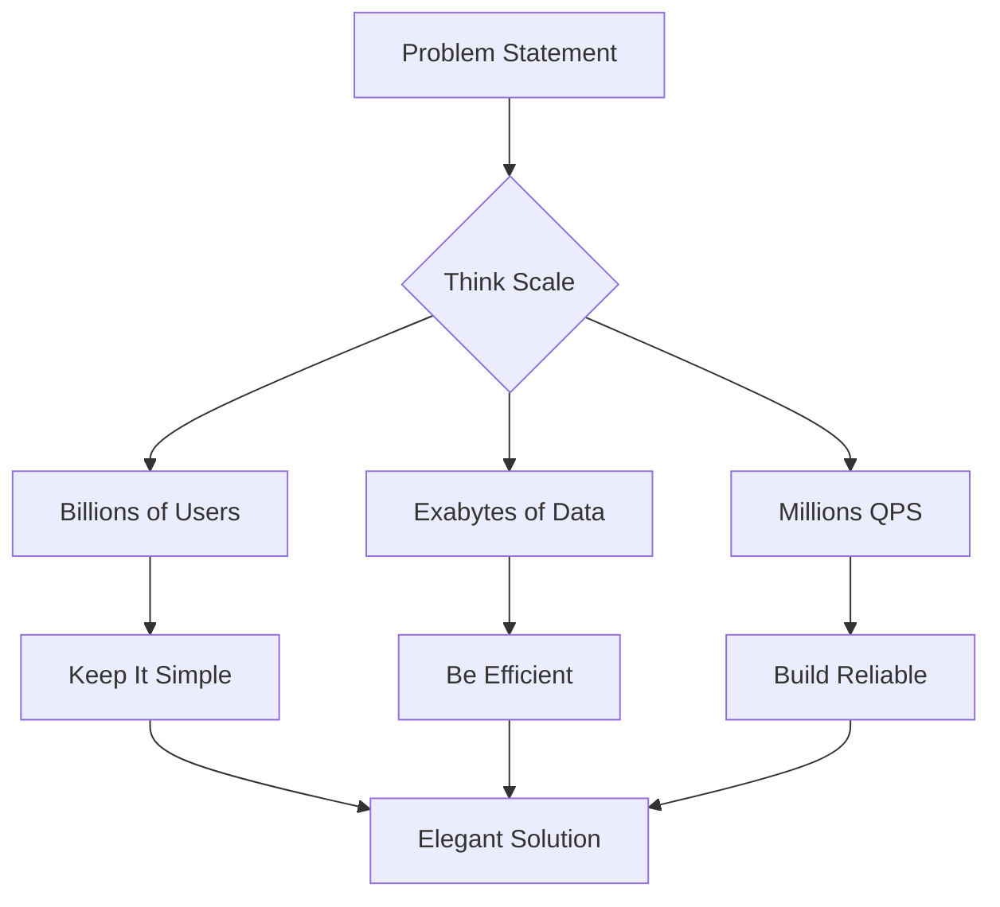

# Google System Design Interview Preparation Guide

## 📚 8-Week Preparation Plan

### Week 1-2: Foundations
**Goal**: Master distributed systems fundamentals

**Study Topics:**
- CAP theorem and consistency models
- Distributed consensus (Paxos, Raft)
- Replication strategies
- Sharding and partitioning
- Load balancing algorithms

**Resources:**
- [The 7 Laws](../axioms/index.md) - Read all axioms
- [The 5 Pillars](../pillars/index.md) - Understand core pillars
- "Designing Data-Intensive Applications" - Chapters 1-6

**Practice:**
- Design a distributed key-value store
- Design a URL shortener
- Review [Consistent Hashing Case Study](../case-studies/consistent-hashing.md)

### Week 3-4: Google Technologies
**Goal**: Understand Google's infrastructure

**Study Topics:**
- MapReduce and its evolution
- Bigtable architecture
- Spanner's global consistency
- Google File System → Colossus
- Borg → Kubernetes evolution

**Essential Papers:**
1. MapReduce: Simplified Data Processing
2. The Google File System
3. Bigtable: A Distributed Storage System
4. Spanner: Google's Globally Distributed Database
5. Large-scale cluster management at Google with Borg

**Practice:**
- Redesign Bigtable from scratch
- Design a global SQL database like Spanner
- Review [Google Spanner Case Study](../case-studies/google-spanner.md)

### Week 5-6: Common Patterns
**Goal**: Master design patterns used at scale

**Patterns to Study:**
- [Circuit Breaker](../patterns/circuit-breaker.md) - Failure isolation
- [Sharding](../patterns/sharding.md) - Data partitioning
- [Event Sourcing](../patterns/event-sourcing.md) - Event-driven systems
- [CQRS](../patterns/cqrs.md) - Read/write separation
- [Leader Election](../patterns/leader-election.md) - Coordination

**Practice Systems:**
- Design YouTube (use walkthrough as reference)
- Design Gmail (use walkthrough as reference)
- Design Google Maps (use walkthrough as reference)
- Design Google Photos
- Design Google Drive

### Week 7: Scale & Performance
**Goal**: Think at Google scale

**Topics:**
- Capacity planning for billions
- Geographic distribution strategies
- Caching at multiple levels
- Performance optimization techniques
- Cost optimization at scale

**Resources:**
- [Latency Numbers](../quantitative/latency-ladder.md)
- [Universal Scalability Law](../quantitative/universal-scalability.md)
- [Scale Cheat Sheet](scale-cheatsheet.md)

**Practice:**
- Take any design and scale it to 10x, 100x, 1000x
- Identify bottlenecks and solutions
- Calculate costs at different scales

### Week 8: Mock Interviews
**Goal**: Perfect your interview skills

**Daily Practice:**
- One 45-minute mock interview
- Record yourself
- Review and improve

**Focus Areas:**
- Time management
- Clear communication
- Handling ambiguity
- Deep dive abilities

## 📖 Essential Reading List

### Google Papers (Must Read)
1. **MapReduce** (2004) - Foundation of big data processing
2. **Google File System** (2003) - Distributed storage
3. **Bigtable** (2006) - NoSQL at scale
4. **Spanner** (2012) - Global SQL database
5. **Borg** (2015) - Container orchestration
6. **Monarch** (2020) - Monitoring at scale

### Books
1. **"Site Reliability Engineering"** - Google's SRE practices
2. **"The Site Reliability Workbook"** - Practical SRE
3. **"Designing Data-Intensive Applications"** - Martin Kleppmann
4. **"Building Secure and Reliable Systems"** - Google's security

### Blog Posts
- "The Tail at Scale" - Jeff Dean
- "On Designing and Deploying Internet-Scale Services" - James Hamilton
- High Scalability blog - Google architecture posts

## 🎯 Practice Problem Sets

### Beginner Level
1. URL Shortener - [Reference](../case-studies/url-shortener.md)
2. Pastebin
3. Key-Value Store - [Reference](../case-studies/key-value-store.md)

### Intermediate Level
1. Design Twitter - Focus on timeline generation
2. Design Instagram - Photo sharing at scale
3. Design Dropbox - File sync challenges

### Advanced Level
1. Design Google Search - Crawling, indexing, ranking
2. Design YouTube - [Use walkthrough](youtube-walkthrough.md)
3. Design AdWords - Real-time bidding

### Google-Specific
1. Design Gmail - [Use walkthrough](gmail-walkthrough.md)
2. Design Google Maps - [Use walkthrough](maps-walkthrough.md)
3. Design Google Docs - Real-time collaboration
4. Design Google Photos - ML at scale
5. Design Google Calendar - Distributed scheduling

## 🧠 Mental Models for Success

### The Google Mindset

### Decision Framework
1. **Can it scale 10x?** - Every component
2. **What fails first?** - Identify bottlenecks
3. **How much does it cost?** - At scale
4. **Is it simple?** - Complexity kills
5. **How do we monitor?** - Observability first

## 🏋️ Daily Practice Routine

### Morning (30 min)
- Review one Google paper
- Understand the problem it solves
- Note key innovations

### Afternoon (45 min)
- Practice one system design
- Use proper time management
- Focus on different aspects each day

### Evening (15 min)
- Review your design
- Identify improvements
- Note patterns used

## 📊 Progress Tracking

### Week 1-2 Checklist
- [ ] Read all 7 Laws
- [ ] Understand 5 Pillars
- [ ] Complete 3 basic designs
- [ ] Review CAP theorem deeply

### Week 3-4 Checklist
- [ ] Read 5 Google papers
- [ ] Understand Bigtable design
- [ ] Understand Spanner design
- [ ] Design one Google service

### Week 5-6 Checklist
- [ ] Master 10 design patterns
- [ ] Complete 5 system designs
- [ ] Practice scaling exercises
- [ ] Review all walkthroughs

### Week 7-8 Checklist
- [ ] 7 mock interviews completed
- [ ] Consistent 45-min completion
- [ ] Comfortable with ambiguity
- [ ] Can handle any topic

## 💡 Interview Day Tips

### Before the Interview
- Review scale numbers
- Practice drawing quickly
- Prepare questions to ask
- Get good sleep

### During the Interview
- **Stay calm** - You know this
- **Ask questions** - Clarify ambiguity
- **Think aloud** - Share reasoning
- **Watch time** - Keep moving
- **Show depth** - Pick battles

### Common Mistakes to Avoid
1. ❌ Diving into details too early
2. ❌ Ignoring scale requirements
3. ❌ Over-engineering solutions
4. ❌ Forgetting about failures
5. ❌ Missing cost considerations

## 🔗 Quick Links

### Patterns
- [Circuit Breaker](../patterns/circuit-breaker.md)
- [Sharding](../patterns/sharding.md)
- [Caching Strategies](../patterns/caching-strategies.md)
- [Load Balancing](../patterns/load-balancing.md)

### Case Studies
- [Amazon DynamoDB](../case-studies/amazon-dynamo.md)
- [Chat System](../case-studies/chat-system.md)
- [Payment System](../case-studies/payment-system.md)

### Quantitative Tools
- [Capacity Calculator](../tools/capacity-calculator.md)
- [Latency Calculator](../tools/latency-calculator.md)
- [Availability Calculator](../tools/availability-calculator.md)

Remember: Google values engineers who can design simple, scalable, and reliable systems. Focus on these principles in every design.