# Google System Design Interview Preparation Guide

## Preparation Strategy Selector

```mermaid
flowchart TD
 Start[Start Here] --> Experience{Years of Experience?}
 
 Experience -->|0-3 years| Junior[Junior Track]
 Experience -->|3-6 years| Mid[Mid-Level Track]
 Experience -->|6+ years| Senior[Senior Track]
 
 Junior --> JTime{Available Time?}
 Mid --> MTime{Available Time?}
 Senior --> STime{Available Time?}
 
 JTime -->|< 4 weeks| JExpress[Junior Express Plan]
 JTime -->|4-8 weeks| JStandard[Junior Standard Plan]
 JTime -->|> 8 weeks| JDeep[Junior Deep Plan]
 
 MTime -->|< 4 weeks| MExpress[Mid Express Plan]
 MTime -->|4-8 weeks| MStandard[Mid Standard Plan]
 MTime -->|> 8 weeks| MDeep[Mid Deep Plan]
 
 STime -->|< 4 weeks| SExpress[Senior Express Plan]
 STime -->|4-8 weeks| SStandard[Senior Standard Plan]
 STime -->|> 8 weeks| SDeep[Senior Deep Plan]
 
 style Start fill:#4285F4
 style JExpress fill:#EA4335
 style JStandard fill:#FBBC04
 style JDeep fill:#34A853
```

## Preparation Intensity Calculator

<h3>Calculate Your Study Hours</h3>
<table class="responsive-table">
<thead>
<tr>
<th>Factor</th>
<th>Your Situation</th>
<th>Hours/Week Needed</th>
</tr>
</thead>
<tbody>
<tr>
<td data-label="Factor">Current Role</td>
<td data-label="Your Situation">
<select id="role">
<option value="5">Non-tech role</option>
<option value="3">Backend Engineer</option>
<option value="2">Distributed Systems Engineer</option>
<option value="1">Already at Google/FAANG</option>
</select>
</td>
<td data-label="Hours/Week Needed">-</td>
</tr>
<tr>
<td data-label="Factor">System Design Experience</td>
<td data-label="Your Situation">
<select id="sd-exp">
<option value="8">Never done it</option>
<option value="5">Some experience</option>
<option value="3">Regular practice</option>
<option value="1">Expert level</option>
</select>
</td>
<td data-label="Hours/Week Needed">-</td>
</tr>
<tr>
<td data-label="Factor">Target Level</td>
<td data-label="Your Situation">
<select id="level">
<option value="3">L3/L4 (Junior/Mid)</option>
<option value="5">L5 (Senior)</option>
<option value="8">L6+ (Staff+)</option>
</select>
</td>
<td data-label="Hours/Week Needed">-</td>
</tr>
<tr>
<td data-label="Factor"><strong>Total Recommended</strong></td>
<td data-label="Your Situation">-</td>
<td data-label="Hours/Week Needed"><strong>-</strong></td>
</tr>
</tbody>
</table>
<button onclick="calculatePrep()">Calculate</button>

## 📚 8-Week Preparation Plan

## 📅 Week-by-Week Visual Roadmap

### Week 1-2: Foundations Dashboard

40Hours Total
5Core Topics
3Practice Problems
2Mock Interviews

**🎯 Goal**: Master distributed systems fundamentals

<h4>📖 Study Topics</h4>
<ul>
<li>✅ CAP theorem and consistency models</li>
<li>✅ Distributed consensus (Paxos, Raft)</li>
<li>✅ Replication strategies</li>
<li>✅ Sharding and partitioning</li>
<li>✅ Load balancing algorithms</li>
</ul>
<h4>📚 Resources</h4>
<ul>
<li><a href="/axioms/">The 7 Laws</a> - Read all axioms</li>
<li><a href="/pillars/">The 5 Pillars</a> - Understand core pillars</li>
<li>"Designing Data-Intensive Applications" - Ch 1-6</li>
</ul>
<h4>💻 Practice</h4>
<ul>
<li>Design a distributed key-value store</li>
<li>Design a URL shortener</li>
<li>Review <a href="../../case-studies/consistent-hashing.md">Consistent Hashing</a></li>
</ul>
<h4>🏁 Milestones</h4>
<ul>
<li>Explain CAP theorem trade-offs</li>
<li>Draw sharding strategies</li>
<li>Calculate capacity needs</li>
</ul>

### Week 3-4: Google Technologies Dashboard

35Hours Total
5Papers to Read
3Systems to Design
10+Technologies

**🎯 Goal**: Understand Google's infrastructure

**Study Topics:**
- MapReduce and its evolution
- Bigtable architecture
- Spanner's global consistency
- Google File System → Colossus
- Borg → Kubernetes evolution

**Essential Papers:**
1. MapReduce: Simplified Data Processing
2. The Google File System
3. Bigtable: A Distributed Storage System
4. Spanner: Google's Globally Distributed Database
5. Large-scale cluster management at Google with Borg

**Practice:**
- Redesign Bigtable from scratch
- Design a global SQL database like Spanner
- Review [Google Spanner Case Study](../../case-studies/google-spanner.md)

### Week 5-6: Common Patterns
**Goal**: Master design patterns used at scale

**Patterns to Study:**
- [Circuit Breaker](../../patterns/circuit-breaker.md) - Failure isolation
- [Sharding](../../patterns/sharding.md) - Data partitioning
- [Event Sourcing](../../patterns/event-sourcing.md) - Event-driven systems
- [CQRS](../../patterns/cqrs.md) - Read/write separation
- [Leader Election](../../patterns/leader-election.md) - Coordination

**Practice Systems:**
- Design YouTube (use walkthrough as reference)
- Design Gmail (use walkthrough as reference)
- Design Google Maps (use walkthrough as reference)
- Design Google Photos
- Design Google Drive

### Week 7: Scale & Performance
**Goal**: Think at Google scale

**Topics:**
- Capacity planning for billions
- Geographic distribution strategies
- Caching at multiple levels
- Performance optimization techniques
- Cost optimization at scale

**Resources:**
- [Latency Numbers](../../quantitative/latency-ladder.md)
- [Universal Scalability Law](../../quantitative/universal-scalability.md)
- [Scale Cheat Sheet](scale-cheatsheet.md)

**Practice:**
- Take any design and scale it to 10x, 100x, 1000x
- Identify bottlenecks and solutions
- Calculate costs at different scales

### Week 8: Mock Interviews
**Goal**: Perfect your interview skills

**Daily Practice:**
- One 45-minute mock interview
- Record yourself
- Review and improve

**Focus Areas:**
- Time management
- Clear communication
- Handling ambiguity
- Deep dive abilities

## 📖 Reading Priority Matrix

<table class="responsive-table">
<thead>
<tr>
<th>Paper/Resource</th>
<th>Priority</th>
<th>Time to Read</th>
<th>Key Takeaways</th>
<th>Interview Relevance</th>
</tr>
</thead>
<tbody>
<tr>
<td data-label="Paper/Resource"><strong>MapReduce (2004)</strong></td>
<td data-label="Priority">🔴 Critical</td>
<td data-label="Time to Read">2 hours</td>
<td data-label="Key Takeaways">Parallel processing, fault tolerance</td>
<td data-label="Interview Relevance">★★★★★</td>
</tr>
<tr>
<td data-label="Paper/Resource"><strong>Bigtable (2006)</strong></td>
<td data-label="Priority">🔴 Critical</td>
<td data-label="Time to Read">3 hours</td>
<td data-label="Key Takeaways">NoSQL design, LSM trees</td>
<td data-label="Interview Relevance">★★★★★</td>
</tr>
<tr>
<td data-label="Paper/Resource"><strong>Spanner (2012)</strong></td>
<td data-label="Priority">🔴 Critical</td>
<td data-label="Time to Read">4 hours</td>
<td data-label="Key Takeaways">Global consistency, TrueTime</td>
<td data-label="Interview Relevance">★★★★☆</td>
</tr>
<tr>
<td data-label="Paper/Resource"><strong>Google File System</strong></td>
<td data-label="Priority">🟡 Important</td>
<td data-label="Time to Read">2 hours</td>
<td data-label="Key Takeaways">Distributed storage, replication</td>
<td data-label="Interview Relevance">★★★★☆</td>
</tr>
<tr>
<td data-label="Paper/Resource"><strong>Borg (2015)</strong></td>
<td data-label="Priority">🟡 Important</td>
<td data-label="Time to Read">3 hours</td>
<td data-label="Key Takeaways">Container orchestration</td>
<td data-label="Interview Relevance">★★★☆☆</td>
</tr>
<tr>
<td data-label="Paper/Resource"><strong>Dapper (2010)</strong></td>
<td data-label="Priority">🟢 Good to Know</td>
<td data-label="Time to Read">2 hours</td>
<td data-label="Key Takeaways">Distributed tracing</td>
<td data-label="Interview Relevance">★★★☆☆</td>
</tr>
<tr>
<td data-label="Paper/Resource"><strong>Monarch (2020)</strong></td>
<td data-label="Priority">🟢 Good to Know</td>
<td data-label="Time to Read">2 hours</td>
<td data-label="Key Takeaways">Monitoring at scale</td>
<td data-label="Interview Relevance">★★☆☆☆</td>
</tr>
</tbody>
</table>

### 📚 Paper Reading Schedule

## 📖 Essential Reading List

### Google Papers (Must Read)
1. **MapReduce** (2004) - Foundation of big data processing
2. **Google File System** (2003) - Distributed storage
3. **Bigtable** (2006) - NoSQL at scale
4. **Spanner** (2012) - Global SQL database
5. **Borg** (2015) - Container orchestration
6. **Monarch** (2020) - Monitoring at scale

### Books
1. **"Site Reliability Engineering"** - Google's SRE practices
2. **"The Site Reliability Workbook"** - Practical SRE
3. **"Designing Data-Intensive Applications"** - Martin Kleppmann
4. **"Building Secure and Reliable Systems"** - Google's security

### Blog Posts
- "The Tail at Scale" - Jeff Dean
- "On Designing and Deploying Internet-Scale Services" - James Hamilton
- High Scalability blog - Google architecture posts

## Practice Problem Progression

## Difficulty & Time Matrix

<table class="responsive-table">
<thead>
<tr>
<th>Problem</th>
<th>Difficulty</th>
<th>Time Needed</th>
<th>Key Challenges</th>
<th>Common Mistakes</th>
</tr>
</thead>
<tbody>
<tr>
<td data-label="Problem"><strong>URL Shortener</strong></td>
<td data-label="Difficulty">⭐⭐</td>
<td data-label="Time Needed">30 min</td>
<td data-label="Key Challenges">ID generation, Analytics</td>
<td data-label="Common Mistakes">Ignoring custom URLs</td>
</tr>
<tr>
<td data-label="Problem"><strong>Chat System</strong></td>
<td data-label="Difficulty">⭐⭐⭐</td>
<td data-label="Time Needed">45 min</td>
<td data-label="Key Challenges">Real-time, Message ordering</td>
<td data-label="Common Mistakes">No offline support</td>
</tr>
<tr>
<td data-label="Problem"><strong>YouTube</strong></td>
<td data-label="Difficulty">⭐⭐⭐⭐⭐</td>
<td data-label="Time Needed">60 min</td>
<td data-label="Key Challenges">Video processing, CDN, Scale</td>
<td data-label="Common Mistakes">Underestimating bandwidth</td>
</tr>
<tr>
<td data-label="Problem"><strong>Google Search</strong></td>
<td data-label="Difficulty">⭐⭐⭐⭐⭐</td>
<td data-label="Time Needed">60 min</td>
<td data-label="Key Challenges">Crawling, Indexing, Ranking</td>
<td data-label="Common Mistakes">Ignoring freshness</td>
</tr>
</tbody>
</table>

## Practice Problem Sets

### Beginner Level
1. URL Shortener - [Reference](../../case-studies/url-shortener.md)
2. Pastebin
3. Key-Value Store - [Reference](../../case-studies/key-value-store.md)

### Intermediate Level
1. Design Twitter - Focus on timeline generation
2. Design Instagram - Photo sharing at scale
3. Design Dropbox - File sync challenges

### Advanced Level
1. Design Google Search - Crawling, indexing, ranking
2. Design YouTube - [Use walkthrough](youtube-walkthrough.md)
3. Design AdWords - Real-time bidding

### Google-Specific
1. Design Gmail - [Use walkthrough](gmail-walkthrough.md)
2. Design Google Maps - [Use walkthrough](maps-walkthrough.md)
3. Design Google Docs - Real-time collaboration
4. Design Google Photos - ML at scale
5. Design Google Calendar - Distributed scheduling

## Mental Models & Decision Trees

### System Design Decision Tree

### The Google Mindset

### Decision Framework
1. **Can it scale 10x?** - Every component
2. **What fails first?** - Identify bottlenecks
3. **How much does it cost?** - At scale
4. **Is it simple?** - Complexity kills
5. **How do we monitor?** - Observability first

## 🏋 Optimized Daily Practice Schedule

<table class="responsive-table">
<thead>
<tr>
<th>Time</th>
<th>Activity</th>
<th>Focus Area</th>
<th>Expected Outcome</th>
</tr>
</thead>
<tbody>
<tr>
<td data-label="Time"><strong>Morning (30 min)</strong></td>
<td data-label="Activity">• Read 1 paper section • Take notes • Identify patterns</td>
<td data-label="Focus Area">Theory & Concepts</td>
<td data-label="Expected Outcome">Deep understanding of Google tech</td>
</tr>
<tr>
<td data-label="Time"><strong>Lunch (15 min)</strong></td>
<td data-label="Activity">• Review flash cards • Quiz yourself • Watch tech talk</td>
<td data-label="Focus Area">Knowledge Retention</td>
<td data-label="Expected Outcome">Memorize key numbers & concepts</td>
</tr>
<tr>
<td data-label="Time"><strong>Evening (45 min)</strong></td>
<td data-label="Activity">• Design 1 system • Time yourself • Full solution</td>
<td data-label="Focus Area">Practical Skills</td>
<td data-label="Expected Outcome">Interview-ready designs</td>
</tr>
<tr>
<td data-label="Time"><strong>Night (15 min)</strong></td>
<td data-label="Activity">• Review design • Identify gaps • Plan improvements</td>
<td data-label="Focus Area">Self-Assessment</td>
<td data-label="Expected Outcome">Continuous improvement</td>
</tr>
</tbody>
</table>

### Weekly Practice Targets

### Morning (30 min)
- Review one Google paper
- Understand the problem it solves
- Note key innovations

### Afternoon (45 min)
- Practice one system design
- Use proper time management
- Focus on different aspects each day

### Evening (15 min)
- Review your design
- Identify improvements
- Note patterns used

## Interactive Progress Tracker

<h3>Your Preparation Progress</h3>

<h4>Foundations (Weeks 1-2)</h4>

<label><input type="checkbox" onchange="updateProgress('foundations')"> Read all 7 Laws</label>
<label><input type="checkbox" onchange="updateProgress('foundations')"> Understand 5 Pillars</label>
<label><input type="checkbox" onchange="updateProgress('foundations')"> Complete 3 basic designs</label>
<label><input type="checkbox" onchange="updateProgress('foundations')"> Review CAP theorem deeply</label>

!!! info
 <h4>Google Tech (Weeks 3-4)</h4>

<label><input type="checkbox" onchange="updateProgress('google')"> Read MapReduce paper</label>
<label><input type="checkbox" onchange="updateProgress('google')"> Read Bigtable paper</label>
<label><input type="checkbox" onchange="updateProgress('google')"> Read Spanner paper</label>
<label><input type="checkbox" onchange="updateProgress('google')"> Design one Google service</label>

!!! info
 <h4>Practice (Weeks 5-6)</h4>

<label><input type="checkbox" onchange="updateProgress('practice')"> Master 10 design patterns</label>
<label><input type="checkbox" onchange="updateProgress('practice')"> Complete 5 system designs</label>
<label><input type="checkbox" onchange="updateProgress('practice')"> Practice scaling exercises</label>
<label><input type="checkbox" onchange="updateProgress('practice')"> Review all walkthroughs</label>

!!! info
 <h4>Mock Interviews (Weeks 7-8)</h4>

<label><input type="checkbox" onchange="updateProgress('mock')"> 7 mock interviews completed</label>
<label><input type="checkbox" onchange="updateProgress('mock')"> Consistent 45-min completion</label>
<label><input type="checkbox" onchange="updateProgress('mock')"> Comfortable with ambiguity</label>
<label><input type="checkbox" onchange="updateProgress('mock')"> Can handle any topic</label>

### Week 1-2 Checklist
- [ ] Read all 7 Laws
- [ ] Understand 5 Pillars
- [ ] Complete 3 basic designs
- [ ] Review CAP theorem deeply

### Week 3-4 Checklist
- [ ] Read 5 Google papers
- [ ] Understand Bigtable design
- [ ] Understand Spanner design
- [ ] Design one Google service

### Week 5-6 Checklist
- [ ] Master 10 design patterns
- [ ] Complete 5 system designs
- [ ] Practice scaling exercises
- [ ] Review all walkthroughs

### Week 7-8 Checklist
- [ ] 7 mock interviews completed
- [ ] Consistent 45-min completion
- [ ] Comfortable with ambiguity
- [ ] Can handle any topic

## Interview Day Strategy Guide

### 🕰 Time Management Matrix

<table class="responsive-table">
<thead>
<tr>
<th>Phase</th>
<th>Time</th>
<th>Must Do</th>
<th>Nice to Have</th>
<th>Avoid</th>
</tr>
</thead>
<tbody>
<tr>
<td data-label="Phase"><strong>Requirements (0-5 min)</strong></td>
<td data-label="Time">5 min</td>
<td data-label="Must Do">• Functional reqs • Scale numbers • Constraints</td>
<td data-label="Nice to Have">• Success metrics • User personas</td>
<td data-label="Avoid">• Assumptions • Rushing</td>
</tr>
<tr>
<td data-label="Phase"><strong>Estimation (5-10 min)</strong></td>
<td data-label="Time">5 min</td>
<td data-label="Must Do">• QPS calculation • Storage needs • Bandwidth</td>
<td data-label="Nice to Have">• Cost estimates • Growth projection</td>
<td data-label="Avoid">• Over-precision • Complex math</td>
</tr>
<tr>
<td data-label="Phase"><strong>High-Level (10-25 min)</strong></td>
<td data-label="Time">15 min</td>
<td data-label="Must Do">• Architecture diagram • Data flow • API design</td>
<td data-label="Nice to Have">• Alternative designs • Trade-offs</td>
<td data-label="Avoid">• Too much detail • Perfection</td>
</tr>
<tr>
<td data-label="Phase"><strong>Deep Dive (25-35 min)</strong></td>
<td data-label="Time">10 min</td>
<td data-label="Must Do">• Critical component • Data model • Algorithms</td>
<td data-label="Nice to Have">• Optimization • Edge cases</td>
<td data-label="Avoid">• Spreading thin • New topics</td>
</tr>
<tr>
<td data-label="Phase"><strong>Scale (35-40 min)</strong></td>
<td data-label="Time">5 min</td>
<td data-label="Must Do">• Bottlenecks • Solutions • Monitoring</td>
<td data-label="Nice to Have">• Cost optimization • Future growth</td>
<td data-label="Avoid">• Hand-waving • Complexity</td>
</tr>
<tr>
<td data-label="Phase"><strong>Wrap-up (40-45 min)</strong></td>
<td data-label="Time">5 min</td>
<td data-label="Must Do">• Summary • Trade-offs • Questions</td>
<td data-label="Nice to Have">• Improvements • Alternatives</td>
<td data-label="Avoid">• New design • Major changes</td>
</tr>
</tbody>
</table>

### Before the Interview
- Review scale numbers
- Practice drawing quickly
- Prepare questions to ask
- Get good sleep

### During the Interview
- **Stay calm** - You know this
- **Ask questions** - Clarify ambiguity
- **Think aloud** - Share reasoning
- **Watch time** - Keep moving
- **Show depth** - Pick battles

### Common Mistakes to Avoid
1. ❌ Diving into details too early
2. ❌ Ignoring scale requirements
3. ❌ Over-engineering solutions
4. ❌ Forgetting about failures
5. ❌ Missing cost considerations

## 🔗 Quick Links

### Patterns
- [Circuit Breaker](../../patterns/circuit-breaker.md)
- [Sharding](../../patterns/sharding.md)
- [Caching Strategies](../../patterns/caching-strategies.md)
- [Load Balancing](../../patterns/load-balancing.md)

### Case Studies
- [Amazon DynamoDB](../../case-studies/amazon-dynamo.md)
- [Chat System](../../case-studies/chat-system.md)
- [Payment System](../../case-studies/payment-system.md)

### Quantitative Tools
- [Capacity Calculator](/tools/capacity-calculator)
- [Latency Calculator](/tools/latency-calculator)
- [Availability Calculator](/tools/availability-calculator)

## Final Success Checklist

<h3>Pre-Interview Readiness Assessment</h3>

<h4>Technical Skills</h4>
<label><input type="checkbox"> Can explain CAP theorem</label>
<label><input type="checkbox"> Know sharding strategies</label>
<label><input type="checkbox"> Understand consistency levels</label>
<label><input type="checkbox"> Master caching patterns</label>
<label><input type="checkbox"> Know Google technologies</label>
!!! info
 <h4>Design Skills</h4>
<label><input type="checkbox"> Can design in 45 minutes</label>
<label><input type="checkbox"> Draw clear diagrams</label>
<label><input type="checkbox"> Make trade-offs explicit</label>
<label><input type="checkbox"> Handle ambiguity well</label>
<label><input type="checkbox"> Think at Google scale</label>
!!! info
 <h4>Communication</h4>
<label><input type="checkbox"> Think out loud</label>
<label><input type="checkbox"> Ask clarifying questions</label>
<label><input type="checkbox"> Summarize decisions</label>
<label><input type="checkbox"> Handle feedback well</label>
<label><input type="checkbox"> Stay organized</label>
!!! info
 <h4>Mindset</h4>
<label><input type="checkbox"> Confident but humble</label>
<label><input type="checkbox"> Eager to learn</label>
<label><input type="checkbox"> Customer focused</label>
<label><input type="checkbox"> Quality obsessed</label>
<label><input type="checkbox"> Team player</label>

<button onclick="assessReadiness()">Assess My Readiness</button>

Remember: Google values engineers who can design simple, scalable, and reliable systems. Focus on these principles in every design.

