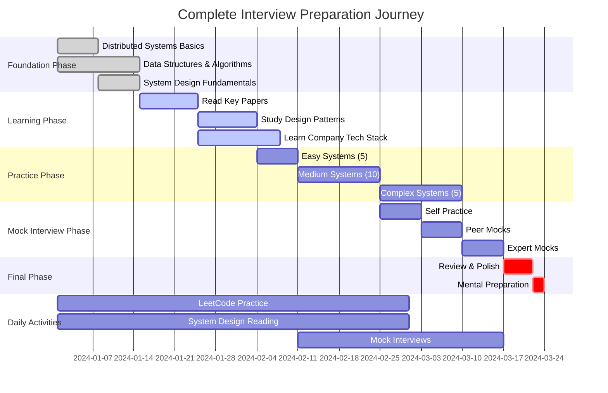
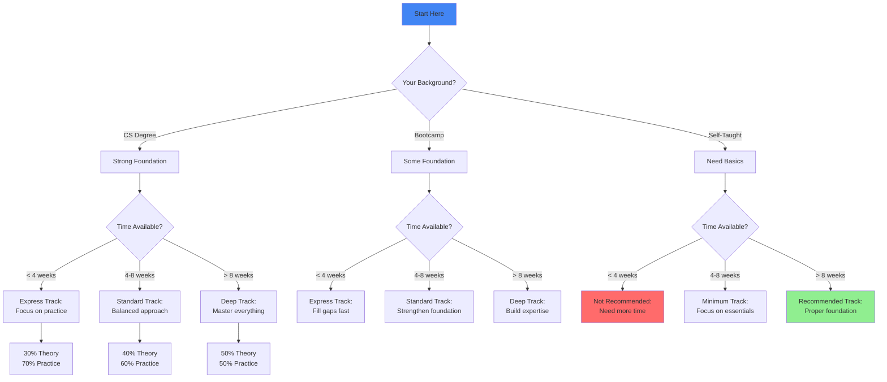
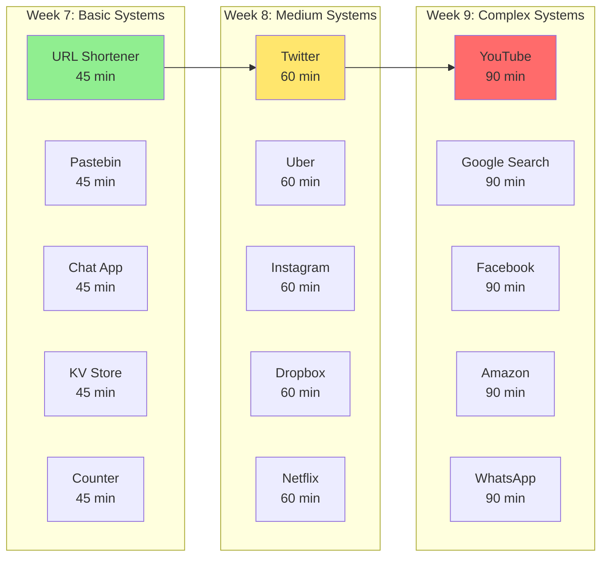
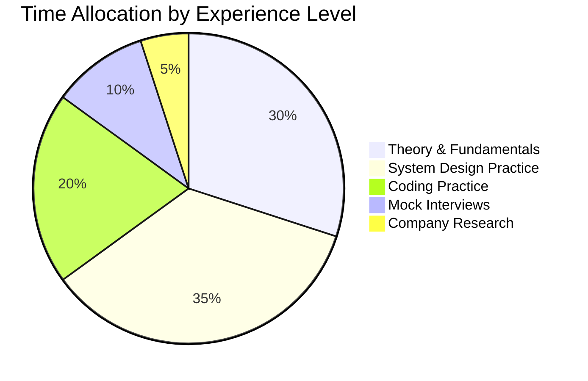
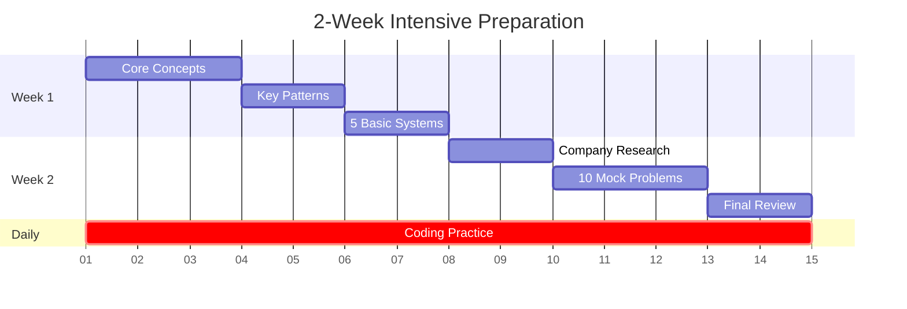

# Visual Interview Preparation Roadmap

## 🗺 Master Preparation Timeline

## Preparation Strategy Matrix

<table class="responsive-table">
<thead>
<tr>
<th>Your Situation</th>
<th>Recommended Timeline</th>
<th>Focus Areas</th>
<th>Daily Commitment</th>
<th>Success Rate</th>
</tr>
</thead>
<tbody>
<tr>
<td data-label="Your Situation"><strong>New Grad (0-2 years)</strong></td>
<td data-label="Recommended Timeline">12-16 weeks</td>
<td data-label="Focus Areas">• Fundamentals (40%) • Coding (30%) • System Design (30%)</td>
<td data-label="Daily Commitment">3-4 hours</td>
<td data-label="Success Rate">65-75%</td>
</tr>
<tr>
<td data-label="Your Situation"><strong>Mid-Level (3-5 years)</strong></td>
<td data-label="Recommended Timeline">8-12 weeks</td>
<td data-label="Focus Areas">• System Design (40%) • Coding (30%) • Behavioral (30%)</td>
<td data-label="Daily Commitment">2-3 hours</td>
<td data-label="Success Rate">70-80%</td>
</tr>
<tr>
<td data-label="Your Situation"><strong>Senior (5+ years)</strong></td>
<td data-label="Recommended Timeline">6-8 weeks</td>
<td data-label="Focus Areas">• System Design (50%) • Leadership (25%) • Coding (25%)</td>
<td data-label="Daily Commitment">2 hours</td>
<td data-label="Success Rate">75-85%</td>
</tr>
<tr>
<td data-label="Your Situation"><strong>Already at FAANG</strong></td>
<td data-label="Recommended Timeline">4-6 weeks</td>
<td data-label="Focus Areas">• Company-specific (40%) • System Design (40%) • Behavioral (20%)</td>
<td data-label="Daily Commitment">1-2 hours</td>
<td data-label="Success Rate">80-90%</td>
</tr>
</tbody>
</table>

## Personalized Path Selector

## 📅 Week-by-Week Breakdown

### 🗓 Phase 1: Foundation (Weeks 1-3)

<h4>Week 1: Core Concepts</h4>

Mon: CAP Theorem & Consistency

Tue: Distributed Consensus

Wed: Replication Strategies

Thu: Partitioning & Sharding

Fri: Load Balancing

Sat: Review & Practice

Sun: Mock Problem

<h5>Goals:</h5>
<ul>
<li>✓ Understand distributed systems basics</li>
<li>✓ Complete 5 easy problems</li>
<li>✓ Read 2 papers</li>
</ul>

<h4>Week 2: Design Patterns</h4>

Mon: Caching Patterns

Tue: Message Queues

Wed: Pub/Sub Systems

Thu: Service Mesh

Fri: API Gateway

Sat: Practice Systems

Sun: Review Week

<h5>Goals:</h5>
<ul>
<li>✓ Master 10 key patterns</li>
<li>✓ Design 3 simple systems</li>
<li>✓ Understand trade-offs</li>
</ul>

<h4>Week 3: Scale & Performance</h4>

Mon: Capacity Planning

Tue: Performance Metrics

Wed: Bottleneck Analysis

Thu: Optimization Techniques

Fri: Cost Analysis

Sat: Scale Exercises

Sun: First Mock Interview

<h5>Goals:</h5>
<ul>
<li>✓ Do scale calculations</li>
<li>✓ Identify bottlenecks</li>
<li>✓ Practice estimations</li>
</ul>

### 🗓 Phase 2: Deep Learning (Weeks 4-6)

<h4>Focus: Company-Specific Technologies</h4>

<h5>Google</h5>
<ul>
<li>Bigtable & Spanner</li>
<li>MapReduce & Dataflow</li>
<li>Borg & Kubernetes</li>
</ul>

<h5>Amazon</h5>
<ul>
<li>DynamoDB & S3</li>
<li>EC2 & Lambda</li>
<li>SQS & Kinesis</li>
</ul>

<h5>Meta</h5>
<ul>
<li>TAO & Cassandra</li>
<li>Scuba & Hive</li>
<li>React & GraphQL</li>
</ul>

<h5>Microsoft</h5>
<ul>
<li>Azure Services</li>
<li>Cosmos DB</li>
<li>Service Fabric</li>
</ul>

### 🗓 Phase 3: Intensive Practice (Weeks 7-9)

### 🗓 Phase 4: Mock Interviews (Weeks 10-11)

<table class="responsive-table">
<thead>
<tr>
<th>Week</th>
<th>Monday</th>
<th>Tuesday</th>
<th>Wednesday</th>
<th>Thursday</th>
<th>Friday</th>
</tr>
</thead>
<tbody>
<tr>
<td data-label="Week"><strong>Week 10</strong></td>
<td data-label="Monday">Self Mock (Record)</td>
<td data-label="Tuesday">Review & Fix</td>
<td data-label="Wednesday">Peer Mock (Friend)</td>
<td data-label="Thursday">Review & Fix</td>
<td data-label="Friday">Platform Mock (Pramp)</td>
</tr>
<tr>
<td data-label="Week"><strong>Week 11</strong></td>
<td data-label="Monday">Expert Mock (Paid)</td>
<td data-label="Tuesday">Implement Feedback</td>
<td data-label="Wednesday">Company Mock (Target)</td>
<td data-label="Thursday">Polish Weak Areas</td>
<td data-label="Friday">Final Mock (All topics)</td>
</tr>
</tbody>
</table>

## Progress Tracking Dashboard

<h3>Track Your Preparation Progress</h3>

<h4>📚 Theory</h4>

<ul>
<li><input type="checkbox"> Distributed Systems</li>
<li><input type="checkbox"> Design Patterns</li>
<li><input type="checkbox"> Company Tech</li>
</ul>

<h4>💻 Coding</h4>

<ul>
<li><input type="checkbox"> 50 Easy</li>
<li><input type="checkbox"> 100 Medium</li>
<li><input type="checkbox"> 50 Hard</li>
</ul>

<h4>🏗️ System Design</h4>

<ul>
<li><input type="checkbox"> 10 Basic</li>
<li><input type="checkbox"> 10 Medium</li>
<li><input type="checkbox"> 5 Complex</li>
</ul>

<h4>🎤 Mock Interviews</h4>

<ul>
<li><input type="checkbox"> 5 Self</li>
<li><input type="checkbox"> 5 Peer</li>
<li><input type="checkbox"> 3 Expert</li>
</ul>

## Daily Study Scheduler

<h3>Optimize Your Daily Study Time</h3>

<h4>🌅 Morning (6-8 AM)</h4>

<strong>Best for:</strong> Theory & Reading

<ul>
<li>Read papers/blogs</li>
<li>Watch system design videos</li>
<li>Review concepts</li>
</ul>

<h4>☀️ Afternoon (12-1 PM)</h4>

<strong>Best for:</strong> Quick Practice

<ul>
<li>1-2 coding problems</li>
<li>Review solutions</li>
<li>Quick concepts</li>
</ul>

<h4>🌆 Evening (6-8 PM)</h4>

<strong>Best for:</strong> Deep Work

<ul>
<li>System design practice</li>
<li>Mock interviews</li>
<li>Complex problems</li>
</ul>

<h4>🌙 Night (9-10 PM)</h4>

<strong>Best for:</strong> Review

<ul>
<li>Review day's work</li>
<li>Plan tomorrow</li>
<li>Light reading</li>
</ul>

## Resource Allocation Guide

### Recommended Resources by Phase

<h4>📚 Phase 1: Foundation</h4>
<ul>
<li><strong>Book:</strong> Designing Data-Intensive Applications</li>
<li><strong>Course:</strong> MIT 6.824 Distributed Systems</li>
<li><strong>Practice:</strong> System Design Primer</li>
</ul>

<h4>📖 Phase 2: Deep Learning</h4>
<ul>
<li><strong>Papers:</strong> Google/Amazon/FB papers</li>
<li><strong>Blogs:</strong> High Scalability</li>
<li><strong>Videos:</strong> InfoQ presentations</li>
</ul>

<h4>💻 Phase 3: Practice</h4>
<ul>
<li><strong>Platform:</strong> LeetCode/HackerRank</li>
<li><strong>Mock:</strong> Pramp/Interviewing.io</li>
<li><strong>Community:</strong> Blind/Reddit</li>
</ul>

<h4>🎯 Phase 4: Final Prep</h4>
<ul>
<li><strong>Review:</strong> Your notes</li>
<li><strong>Practice:</strong> Company-specific</li>
<li><strong>Mental:</strong> Meditation/Exercise</li>
</ul>

## Accelerated Paths

### 2-Week Crash Course

### 4-Week Standard Path

<table class="responsive-table">
<thead>
<tr>
<th>Week</th>
<th>Focus</th>
<th>Goals</th>
<th>Hours/Day</th>
</tr>
</thead>
<tbody>
<tr>
<td data-label="Week"><strong>Week 1</strong></td>
<td data-label="Focus">Fundamentals</td>
<td data-label="Goals">• Master basics • 5 easy systems • Read 3 papers</td>
<td data-label="Hours/Day">3 hours</td>
</tr>
<tr>
<td data-label="Week"><strong>Week 2</strong></td>
<td data-label="Focus">Patterns & Practice</td>
<td data-label="Goals">• 10 patterns • 8 medium systems • First mock</td>
<td data-label="Hours/Day">3 hours</td>
</tr>
<tr>
<td data-label="Week"><strong>Week 3</strong></td>
<td data-label="Focus">Advanced & Company</td>
<td data-label="Goals">• Complex systems • Company tech • 5 mocks</td>
<td data-label="Hours/Day">4 hours</td>
</tr>
<tr>
<td data-label="Week"><strong>Week 4</strong></td>
<td data-label="Focus">Polish & Perfect</td>
<td data-label="Goals">• Weak areas • Final mocks • Mental prep</td>
<td data-label="Hours/Day">2 hours</td>
</tr>
</tbody>
</table>

## Success Metrics

<h3>Are You Ready? Check Your Scores</h3>

<h4>Theory Knowledge (25%)</h4>
<label><input type="checkbox"> Can explain CAP theorem</label>
<label><input type="checkbox"> Know 5+ consistency models</label>
<label><input type="checkbox"> Understand consensus algorithms</label>
<label><input type="checkbox"> Master sharding strategies</label>
<label><input type="checkbox"> Know caching patterns</label>

<h4>Practical Skills (25%)</h4>
<label><input type="checkbox"> Designed 20+ systems</label>
<label><input type="checkbox"> Can estimate scale</label>
<label><input type="checkbox"> Handle failures well</label>
<label><input type="checkbox"> Optimize bottlenecks</label>
<label><input type="checkbox"> Consider costs</label>

<h4>Company Knowledge (25%)</h4>
<label><input type="checkbox"> Know target company tech</label>
<label><input type="checkbox"> Understand their scale</label>
<label><input type="checkbox"> Read their papers</label>
<label><input type="checkbox"> Know their products</label>
<label><input type="checkbox"> Understand culture</label>

<h4>Interview Skills (25%)</h4>
<label><input type="checkbox"> Good time management</label>
<label><input type="checkbox"> Clear communication</label>
<label><input type="checkbox"> Handle ambiguity</label>
<label><input type="checkbox"> Think out loud</label>
<label><input type="checkbox"> Take feedback well</label>

<button onclick="calculateReadiness()">Check My Readiness</button>

