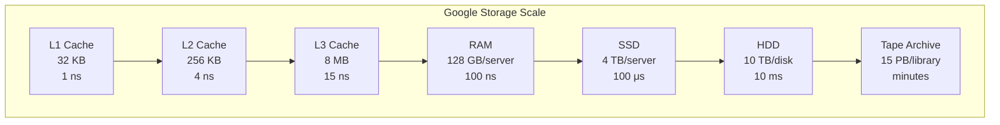
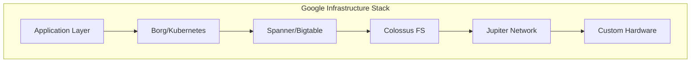

# Google Scale Cheat Sheet

## Quick Reference Numbers

### Google Services Scale

| Service | Users | Daily Volume | Peak QPS | Storage |
|---------|-------|--------------|----------|---------|
| **Search** | 8.5B searches/day | 500B pages indexed | 100K | 100+ PB index |
| **YouTube** | 2B users | 1B hours watched/day | 1M video serves | 1 EB+ videos |
| **Gmail** | 1.8B users | 300B emails/day | 3.5M | 90 EB total |
| **Maps** | 1B users | 1B km navigated/day | 1M tile requests | 100 TB base map |
| **Photos** | 1B users | 28B photos/week | 300K uploads | 4 trillion photos |
| **Drive** | 2B users | 50M files created/day | 500K | 15 EB total |
| **Android** | 3B devices | 250M app installs/day | 3M | - |
| **Chrome** | 3.2B users | 100B searches/month | - | - |


### 💾 Storage Hierarchy



### Latency Numbers

| Operation | Latency | Notes |
|-----------|---------|-------|
| L1 cache reference | 1 ns | |
| Branch mispredict | 3 ns | |
| L2 cache reference | 4 ns | |
| Mutex lock/unlock | 17 ns | |
| L3 cache reference | 15 ns | |
| Main memory reference | 100 ns | |
| SSD random read | 100 μs | 1,000x slower than RAM |
| SSD sequential read 1MB | 1 ms | |
| HDD random read | 10 ms | 100x slower than SSD |
| HDD sequential read 1MB | 20 ms | |
| California to Netherlands | 150 ms | Speed of light limit |
| Tape archive retrieval | 10-60 min | Cold storage |


### Network Capacity

| Type | Bandwidth | Latency | Use Case |
|------|-----------|---------|----------|
| Datacenter network | 100 Gbps | <1 ms | Intra-DC |
| Metro fiber | 10-40 Gbps | 1-5 ms | Same city |
| Long-haul fiber | 10-100 Gbps | 10-100 ms | Cross-country |
| Submarine cable | 10-20 Tbps | 50-300 ms | Intercontinental |
| Satellite | 50-500 Mbps | 600 ms | Remote areas |
| 5G mobile | 1-10 Gbps | 5-10 ms | Mobile users |
| Home broadband | 100-1000 Mbps | 10-50 ms | End users |


## Capacity Planning Quick Math

### Storage Conversions
```
1 KB = 1,000 bytes (use 1,024 for precise)
1 MB = 1,000 KB
1 GB = 1,000 MB
1 TB = 1,000 GB
1 PB = 1,000 TB
1 EB = 1,000 PB
```

### Common Calculations

**Daily to QPS:**
```
QPS = Daily_volume / 86,400 seconds
Peak QPS = QPS × 3 (typical peak factor)
```

**Storage Growth:**
```
Daily storage = Users × Upload_rate × Size
Yearly storage = Daily × 365
Total with replication = Storage × 3
Total with erasure coding = Storage × 1.3
```

**Bandwidth:**
```
Bandwidth = QPS × Average_size × 8 bits/byte
Peak bandwidth = Average × 3
```

### Rule of Thumb Estimates

| Metric | Typical Value | Google Scale |
|--------|---------------|--------------|
| Read/Write ratio | 10:1 | 100:1 |
| Cache hit rate | 80% | 95%+ |
| Peak/Average traffic | 2-3x | 3-5x |
| Storage replication | 3x | 1.3x (erasure) |
| Server utilization | 50-70% | 80-90% |
| Datacenter PUE | 1.5-2.0 | 1.1 |


## System Design Targets

### Availability Tiers

| Availability | Downtime/year | Downtime/month | Use Case |
|--------------|---------------|----------------|-----------|
| 99% | 3.65 days | 7.2 hours | Development |
| 99.9% | 8.76 hours | 43.2 minutes | Standard SLA |
| 99.95% | 4.38 hours | 21.6 minutes | Business critical |
| 99.99% | 52.56 minutes | 4.32 minutes | High availability |
| 99.999% | 5.26 minutes | 25.9 seconds | Mission critical |


### Response Time Goals

| Percentile | Target | User Experience |
|------------|--------|-----------------|
| p50 (median) | <100ms | Feels instant |
| p90 | <300ms | Barely noticeable |
| p95 | <500ms | Noticeable |
| p99 | <1s | Annoying |
| p99.9 | <2s | Abandonment risk |


## Google-Specific Architectures

### Typical Stack



### Data Storage Choices

| Data Type | Storage System | Why |
|-----------|---------------|-----|
| User profiles | Spanner | Global consistency |
| Time series | Bigtable | High write throughput |
| Blobs/Media | Colossus/GCS | Cost effective |
| Cache | Memcache/Redis | Low latency |
| Search index | Custom SSTable | Optimized format |
| Analytics | Dremel/BigQuery | Columnar storage |


### Geographic Distribution

```
Google Regions: 35+
Availability Zones: 106+
Edge Locations: 200+
Network PoPs: 1000+
Submarine cables: 16 owned/leased
```

## Quick Estimation Template

```python
# Users and Usage
users = 1_000_000_000  # 1B users
daily_active = users * 0.6  # 60% DAU
actions_per_user = 10
daily_actions = daily_active * actions_per_user

# QPS Calculation
qps_average = daily_actions / 86400
qps_peak = qps_average * 3

# Storage Calculation
data_per_action = 1_000  # 1KB
daily_data = daily_actions * data_per_action
yearly_data = daily_data * 365
total_storage = yearly_data * 1.3  # With erasure coding

# Bandwidth Calculation
bandwidth_avg = qps_average * data_per_action * 8
bandwidth_peak = bandwidth_avg * 3

print(f"QPS: {qps_average:,.0f} avg, {qps_peak:,.0f} peak")
print(f"Storage: {total_storage/1e15:.1f} PB/year")
print(f"Bandwidth: {bandwidth_peak/1e9:.1f} Gbps peak")
```

## Hot Tips for Interviews

1. **Always clarify scale first** - It drives all decisions
2. **Use powers of 2** for rough calculations (1K ≈ 1024)
3. **Remember 86,400** seconds in a day
4. **Peak is typically 3x average** (can be 10x for events)
5. **Storage needs 3x for replication** (or 1.3x with erasure coding)
6. **Network RTT** limits geographic latency
7. **Caching solves many problems** at Google scale
8. **Sharding is inevitable** at billions of users
9. **Eventual consistency** is often acceptable
10. **Pre-computation** trades storage for latency