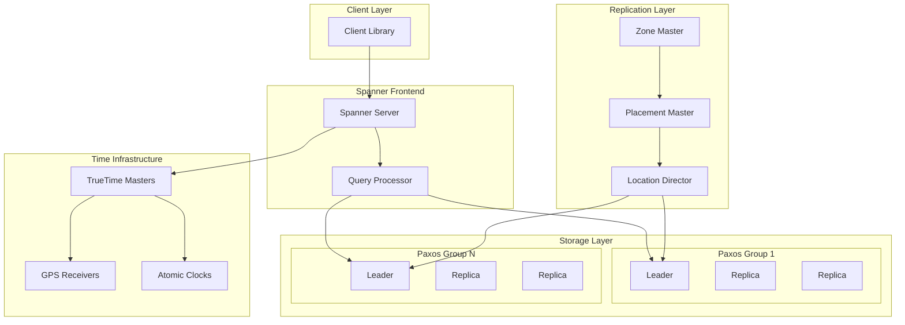

# Design Spanner


## Problem Statement

"Design a globally distributed relational database that provides ACID transactions with strong consistency across continents, supporting both OLTP and OLAP workloads at Google scale."

## Overview

Spanner is Google's globally distributed, multi-version database that provides externally consistent transactions at global scale. It's the first system to distribute data at global scale and support externally consistent distributed transactions.

## Key Innovations

### 1. TrueTime API
- GPS and atomic clock synchronization
- Bounded uncertainty intervals
- Enables global consistency

### 2. External Consistency
- Strongest consistency guarantee
- Global transaction ordering
- Snapshot isolation across regions

### 3. SQL at Scale
- Full SQL support
- ACID transactions
- Secondary indexes

## Scale Metrics

```
Deployment Scale:
- Regions: 30+ globally
- Zones: 100+ availability zones
- Servers: 10,000+ machines
- Data: Petabytes

Performance:
- Read latency: 5-10ms (regional)
- Write latency: 50-150ms (global)
- Throughput: Millions QPS
- Availability: 99.999% (five 9s)
```

## System Architecture



## TrueTime Deep Dive

### API Design
```protobuf
message TTInterval {
    Timestamp earliest;  // earliest possible time
    Timestamp latest;    // latest possible time
}

service TrueTime {
    // Returns current time interval
    rpc Now() returns (TTInterval);
    
    // Blocks until time has definitely passed t
    rpc After(Timestamp t) returns (void);
    
    // Blocks until time is definitely t
    rpc Before(Timestamp t) returns (void);
}
```

### Implementation
```python
class TrueTimeImpl:
    def __init__(self):
        self.gps_source = GPSTimeSource()
        self.atomic_source = AtomicClockSource()
        self.uncertainty = 7  # ms typical
    
    def now(self):
# Get time from multiple sources
        gps_time = self.gps_source.get_time()
        atomic_time = self.atomic_source.get_time()
        
# Compute consensus time
        consensus = self.compute_consensus(gps_time, atomic_time)
        
# Return interval with uncertainty
        return TTInterval(
            earliest=consensus - self.uncertainty,
            latest=consensus + self.uncertainty
        )
    
    def after(self, t):
# Wait until we're definitely after time t
        while self.now().earliest <= t:
            time.sleep(0.001)  # 1ms
```

## Data Model

### Hierarchical Schema
```sql
-- Universe (top level)
CREATE DATABASE mydb;

-- Tables with interleaved hierarchy
CREATE TABLE Users (
    UserId INT64 NOT NULL,
    Username STRING(MAX),
    Email STRING(MAX),
) PRIMARY KEY (UserId);

CREATE TABLE Orders (
    UserId INT64 NOT NULL,
    OrderId INT64 NOT NULL,
    OrderDate TIMESTAMP,
    Total NUMERIC,
) PRIMARY KEY (UserId, OrderId),
  INTERLEAVE IN PARENT Users ON DELETE CASCADE;

CREATE TABLE OrderItems (
    UserId INT64 NOT NULL,
    OrderId INT64 NOT NULL,
    ItemId INT64 NOT NULL,
    ProductId INT64,
    Quantity INT64,
    Price NUMERIC,
) PRIMARY KEY (UserId, OrderId, ItemId),
  INTERLEAVE IN PARENT Orders ON DELETE CASCADE;
```

### Directory Structure
```
Directory: Unit of data placement
├── Can contain multiple table fragments
├── Unit of replication (Paxos group)
└── 1-100MB typical size

Example:
Directory 1: Users[1-1000] + Orders + OrderItems
Directory 2: Users[1001-2000] + Orders + OrderItems
```

## Transaction Protocol

### Read-Write Transactions
```python
def read_write_transaction(operations):
# 1. Acquire locks
    tx_id = begin_transaction()
    locks = []
    
    for op in operations:
        if op.is_write():
            lock = acquire_lock(op.key, tx_id)
            locks.append(lock)
    
# 2. Pick timestamp
    prepare_ts = TrueTime.now().latest
    
# 3. Prepare phase (2PC)
    for participant in get_participants(operations):
        vote = participant.prepare(tx_id, prepare_ts)
        if vote == ABORT:
            abort_transaction(tx_id)
            return ABORTED
    
# 4. Wait for safe time
    commit_ts = TrueTime.now().latest
    TrueTime.after(commit_ts)
    
# 5. Commit phase
    for participant in get_participants(operations):
        participant.commit(tx_id, commit_ts)
    
# 6. Release locks
    for lock in locks:
        release_lock(lock)
    
    return COMMITTED
```

### Read-Only Transactions
```python
def read_only_transaction(read_operations):
# Pick read timestamp
    read_ts = TrueTime.now().latest
    
    results = []
    for op in read_operations:
# Read at timestamp without locks
        data = read_at_timestamp(op.key, read_ts)
        results.append(data)
    
    return results
```

## Replication and Consistency

### Paxos Groups
```
Each directory is a Paxos group:
- 5 replicas (typically)
- 1 leader, 4 followers
- Leader handles all writes
- Followers can serve reads

Leader Election:
1. Leader lease (10 seconds)
2. Paxos election on expiry
3. TrueTime ensures disjoint leases
```

### Write Path
```
Client Write Request
       ↓
Spanner Frontend
       ↓
Find Directory Leader
       ↓
Acquire Locks (if needed)
       ↓
Replicate via Paxos
       ↓
Wait for Safe Time
       ↓
Apply Write
       ↓
Release Locks
       ↓
Return to Client
```

## Query Processing

### SQL Compilation
```sql
-- Original query
SELECT u.Username, COUNT(o.OrderId) as OrderCount
FROM Users u
JOIN Orders o ON u.UserId = o.UserId
WHERE u.Email LIKE '%@gmail.com'
GROUP BY u.Username
HAVING COUNT(o.OrderId) > 10;

-- Compiled to distributed plan
DistributedUnion
├── RemoteScan(Users@Shard1) → Filter → LocalJoin
├── RemoteScan(Users@Shard2) → Filter → LocalJoin
└── RemoteScan(Users@ShardN) → Filter → LocalJoin
    ↓
GlobalAggregate → Having → Sort
```

### Query Execution
```python
class QueryExecutor:
    def execute_query(self, sql):
# 1. Parse and optimize
        ast = parse_sql(sql)
        logical_plan = optimize_logical(ast)
        
# 2. Generate distributed plan
        physical_plan = generate_physical_plan(logical_plan)
        
# 3. Determine timestamp
        read_ts = self.get_read_timestamp()
        
# 4. Execute distributed
        results = []
        for shard_plan in physical_plan.shard_plans:
            shard_result = self.execute_remotely(
                shard_plan, 
                read_ts
            )
            results.append(shard_result)
        
# 5. Merge results
        return self.merge_results(results, physical_plan.merge_plan)
```

## Schema Changes

### Online DDL
```python
def alter_table_add_column(table, column):
# 1. Create schema version
    new_version = current_version + 1
    
# 2. Distributed schema change
    for directory in get_directories(table):
# Non-blocking schema update
        directory.add_pending_schema(new_version, column)
    
# 3. Wait for propagation
    wait_for_schema_propagation(new_version)
    
# 4. Activate new schema
    for directory in get_directories(table):
        directory.activate_schema(new_version)
    
# 5. Backfill if needed
    if column.has_default:
        backfill_column(table, column)
```

## Performance Optimizations

### 1. Read Optimization
```python
# Stale reads for better latency
result = spanner.read(
    table='Users',
    columns=['Username', 'Email'],
    key_set=key_set,
# Read from 15 seconds ago
    timestamp=time.time() - 15
)

# Bounded staleness
result = spanner.read(
    table='Orders',
    columns=['OrderId', 'Total'],
    key_set=key_set,
# At most 10 seconds old
    max_staleness=timedelta(seconds=10)
)
```

### 2. Batching
```python
# Batch writes for efficiency
batch = spanner.batch()
for user in users:
    batch.insert('Users', user.to_dict())
for order in orders:
    batch.insert('Orders', order.to_dict())
batch.commit()
```

### 3. Query Hints
```sql
-- Force index usage
SELECT /*@ FORCE_INDEX=OrdersByDate */ *
FROM Orders@{FORCE_INDEX=OrdersByDate}
WHERE OrderDate > @start_date;

-- Control join order
SELECT /*@ JOIN_ORDER=Users,Orders,Products */ *
FROM Users u
JOIN Orders o ON u.UserId = o.UserId
JOIN Products p ON o.ProductId = p.ProductId;
```

## Monitoring and Operations

### Key Metrics
```
Latency Metrics:
- Read latency (p50, p99)
- Write latency (p50, p99)
- Transaction latency
- Lock wait time

Throughput Metrics:
- Reads/second
- Writes/second
- Transactions/second
- CPU utilization

Health Metrics:
- Replica lag
- Leader distribution
- Schema version drift
- TrueTime uncertainty
```

### Debugging Tools
```python
# Transaction analysis
EXPLAIN ANALYZE
SELECT * FROM Orders
WHERE UserId = @user_id;

# Lock investigation
SELECT *
FROM INFORMATION_SCHEMA.SPANNER_STATS
WHERE LOCK_WAIT_TIME > 1000;  -- ms

# Replica status
SELECT *
FROM INFORMATION_SCHEMA.REPLICA_STATUS
WHERE LAG_MS > 100;
```

## Common Interview Questions

### Q1: "How does Spanner achieve global consistency?"
**Answer:**
- TrueTime provides global timestamps
- Commit wait ensures causality
- External consistency guarantee
- Transactions ordered by real time

### Q2: "What happens during network partition?"
**Answer:**
- Paxos ensures availability with majority
- Minority partition becomes read-only
- No split-brain due to TrueTime leases
- Automatic recovery when healed

### Q3: "How does Spanner scale?"
**Answer:**
- Automatic sharding (directories)
- Dynamic load balancing
- Horizontal scaling of replicas
- Regional expansion capability

## Design Trade-offs

### Consistency vs Latency
- Strong consistency requires coordination
- Cross-region writes have higher latency
- Stale reads reduce latency

### Availability vs Consistency
- 5 replicas for high availability
- Majority quorum for consistency
- Regional failures handled gracefully

## Best Practices

### 1. Schema Design
- Use table interleaving wisely
- Consider data locality
- Plan for sharding

### 2. Query Optimization
- Use appropriate indexes
- Avoid large scans
- Batch operations when possible

### 3. Geographic Distribution
- Place data near users
- Use read replicas effectively
- Consider multi-region tables

## References

- [Spanner: Google's Globally-Distributed Database](google-interviews/https://research.google/pubs/pub39966/)
- [Spanner: Becoming a SQL System](google-interviews/https://research.google/pubs/pub46103/)
- [Cloud Spanner Documentation](google-interviews/https://cloud.google.com/spanner/docs)

[Return to Google Interview Guide](google-interviews/index.md)