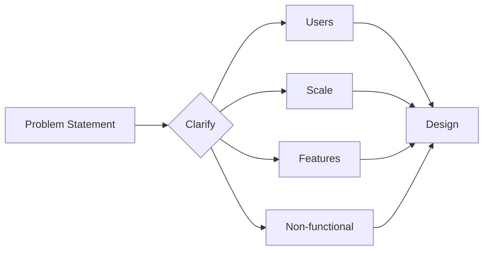
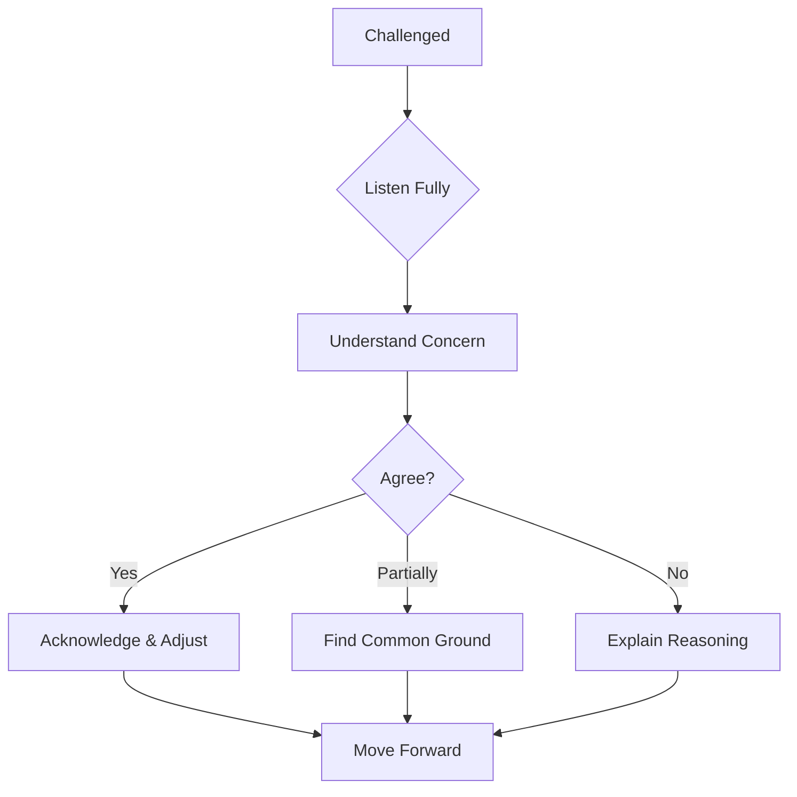
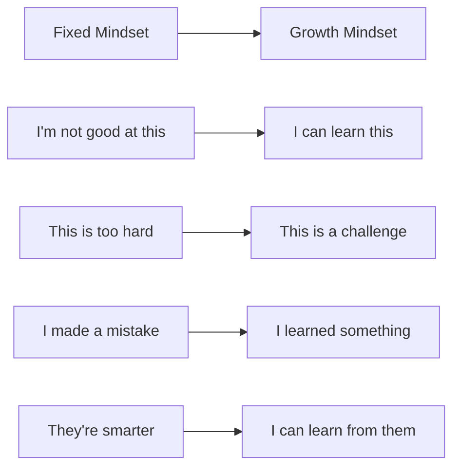

# Final Tips and Success Strategies

Your comprehensive guide to succeeding in Google system design interviews, with practical tips from successful candidates and Google interviewers.

## Pre-Interview Preparation

### The Week Before

```python
class WeekBeforePrep:
    def daily_schedule(self):
        return {
            "Day_7": "Review core distributed systems concepts",
            "Day_6": "Practice 2 full system designs",
            "Day_5": "Deep dive Google technologies",
            "Day_4": "Work on communication clarity",
            "Day_3": "Practice with mock interviews",
            "Day_2": "Review your past designs",
            "Day_1": "Light review, rest well"
        }
    
    def key_areas(self):
        return [
            "CAP theorem and consistency models",
            "Scaling patterns (sharding, replication)",
            "Google systems (GFS, Bigtable, Spanner)",
            "Estimation and capacity planning",
            "Trade-off analysis"
        ]
```

### The Night Before

✅ **DO:**
- Review your notes briefly (30 mins max)
- Prepare your setup (computer, internet, quiet space)
- Get 8 hours of sleep
- Set multiple alarms
- Prepare water and snacks

❌ **DON'T:**
- Cram new concepts
- Stay up late practicing
- Consume excessive caffeine
- Read interview horror stories
- Second-guess your preparation

## Interview Day Strategy

### The First 5 Minutes

```python
def interview_opening():
    """
    Make a strong first impression
    """
    steps = [
        "Greet warmly and professionally",
        "Test audio/video if remote",
        "Have paper and pen ready",
        "Listen carefully to the problem",
        "Take notes while listening"
    ]
    
# What interviewers notice
    positive_signals = [
        "Confident but humble demeanor",
        "Active listening",
        "Thoughtful questions",
        "Structured approach",
        "Clear communication"
    ]
    
    return steps, positive_signals
```

### The Clarification Phase



**Smart Questions to Ask:**

```python
class ClarificationQuestions:
    def essential_questions(self):
        return {
            "Scale": [
                "How many users are we designing for?",
                "What's the expected QPS?",
                "How much data will we store?"
            ],
            "Features": [
                "What's the MVP vs full feature set?",
                "Are there any specific features to prioritize?",
                "What features are explicitly out of scope?"
            ],
            "Constraints": [
                "Any specific latency requirements?",
                "Budget constraints?",
                "Team size constraints?"
            ],
            "Success": [
                "How do we measure success?",
                "What are the key metrics?",
                "What's the business goal?"
            ]
        }
```

## Design Phase Excellence

### The Structured Approach

```
1. Requirements Summary (2 min)
   - Functional requirements
   - Non-functional requirements
   - Out of scope

2. Capacity Estimation (3 min)
   - Users and growth
   - Storage needs
   - Bandwidth requirements

3. High-Level Design (10 min)
   - Major components
   - Data flow
   - API design

4. Detailed Design (15 min)
   - Data models
   - Algorithm choices
   - Component details

5. Scale & Optimize (10 min)
   - Bottleneck analysis
   - Caching strategy
   - Sharding approach

6. Reliability & Monitoring (5 min)
   - Failure scenarios
   - Monitoring strategy
   - Deployment approach
```

### Drawing Effective Diagrams

```python
class DiagramTips:
    def best_practices(self):
        return [
            "Start with boxes for major components",
            "Use arrows to show data flow",
            "Label everything clearly",
            "Use different colors for different types",
            "Keep it clean and organized",
            "Build incrementally"
        ]
    
    def component_symbols(self):
        return {
            "□": "Service/Server",
            "⬭": "Database",
            "○": "Cache",
            "⬟": "Queue",
            "△": "Load Balancer",
            "◇": "Client"
        }
```

## Communication Excellence

### The PREP Method

```
P - Point: State your main point
R - Reason: Explain why
E - Example: Give concrete example
P - Point: Restate conclusion

Example:
P: "I'd use consistent hashing for sharding"
R: "Because it minimizes data movement when scaling"
E: "Like DynamoDB, adding a node only moves 1/n data"
P: "So consistent hashing gives us elastic scaling"
```

### Thinking Aloud Effectively

```python
def think_aloud_examples():
    good_examples = [
        "I'm considering two approaches here...",
        "Let me think about the trade-offs...",
        "I'm calculating the storage needs...",
        "I'm wondering if we need strong consistency here..."
    ]
    
    avoid_these = [
        "Umm... I don't know...",
        "This is probably wrong but...",
        "I'm not sure if this makes sense...",
        "Sorry, I'm rambling..."
    ]
    
    return good_examples, avoid_these
```

## Handling Difficult Moments

### When You're Stuck

```python
class StuckStrategies:
    def recovery_tactics(self):
        return [
            {
                "tactic": "Break it down",
                "example": "Let me approach this step by step..."
            },
            {
                "tactic": "Think analogies",
                "example": "This reminds me of how X works..."
            },
            {
                "tactic": "Ask for hints",
                "example": "Am I thinking in the right direction?"
            },
            {
                "tactic": "State assumptions",
                "example": "I'll assume X for now and revisit..."
            }
        ]
```

### When Challenged



**Response Templates:**

```python
def challenge_responses():
    return {
        "Valid point": "That's a great point. Let me revise my approach...",
        "Different view": "I see your perspective. Another way to think about it...",
        "Clarification": "Let me make sure I understand your concern...",
        "Trade-off": "You're right about X, but we gain Y which is important because..."
    }
```

## Common Mistakes to Avoid

### Technical Mistakes

```python
class TechnicalMistakes:
    common_errors = {
        "Single_point_of_failure": "Always identify and address SPOF",
        "Ignoring_data_consistency": "Be explicit about consistency model",
        "Over_engineering": "Don't use Spanner for 100GB",
        "Under_engineering": "Don't use SQLite for Google scale",
        "Missing_monitoring": "Always discuss observability",
        "Ignoring_security": "At least mention authentication/authorization"
    }
    
    def avoid_mistakes(self, design):
        checklist = [
            "No single points of failure?",
            "Consistency model defined?",
            "Appropriate for scale?",
            "Monitoring included?",
            "Security considered?",
            "Trade-offs acknowledged?"
        ]
        return all(self.check(item) for item in checklist)
```

### Communication Mistakes

❌ **Avoid These:**
- Jumping to implementation without design
- Being defensive about feedback
- Saying "I don't know" without trying
- Over-apologizing
- Being arrogant or dismissive
- Ignoring the interviewer

✅ **Do These Instead:**
- Start with high-level design
- Be collaborative and open
- Think through problems aloud
- Be confident but humble
- Engage with the interviewer
- Show enthusiasm

## The Final 10 Minutes

### Strong Closing Strategy

```python
def closing_strategy():
    steps = [
        "Summarize the design briefly",
        "Highlight key decisions and trade-offs",
        "Mention what you'd do differently with more time",
        "Ask thoughtful questions about Google's approach",
        "Thank the interviewer genuinely"
    ]
    
    good_questions = [
        "How does Google actually solve this problem?",
        "What challenges have you seen with similar systems?",
        "What would you optimize first in this design?",
        "How does this compare to your experience at Google?"
    ]
    
    return steps, good_questions
```

## Post-Interview Actions

### Immediate Steps

```
1. Write down the problem and your solution
2. Note what went well
3. Identify areas for improvement
4. Don't obsess over mistakes
5. Send a thank you note if appropriate
```

### Learning from Experience

```python
class PostInterviewReflection:
    def analyze_performance(self):
        questions = [
            "Did I clarify requirements thoroughly?",
            "Was my design structured and clear?",
            "Did I handle scale appropriately?",
            "Were my trade-offs well-reasoned?",
            "Did I communicate effectively?",
            "Was I collaborative with the interviewer?"
        ]
        
        for question in questions:
            self.reflect_on(question)
            self.plan_improvement(question)
```

## Mindset for Success

### The Growth Mindset



### Confidence Builders

```python
def build_confidence():
    affirmations = [
        "I've prepared thoroughly",
        "I can think through problems systematically",
        "I can communicate my ideas clearly",
        "I can learn from feedback",
        "I belong in this interview"
    ]
    
    evidence = [
        "I've practiced X system designs",
        "I understand Y core concepts",
        "I can explain trade-offs clearly",
        "I've built systems before",
        "I'm here because I'm qualified"
    ]
    
    return affirmations, evidence
```

## Success Stories and Patterns

### What Successful Candidates Do

```python
class SuccessPatterns:
    def common_traits(self):
        return {
            "Preparation": "Practice regularly, not just before interviews",
            "Communication": "Explain thinking clearly and concisely",
            "Collaboration": "Treat interviewer as colleague",
            "Adaptability": "Adjust based on feedback",
            "Curiosity": "Ask insightful questions",
            "Humility": "Acknowledge what they don't know"
        }
    
    def during_interview(self):
        return [
            "Stay calm under pressure",
            "Think before speaking",
            "Draw clear diagrams",
            "Make reasonable assumptions",
            "Prioritize important aspects",
            "Leave time for all sections"
        ]
```

## Final Checklist

### Technical Readiness

- [ ] Distributed systems fundamentals
- [ ] Scaling patterns
- [ ] Database choices and trade-offs
- [ ] Caching strategies
- [ ] Load balancing approaches
- [ ] Consistency models
- [ ] Google technologies overview

### Communication Readiness

- [ ] Can explain complex ideas simply
- [ ] Comfortable with whiteboarding
- [ ] Practice thinking aloud
- [ ] Know how to handle feedback
- [ ] Prepared for common questions

### Mental Readiness

- [ ] Well-rested
- [ ] Confident but humble
- [ ] Ready to learn
- [ ] Excited about the opportunity
- [ ] Prepared for any outcome

## Remember

```python
def final_wisdom():
    return """
    The interview is a conversation, not an interrogation.
    Google wants you to succeed.
    Show how you think, not just what you know.
    Perfect solutions don't exist - good engineers make trade-offs.
    Your unique perspective is valuable.
    
    You've prepared well. Trust yourself.
    Good luck! You've got this! 🚀
    """
```

## One Last Thing

The best engineers at Google aren't those who memorize solutions. They're those who:
- Think from first principles
- Communicate clearly
- Learn continuously
- Collaborate effectively
- Build with empathy

Show these qualities, and you'll do great.

[Return to Google Interview Guide](/google-interviews/index.md)