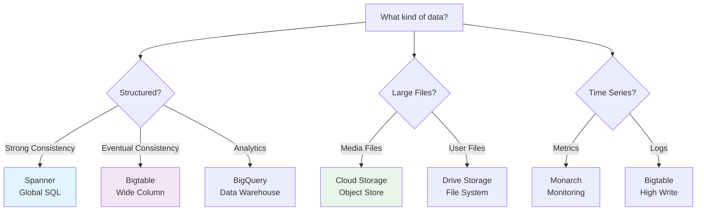
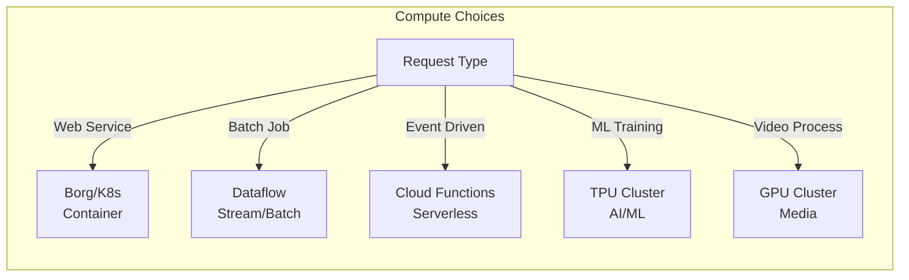
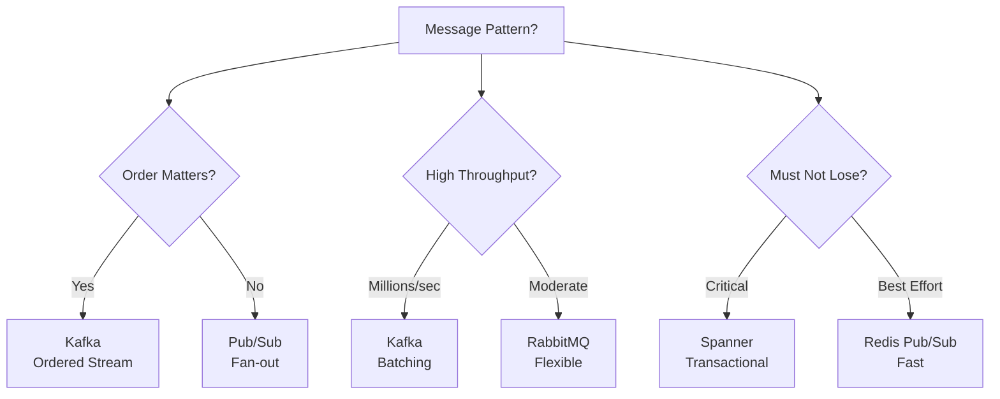
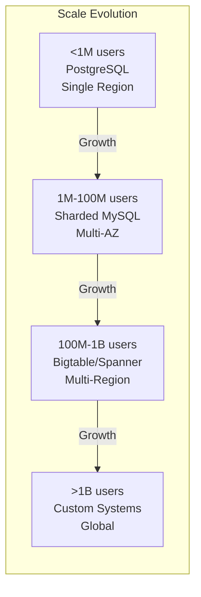

# Technology Mapping Guide

## When to Use What: Google Interview Edition

### 🗄 Storage Systems Decision Tree



### Database Selection Matrix

<div class="responsive-table" markdown>

| Use Case | Best Choice | Why | Trade-offs |
|----------|-------------|-----|------------|
| **User Profiles** | Spanner | Global consistency, SQL | Higher latency |
| **Shopping Cart** | Spanner | ACID transactions | Cost at scale |
| **Product Catalog** | Bigtable + Cache | Read heavy, eventual consistency OK | Complex queries harder |
| **Time Series Data** | Bigtable | Optimized for append, high write rate | No SQL, no transactions |
| **Session Storage** | Memcache/Redis | Temporary, fast access | Data loss OK |
| **Analytics** | BigQuery | Columnar, SQL analytics | Not for OLTP |
| **Full-Text Search** | Custom inverted index | Optimized for search | Separate system |
| **Graph Data** | Custom graph DB | Optimized traversals | Limited tooling |
| **Blob Storage** | GCS/Colossus | Cost effective, durable | Higher latency |

</div>


### Compute Platform Selection



### Caching Strategy by Use Case

<div class="responsive-table" markdown>

| Data Type | Cache Level | Technology | TTL | Hit Rate Target |
|-----------|-------------|------------|-----|-----------------|
| **Static content** | CDN | Cloud CDN | 24h-30d | >95% |
| **API responses** | Application | Memcache | 1-60 min | >80% |
| **Database queries** | Query cache | Redis | 5-30 min | >70% |
| **User sessions** | In-memory | Redis | Session lifetime | 100% |
| **Computed results** | Distributed | Hazelcast | 1-24h | >60% |
| **Media thumbnails** | Multi-tier | CDN + Local | 7-30d | >90% |

</div>


### Message Queue Selection



### Pattern to Technology Mapping

<div class="responsive-table" markdown>

| Pattern | Google Technology | Open Source Alternative | When to Use |
|---------|------------------|------------------------|-------------|
| **Load Balancing** | Google LB (Maglev) | HAProxy, Nginx | All services |
| **Service Mesh** | Istio | Envoy, Linkerd | Microservices |
| **API Gateway** | Apigee, Cloud Endpoints | Kong, Zuul | External APIs |
| **Circuit Breaker** | Custom library | Hystrix, Resilience4j | Service calls |
| **Rate Limiting** | Cloud Armor | Redis + Lua | API protection |
| **Distributed Lock** | Chubby | Zookeeper, etcd | Coordination |
| **Event Sourcing** | Spanner + Pub/Sub | Kafka + PostgreSQL | Audit trails |
| **CQRS** | Spanner + Bigtable | PostgreSQL + Elasticsearch | Read/write split |
| **Saga Pattern** | Workflow engine | Temporal, Airflow | Distributed transactions |

</div>


### Scale Thresholds for Technology Changes



### Common Technology Combinations

#### Real-time Chat System
```
- WebSocket: Envoy proxy for connection management
- Pub/Sub: For message delivery
- Bigtable: Message history
- Redis: Online presence
- Spanner: User data
```

#### Video Streaming Platform
```
- GCS: Video storage
- CDN: Global distribution
- Bigtable: Video metadata
- Pub/Sub: Processing pipeline
- Memcache: Hot content
```

#### E-commerce Platform
```
- Spanner: Orders, inventory (ACID)
- Bigtable: Product catalog
- Redis: Shopping cart
- Pub/Sub: Order events
- BigQuery: Analytics
```

#### Maps & Navigation
```
- Custom graph DB: Road network
- Bigtable: Traffic data
- Redis: Hot routes cache
- Colossus: Map tiles
- Pub/Sub: Real-time updates
```

### Decision Framework

#### Step 1: Identify Requirements
- [ ] Data consistency needs
- [ ] Latency requirements
- [ ] Throughput requirements
- [ ] Geographic distribution
- [ ] Cost constraints

#### Step 2: Map to Patterns
- [ ] Which distributed patterns apply?
- [ ] What are the failure modes?
- [ ] How to handle scale?

#### Step 3: Select Technologies
- [ ] Primary data store
- [ ] Caching strategy
- [ ] Message passing
- [ ] Compute platform

#### Step 4: Validate Choices
- [ ] Can it scale 10x?
- [ ] What breaks first?
- [ ] Cost at scale?
- [ ] Operational complexity?

### Quick Reference Table

<div class="responsive-table" markdown>

| If you need... | Consider using... | But watch out for... |
|----------------|-------------------|---------------------|
| Global consistency | Spanner | Latency, cost |
| High write throughput | Bigtable | No transactions |
| Complex queries | BigQuery | Not real-time |
| Fast key lookup | Memcache/Redis | Memory limits |
| Message ordering | Kafka | Operational complexity |
| Serverless | Cloud Functions | Cold starts |
| ML inference | Cloud ML | Prediction latency |
| Graph queries | Custom solution | Build complexity |

</div>


### Red Flags in Technology Choices

1. **Using Spanner for everything** - It's expensive and has latency
2. **No caching strategy** - You'll hit scaling walls
3. **Ignoring eventual consistency** - Perfect consistency isn't always needed
4. **Over-engineering** - Start simple, evolve as needed
5. **Ignoring geographic distribution** - Latency matters globally
6. **Not considering failure modes** - Everything fails at scale
7. **Forgetting about cost** - Some solutions are prohibitively expensive

### Pro Tips

1. **Cache aggressively** - It solves many problems
2. **Shard early** - It's harder to add later
3. **Use queues** - Decouple components
4. **Plan for 10x** - Current scale × 10
5. **Monitor everything** - You can't fix what you can't see
6. **Fail gracefully** - Partial availability > no availability
7. **Keep it simple** - Complex systems fail in complex ways