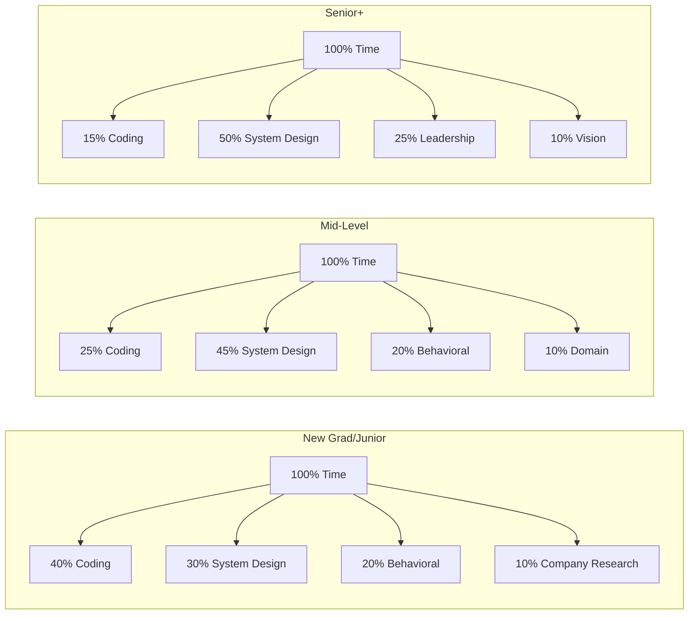
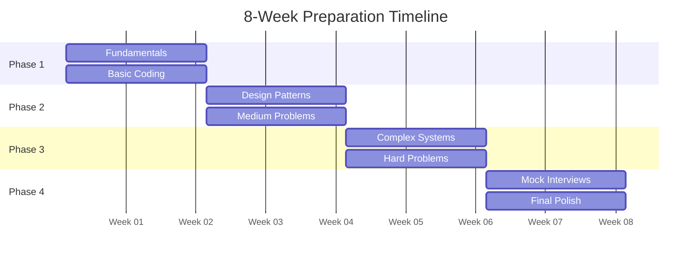

# Interview Preparation Time Allocation Calculator

## 🧮 Interactive Study Plan Generator

<h3>📊 Personalized Time Allocation Calculator</h3>

<h4>Your Profile</h4>
<label>Current Role:
<select id="current-role">
<option value="student">Student/New Grad</option>
<option value="junior">Junior Engineer (0-2 years)</option>
<option value="mid">Mid-level (3-5 years)</option>
<option value="senior">Senior (5+ years)</option>
<option value="staff">Staff+ (8+ years)</option>
</select>
</label>

<label>Target Company:
<select id="target-company">
<option value="google">Google</option>
<option value="amazon">Amazon</option>
<option value="meta">Meta/Facebook</option>
<option value="microsoft">Microsoft</option>
<option value="apple">Apple</option>
<option value="netflix">Netflix</option>
<option value="other">Other Tech</option>
</select>
</label>

<label>Target Level:
<select id="target-level">
<option value="L3">L3/SDE I (Junior)</option>
<option value="L4">L4/SDE II (Mid)</option>
<option value="L5">L5/Senior SDE</option>
<option value="L6">L6/Staff</option>
<option value="L7">L7+/Principal</option>
</select>
</label>

<h4>Time Availability</h4>
<label>Weeks Until Interview:
<input type="number" id="weeks-available" min="1" max="52" value="8">
</label>

<label>Hours Per Day:
<input type="number" id="hours-per-day" min="0.5" max="12" step="0.5" value="2">
</label>

<label>Days Per Week:
<input type="number" id="days-per-week" min="1" max="7" value="6">
</label>

<label>Current Preparation Level:
<input type="range" id="prep-level" min="0" max="100" value="20">
20%
</label>

<h4>Strengths & Weaknesses</h4>
<label>Strongest Area:
<select id="strength">
<option value="coding">Coding/Algorithms</option>
<option value="system">System Design</option>
<option value="behavioral">Behavioral/Leadership</option>
<option value="domain">Domain Knowledge</option>
</select>
</label>

<label>Weakest Area:
<select id="weakness">
<option value="system">System Design</option>
<option value="coding">Coding/Algorithms</option>
<option value="behavioral">Behavioral/Leadership</option>
<option value="domain">Domain Knowledge</option>
</select>
</label>

<label>Learning Style:
<select id="learning-style">
<option value="visual">Visual (Videos, Diagrams)</option>
<option value="reading">Reading (Books, Blogs)</option>
<option value="practice">Practice (Hands-on)</option>
<option value="discussion">Discussion (Study Groups)</option>
</select>
</label>

<button onclick="calculateTimeAllocation()" class="calculate-btn">Generate My Study Plan</button>

<h3>📈 Your Personalized Study Plan</h3>

<h4>Total Study Time</h4>

-

<h4>Daily Commitment</h4>

-

<h4>Success Probability</h4>

-

<h4>Readiness Date</h4>

-

<canvas id="allocationChart" width="400" height="300"></canvas>

<h4>📅 Week-by-Week Focus</h4>

<h4>⏰ Optimal Daily Schedule</h4>

<h4>📚 Recommended Resources</h4>

<h4>🎯 Key Milestones</h4>

## Time Allocation Strategies

### By Experience Level

### By Target Company

<table class="responsive-table">
<thead>
<tr>
<th>Company</th>
<th>Coding</th>
<th>System Design</th>
<th>Behavioral</th>
<th>Special Focus</th>
</tr>
</thead>
<tbody>
<tr>
<td data-label="Company"><strong>Google</strong></td>
<td data-label="Coding">30%</td>
<td data-label="System Design">50%</td>
<td data-label="Behavioral">10%</td>
<td data-label="Special Focus">10% - Scale & Algorithms</td>
</tr>
<tr>
<td data-label="Company"><strong>Amazon</strong></td>
<td data-label="Coding">25%</td>
<td data-label="System Design">35%</td>
<td data-label="Behavioral">30%</td>
<td data-label="Special Focus">10% - Leadership Principles</td>
</tr>
<tr>
<td data-label="Company"><strong>Meta</strong></td>
<td data-label="Coding">35%</td>
<td data-label="System Design">40%</td>
<td data-label="Behavioral">15%</td>
<td data-label="Special Focus">10% - Product Sense</td>
</tr>
<tr>
<td data-label="Company"><strong>Microsoft</strong></td>
<td data-label="Coding">30%</td>
<td data-label="System Design">40%</td>
<td data-label="Behavioral">20%</td>
<td data-label="Special Focus">10% - Cloud/Enterprise</td>
</tr>
<tr>
<td data-label="Company"><strong>Apple</strong></td>
<td data-label="Coding">35%</td>
<td data-label="System Design">35%</td>
<td data-label="Behavioral">20%</td>
<td data-label="Special Focus">10% - Excellence/Details</td>
</tr>
<tr>
<td data-label="Company"><strong>Netflix</strong></td>
<td data-label="Coding">25%</td>
<td data-label="System Design">55%</td>
<td data-label="Behavioral">10%</td>
<td data-label="Special Focus">10% - Scale/Performance</td>
</tr>
</tbody>
</table>

## Quick Allocation Templates

### 2-Week Sprint (Emergency Prep)

<h4>🚨 14 Days Total</h4>
<ul>
<li><strong>Days 1-3:</strong> Core concepts review</li>
<li><strong>Days 4-7:</strong> 10 system designs</li>
<li><strong>Days 8-10:</strong> Company-specific prep</li>
<li><strong>Days 11-12:</strong> Mock interviews</li>
<li><strong>Days 13-14:</strong> Polish & review</li>
</ul>

Total: 56 hours @ 4hrs/day

<h4>⚡ Daily Breakdown</h4>
<ul>
<li><strong>Morning (1hr):</strong> Theory/Reading</li>
<li><strong>Afternoon (1.5hr):</strong> Practice problems</li>
<li><strong>Evening (1.5hr):</strong> System design</li>
</ul>

Focus: Speed > Depth

### 4-Week Standard Prep

<h5>Week 1: Foundation</h5>

Coding 40%

Theory 60%

<h5>Week 2: Build</h5>

Coding 30%

System Design 70%

<h5>Week 3: Practice</h5>

Practice 80%

Review 20%

<h5>Week 4: Polish</h5>

Mocks 60%

Polish 40%

### 8-Week Comprehensive Prep

## Efficiency Maximization Tips

<h4>🌅 Morning Sessions</h4>

<strong>Best for:</strong> Theory & Concepts

<ul>
<li>Fresh mind for complex topics</li>
<li>Read papers/books</li>
<li>Watch educational videos</li>
<li>Review fundamentals</li>
</ul>

Efficiency: 90%

<h4>☀️ Afternoon Sessions</h4>

<strong>Best for:</strong> Coding Practice

<ul>
<li>Peak problem-solving time</li>
<li>LeetCode problems</li>
<li>Algorithm practice</li>
<li>Debugging skills</li>
</ul>

Efficiency: 85%

<h4>🌆 Evening Sessions</h4>

<strong>Best for:</strong> System Design

<ul>
<li>Creative thinking time</li>
<li>Design problems</li>
<li>Architecture planning</li>
<li>Trade-off analysis</li>
</ul>

Efficiency: 80%

<h4>🌙 Night Sessions</h4>

<strong>Best for:</strong> Review & Behavioral

<ul>
<li>Reflect on learning</li>
<li>Behavioral stories</li>
<li>Quick reviews</li>
<li>Planning next day</li>
</ul>

Efficiency: 70%

## Dynamic Adjustment Framework

### Weekly Progress Checkpoints

<h4>Week 1 Check</h4>
<ul>
<li>☐ Completed fundamentals?</li>
<li>☐ 20+ coding problems?</li>
<li>☐ 2 system designs?</li>
</ul>

If behind: +1 hour/day

<h4>Week 2 Check</h4>
<ul>
<li>☐ Patterns mastered?</li>
<li>☐ 50+ total problems?</li>
<li>☐ 5 system designs?</li>
</ul>

If behind: Focus on gaps

<h4>Week 4 Check</h4>
<ul>
<li>☐ Mock interviews done?</li>
<li>☐ Consistent timing?</li>
<li>☐ Confidence level?</li>
</ul>

If behind: Intensive mode

