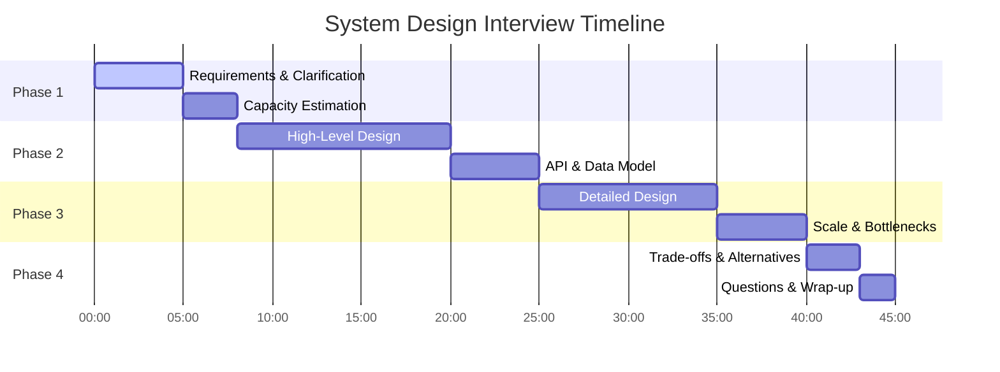
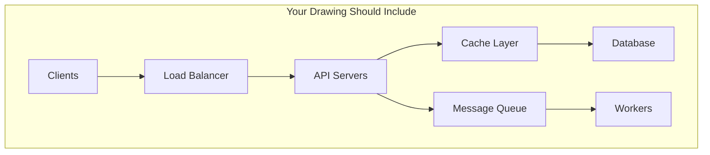

# Time Management Template for Google Interviews

## 45-Minute Interview Timeline



## Phase-by-Phase Checklist

### Phase 1: Requirements (0-8 minutes)

**First 5 minutes - MUST ASK:**
```
□ Functional requirements
  □ Core features (2-3 main ones)
  □ Out of scope features
  □ User types and use cases
  
□ Non-functional requirements  
  □ Scale (users, requests, data)
  □ Performance (latency, throughput)
  □ Availability target
  □ Consistency requirements
```

**Next 3 minutes - MUST DO:**
```
□ Back-of-envelope calculation
  □ QPS (average and peak)
  □ Storage requirements
  □ Bandwidth needs
  □ Server count estimate
```

**Red flags:**
- Jumping into design without clarifying
- Assuming requirements
- Skipping capacity planning

### Phase 2: High-Level Design (8-25 minutes)

**First 12 minutes - Architecture:**
```
□ Draw main components
  □ Client tier
  □ API Gateway/Load Balancer
  □ Application servers
  □ Data stores
  □ Cache layers
  
□ Show data flow
  □ Read path
  □ Write path
  □ Background jobs
```

**Next 5 minutes - API & Schema:**
```
□ Define 3-5 core APIs
□ Design main database tables
□ Identify primary keys and indexes
```

**Visual Example:**


### Phase 3: Deep Dive (25-40 minutes)

**10 minutes - Component Details:**
```
□ Pick 2-3 critical components
□ Explain internal design
□ Show algorithms/data structures
□ Discuss technology choices
```

**5 minutes - Scaling Concerns:**
```
□ Identify bottlenecks
□ Propose solutions
□ Discuss sharding/partitioning
□ Address hot spots
```

### Phase 4: Wrap Up (40-45 minutes)

**3 minutes - Trade-offs:**
```
□ Discuss 2-3 alternatives
□ Explain pros/cons
□ Justify your choices
```

**2 minutes - Q&A:**
```
□ Ask clarifying questions
□ Show interest in the problem
```

## Time Allocation Strategies

### For Different Problem Types

#### High-Traffic Service (YouTube, Gmail)
```
Requirements:        5 min  ████
Capacity:           5 min  ████
Architecture:      15 min  ████████████
Deep Dive:         15 min  ████████████
Scale & Trade-offs: 5 min  ████
```

#### Complex Business Logic (Uber, Payment)
```
Requirements:       8 min  ██████
Capacity:          3 min  ██
Architecture:      12 min  █████████
Deep Dive:         17 min  █████████████
Scale & Trade-offs: 5 min  ████
```

#### Data-Heavy System (Analytics, Search)
```
Requirements:       5 min  ████
Capacity:          5 min  ████
Architecture:      10 min  ████████
Deep Dive:         20 min  ████████████████
Scale & Trade-offs: 5 min  ████
```

## Quick Decision Templates

### When You're Running Short on Time

**30 seconds - Requirements unclear?**
```python
# Quick template
"Let me confirm the key requirements:
- We need to support X users
- Main operations are Y and Z  
- Targeting P% availability
- Latency should be under Q ms
Is this correct?"
```

**1 minute - Need quick architecture?**
```
Client → LB → API → Cache → DB
              ↓
           Queue → Workers → Storage
```

**30 seconds - Database choice?**
```
if need_consistency and global:
    return "Spanner"
elif high_write_volume:
    return "Bigtable"
elif analytics:
    return "BigQuery"
else:
    return "CloudSQL with sharding"
```

## Time Tracking Worksheet

Print and use during practice:

```
Interview: _________________ Date: _______

Phase 1: Requirements & Estimation
├─ Start: _____ End: _____ (Target: 8m)
├─ ✓ Functional requirements
├─ ✓ Non-functional requirements  
└─ ✓ Capacity estimation

Phase 2: High-Level Design
├─ Start: _____ End: _____ (Target: 17m)
├─ ✓ Architecture diagram
├─ ✓ Data flow
└─ ✓ API & Schema

Phase 3: Detailed Design
├─ Start: _____ End: _____ (Target: 15m)
├─ ✓ Component deep dive
└─ ✓ Scaling discussion

Phase 4: Wrap-up
├─ Start: _____ End: _____ (Target: 5m)
├─ ✓ Trade-offs
└─ ✓ Questions

Notes: _________________________________
_______________________________________
```

## Warning Signs & Recovery

### You're Behind Schedule

**At 10 minutes - Still on requirements?**
- Say: "Let me quickly summarize and move to design"
- Draw high-level architecture in 2 minutes
- Skip detailed calculations

**At 25 minutes - Haven't shown deep knowledge?**
- Pick ONE component
- Go deep on algorithms/data structures
- Show you understand the hard parts

**At 40 minutes - No scaling discussion?**
- Quickly identify top 2 bottlenecks
- Propose solutions in bullet points
- Mention horizontal scaling

### You're Ahead of Schedule

**Finished early?**
- Discuss monitoring and alerting
- Add security considerations
- Explore edge cases
- Ask about real-world constraints

## Speed Techniques

### Drawing Shortcuts

```
// Instead of drawing everything, use notation:

[LB] → {API×N} → <Cache> → |DB|
         ↓
      [Queue] → {Workers×M}

Legend:
[] = Infrastructure
{} = Scaled service  
<> = Cache layer
|| = Database
```

### Verbal Shortcuts

Instead of: "We'll use a load balancer to distribute traffic across multiple application servers..."

Say: "Standard LB setup with round-robin to N API servers"

### Calculation Shortcuts

```python
# Memory method for common calculations
1 billion users = 1B
1 day = 86,400 ≈ 100K seconds  
1 year ≈ 30M seconds

QPS = daily_volume / 100K
Peak = QPS × 3
Storage = users × size × retention
```

## Practice Scripts

### Opening (30 seconds)
"Thanks for the problem. Before I dive into the design, I'd like to clarify a few requirements. I'll spend about 5 minutes on requirements, then move to high-level design."

### Transition to Design (15 seconds)
"Based on these requirements, let me start with a high-level architecture. I'll draw the main components and data flow."

### Transition to Deep Dive (15 seconds)
"Now let me dive deeper into [specific component]. This is critical because [reason]."

### Closing (30 seconds)
"To summarize, we've designed a system that handles [X] scale with [Y] availability. The key decisions were [Z]. What aspects would you like me to explore further?"

## ✅ Final Checklist

Before the interview:
- [ ] Practice drawing quickly
- [ ] Memorize common numbers
- [ ] Prepare transition phrases
- [ ] Have backup plans for running late

During the interview:
- [ ] Watch the clock
- [ ] Hit major milestones
- [ ] Show breadth AND depth
- [ ] Leave time for questions

Remember: It's better to have a complete but less detailed design than a perfect but incomplete one!