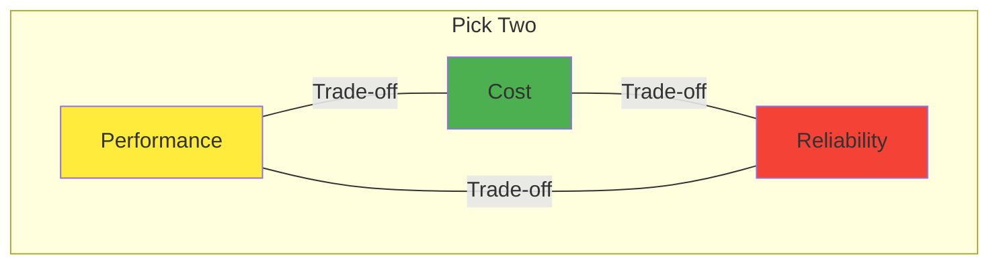
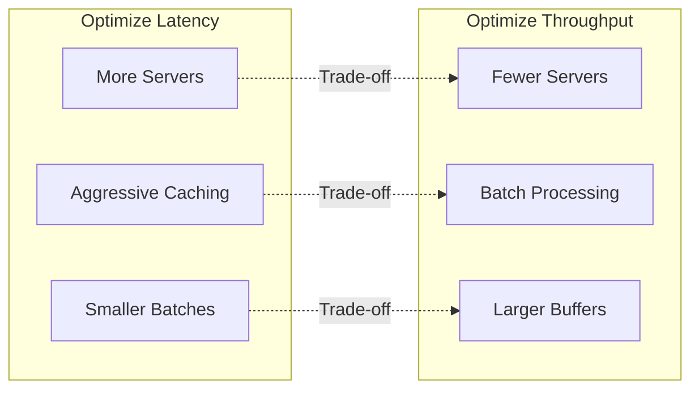
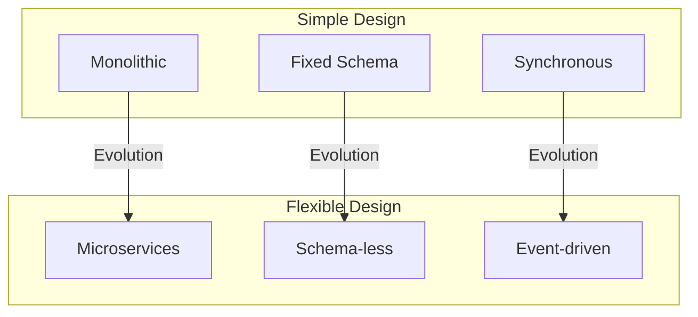
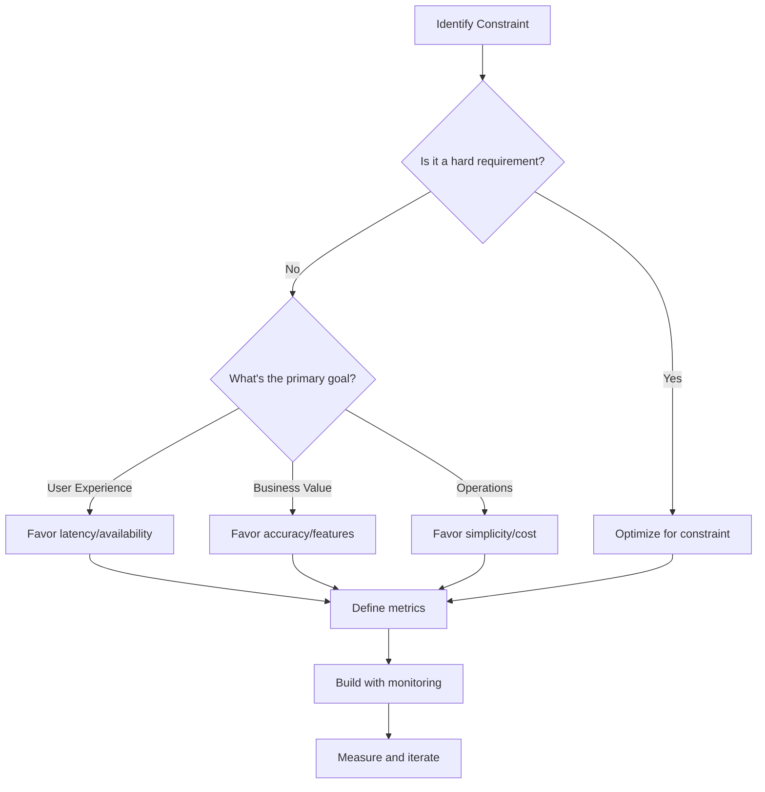

# System Design Trade-off Analysis

Learn how to analyze and communicate trade-offs effectively in Google system design interviews. This skill distinguishes senior engineers from junior ones.

## The Trade-off Mindset

### Universal Truth
```
Every design decision is a trade-off.
There are no perfect solutions, only appropriate ones.
Your job: Make informed choices and communicate them clearly.
```

### The Trade-off Triangle



## Framework for Trade-off Analysis

### The TRADE Method

```
T - Target: What are we optimizing for?
R - Resources: What constraints do we have?
A - Alternatives: What options exist?
D - Decision: What do we choose and why?
E - Evaluation: How do we measure success?
```

### Decision Matrix Template

| Option | Pros | Cons | When to Use |
|--------|------|------|-------------|
| **Option A** | ✓ Fast<br>✓ Simple | ✗ Expensive<br>✗ Less flexible | Early stage, need speed |
| **Option B** | ✓ Scalable<br>✓ Cost-effective | ✗ Complex<br>✗ Slower | Mature system, cost matters |
| **Option C** | ✓ Flexible<br>✓ Reliable | ✗ High latency<br>✗ Operational overhead | Mission-critical, need reliability |


## Common System Design Trade-offs

### 1. Consistency vs Availability

```python
class ConsistencyTradeoff:
    def analyze(self, requirements):
        if requirements.financial_transactions:
            return {
                "choice": "Strong Consistency",
                "implementation": "Synchronous replication",
                "trade_off": "Lower availability during partitions",
                "justification": "Can't lose money or double-spend"
            }
        elif requirements.social_media_feed:
            return {
                "choice": "Eventual Consistency",
                "implementation": "Async replication with conflict resolution",
                "trade_off": "Users might see stale data temporarily",
                "justification": "Better user experience with high availability"
            }
```

**Real-World Examples:**

| System | Choice | Why |
|--------|--------|-----|
| **Google Spanner** | Strong Consistency | Financial data, global transactions |
| **YouTube Comments** | Eventual Consistency | UX more important than immediate consistency |
| **Gmail** | Session Consistency | Balance between UX and data accuracy |


### 2. Latency vs Throughput



**Analysis Framework:**

```python
def analyze_latency_throughput(use_case):
    if use_case == "search_autocomplete":
        return {
            "optimize_for": "latency",
            "target": "<100ms p99",
            "techniques": ["In-memory trie", "Edge caching", "Predictive fetch"],
            "sacrifice": "Higher infrastructure cost"
        }
    elif use_case == "log_processing":
        return {
            "optimize_for": "throughput",
            "target": "1M events/sec",
            "techniques": ["Batching", "Compression", "Columnar storage"],
            "sacrifice": "30-60 second delay in insights"
        }
```

### 3. Space vs Time

```
Classic CS Trade-off in Distributed Systems:

Approach 1: Precompute Everything
✓ Fast reads (O(1))
✗ Huge storage cost
✗ Slow writes
→ Use for: YouTube video recommendations

Approach 2: Compute on Demand
✓ Minimal storage
✓ Always fresh data
✗ Slow reads (O(n))
→ Use for: Complex analytics queries

Approach 3: Hybrid (Cache + Compute)
✓ Balance of both
✗ Cache invalidation complexity
→ Use for: Google Search results
```

### 4. Accuracy vs Performance

```python
class AccuracyTradeoff:
    def design_solution(self, requirement):
        solutions = {
            "exact_count": {
                "algorithm": "Distributed counter with locks",
                "accuracy": "100%",
                "performance": "Slow, doesn't scale",
                "use_case": "Banking transactions"
            },
            "approximate_count": {
                "algorithm": "HyperLogLog",
                "accuracy": "±2% error",
                "performance": "Fast, highly scalable",
                "use_case": "Unique visitors count"
            },
            "sampled_analytics": {
                "algorithm": "Reservoir sampling",
                "accuracy": "Statistical confidence",
                "performance": "Can handle any scale",
                "use_case": "YouTube analytics"
            }
        }
        return solutions[requirement]
```

### 5. Flexibility vs Simplicity



**Evolution Pattern:**
```
Start Simple → Grow → Hit Limits → Add Flexibility → Manage Complexity
```

## Advanced Trade-off Patterns

### 1. The Gradient Approach

Instead of binary choices, consider gradients:

```python
class CachingGradient:
    """
    Not just "cache or no cache" but levels of caching
    """
    levels = [
        {"name": "No Cache", "latency": "100ms", "cost": "$", "complexity": "Low"},
        {"name": "App Cache", "latency": "50ms", "cost": "$$", "complexity": "Medium"},
        {"name": "CDN Cache", "latency": "20ms", "cost": "$$$", "complexity": "High"},
        {"name": "Edge Cache", "latency": "5ms", "cost": "$$$$", "complexity": "Very High"},
    ]
    
    def recommend(self, budget, latency_sla):
# Find optimal level based on constraints
        return self.find_sweet_spot(budget, latency_sla)
```

### 2. The Migration Trade-off

```
Migrating from System A to System B:

Option 1: Big Bang Migration
✓ Clean, no dual maintenance
✗ High risk, long downtime
When: Small system, can afford downtime

Option 2: Parallel Run
✓ Safe, can rollback
✗ 2x cost, data sync complexity
When: Critical systems, zero downtime

Option 3: Gradual Migration
✓ Low risk, learn as you go
✗ Long timeline, feature parity issues
When: Large systems, complex dependencies
```

### 3. The Optimization Hierarchy

```python
def optimization_hierarchy(constraint):
    """
    Order matters - optimize for primary constraint first
    """
    hierarchies = {
        "startup": ["Correctness", "Simplicity", "Performance", "Cost"],
        "scale": ["Performance", "Cost", "Reliability", "Simplicity"],
        "enterprise": ["Reliability", "Security", "Performance", "Cost"],
    }
    
    return hierarchies[constraint]
```

## Real Google System Trade-offs

### YouTube Video Upload

```
Trade-off: Processing Speed vs Cost

Option A: Process immediately on upload
- Pro: Videos available quickly
- Con: Need massive compute capacity for peak times
- Cost: Very high

Option B: Queue and batch process
- Pro: Efficient resource utilization
- Con: Delay in video availability
- Cost: Moderate

Google's Choice: Hybrid
- Popular creators: Fast track processing
- Regular users: Standard queue
- ML predicts viral content for prioritization
```

### Google Search Indexing

```
Trade-off: Freshness vs Completeness

Fresh Index:
- Updates every few hours
- Contains recent changes
- Smaller, fits in memory
- Used for news, trending topics

Complete Index:
- Updates daily/weekly
- Contains all web pages
- Massive, distributed storage
- Used for long-tail queries

Smart Routing:
- Query classifier determines which index
- Blends results when appropriate
- Users get best of both worlds
```

## Communication Techniques

### 1. The Options Presentation

```python
def present_options(interviewer_question):
    """
    Always present multiple options with trade-offs
    """
    response = """
    For {problem}, I see three approaches:
    
    1. {Option A}: {brief description}
       - Pros: {key advantages}
       - Cons: {key disadvantages}
       - Best when: {use case}
    
    2. {Option B}: {brief description}
       - Pros: {key advantages}
       - Cons: {key disadvantages}
       - Best when: {use case}
    
    3. {Option C}: {brief description}
       - Pros: {key advantages}
       - Cons: {key disadvantages}
       - Best when: {use case}
    
    Given our constraints of {constraints}, I recommend {choice} because {reasoning}.
    """
    return response
```

### 2. The Quantitative Comparison

Always use numbers when possible:

```
"Option A gives us 10ms latency but costs $10K/month,
 Option B gives us 50ms latency but costs $2K/month.
 
 Since our SLA is 100ms, Option B saves us $96K/year
 with acceptable performance."
```

### 3. The Evolution Story

```
"Initially, we'd start with approach A for simplicity.
 
 When we hit 10K QPS, we'd add caching (approach B).
 
 At 100K QPS, we'd need sharding (approach C).
 
 This evolution minimizes complexity at each stage
 while preparing for the next level of scale."
```

## Trade-off Decision Framework

### The Decision Tree



### Evaluation Criteria

```python
class TradeoffEvaluator:
    def score_solution(self, solution):
        weights = {
            "performance": 0.3,
            "scalability": 0.2,
            "reliability": 0.2,
            "cost": 0.15,
            "complexity": 0.15
        }
        
        scores = {}
        for criterion, weight in weights.items():
            scores[criterion] = self.evaluate(solution, criterion) * weight
        
        return {
            "total_score": sum(scores.values()),
            "breakdown": scores,
            "recommendation": self.interpret_score(sum(scores.values()))
        }
```

## Common Pitfalls to Avoid

### 1. The Perfect Solution Trap
❌ "This solution handles everything perfectly"
✅ "This solution optimizes for X at the cost of Y"

### 2. The Indecision Paralysis
❌ "Both options are good, hard to choose"
✅ "Option A is better for our current scale, we can migrate to B later"

### 3. The Complexity Bias
❌ "Let's use the most advanced solution"
✅ "Let's use the simplest solution that meets our needs"

### 4. The Google Scale Fallacy
❌ "Google does X, so we should too"
✅ "At our scale, Y is more appropriate, but we can evolve to X"

## Practice Exercises

### Exercise 1: Database Choice

```
Scenario: Design a URL shortener database

Analyze trade-offs between:
- SQL (PostgreSQL)
- NoSQL (DynamoDB)
- Cache-based (Redis)

Consider:
- Scale requirements
- Consistency needs
- Query patterns
- Operational complexity
```

### Exercise 2: Caching Strategy

```
Scenario: Cache strategy for social media feed

Compare:
- Client-side caching
- CDN caching
- Application-level caching
- Database query caching

Evaluate on:
- Cache hit rate
- Invalidation complexity
- Storage cost
- User experience
```

### Exercise 3: Real-time vs Batch

```
Scenario: Analytics for video platform

Trade-offs:
- Real-time streaming (Apache Flink)
- Micro-batch (Spark Streaming)
- Batch processing (Hadoop)

Factors:
- Latency requirements
- Cost at scale
- Accuracy needs
- Operational complexity
```

## The Meta Trade-off

Remember: Even choosing which trade-offs to optimize for is itself a trade-off. The key is to:

1. **Understand the business context**
2. **Make explicit choices**
3. **Document your reasoning**
4. **Plan for change**
5. **Measure and validate**

Master this, and you'll think like a Staff+ engineer at Google.

[Return to Google Interview Guide](google-interviews/index.md)