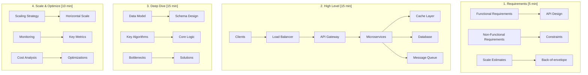
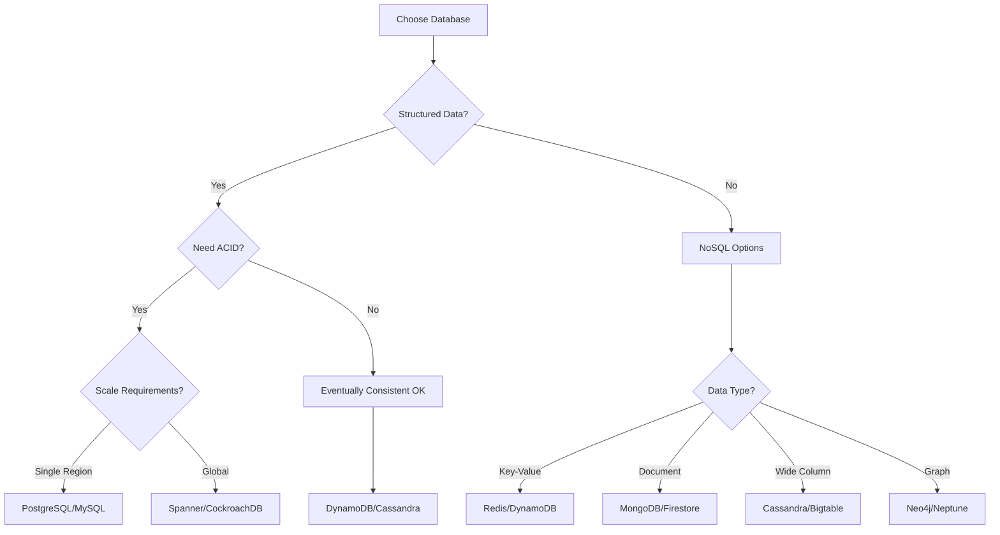
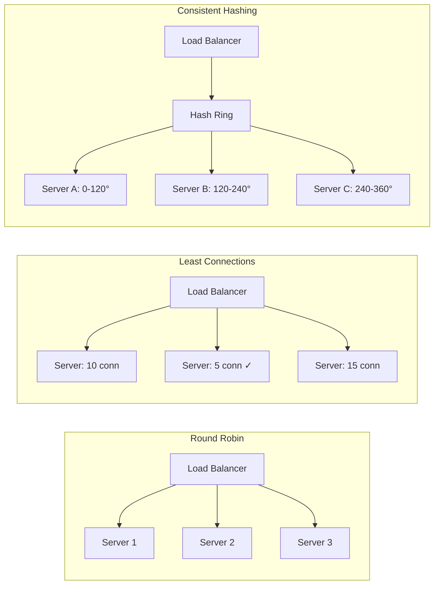

# Visual Cheat Sheets for System Design Interviews

## 🎯 The Ultimate System Design Canvas

## 📊 Quick Reference: Scale Numbers

<table>
<thead>
<tr>
<th>Metric</th>
<th>Small</th>
<th>Medium</th>
<th>Large</th>
<th>Google Scale</th>
</tr>
</thead>
<tbody>
<tr>
<td><strong>Users</strong></td>
<td>10K</td>
<td>1M</td>
<td>100M</td>
<td>1B+</td>
</tr>
<tr>
<td><strong>Requests/sec</strong></td>
<td>100</td>
<td>10K</td>
<td>100K</td>
<td>1M+</td>
</tr>
<tr>
<td><strong>Data Size</strong></td>
<td>GB</td>
<td>TB</td>
<td>PB</td>
<td>EB</td>
</tr>
<tr>
<td><strong>Servers Needed</strong></td>
<td>1-10</td>
<td>100s</td>
<td>1000s</td>
<td>100K+</td>
</tr>
<tr>
<td><strong>Cache Size</strong></td>
<td>MB</td>
<td>GB</td>
<td>TB</td>
<td>PB</td>
</tr>
<tr>
<td><strong>Bandwidth</strong></td>
<td>Mbps</td>
<td>Gbps</td>
<td>10 Gbps</td>
<td>Tbps</td>
</tr>
</tbody>
</table>

## 🚀 Latency Numbers Every Engineer Should Know

```mermaid
gantt
    title Latency Comparison (log scale)
    dateFormat X
    axisFormat %s
    
    section Cache
    L1 Cache Reference    :0, 1
    L2 Cache Reference    :0, 10
    
    section Memory
    Main Memory Reference :0, 100
    
    section Storage
    SSD Random Read       :0, 16000
    HDD Seek              :0, 10000000
    
    section Network
    Same DC Round Trip    :0, 500000
    Cross-Coast RT        :0, 150000000
```

### Quick Latency Reference
- **L1 Cache**: 0.5 ns
- **L2 Cache**: 7 ns
- **RAM**: 100 ns
- **SSD Read**: 16 μs
- **Network Same DC**: 0.5 ms
- **Network Cross-Coast**: 150 ms
- **HDD Seek**: 10 ms

## 🏗️ Common Architecture Patterns

<h3>1. Basic Web App</h3>
<pre>
┌─────────┐     ┌──────────┐     ┌────────┐
│ Browser ├────►│ Web Server├────►│   DB   │
└─────────┘     └──────────┘     └────────┘
</pre>

<h3>2. With Load Balancer</h3>
<pre>
┌─────────┐     ┌────┐     ┌──────────┐
│ Browser ├────►│ LB ├────►│ Server 1 │
└─────────┘     └─┬──┘     └──────────┘
                  │        ┌──────────┐
                  └───────►│ Server 2 │
                           └──────────┘
</pre>

<h3>3. With Cache</h3>
<pre>
┌─────────┐     ┌──────────┐     ┌───────┐
│ Browser ├────►│   Server  ├────►│ Cache │
└─────────┘     └──────────┘     └───┬───┘
                                      │
                                  ┌───▼───┐
                                  │   DB  │
                                  └───────┘
</pre>

<h3>4. Microservices</h3>
<pre>
┌─────────┐     ┌──────────┐     ┌─────────┐
│   API   ├────►│ Service A├────►│  DB A   │
│ Gateway │     └──────────┘     └─────────┘
└────┬────┘     ┌──────────┐     ┌─────────┐
     └─────────►│ Service B├────►│  DB B   │
                └──────────┘     └─────────┘
</pre>

## 📐 Capacity Planning Formulas

<h4>🔢 QPS Calculation</h4>
<pre>
Daily Active Users = 100M
Avg requests/user/day = 20
Total daily requests = 2B

QPS = 2B / 86400 = ~23K QPS
Peak QPS = 23K × 3 = ~70K QPS
</pre>

<h4>💾 Storage Calculation</h4>
<pre>
Users = 100M
Data per user = 10 MB
Total = 100M × 10 MB = 1 PB

With replication (3x) = 3 PB
With backups (+50%) = 4.5 PB
</pre>

<h4>🖥️ Server Calculation</h4>
<pre>
Peak QPS = 70K
QPS per server = 1000
Servers needed = 70

With redundancy (2x) = 140
Round up = 150 servers
</pre>

<h4>💰 Bandwidth Calculation</h4>
<pre>
QPS = 70K
Request size = 1 KB
Response size = 10 KB

Bandwidth = 70K × 11 KB
= 770 MB/s = 6.2 Gbps
</pre>

## 🎨 Database Decision Tree

## 🔄 Caching Strategy Selector

<table>
<thead>
<tr>
<th>Pattern</th>
<th>When to Use</th>
<th>Pros</th>
<th>Cons</th>
</tr>
</thead>
<tbody>
<tr>
<td><strong>Cache Aside</strong></td>
<td>• Read heavy • Cache misses OK</td>
<td>• Simple • Flexible</td>
<td>• Cache misses • Inconsistency risk</td>
</tr>
<tr>
<td><strong>Write Through</strong></td>
<td>• Write heavy • Need consistency</td>
<td>• No stale data • Simpler logic</td>
<td>• Write latency • Cache churn</td>
</tr>
<tr>
<td><strong>Write Behind</strong></td>
<td>• Write heavy • Latency sensitive</td>
<td>• Fast writes • Batch updates</td>
<td>• Data loss risk • Complex</td>
</tr>
<tr>
<td><strong>Refresh Ahead</strong></td>
<td>• Predictable access • Low latency critical</td>
<td>• No cache misses • Great performance</td>
<td>• Prediction needed • Resource intensive</td>
</tr>
</tbody>
</table>

## 🌐 API Design Patterns

<h4>RESTful API</h4>
<pre>
GET    /users/{id}
POST   /users
PUT    /users/{id}
DELETE /users/{id}

GET    /users/{id}/posts
POST   /users/{id}/posts
</pre>

<h4>GraphQL</h4>
<pre>
query {
  user(id: "123") {
    name
    email
    posts {
      title
      content
    }
  }
}
</pre>

<h4>gRPC</h4>
<pre>
service UserService {
  rpc GetUser(GetUserRequest) 
      returns (User);
  rpc ListUsers(ListUsersRequest) 
      returns (stream User);
}
</pre>

## 🚦 Load Balancing Algorithms

## 📱 Mobile App Architecture

<h3>Offline-First Architecture</h3>
<pre>
┌─────────────────────────────────────┐
│          Mobile App                 │
├─────────────────────────────────────┤
│  ┌─────────┐      ┌──────────────┐ │
│  │   UI    │◄────►│ Local SQLite │ │
│  └─────────┘      └──────────────┘ │
│       ▲                    ▲        │
│       │                    │        │
│  ┌────▼──────┐      ┌─────▼──────┐ │
│  │ View Model│      │ Sync Engine │ │
│  └───────────┘      └─────────────┘ │
└───────────────────────────┬─────────┘
                            │
                     ┌──────▼──────┐
                     │   Backend   │
                     │     API     │
                     └─────────────┘
</pre>

## 🎯 Interview Time Management

<svg viewBox="0 0 400 400" style="max-width: 400px;">
  <!-- Clock face -->
  <circle cx="200" cy="200" r="180" fill="#f0f0f0" stroke="#333" stroke-width="4"/>
  
  <!-- Time segments -->
  <path d="M 200,200 L 200,20 A 180,180 0 0,1 290,60 z" fill="#FF6B6B" opacity="0.7"/>
  <path d="M 200,200 L 290,60 A 180,180 0 0,1 350,200 z" fill="#4ECDC4" opacity="0.7"/>
  <path d="M 200,200 L 350,200 A 180,180 0 0,1 290,340 z" fill="#FFE66D" opacity="0.7"/>
  <path d="M 200,200 L 290,340 A 180,180 0 0,1 200,380 z" fill="#95E1D3" opacity="0.7"/>
  <path d="M 200,200 L 200,380 A 180,180 0 0,1 110,340 z" fill="#A8E6CF" opacity="0.7"/>
  <path d="M 200,200 L 110,340 A 180,180 0 0,1 200,20 z" fill="#C7CEEA" opacity="0.7"/>
  
  <!-- Labels -->
  <text x="200" y="100" text-anchor="middle" font-size="14" font-weight="bold">Requirements</text>
  <text x="200" y="115" text-anchor="middle" font-size="12">5 min</text>
  
  <text x="320" y="130" text-anchor="middle" font-size="14" font-weight="bold">Estimation</text>
  <text x="320" y="145" text-anchor="middle" font-size="12">5 min</text>
  
  <text x="320" y="270" text-anchor="middle" font-size="14" font-weight="bold">High Level</text>
  <text x="320" y="285" text-anchor="middle" font-size="12">15 min</text>
  
  <text x="200" y="320" text-anchor="middle" font-size="14" font-weight="bold">Deep Dive</text>
  <text x="200" y="335" text-anchor="middle" font-size="12">10 min</text>
  
  <text x="80" y="270" text-anchor="middle" font-size="14" font-weight="bold">Scale</text>
  <text x="80" y="285" text-anchor="middle" font-size="12">5 min</text>
  
  <text x="80" y="130" text-anchor="middle" font-size="14" font-weight="bold">Wrap Up</text>
  <text x="80" y="145" text-anchor="middle" font-size="12">5 min</text>
  
  <!-- Center -->
  <circle cx="200" cy="200" r="10" fill="#333"/>
</svg>

## 🔍 Common Bottlenecks & Solutions

<table>
<thead>
<tr>
<th>Bottleneck</th>
<th>Symptoms</th>
<th>Solutions</th>
</tr>
</thead>
<tbody>
<tr>
<td><strong>Database</strong></td>
<td>• Slow queries • Connection limits • Lock contention</td>
<td>• Add read replicas • Implement caching • Shard data • Optimize queries</td>
</tr>
<tr>
<td><strong>Network</strong></td>
<td>• High latency • Packet loss • Bandwidth limits</td>
<td>• Use CDN • Compress data • Regional deployment • Connection pooling</td>
</tr>
<tr>
<td><strong>CPU</strong></td>
<td>• High CPU usage • Slow processing • Request timeouts</td>
<td>• Horizontal scaling • Optimize algorithms • Async processing • Load balancing</td>
</tr>
<tr>
<td><strong>Memory</strong></td>
<td>• OOM errors • Garbage collection • Cache misses</td>
<td>• Increase memory • Optimize data structures • Implement paging • Memory-mapped files</td>
</tr>
<tr>
<td><strong>Storage</strong></td>
<td>• Slow I/O • Full disks • Hot partitions</td>
<td>• Use SSD • Implement archiving • Partition data • Compress files</td>
</tr>
</tbody>
</table>

## 📊 Monitoring & Metrics Cheat Sheet

<h4>🟢 Golden Signals</h4>
<ul>
<li><strong>Latency</strong>: Response time</li>
<li><strong>Traffic</strong>: Requests/sec</li>
<li><strong>Errors</strong>: Error rate %</li>
<li><strong>Saturation</strong>: Resource usage</li>
</ul>

<h4>🔵 SLI Examples</h4>
<ul>
<li>P99 latency < 100ms</li>
<li>Availability > 99.9%</li>
<li>Error rate < 0.1%</li>
<li>Throughput > 10K QPS</li>
</ul>

<h4>🟡 Key Metrics</h4>
<ul>
<li>CPU utilization</li>
<li>Memory usage</li>
<li>Disk I/O</li>
<li>Network bandwidth</li>
<li>Queue depth</li>
<li>Cache hit rate</li>
</ul>

<h4>🔴 Alert Thresholds</h4>
<ul>
<li>CPU > 80% for 5 min</li>
<li>Memory > 90%</li>
<li>Error rate > 1%</li>
<li>Queue depth > 1000</li>
<li>P99 latency > 1s</li>
</ul>

