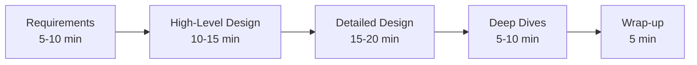
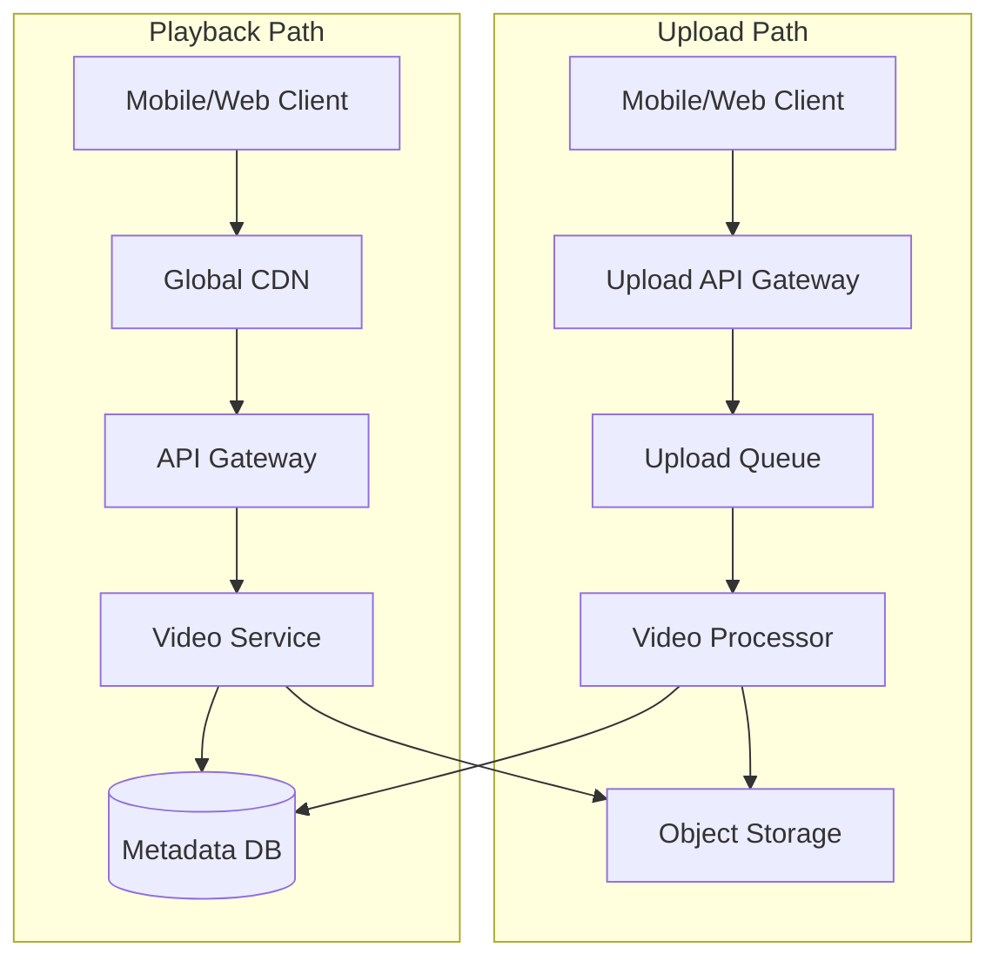
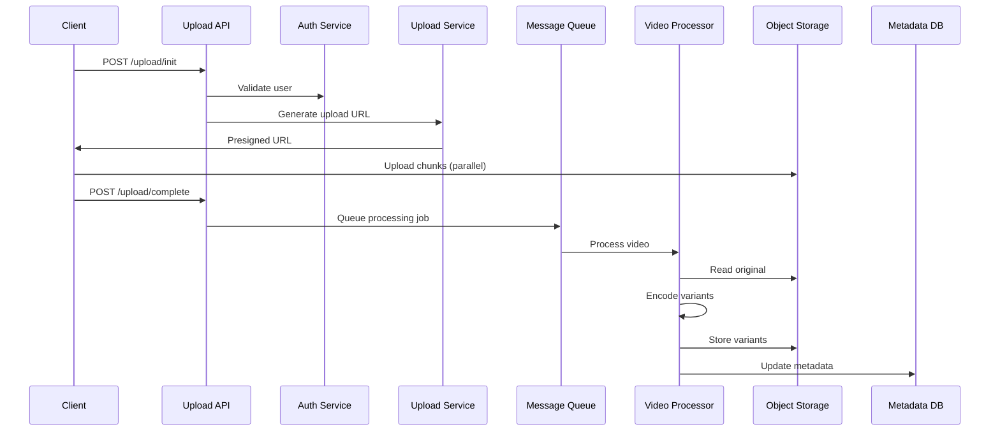
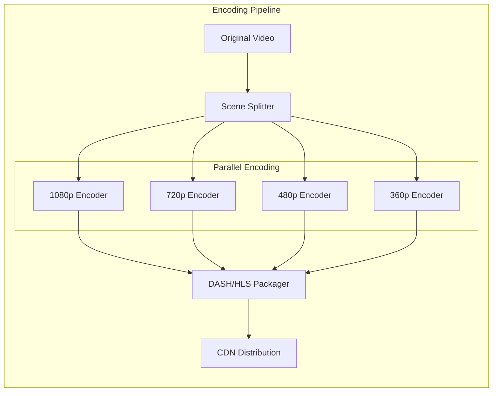
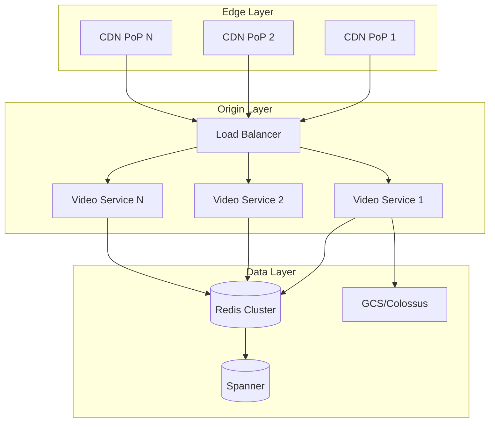
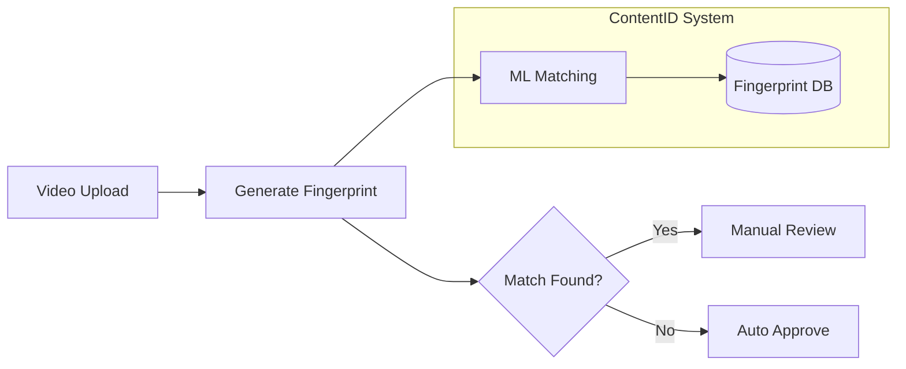

# YouTube System Design Walkthrough

## Overview

This walkthrough demonstrates a complete approach to designing YouTube in a Google system design interview, showing the thought process, questions to ask, and how to evolve the design based on requirements.

## Interview Timeline (45 minutes)



## Phase 1: Requirements Gathering (5-10 minutes)

### Initial Questions to Ask

**Functional Requirements:**
- "Should we support both video upload and playback?" → Yes
- "What video formats and resolutions?" → Multiple formats, adaptive streaming
- "Do we need features like comments, likes, subscriptions?" → Focus on core video platform
- "Live streaming?" → Not for this design, just VOD (Video on Demand)
- "Video recommendations?" → Yes, but not the main focus

**Non-Functional Requirements:**
- "What's the scale?" → 2 billion users, 1 billion hours watched daily
- "Geographic distribution?" → Global
- "Latency requirements?" → <200ms to start playback globally
- "Availability target?" → 99.95% for playback, 99.9% for upload
- "Storage requirements?" → 500 hours uploaded per minute

### Capacity Estimation

```
Upload Volume:
- 500 hours/minute = 30,000 hours/hour
- Average video: 10 minutes, 100MB (after compression)
- Daily uploads: 720,000 hours = 4.32M videos
- Daily storage: 4.32M × 100MB = 432TB/day
- Yearly storage: ~150PB raw (before encoding variants)

Playback Volume:
- 1 billion hours watched/day
- Average video: 10 minutes
- Videos served: 6B videos/day
- Peak QPS: 6B / 86400 × 3 (peak factor) = ~200K QPS

Bandwidth:
- Playback: 6B videos × 100MB = 600PB/day = ~56Gbps average
- Peak bandwidth: ~170Gbps
```

## Phase 2: High-Level Design (10-15 minutes)

### System Architecture



### Key Design Decisions

1. **Separate Upload and Playback Paths**
   - Different scaling requirements
   - Upload is write-heavy, playback is read-heavy
   - Can optimize independently

2. **Asynchronous Video Processing**
   - Upload returns immediately after receiving
   - Background processing for encoding
   - Better user experience

3. **CDN-First Architecture**
   - 90%+ requests served from edge
   - Reduces origin load
   - Better global latency

## Phase 3: Detailed Design (15-20 minutes)

### Upload Flow Deep Dive



### Video Processing Pipeline



### Playback Architecture



### Database Schema

```sql
-- Video metadata (stored in Spanner for global consistency)
CREATE TABLE videos (
    video_id STRING(36) NOT NULL,
    channel_id STRING(36) NOT NULL,
    title STRING(1000) NOT NULL,
    description TEXT,
    duration_seconds INT64,
    upload_timestamp TIMESTAMP,
    processing_status STRING(50),
    view_count INT64,
    storage_paths JSON,  -- {"1080p": "path1", "720p": "path2", ...}
    PRIMARY KEY (video_id),
    INDEX idx_channel (channel_id, upload_timestamp DESC)
);

-- View analytics (stored in Bigtable for scale)
-- Row key: video_id#reversed_timestamp
CREATE TABLE video_analytics (
    row_key STRING,
    views INT64,
    watch_time_seconds INT64,
    geography STRING,
    device_type STRING,
    -- Column families for time-series data
);
```

## Phase 4: Deep Dives (5-10 minutes)

### Scalability Considerations

1. **Video Storage Optimization**
   ```
   Storage Calculation:
   - Original: 100MB per video
   - Encoded variants: 4K(200MB) + 1080p(100MB) + 720p(50MB) + 480p(25MB) + 360p(15MB)
   - Total per video: ~490MB
   - Use erasure coding for 1.3x overhead instead of 3x replication
   - Effective storage: 490MB × 1.3 = 637MB per video
   ```

2. **CDN Strategy**
   ```mermaid
   graph TD
       subgraph "Hierarchical Caching"
           Edge[Edge PoPs<br/>10,000 locations]
           Regional[Regional Caches<br/>100 locations]
           Origin[Origin Data Centers<br/>10 locations]
       end
       
       Edge -->|Cache Miss| Regional
       Regional -->|Cache Miss| Origin
   ```

3. **Adaptive Bitrate Streaming**
   - DASH/HLS protocols for dynamic quality adjustment
   - Client monitors bandwidth and switches quality
   - Reduces buffering, improves experience

### Reliability Engineering

1. **Multi-Region Redundancy**
   ```mermaid
   graph LR
       subgraph "US Region"
           US_Primary[Primary Storage]
           US_Backup[Backup Storage]
       end
       
       subgraph "EU Region"
           EU_Primary[Primary Storage]
           EU_Backup[Backup Storage]
       end
       
       subgraph "APAC Region"
           APAC_Primary[Primary Storage]
           APAC_Backup[Backup Storage]
       end
       
       US_Primary -.->|Async Replication| EU_Backup
       US_Primary -.->|Async Replication| APAC_Backup
   ```

2. **Graceful Degradation**
   - Serve lower quality if high quality unavailable
   - Disable non-critical features (comments, recommendations)
   - Static fallback pages for extreme failures

### Performance Optimizations

1. **Predictive Caching**
   ```python
   def predict_next_videos(user_id, current_video_id):
# ML model predicts likely next videos
       predictions = ml_model.predict(user_id, current_video_id)
       
# Pre-warm CDN edge for top predictions
       for video_id, probability in predictions[:5]:
           if probability > 0.3:
               cdn.pre_warm(video_id, user_location)
   ```

2. **Chunked Encoding**
   - Split videos into 2-second chunks
   - Encode chunks in parallel
   - Start serving before full encoding completes

## Trade-off Discussions

### Consistency vs Availability

**Scenario**: View count updates

**Option 1**: Strong consistency (Spanner)
- Accurate counts globally
- Higher latency, lower throughput
- **Decision**: Use for creator analytics

**Option 2**: Eventual consistency (Bigtable + aggregation)
- High throughput, low latency
- Temporary inconsistencies
- **Decision**: Use for public view counts

### Storage vs Compute

**Scenario**: Video encoding strategy

**Option 1**: Pre-encode all qualities
- Fast playback start
- 5x storage cost
- **Decision**: Use for popular videos (>1000 views)

**Option 2**: On-demand encoding
- Minimal storage
- Slower first playback
- **Decision**: Use for long-tail content

## Common Follow-up Questions

### Q: How would you handle copyright detection?



### Q: How would you implement video recommendations?

Link to patterns:
- ML Pipeline Pattern (Coming Soon) for training
- [Caching Strategies](../../patterns/caching-strategies.md) for serving
- [Event-Driven Pattern](../../patterns/event-driven.md) for real-time updates

### Q: How do you handle viral videos?

1. **Auto-scaling**:
   - Monitor view velocity (views/minute)
   - Pre-scale when velocity > threshold
   - Geographic distribution prediction

2. **Caching Strategy**:
   - Promote to hot tier in all regions
   - Increase CDN retention time
   - Pre-encode all quality variants

## Key Takeaways

1. **Start with clear requirements** - Don't assume, always clarify scale
2. **Show methodology** - Capacity planning demonstrates analytical thinking
3. **Design for scale** - Every component should handle 10x growth
4. **Consider trade-offs** - No perfect solutions, only informed decisions
5. **Link to real patterns** - Show knowledge of proven solutions

## Related Resources

- [Event Sourcing Pattern](../../patterns/event-sourcing.md) - For analytics pipeline
- [Edge Computing Pattern](../../patterns/edge-computing.md) - For content delivery
- [Sharding Pattern](../../patterns/sharding.md) - For metadata storage
- [Google's Vitess Paper](https://vitess.io/docs/) - For YouTube's actual MySQL scaling