<!-- Navigation -->
[Home](../index.md) → [Part V: Human Factors](index.md) → **Chaos Engineering**

# Chaos Engineering

**Breaking things on purpose to build confidence**

## Core Principles

1. Build hypothesis around steady state
2. Vary real-world events
3. Run experiments in production
4. Automate experiments
5. Minimize blast radius

## Chaos Experiment Lifecycle

### 1. Steady State Definition

**Key metrics**: Success rate > 99.9%, p99 < 100ms, zero data loss
**Baseline**: Week of normal operation with documented variance

### 2. Hypothesis Formation


**Examples**:
- Payment service: 1 DB replica failure → <10ms p99 increase
- Recommendation API: 50% cache loss → <5% error increase
- Order system: Region failover → <30s recovery

### 3. Experiment Design

**Scope**: Blast radius, duration, severity, rollback plan
**Safety**: Auto-abort on SLO breach, kill switch, gradual rollout

## Chaos Experiments Catalog

### Infrastructure Chaos

**1. Instance Termination**


**Tests**: Auto-scaling, service discovery, health checks, resilience

**2. Network Partitions**


**Tests**: Quorum behavior, split-brain prevention, failover, retry logic

**3. Clock Skew**

```mermaid
graph TB
    subgraph "Clock Skew Effects"
        A[Normal Time] --> B[+5 min skew]
        B --> C{System Impact}
        
        C --> D[Certificate Validation]
        C --> E[Token Expiry]
        C --> F[Distributed Locks]
        C --> G[Log Ordering]
        
        D --> H[🔒 Auth Failures]
        E --> I[🚫 Access Denied]
        F --> J[⚠️ Deadlocks]
        G --> K[📋 Wrong Sequence]
    end
    
    style H fill:#ffcdd2
    style I fill:#ffcdd2
    style J fill:#fff3cd
    style K fill:#fff3cd
```


**Tests**: Time sync dependencies, cert/token handling, ordering, grace periods

**4. Resource Exhaustion**

```mermaid
flowchart TD
    subgraph "Resource Exhaustion Test"
        A[Check Available Space] --> B[Calculate Fill Amount]
        B --> C[Create Large File]
        C --> D[Monitor System]
        
        D --> E{Application Response}
        E --> F[Graceful Degradation ✓]
        E --> G[Crash/Hang ❌]
        E --> H[Alert Fired ✓]
        
        I[Cleanup After Test] --> J[Remove Chaos File]
    end
    
    style F fill:#c8e6c9
    style G fill:#ffcdd2
    style H fill:#e3f2fd
```


**Resource Exhaustion Test Matrix:**

| Resource | Test Method | Expected Behavior | Common Failures |
|----------|------------|------------------|------------------|
| **Disk** | Fill to 90% | Log rotation, cleanup | App crashes, no alerts |
| **Memory** | Allocate arrays | OOM killer, restart | Hung process |
| **CPU** | Spin loops | Throttling, queueing | Timeouts |
| **Network** | Bandwidth limit | Backpressure | Connection drops |

**Tests**: Degradation handling, alert effectiveness

### Application Chaos

**1. Latency Injection**

```mermaid
flowchart LR
    subgraph "Latency Injection Flow"
        A[Request Arrives] --> B{Random Check}
        B -->|10% chance| C[Add 1s Delay]
        B -->|90% chance| D[No Delay]
        
        C --> E[Process Request]
        D --> E
        
        E --> F{Client Behavior}
        F --> G[Timeout ⚠️]
        F --> H[Retry 🔄]
        F --> I[Success ✓]
    end
    
    style C fill:#fff3cd
    style G fill:#ffcdd2
    style I fill:#c8e6c9
```


**Latency Test Scenarios:**

| Delay | Percentage | Tests | Expected Outcome |
|-------|------------|-------|------------------|
| 100ms | 50% | Normal variance | No impact |
| 1s | 10% | Timeout handling | Some retries |
| 5s | 5% | Circuit breakers | Breaker opens |
| 30s | 1% | Dead detection | Failover triggered |

**Tests**: Timeout handling, circuit breakers

**2. Error Injection**


**Tests**: Retry logic, fallback mechanisms

**3. Data Corruption**
**Data Corruption Test Scenarios:**

| Corruption Type | Example | Tests | Detection Method |
|----------------|---------|-------|------------------|
| **Numeric Drift** | amount * 1.1 | Validation logic | Checksum/bounds |
| **Missing Fields** | Remove required field | Schema validation | Contract testing |
| **Type Changes** | String → Number | Parsing robustness | Type checking |
| **Encoding Issues** | UTF-8 → ASCII | Character handling | Encoding validation |

```mermaid
flowchart TD
    A[Valid Response] --> B{Corruption Type}
    B --> C[Numeric Changes]
    B --> D[Missing Fields]
    B --> E[Type Mutations]
    
    C --> F[Client Validation]
    D --> F
    E --> F
    
    F --> G{Detection?}
    G -->|Yes| H[✅ Caught Error]
    G -->|No| I[❌ Data Corrupted]
    
    style H fill:#c8e6c9
    style I fill:#ffcdd2
```



**Tests**: Validation effectiveness, error detection

**4. Rate Limiting**

```mermaid
flowchart TD
    subgraph "Rate Limit Testing"
        A[Request with Key] --> B[Check Counter]
        B --> C{Over Limit?}
        
        C -->|Yes| D[Reject Request]
        C -->|No| E[Increment Counter]
        
        D --> F[Return 429]
        E --> G[Process Request]
        
        F --> H{Client Response}
        H --> I[Backoff ✓]
        H --> J[Retry Storm ❌]
        H --> K[Circuit Break ✓]
    end
    
    style D fill:#ffcdd2
    style I fill:#c8e6c9
    style J fill:#ffcdd2
    style K fill:#c8e6c9
```


**Rate Limiting Test Matrix:**

| Limit | Window | Test Scenario | Expected Behavior |
|-------|--------|--------------|-------------------|
| 10/min | Fixed | Burst of 20 | 10 pass, 10 fail, retry after window |
| 100/hr | Sliding | Sustained load | Smooth throttling |
| 1000/day | Token | Spike traffic | Burst allowed, then throttle |

**Tests**: Backoff behavior, queue management

## GameDay Planning

### Pre-GameDay Checklist

**Pre-GameDay Checklist Status:**

| Item | Owner | Status | Notes |
|------|-------|--------|-------|
| Hypothesis documented | Tech Lead | ✅ | Clear failure scenario |
| Success criteria | SRE Team | ✅ | SLOs maintained |
| Monitoring ready | Ops | ✅ | Dashboards live |
| Abort procedures | All | ✅ | Kill switch tested |
| Roles assigned | Manager | ✅ | See role matrix |
| Comm plan | Comms Lead | ✅ | Templates ready |
| Support briefed | Support Mgr | ✅ | FAQs prepared |
| Rollback tested | Dev Team | ✅ | <30s recovery |
| Stakeholders informed | PM | ✅ | Email sent |
| Runbooks updated | SRE | ✅ | Latest version |

### GameDay Roles

**Game Master**: Runs experiment | **Observer**: Monitors metrics | **Communicator**: Updates stakeholders
**Fixer**: Ready to intervene | **Scribe**: Documents everything

### GameDay Timeline

```mermaid
gantt
    title GameDay Execution Timeline
    dateFormat HH:mm
    axisFormat %H:%M
    
    section Preparation
    Team Assembly           :prep1, 09:00, 15m
    Final Checks           :prep2, after prep1, 10m
    Monitor Verification   :prep3, after prep2, 5m
    
    section Execution
    Start Experiment       :exec1, 09:30, 5m
    Health Check 1        :exec2, after exec1, 5m
    Continue Decision     :exec3, after exec2, 5m
    Main Test Period      :exec4, after exec3, 15m
    
    section Wrap-up
    End Experiment        :wrap1, 10:00, 5m
    Initial Debrief       :wrap2, after wrap1, 10m
    Document Findings     :wrap3, after wrap2, 30m
    Publish Report       :wrap4, 11:30, 30m
    
    style exec1 fill:#ffcdd2
    style exec4 fill:#fff3cd
    style wrap4 fill:#c8e6c9
```

## Real GameDay Example

### Payment Service Region Failure

**Hypothesis**: Failover < 60s with zero transaction loss

**Results**: 47s failover ✓, 0 lost transactions ✓, 15% timeouts (connection pool issue)

**Fixes**: Larger connection pool warmup, pre-flight checks, faster health checks

## Chaos Maturity Model

**Level 1**: Dev only, manual, known failures
**Level 2**: Staging, some automation, weekly
**Level 3**: Production, automated, business hours
**Level 4**: Always-on, random, fully automated

## Chaos Engineering Tools

**Chaos Monkey**: AWS instances, mature, instance failures
**Gremlin**: Full infrastructure, commercial, enterprise
**Litmus**: Kubernetes, CNCF, container chaos
**Chaos Toolkit**: Extensible, growing, custom experiments

## Measuring Chaos Success

**Key Metrics**:
- Experiments run: 1/service/month
- Unknown issues discovered
- MTTR improvement
- Team confidence score
- Real incident reduction

### ROI Calculation

```mermaid
flowchart LR
    subgraph "Chaos Engineering ROI"
        subgraph "Investment (Annual)"
            A[Engineering Time<br/>$100k]
            B[Tools & Infra<br/>$20k]
            C[Total: $120k]
        end
        
        subgraph "Returns (Annual)"
            D[Prevented Outages<br/>5 × $200k = $1M]
            E[MTTR Reduction<br/>50% × $500k = $250k]
            F[Total: $1.25M]
        end
        
        C --> G[ROI Calculation]
        F --> G
        G --> H[940% ROI<br/>First Year]
    end
    
    style C fill:#ffcdd2
    style F fill:#c8e6c9
    style H fill:#ffd54f
```



**Chaos Engineering Value Metrics:**

| Metric | Before Chaos | After Chaos | Improvement |
|--------|--------------|-------------|-------------|
| **Outages/Year** | 12 | 7 | 42% reduction |
| **MTTR** | 4 hours | 2 hours | 50% faster |
| **Confidence Score** | 6/10 | 9/10 | 50% increase |
| **Unknown Failures** | 8 found in prod | 2 found in prod | 75% caught early |
| **Team Readiness** | Ad-hoc response | Practiced response | Measurable improvement |

## Best Practices

1. **Start Small**: Single service, known failures, test environment
2. **Automate Early**: Reproducible experiments, consistent results
3. **Communicate Well**: Clear hypotheses, share learnings
4. **Safety First**: Limit blast radius, test abort procedures
5. **Learn Always**: Document findings, update runbooks

## Common Pitfalls

1. **Too Much Too Soon**: Build confidence gradually
2. **Poor Communication**: Announce experiments, share results
3. **No Learning**: Fix findings, track improvements
4. **Production Cowboy**: Always have safety measures

## Key Takeaways

- Chaos finds unknown unknowns
- Production testing reveals real issues
- Small experiments minimize risk
- Automation enables scale
- Culture of learning from failure is essential

**Remember**: Discover weaknesses before they break in production.
