<!-- Navigation -->
[Home](../index.md) → [Part V: Human Factors](index.md) → **Chaos Engineering**

# Chaos Engineering

**Breaking things on purpose to build confidence**

## Chaos Engineering Principles

1. Build hypothesis around steady state
2. Vary real-world events
3. Run experiments in production
4. Automate experiments
5. Minimize blast radius

Not random destruction, but scientific discovery.

## Chaos Experiment Lifecycle

### 1. Steady State Definition

Key metrics that define "working":
- Success rate > 99.9%
- p99 latency < 100ms
- Zero data loss
- No customer complaints

Baseline measurement:
- Week of normal operation
- Capture variance
- Document assumptions

### 2. Hypothesis Formation


Examples:
- "Payment service can tolerate 1 database replica failure with <10ms p99 latency increase"
- "Recommendation API can lose 50% of cache nodes with <5% error rate increase"
- "Order system can handle primary region failure with <30 second recovery time"

### 3. Experiment Design

**Scope:**
- Blast radius (% of traffic/users affected)
- Duration (how long to run)
- Severity (partial vs complete failure)
- Rollback plan (how to stop)

**Safety mechanisms:**
- Automatic abort on SLO breach
- Manual kill switch
- Gradual rollout
- Business hours only (initially)

## Chaos Experiments Catalog

### Infrastructure Chaos

**1. Instance Termination**


**What This Tests:**
- Auto-scaling responsiveness
- Service discovery updates
- Load balancer health checks
- Application resilience

Tests: Auto-scaling, service discovery

**2. Network Partitions**


**What This Tests:**
- Quorum-based systems behavior
- Split-brain prevention
- Failover mechanisms
- Client retry logic

Tests: Quorum logic, split-brain handling

**3. Clock Skew**

```mermaid
graph TB
    subgraph "Clock Skew Effects"
        A[Normal Time] --> B[+5 min skew]
        B --> C{System Impact}
        
        C --> D[Certificate Validation]
        C --> E[Token Expiry]
        C --> F[Distributed Locks]
        C --> G[Log Ordering]
        
        D --> H[🔒 Auth Failures]
        E --> I[🚫 Access Denied]
        F --> J[⚠️ Deadlocks]
        G --> K[📋 Wrong Sequence]
    end
    
    style H fill:#ffcdd2
    style I fill:#ffcdd2
    style J fill:#fff3cd
    style K fill:#fff3cd
```


**What This Tests:**
- Time synchronization dependencies
- Certificate and token handling
- Ordering assumptions
- Grace period implementations

Tests: Time-dependent logic, ordering

**4. Resource Exhaustion**

```mermaid
flowchart TD
    subgraph "Resource Exhaustion Test"
        A[Check Available Space] --> B[Calculate Fill Amount]
        B --> C[Create Large File]
        C --> D[Monitor System]
        
        D --> E{Application Response}
        E --> F[Graceful Degradation ✓]
        E --> G[Crash/Hang ❌]
        E --> H[Alert Fired ✓]
        
        I[Cleanup After Test] --> J[Remove Chaos File]
    end
    
    style F fill:#c8e6c9
    style G fill:#ffcdd2
    style H fill:#e3f2fd
```


**Resource Exhaustion Test Matrix:**

| Resource | Test Method | Expected Behavior | Common Failures |
|----------|------------|------------------|------------------|
| **Disk** | Fill to 90% | Log rotation, cleanup | App crashes, no alerts |
| **Memory** | Allocate arrays | OOM killer, restart | Hung process |
| **CPU** | Spin loops | Throttling, queueing | Timeouts |
| **Network** | Bandwidth limit | Backpressure | Connection drops |

Tests: Degradation handling, alerts

### Application Chaos

**1. Latency Injection**

```mermaid
flowchart LR
    subgraph "Latency Injection Flow"
        A[Request Arrives] --> B{Random Check}
        B -->|10% chance| C[Add 1s Delay]
        B -->|90% chance| D[No Delay]
        
        C --> E[Process Request]
        D --> E
        
        E --> F{Client Behavior}
        F --> G[Timeout ⚠️]
        F --> H[Retry 🔄]
        F --> I[Success ✓]
    end
    
    style C fill:#fff3cd
    style G fill:#ffcdd2
    style I fill:#c8e6c9
```


**Latency Test Scenarios:**

| Delay | Percentage | Tests | Expected Outcome |
|-------|------------|-------|------------------|
| 100ms | 50% | Normal variance | No impact |
| 1s | 10% | Timeout handling | Some retries |
| 5s | 5% | Circuit breakers | Breaker opens |
| 30s | 1% | Dead detection | Failover triggered |

Tests: Timeout handling, circuit breakers

**2. Error Injection**


Tests: Retry logic, fallbacks

**3. Data Corruption**
**Data Corruption Test Scenarios:**

| Corruption Type | Example | Tests | Detection Method |
|----------------|---------|-------|------------------|
| **Numeric Drift** | amount * 1.1 | Validation logic | Checksum/bounds |
| **Missing Fields** | Remove required field | Schema validation | Contract testing |
| **Type Changes** | String → Number | Parsing robustness | Type checking |
| **Encoding Issues** | UTF-8 → ASCII | Character handling | Encoding validation |

```mermaid
flowchart TD
    A[Valid Response] --> B{Corruption Type}
    B --> C[Numeric Changes]
    B --> D[Missing Fields]
    B --> E[Type Mutations]
    
    C --> F[Client Validation]
    D --> F
    E --> F
    
    F --> G{Detection?}
    G -->|Yes| H[✅ Caught Error]
    G -->|No| I[❌ Data Corrupted]
    
    style H fill:#c8e6c9
    style I fill:#ffcdd2
```



Tests: Validation, error detection

**4. Rate Limiting**

```mermaid
flowchart TD
    subgraph "Rate Limit Testing"
        A[Request with Key] --> B[Check Counter]
        B --> C{Over Limit?}
        
        C -->|Yes| D[Reject Request]
        C -->|No| E[Increment Counter]
        
        D --> F[Return 429]
        E --> G[Process Request]
        
        F --> H{Client Response}
        H --> I[Backoff ✓]
        H --> J[Retry Storm ❌]
        H --> K[Circuit Break ✓]
    end
    
    style D fill:#ffcdd2
    style I fill:#c8e6c9
    style J fill:#ffcdd2
    style K fill:#c8e6c9
```


**Rate Limiting Test Matrix:**

| Limit | Window | Test Scenario | Expected Behavior |
|-------|--------|--------------|-------------------|
| 10/min | Fixed | Burst of 20 | 10 pass, 10 fail, retry after window |
| 100/hr | Sliding | Sustained load | Smooth throttling |
| 1000/day | Token | Spike traffic | Burst allowed, then throttle |

Tests: Backoff, queueing

## GameDay Planning

### Pre-GameDay Checklist

```mermaid
flowchart TD
    subgraph "GameDay Preparation Flow"
        A[Start Planning] --> B[Document Hypothesis]
        B --> C[Define Success Criteria]
        C --> D[Setup Monitoring]
        D --> E[Test Abort Procedures]
        E --> F[Assign Team Roles]
        F --> G[Create Comm Plan]
        G --> H[Brief Support Team]
        H --> I[Validate Rollback]
        I --> J[Inform Stakeholders]
        J --> K[Update Runbooks]
        K --> L{Ready?}
        L -->|No| M[Address Gaps]
        L -->|Yes| N[✅ Execute GameDay]
        M --> B
    end
    
    style N fill:#c8e6c9
    style M fill:#fff3cd
```



**Pre-GameDay Checklist Status:**

| Item | Owner | Status | Notes |
|------|-------|--------|-------|
| Hypothesis documented | Tech Lead | ✅ | Clear failure scenario |
| Success criteria | SRE Team | ✅ | SLOs maintained |
| Monitoring ready | Ops | ✅ | Dashboards live |
| Abort procedures | All | ✅ | Kill switch tested |
| Roles assigned | Manager | ✅ | See role matrix |
| Comm plan | Comms Lead | ✅ | Templates ready |
| Support briefed | Support Mgr | ✅ | FAQs prepared |
| Rollback tested | Dev Team | ✅ | <30s recovery |
| Stakeholders informed | PM | ✅ | Email sent |
| Runbooks updated | SRE | ✅ | Latest version |

### GameDay Roles

- **Game Master**: Runs the experiment
- **Observer**: Watches metrics
- **Communicator**: Updates stakeholders
- **Fixer**: Ready to intervene
- **Scribe**: Documents everything

### GameDay Timeline

```mermaid
gantt
    title GameDay Execution Timeline
    dateFormat HH:mm
    axisFormat %H:%M
    
    section Preparation
    Team Assembly           :prep1, 09:00, 15m
    Final Checks           :prep2, after prep1, 10m
    Monitor Verification   :prep3, after prep2, 5m
    
    section Execution
    Start Experiment       :exec1, 09:30, 5m
    Health Check 1        :exec2, after exec1, 5m
    Continue Decision     :exec3, after exec2, 5m
    Main Test Period      :exec4, after exec3, 15m
    
    section Wrap-up
    End Experiment        :wrap1, 10:00, 5m
    Initial Debrief       :wrap2, after wrap1, 10m
    Document Findings     :wrap3, after wrap2, 30m
    Publish Report       :wrap4, 11:30, 30m
    
    style exec1 fill:#ffcdd2
    style exec4 fill:#fff3cd
    style wrap4 fill:#c8e6c9
```

## Real GameDay Example

### Scenario: Payment Service Region Failure

**Hypothesis:**
"Payment service can failover to secondary region within 60 seconds with zero transaction loss"

**Experiment:**
1. Block all traffic to us-east-1
2. Monitor failover behavior
3. Verify no payments lost

**Results:**
- Failover time: 47 seconds ✓
- Transactions lost: 0 ✓
- Unexpected finding: 15% timeout errors
- Root cause: Connection pool size

**Improvements:**
- Increase connection pool warmup
- Add pre-flight checks
- Reduce health check interval

## Chaos Maturity Model

### Level 1: In Development
- Chaos in test environment only
- Manual experiments
- Known failures only
- Team-initiated

### Level 2: In Staging
- Staging environment chaos
- Some automation
- Broader failure modes
- Weekly schedule

### Level 3: In Production
- Production experiments
- Automated suite
- Business hours only
- Monthly GameDays

### Level 4: Continuous Chaos
- Always-on chaos
- Random scheduling
- Full automation
- Part of CI/CD

## Chaos Engineering Tools

### Tool Comparison

**Chaos Monkey (Netflix):**
- Scope: AWS instances
- Maturity: Very high
- Use case: Instance failures

**Gremlin:**
- Scope: Full infrastructure
- Maturity: Commercial product
- Use case: Enterprise chaos

**Litmus:**
- Scope: Kubernetes
- Maturity: CNCF project
- Use case: Container chaos

**Chaos Toolkit:**
- Scope: Extensible
- Maturity: Growing
- Use case: Custom experiments

## Measuring Chaos Success

### Metrics

1. **Experiments Run**
   - Target: 1 per service per month

2. **Issues Discovered**
   - Track: Unknown failure modes found

3. **MTTR Improvement**
   - Before/after chaos findings

4. **Confidence Score**
   - Team survey on system reliability

5. **Incident Reduction**
   - Correlation with real incidents

### ROI Calculation

```mermaid
flowchart LR
    subgraph "Chaos Engineering ROI"
        subgraph "Investment (Annual)"
            A[Engineering Time<br/>$100k]
            B[Tools & Infra<br/>$20k]
            C[Total: $120k]
        end
        
        subgraph "Returns (Annual)"
            D[Prevented Outages<br/>5 × $200k = $1M]
            E[MTTR Reduction<br/>50% × $500k = $250k]
            F[Total: $1.25M]
        end
        
        C --> G[ROI Calculation]
        F --> G
        G --> H[940% ROI<br/>First Year]
    end
    
    style C fill:#ffcdd2
    style F fill:#c8e6c9
    style H fill:#ffd54f
```



**Chaos Engineering Value Metrics:**

| Metric | Before Chaos | After Chaos | Improvement |
|--------|--------------|-------------|-------------|
| **Outages/Year** | 12 | 7 | 42% reduction |
| **MTTR** | 4 hours | 2 hours | 50% faster |
| **Confidence Score** | 6/10 | 9/10 | 50% increase |
| **Unknown Failures** | 8 found in prod | 2 found in prod | 75% caught early |
| **Team Readiness** | Ad-hoc response | Practiced response | Measurable improvement |

## Best Practices

1. **Start Small**
   - Single service
   - Known failures
   - Test environment
   - Build confidence

2. **Automate Early**
   - Reproducible experiments
   - Consistent results
   - Reduced toil

3. **Communicate Well**
   - Clear hypotheses
   - Regular updates
   - Share learnings
   - Celebrate findings

4. **Safety First**
   - Blast radius limits
   - Abort procedures
   - Monitoring ready
   - Rollback tested

5. **Learn Always**
   - Document everything
   - Share findings
   - Update runbooks
   - Improve systems

## Common Pitfalls

1. **Too Much Too Soon**
   - Start with small experiments
   - Build confidence gradually
   - Don't break everything day 1

2. **Poor Communication**
   - Surprise chaos = angry teammates
   - Always announce experiments
   - Share results widely

3. **No Learning**
   - Running chaos without fixing findings
   - Document and prioritize fixes
   - Track improvements

4. **Production Cowboy**
   - Chaos without safety measures
   - Always have abort procedures
   - Start in lower environments

## Key Takeaways

- **Chaos finds unknown unknowns** - You don't know what you don't know
- **Production is different** - Test where it matters
- **Small experiments** - Minimize blast radius
- **Automate everything** - Manual chaos doesn't scale
- **Culture matters** - Teams must embrace failure

Remember: The goal is not to break things, but to discover weaknesses before they break in production.
