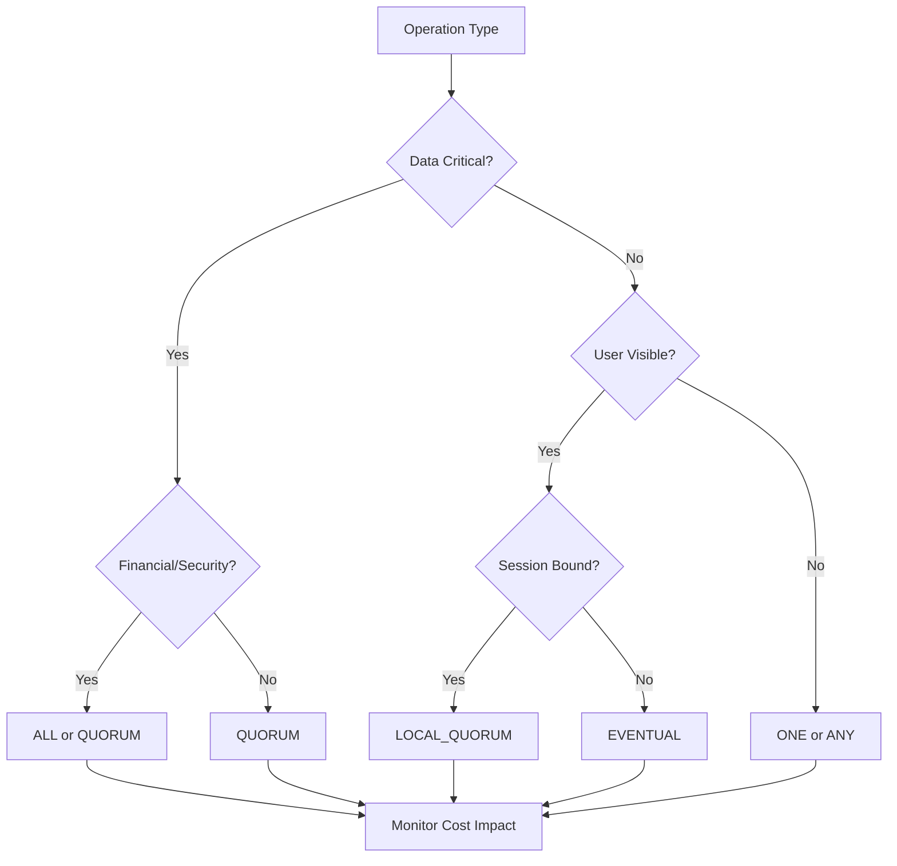
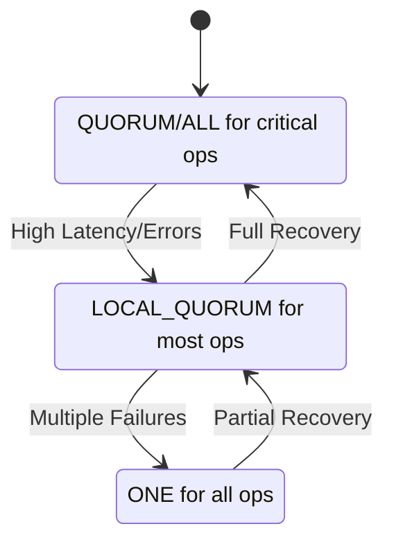

<!-- Navigation -->
[Home](../introduction/index.md) → [Part V: Human Factors](index.md) → **Consistency Tuning in Production**

# Consistency Tuning in Production

**The art of dialing consistency without breaking production**

## The Production Reality

Theory says "just set consistency level to QUORUM." Reality says "our p99 latency just tripled and we're losing $10k/minute."

Production is where theory meets:
- Real network latencies
- Actual failure rates
- Business requirements
- Cost constraints
- Human patience

## Consistency Tuning Framework

### Step 1: Map Operations to Requirements

```text
Operation Type         Consistency Need    Rationale
--------------        ----------------    ---------
User login            STRONG              Security critical
Password change       ALL                 Must replicate immediately
Shopping cart add     SESSION             User's view matters
Product browse        EVENTUAL            Can be stale
Analytics write       ANY                 Some loss OK
Payment processing    STRONG              Money matters
Inventory check       LOCAL_QUORUM        Regional accuracy OK
User preferences      EVENTUAL            Not critical
Audit logs           ALL                 Compliance required
```

### Step 2: Measure Current Impact

Baseline metrics per consistency level:

```bash
Operation: getUserProfile
LOCAL_ONE:    p50=5ms,   p99=15ms,   success=99.9%
LOCAL_QUORUM: p50=12ms,  p99=40ms,   success=99.7%
QUORUM:       p50=45ms,  p99=120ms,  success=99.5%
ALL:          p50=80ms,  p99=250ms,  success=98.9%

Business impact:
+10ms latency = -1% conversion rate = -$50k/day
```

### Step 3: Dynamic Tuning Strategy

```python
class ConsistencyManager:
    def select_consistency(self, operation, context):
        # User-based
        if context.user.is_premium:
            return upgrade_consistency(operation.default)

        # Time-based
        if is_peak_hours():
            return downgrade_consistency(operation.default)

        # Health-based
        if replica_lag > threshold:
            return LOCAL_ONE  # Degrade gracefully

        # SLO-based
        if error_budget_remaining < 10%:
            return strongest_available()

        return operation.default
```

Approach: Start conservative → Measure → Relax gradually → Monitor metrics → Rollback if needed

## Production Tuning Patterns

### 1. Read-Your-Writes Consistency

Problem: User updates profile, refresh shows old data

```python
# Solution
write_result = db.write(QUORUM, data)
session.last_write_timestamp = write_result.timestamp

# On subsequent read:
if session.last_write_timestamp:
    # Ensure we read from up-to-date replica
    consistency = LOCAL_QUORUM
    min_timestamp = session.last_write_timestamp
else:
    consistency = LOCAL_ONE
```

### 2. Gradual Consistency Degradation

```python
# Degradation ladder
async def read_with_degradation(key):
    strategies = [
        (ALL, 100),           # 100ms timeout
        (QUORUM, 200),        # 200ms timeout
        (LOCAL_QUORUM, 300),  # 300ms timeout
        (ONE, 500),           # 500ms timeout
    ]

    for consistency, timeout in strategies:
        try:
            return await read(key, consistency, timeout)
        except TimeoutError:
            continue

    # Last resort: return cached or default
    return get_cached_or_default(key)
```

Track degradation rate:
- Normal: <1% degraded reads
- Warning: 1-5% degraded
- Alert: >5% degraded

### 3. Consistency SLOs

Define per operation:
- Login: 99% strong consistency
- Cart: 95% session consistency
- Browse: 90% eventual consistency

```python
# Monitor compliance
consistency_slo_met = (
    strong_reads_succeeded / total_reads_attempted
)

if consistency_slo_met < target:
    page_oncall("Consistency SLO violation")
```

## Real-World Tuning Example

### E-commerce Platform Timeline

**Day 1: Launch with ALL writes, QUORUM reads**
- Latency: p99 = 200ms
- Errors: 0.5%
- Cost: $10k/day

**Day 7: Analyze patterns**
- 90% of reads are browsing (can be eventual)
- 5% are cart operations (need session)
- 5% are checkout (need strong)

**Day 14: Implement per-operation consistency**
- Browse: ONE (p99 = 20ms)
- Cart: LOCAL_QUORUM (p99 = 50ms)
- Checkout: QUORUM (p99 = 100ms)
- Latency: Overall p99 = 45ms
- Cost: $6k/day

**Day 30: Add dynamic tuning**
- Degrade during traffic spikes
- Upgrade for premium users
- Overall availability: 99.95%
- Cost: $5k/day

## Law Impact Analysis

Understanding how consistency tuning relates to our fundamental laws helps make better decisions:

| Law | Impact on Consistency Tuning | Key Considerations |
|-----|------------------------------|-------------------|
| **Law 2: Asynchronous Reality ⏳** | Higher consistency = higher latency | Balance consistency needs with latency SLOs. QUORUM adds network round trips. |
| **Law 4: Trade-offs ⚖️** | Stronger consistency consumes more resources | ALL writes can exhaust capacity during failures. Plan for degraded modes. |
| **Law 1: Failure ⛓️** | Consistency levels determine failure tolerance | LOCAL_ONE survives most failures but risks inconsistency. ALL fails if any node is down. |
| **Law 4: Trade-offs ⚖️** | Core law - defines data agreement guarantees | Choose appropriate levels per operation based on business requirements. |
| **Law 2: Asynchronous Reality ⏳** | Clock skew affects consistency guarantees | Last-write-wins resolution depends on synchronized clocks. |
| **Law 3: Emergence 🌪️** | Consistency levels affect operation ordering | Weaker consistency may see operations out of order. |
| **Law 5: Epistemology 🧠** | Nodes have incomplete knowledge | Consistency levels determine how much agreement before proceeding. |
| **Law 7: Economics 💰** | Scaling impacts consistency performance | More nodes = higher latency for QUORUM/ALL operations. |

## Consistency Decision Matrix

Use this matrix to choose the right consistency level:



## Trade-off Analysis Framework

| Consistency Level | Latency Impact | Availability | Consistency Guarantee | Cost | Use Case |
|-------------------|----------------|--------------|----------------------|------|----------|
| **ANY** | Lowest (5ms) | Highest (99.99%) | None - may not be durable | $ | Metrics, logs |
| **ONE** | Low (10ms) | Very High (99.9%) | At least one replica | $ | Caching, analytics |
| **LOCAL_ONE** | Low (10ms) | High (99.9%) | One replica in local DC | $ | Read-heavy workloads |
| **LOCAL_QUORUM** | Medium (25ms) | High (99.5%) | Majority in local DC | $$ | Regional operations |
| **QUORUM** | High (50ms) | Medium (99%) | Majority across all DCs | $$$ | Standard transactions |
| **ALL** | Highest (100ms+) | Lowest (95%) | All replicas agree | $$$$ | Critical operations |

## Monitoring Consistency

### Key Metrics

**1. Consistency Level Distribution**
- What % of operations at each level
- Trend over time
- Correlation with errors

**2. Consistency Violations**
- Read-your-write failures
- Stale read detection
- Out-of-order operations

**3. Business Impact**
- Conversion rate by consistency
- User complaints about stale data
- Revenue impact of degradation

**4. Infrastructure Cost**
- $/operation by consistency level
- Cross-region traffic costs
- Resource utilization

## Rollout Strategy

**Week 1: Shadow mode**
- Log what consistency would be used
- No actual changes
- Analyze impact

**Week 2: 1% experiment**
- Enable for 1% of traffic
- A/B test results
- Monitor all metrics

**Week 3: Regional rollout**
- Enable in lowest-traffic region
- Full monitoring
- Rollback plan ready

**Week 4: Global rollout**
- Gradual increase
- Watch for regional differences
- Tune based on results

## Consistency Tuning Decision Framework

### Operation Classification Matrix

| Operation Category | Example Operations | Default Level | Degraded Level | Business Impact of Inconsistency |
|-------------------|-------------------|---------------|----------------|----------------------------------|
| **Financial** | Payment processing, Balance updates | ALL | QUORUM | Revenue loss, compliance issues |
| **Authentication** | Login, Password change | QUORUM | LOCAL_QUORUM | Security breach, user lockout |
| **User Content** | Posts, Comments, Profile updates | QUORUM | LOCAL_ONE | User confusion, data loss perception |
| **Shopping Cart** | Add/Remove items | LOCAL_QUORUM | ONE | Mild frustration, recoverable |
| **Analytics** | Page views, Click tracking | ONE | ANY | Acceptable data loss (<1%) |
| **System Metrics** | Performance data, Logs | ANY | ANY | No user impact |

### Dynamic Consistency Strategy



## Common Pitfalls

### 1. Consistency Whiplash

Problem: Rapidly changing consistency levels
Impact: Cache thrashing, unpredictable behavior

```python
# Solution: Hysteresis
if current == QUORUM and load < 0.7:
    stay at QUORUM  # Don't thrash
elif current == ONE and load > 0.9:
    upgrade to QUORUM
```

### 2. Silent Degradation

Problem: System silently serves stale data
Impact: Business logic errors, user confusion

```python
# Solution: Make it visible
response.headers['X-Consistency-Level'] = actual_level
response.headers['X-Data-Freshness'] = staleness_ms
```

### 3. All-or-Nothing Thinking

Problem: "We need strong consistency everywhere"
Reality: 10% of operations need 90% of consistency

Solution: Data-driven decisions
- Measure actual requirements
- Test with real users
- Optimize the 90% case

## Best Practices

1. **Start Strong, Relax Gradually**
   - Begin with higher consistency
   - Measure impact
   - Selectively reduce

2. **Make Consistency Visible**
   - Log actual consistency achieved
   - Include in response headers
   - Track in metrics

3. **Test Degradation Paths**
   - Chaos engineering for consistency
   - Force degradation in staging
   - Verify business logic handles it

4. **Document Decisions**
   - Why each operation has its level
   - What happens during degradation
   - Business impact of changes

5. **Review Regularly**
   - Monthly consistency review
   - Correlate with incidents
   - Adjust based on data

## Key Takeaways

- **Production != Theory** - Real systems need pragmatic choices
- **One size doesn't fit all** - Different operations, different needs
- **Measure everything** - Data drives decisions
- **Gradual changes** - Big bang consistency changes break things
- **Business metrics matter** - Technical metrics aren't enough

Remember: The goal is not perfect consistency, but the right consistency for each use case at the right cost.
