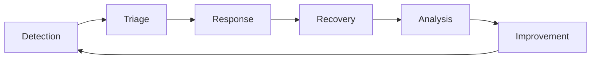

<!-- Navigation -->
[Home](../index.md) → [Part V: Human Factors](index.md) → **Incident Response**

# Incident Response

**Coordinated action when systems fail**

> *"The best incident response is like a well-rehearsed fire drill—everyone knows their role."*

---

## What is Incident Response?

Incident response is the organized approach to addressing and managing the aftermath of a security breach or system failure. The goal is to handle the situation in a way that limits damage and reduces recovery time and costs.

## Incident Severity Levels

| Level | Definition | Response Time | Example |
|-------|------------|---------------|---------|
| **SEV-1** | Critical business impact | < 15 minutes | Complete outage, data loss |
| **SEV-2** | Major functionality impaired | < 30 minutes | Core features down |
| **SEV-3** | Minor functionality impaired | < 2 hours | Non-critical features affected |
| **SEV-4** | Minimal impact | < 24 hours | Cosmetic issues |

## Incident Response Lifecycle



## Key Roles

### 1. Incident Commander (IC)
- Overall incident coordination
- Decision making authority
- External communication
- Not necessarily technical lead

### 2. Technical Lead
- Technical investigation
- Solution implementation
- Coordinate engineering response

### 3. Communications Lead
- Status page updates
- Customer communication
- Internal updates

### 4. Scribe
- Document timeline
- Track decisions
- Record action items

## Response Procedures

### Initial Response Checklist
```python
class IncidentResponseChecklist:
    def __init__(self):
        self.checklist = [
            "Acknowledge incident",
            "Assess severity",
            "Assemble response team",
            "Create incident channel/bridge",
            "Begin investigation",
            "Communicate status",
            "Implement fixes",
            "Verify resolution",
            "Document timeline",
            "Schedule postmortem"
        ]

    def validate_response(self, incident):
        completed = []
        missing = []

        for item in self.checklist:
            if self.is_completed(incident, item):
                completed.append(item)
            else:
                missing.append(item)

        return {
            'completed': completed,
            'missing': missing,
            'compliance': len(completed) / len(self.checklist)
        }
```

### Communication Templates

#### Initial Customer Communication
```text
We are currently investigating reports of [service] issues.
Our team is actively working on the problem.

Affected services: [list]
Impact: [description]

Next update in: 30 minutes
Status page: [link]
```

#### Update Communication
```text
Update on [service] incident:

Current status: [Investigating/Identified/Monitoring]
Progress: [what has been done]
Current impact: [updated impact]

Next update in: [timeframe]
```

#### Resolution Communication
```yaml
The [service] incident has been resolved.

Duration: [start time] - [end time]
Root cause: [brief explanation]
Actions taken: [summary]

A detailed postmortem will follow.
Thank you for your patience.
```

## Incident Response Automation

```python
class IncidentAutomation:
    def __init__(self):
        self.pagerduty = PagerDutyClient()
        self.slack = SlackClient()
        self.statuspage = StatusPageClient()

    def create_incident(self, alert):
        # Create PagerDuty incident
        incident = self.pagerduty.create_incident({
            'title': alert.title,
            'service': alert.service,
            'urgency': self.calculate_urgency(alert)
        })

        # Create Slack channel
        channel = self.slack.create_channel(
            f"incident-{incident.id}",
            purpose=f"Response for: {alert.title}"
        )

        # Invite on-call team
        oncall = self.pagerduty.get_oncall(alert.service)
        self.slack.invite_users(channel, oncall)

        # Post initial message
        self.slack.post_message(channel, self.format_incident_message(incident))

        # Update status page
        self.statuspage.create_incident({
            'name': alert.title,
            'status': 'investigating',
            'impact': self.determine_impact(alert)
        })

        return incident
```

## On-Call Best Practices

### 1. On-Call Rotation
```yaml
on_call_schedule:
  rotation_period: 1_week
  team_size: 6
  shifts:
    primary:
      start: Monday 9:00
      duration: 168h
    secondary:
      start: Monday 9:00
      duration: 168h
  handoff_process:
    - Review open incidents
    - Discuss recent issues
    - Update documentation
    - Confirm contact info
```

### 2. On-Call Kit
- Laptop with VPN access
- Phone with PagerDuty app
- Access to all critical systems
- Runbook repository access
- Emergency contact list

### 3. Escalation Policies
```python
class EscalationPolicy:
    def __init__(self):
        self.levels = [
            {
                'timeout': 5,  # minutes
                'targets': ['primary_oncall']
            },
            {
                'timeout': 10,
                'targets': ['secondary_oncall', 'team_lead']
            },
            {
                'timeout': 15,
                'targets': ['director', 'vp_engineering']
            }
        ]

    def get_escalation_targets(self, incident_age_minutes):
        targets = []
        for level in self.levels:
            if incident_age_minutes >= level['timeout']:
                targets.extend(level['targets'])
        return list(set(targets))
```

## Runbook Structure

```markdown
# Service Name Runbook

## Service Overview
- Purpose: What does this service do?
- Dependencies: What does it depend on?
- Impact: What happens when it fails?

## Key Metrics
- Dashboard: [link]
- Key metrics to monitor:
  - Request rate
  - Error rate
  - Latency (p50, p95, p99)

## Common Issues

### Issue 1: High Memory Usage
**Symptoms**: Memory alerts, OOM kills
**Diagnosis**: Check memory metrics, heap dumps
**Resolution**:
1. Restart service (immediate relief)
2. Investigate memory leak
3. Scale horizontally if needed

### Issue 2: Database Connection Exhaustion
**Symptoms**: Connection timeout errors
**Diagnosis**: Check connection pool metrics
**Resolution**:
1. Kill idle connections
2. Increase connection limit
3. Investigate connection leak

## Emergency Procedures

### Rollback
```bash
# Get previous version
kubectl rollout history deployment/service-name

# Rollback to previous
kubectl rollout undo deployment/service-name

# Rollback to specific version
kubectl rollout undo deployment/service-name --to-revision=2
```bash
### Emergency Scale
```bash
# Scale up immediately
kubectl scale deployment/service-name --replicas=10

# Auto-scale based on CPU
kubectl autoscale deployment/service-name --cpu-percent=50 --min=5 --max=20
```text
```

## Incident Metrics

### Key Performance Indicators
- **MTTA** (Mean Time To Acknowledge)
- **MTTD** (Mean Time To Detect)
- **MTTR** (Mean Time To Resolve)
- **MTTF** (Mean Time To Failure)

### Tracking and Improvement
```python
class IncidentMetrics:
    def calculate_mttr(self, incidents):
        total_time = sum(
            (inc.resolved_at - inc.started_at).total_seconds()
            for inc in incidents
        )
        return total_time / len(incidents) / 60  # minutes

    def calculate_mtta(self, incidents):
        total_time = sum(
            (inc.acknowledged_at - inc.triggered_at).total_seconds()
            for inc in incidents
        )
        return total_time / len(incidents) / 60  # minutes

    def generate_report(self, incidents):
        return {
            'total_incidents': len(incidents),
            'mttr_minutes': self.calculate_mttr(incidents),
            'mtta_minutes': self.calculate_mtta(incidents),
            'by_severity': self.group_by_severity(incidents),
            'by_service': self.group_by_service(incidents),
            'repeat_incidents': self.find_repeat_incidents(incidents)
        }
```

## Learning and Improvement

1. **Regular Drills**: Practice incident response quarterly
2. **Runbook Reviews**: Update runbooks after each incident
3. **Tool Training**: Ensure everyone knows the tools
4. **Postmortem Culture**: Learn from every incident
5. **Metrics Review**: Monthly review of incident metrics

---

---

*"Smooth seas never made a skilled sailor—incidents make experienced engineers."*
