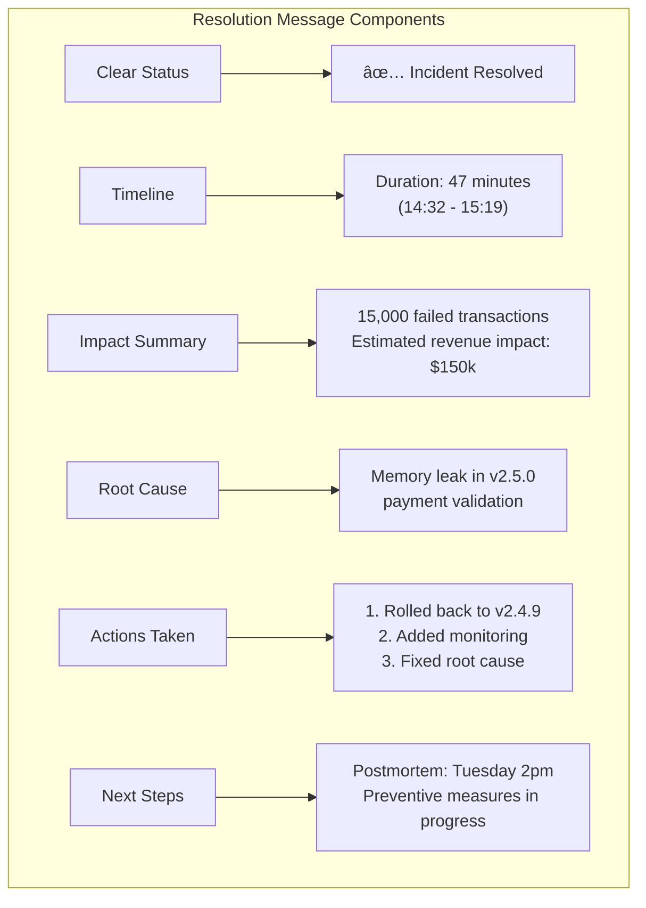

<!-- Navigation -->
[Home](../introduction/index.md) → [Part V: Human Factors](index.md) → **Incident Response**

# Incident Response

**Coordinated action when systems fail - designed for Law 6: Human-API under stress**

> *"The best incident response works when cognitive capacity drops 80% under stress—simple, clear, practiced."*

---

## What is Incident Response? (Law 6 Context)

Organized approach to managing failures when human cognitive capacity is severely reduced by stress. Goal: provide simple, clear procedures that work within the 7±2 cognitive limit even when operators are at 20% mental capacity.

## Incident Severity Levels

| Level | Definition | Response Time | Example |
|-------|------------|---------------|---------|
| **SEV-1** | Critical business impact | < 15 minutes | Complete outage, data loss |
| **SEV-2** | Major functionality impaired | < 30 minutes | Core features down |
| **SEV-3** | Minor functionality impaired | < 2 hours | Non-critical features affected |
| **SEV-4** | Minimal impact | < 24 hours | Cosmetic issues |

## Incident Response Lifecycle (Cognitive Load Aware)

```mermaid
flowchart LR
    subgraph "Incident Response Lifecycle - Law 6 Optimized"
        A[Detection<br/>👀<br/>(Clear signals)] --> B[Triage<br/>🔍<br/>(Simple decision tree)]
        B --> C[Response<br/>🔨<br/>(Practiced actions)] --> D[Recovery<br/>✅<br/>(Verification steps)]
        D --> E[Analysis<br/>📊<br/>(When calm)] --> F[Improvement<br/>📝<br/>(Update runbooks)]
        F -.-> A
    end
    
    subgraph "Cognitive Load at Each Stage"
        CL1[High stress<br/>20% capacity] --> A
        CL1 --> B
        CL2[Moderate stress<br/>40% capacity] --> C
        CL2 --> D
        CL3[Low stress<br/>80% capacity] --> E
        CL3 --> F
    end
    
    style A fill:#ffebee
    style B fill:#fff3cd
    style C fill:#e3f2fd
    style D fill:#c8e6c9
    style E fill:#f3e5f5
    style F fill:#e0f2f1
```

## Key Roles (Law 6: Human-API Distribution)

### 1. Incident Commander (IC) - Managing Attention
- Overall coordination (max 7±2 active concerns)
- Decision authority (reduces cognitive burden on others)
- External communication (single voice principle)
- NOT debugging (preserves cognitive capacity for coordination)

### 2. Technical Lead
- Investigation
- Solution implementation
- Engineering coordination

### 3. Communications Lead
- Status updates
- Customer communication
- Internal updates

### 4. Scribe
- Document timeline
- Track decisions
- Record actions

## Response Procedures

### Initial Response Checklist


**Response Checklist by Phase:**

| Phase | Task | Target Time | Owner |
|-------|------|-------------|-------|
| **Detection** | Acknowledge alert | < 5 minutes | On-call |
| **Triage** | Assess severity | < 10 minutes | On-call |
| **Assembly** | Form response team | < 15 minutes | IC |
| **Communication** | First customer update | < 30 minutes | Comms |
| **Investigation** | Root cause analysis | Ongoing | Tech Lead |
| **Resolution** | Deploy fix | ASAP | Dev Team |
| **Verification** | Confirm fixed | +15 minutes | QA/Ops |
| **Documentation** | Timeline complete | +2 hours | Scribe |

### Communication Templates

#### Initial Customer Communication
**Communication Templates:**


| Template | When to Use | Key Elements | Tone |
|----------|-------------|--------------|------|  
| **Initial** | First 30 min | Impact, investigating, next update | Acknowledge concern |
| **Update** | Every 30-60 min | Progress, current state, ETA | Transparent |
| **Resolution** | When fixed | Duration, cause, prevention | Apologetic, forward-looking |
| **RCA** | Within 48hr | Deep dive, lessons, improvements | Technical, honest |

#### Update Communication
**Status Update Framework:**

| Status | Meaning | Customer Message | Internal Actions |
|--------|---------|-----------------|------------------|
| **Investigating** | Cause unknown | "We're investigating the issue" | All hands debugging |
| **Identified** | Cause found | "We've identified the problem" | Working on fix |
| **Monitoring** | Fix deployed | "A fix has been implemented" | Watching metrics |
| **Resolved** | Confirmed fixed | "The issue has been resolved" | Start postmortem |

#### Resolution Communication
**Resolution Communication Guide:**



## Incident Response Automation


**Automation Benefits:**

| Task | Manual Time | Automated Time | Time Saved |
|------|-------------|----------------|------------|
| Create incident | 5 minutes | 5 seconds | 98% |
| Assemble team | 10 minutes | 30 seconds | 95% |
| Initial comms | 15 minutes | 1 minute | 93% |
| Status page | 5 minutes | Instant | 100% |
| **Total** | **35 minutes** | **< 2 minutes** | **94%** |

## On-Call Best Practices

### 1. On-Call Rotation


**Best Practices:**
- **6+ person rotation**: Max 1 week/month
- **Primary + Secondary**: Backup coverage
- **Weekday handoffs**: Monday 9am
- **Compensation**: Time off or pay
- **Documentation**: Handoff checklist

### 2. On-Call Kit
- Laptop + VPN
- Phone + PagerDuty
- System access
- Runbooks
- Emergency contacts

### 3. Escalation Policies


**Escalation Matrix:**

| Time | Level | Who Gets Paged | Expected Action |
|------|-------|----------------|------------------|
| 0-5 min | L1 | Primary on-call | Acknowledge & respond |
| 5-10 min | L2 | Secondary + Lead | Assist or take over |
| 10-15 min | L3 | Director + VP | Resource allocation |
| 15+ min | L4 | C-Suite | Business decisions |

## Runbook Structure

```markdown
# Service Name Runbook

## Service Overview
- Purpose: What does this service do?
- Dependencies: What does it depend on?
- Impact: What happens when it fails?

## Key Metrics
- Dashboard: [link]
- Key metrics to monitor:
  - Request rate
  - Error rate
  - Latency (p50, p95, p99)

## Common Issues (Pre-computed Solutions for Stressed Minds)

### Issue 1: High Memory Usage
**Symptoms** (Recognition cues): Memory alerts, OOM kills, slow responses
**Diagnosis** (Simple steps): 
- Check dashboard link #1
- Look for red memory graph
**Resolution** (Copy-paste ready):
```bash
# Step 1: Immediate relief (do this first)
kubectl rollout restart deployment/service-name

# Step 2: If persists (after 5 min)
kubectl scale deployment/service-name --replicas=+2

# Step 3: Investigate later (when calm)
# Memory leak analysis runbook: [link]
```

### Issue 2: Database Connection Exhaustion  
**Symptoms** (Recognition cues): "connection refused", timeout errors
**Diagnosis** (Simple check):
- Dashboard link #2 
- Connection count > 90%
**Resolution** (Copy-paste ready):
```sql
-- Step 1: Kill idle connections
SELECT pg_terminate_backend(pid) 
FROM pg_stat_activity 
WHERE state = 'idle' AND state_change < NOW() - INTERVAL '10 minutes';

-- Step 2: Emergency increase
ALTER SYSTEM SET max_connections = 500;
SELECT pg_reload_conf();
```

## Emergency Procedures

### Rollback
```bash
# Get previous version
kubectl rollout history deployment/service-name

# Rollback to previous
kubectl rollout undo deployment/service-name

# Rollback to specific version
kubectl rollout undo deployment/service-name --to-revision=2
```bash
### Emergency Scale
```bash
# Scale up immediately
kubectl scale deployment/service-name --replicas=10

# Auto-scale based on CPU
kubectl autoscale deployment/service-name --cpu-percent=50 --min=5 --max=20
```text
```

## Law Impact Analysis

How incident response connects to fundamental distributed systems laws:

| Law | Impact on Incident Response | Strategic Considerations |
|-----|----------------------------|-------------------------|
| **Law 2: Asynchronous Reality ⏱️** | Detection and response time critical | Minimize alert latency, optimize communication channels, pre-position resources |
| **Law 4: Trade-offs 📊** | Incidents often triggered by capacity limits | Plan for degraded modes, have scaling runbooks ready, monitor resource usage |
| **Law 1: Failure ⛓️** | Core trigger for incident response | Build resilient systems, plan for failure scenarios, practice recovery |
| **Law 4: Trade-offs 🔐** | Inconsistencies complicate debugging | Include consistency checks in runbooks, understand trade-offs during incidents |
| **Law 5: Epistemology 🧠** | Incomplete info hampers response | Invest in observability, maintain up-to-date documentation, share knowledge |
| **Law 6: Human-API 🤯** | Stress reduces capacity by 80% | Simple runbooks, clear roles, practiced procedures, cognitive offload tools |
| **Law 5: Epistemology 🤝** | Coordination failures extend incidents | Clear ownership, defined handoffs, single communication channel |
| **Law 7: Economics 💰** | Scale triggers new incident patterns | Plan for growth-related failures, update runbooks as systems evolve |

## Incident Response Decision Tree


## Incident Classification Framework

### Severity Assessment Matrix

| Criteria ↓ / Level → | SEV-1 (Critical) | SEV-2 (Major) | SEV-3 (Minor) | SEV-4 (Low) |
|---------------------|------------------|---------------|---------------|-------------|
| **Revenue Impact** | >$10k/minute | $1k-10k/minute | <$1k/minute | None |
| **User Impact** | All users affected | Many users (>10%) | Some users (<10%) | Few users |
| **Data Risk** | Data loss/corruption | Data at risk | Data delays | No risk |
| **Security** | Active breach | Vulnerability exposed | Potential issue | None |
| **Reputation** | Media attention | Social media noise | Customer complaints | Internal only |
| **Recovery Time** | >4 hours | 1-4 hours | <1 hour | <30 minutes |

### Response Requirements by Severity

```text
┌─────────────────────────────────────────────────────────────────┐
│ SEV-1: All Hands On Deck                                        │
├─────────────────────────────────────────────────────────────────┤
│ • Response Time: < 5 minutes                                    │
│ • War Room: Mandatory                                           │
│ • Updates: Every 15 minutes                                     │
│ • Leadership: VP notification                                   │
│ • Customer Comms: Immediate                                     │
└─────────────────────────────────────────────────────────────────┘

┌─────────────────────────────────────────────────────────────────┐
│ SEV-2: Rapid Response                                           │
├─────────────────────────────────────────────────────────────────┤
│ • Response Time: < 15 minutes                                   │
│ • War Room: As needed                                           │
│ • Updates: Every 30 minutes                                     │
│ • Leadership: Director notification                             │
│ • Customer Comms: Within 30 min                                 │
└─────────────────────────────────────────────────────────────────┘
```

## Incident Metrics

### Key Performance Indicators
- **MTTA** (Mean Time To Acknowledge)
- **MTTD** (Mean Time To Detect)
- **MTTR** (Mean Time To Resolve)
- **MTTF** (Mean Time To Failure)

### Tracking and Improvement


**Incident Metrics Dashboard:**

| Metric | Definition | Target | Current | Trend |
|--------|------------|--------|---------|-------|
| **MTTD** | Detection time | < 5 min | 3.2 min | ↓ 15% |
| **MTTA** | Acknowledge time | < 5 min | 4.1 min | ↓ 8% |
| **MTTR** | Resolution time | < 30 min | 28 min | ↓ 22% |
| **MTTF** | Between failures | > 720 hr | 892 hr | ↑ 18% |
| **Incidents/Month** | Total count | < 10 | 7 | ↓ 30% |

## Communication Strategy Matrix

### Stakeholder Communication Plan

| Stakeholder | SEV-1 | SEV-2 | SEV-3 | SEV-4 |
|-------------|-------|-------|-------|-------|
| **Customers** | Immediate status page | 30 min status update | If asked | No comms |
| **Support Team** | Immediate briefing | Alert + talking points | FYI notice | Wiki update |
| **Engineering** | All hands page | Team page | Slack notify | Ticket only |
| **Leadership** | CEO + VP alert | Director alert | Manager FYI | Weekly report |
| **Sales** | Account manager alert | If customer facing | No action | No action |

### Incident Timeline Tracking

```text
┌─────────────────────────────────────────────────────────────┐
│ Incident Timeline: Payment Service Outage                   │
├─────────────┬───────────────────────────────────────────────┤
│ Time        │ Event                                         │
├─────────────┼───────────────────────────────────────────────┤
│ 14:32:15    │ 🔴 First alert: High error rate (>5%)       │
│ 14:32:45    │ 🔔 PagerDuty triggered                       │
│ 14:33:12    │ ✅ On-call acknowledged                      │
│ 14:35:00    │ 🔍 Initial investigation started             │
│ 14:38:30    │ 🎯 Root cause identified: DB connection pool │
│ 14:40:00    │ 📢 Customer communication sent               │
│ 14:42:15    │ 🔧 Mitigation applied: Increased pool size   │
│ 14:45:00    │ 📊 Error rate dropping                       │
│ 14:48:00    │ ✅ Service recovered                          │
│ 14:55:00    │ 📝 All clear, monitoring continues           │
└─────────────┴───────────────────────────────────────────────┘
```

## Role Responsibility RACI Matrix

| Activity | Incident Commander | Tech Lead | Comms Lead | Scribe | On-call |
|----------|-------------------|-----------|------------|---------|----------|
| **Declare Incident** | A | C | I | I | R |
| **Assess Severity** | A | C | I | R | C |
| **Technical Investigation** | I | A | I | R | R |
| **Customer Updates** | A | I | R | C | I |
| **Execute Fixes** | A | R | I | I | C |
| **Status Updates** | R | C | A | R | I |
| **Document Timeline** | I | C | C | A | C |
| **Call Postmortem** | A | R | I | R | C |

*R = Responsible, A = Accountable, C = Consulted, I = Informed*

## Learning and Improvement

1. **Regular Drills**: Quarterly practice
2. **Runbook Reviews**: Update post-incident
3. **Tool Training**: Universal knowledge
4. **Postmortem Culture**: Learn from all
5. **Metrics Review**: Monthly analysis

---

---

*"Smooth seas never made a skilled sailor—incidents make experienced engineers."*
