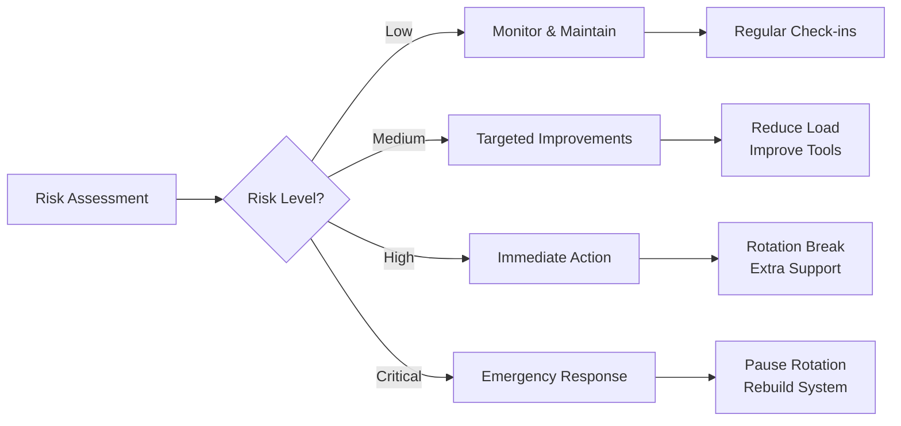

# On-Call Culture

**Building sustainable and effective on-call practices**

> *"On-call should be a responsibility, not a punishment."*

## Core Principles

1. **Shared Responsibility**: Those who build it, run it
2. **Sustainable Practices**: Fair rotations, compensation, recovery time
3. **Continuous Improvement**: Fix root causes, automate, retrospect

## Building Healthy On-Call Rotations

### Rotation Models

| Model | Description | Pros | Cons |
|-------|-------------|------|------|
| **Follow the Sun** | Geographically distributed | No night shifts | Requires global team |
| **Weekly Primary/Secondary** | Two engineers per week | Backup available | Two people impacted |
| **Daily Rotation** | Different person each day | Minimal impact | More handoffs |
| **Team-based** | Entire team shares | Shared knowledge | Can impact whole team |

### Optimal Rotation Size

**Formula**: `(incidents/week ÷ max_per_person) × 1.15 (vacation) × 1.25 (burnout) = team size`
**Minimum**: 4 people for viable rotation

## On-Call Compensation

**Common Models**:
1. **Time-based**: Flat rate (weekday/weekend/holiday differentiated)
2. **Incident-based**: Base + per-incident + severity multiplier
3. **Time Off**: Comp time for weekends/holidays, flex after incidents

### Example Compensation Structure
```yaml
on_call_compensation:
  base_rates:
    weekday: $500/week
    weekend: $750/week
    holiday: $1000/week

  incident_rates:
    first_incident: $0  # Included in base
    additional_incidents: $100/each
    after_hours_incident: $150/each

  time_off:
    weekend_shift: 0.5 days comp time
    holiday_shift: 1.0 days comp time
    rough_shift: Additional day off # >3 incidents
```

## Alert Quality and Hygiene

### Alert Quality Metrics
```python
class AlertQualityTracker:
    def __init__(self):
        self.alerts = []

    def calculate_alert_quality(self):
        total_alerts = len(self.alerts)
        actionable = sum(1 for a in self.alerts if a.actionable)

        return {
            'total_alerts': total_alerts,
            'actionable_rate': actionable / total_alerts,
            'noise_rate': 1 - (actionable / total_alerts),
            'false_positive_rate': sum(1 for a in self.alerts if a.false_positive) / total_alerts,
            'duplicate_rate': self.calculate_duplicate_rate()
        }

    def identify_noisy_alerts(self, threshold=0.5):
        """Find alerts with high false positive rate"""
        alert_stats = {}

        for alert in self.alerts:
            name = alert.name
            if name not in alert_stats:
                alert_stats[name] = {'total': 0, 'false_positives': 0}

            alert_stats[name]['total'] += 1
            if alert.false_positive:
                alert_stats[name]['false_positives'] += 1

        noisy_alerts = []
        for name, stats in alert_stats.items():
            false_rate = stats['false_positives'] / stats['total']
            if false_rate > threshold:
                noisy_alerts.append({
                    'name': name,
                    'false_positive_rate': false_rate,
                    'total_alerts': stats['total']
                })

        return sorted(noisy_alerts, key=lambda x: x['false_positive_rate'], reverse=True)
```

### Alert Standards

```yaml
alert_standards:
  required_fields:
    - title: Clear description of the problem
    - severity: SEV-1 through SEV-4
    - service: Affected service name
    - runbook: Link to resolution steps
    - dashboard: Link to relevant metrics

  quality_criteria:
    - Actionable: Engineer can do something
    - Urgent: Requires immediate attention
    - User-impacting: Affects customers
    - Unique: Not duplicate of other alerts

  slo_based_alerting:
    - Alert on symptoms, not causes
    - Use error budgets
    - Multi-window alerts (short and long term)
```

## On-Call Tools and Automation

### Essential On-Call Toolkit
```python
class OnCallToolkit:
    """Standard tools for on-call engineers"""

    def __init__(self):
        self.tools = {
            'alerting': ['PagerDuty', 'Opsgenie', 'VictorOps'],
            'communication': ['Slack', 'Zoom', 'StatusPage'],
            'monitoring': ['Datadog', 'Grafana', 'New Relic'],
            'incident_mgmt': ['Jira', 'Linear', 'ServiceNow'],
            'documentation': ['Confluence', 'Notion', 'Wiki'],
            'automation': ['Rundeck', 'Ansible', 'Jenkins']
        }

    def setup_new_oncall(self, engineer):
        """Setup checklist for new on-call engineer"""
        checklist = [
            "PagerDuty account and app installed",
            "Added to on-call Slack channels",
            "VPN access configured",
            "Production access provisioned",
            "Runbook repository access",
            "Shadow current on-call",
            "Review recent incidents",
            "Participate in game day exercise"
        ]

        return {
            'engineer': engineer,
            'checklist': checklist,
            'tools_access': self.provision_access(engineer)
        }
```

### Automation Opportunities
```python
class OnCallAutomation:
    """Automate common on-call tasks"""

    def auto_diagnosis(self, alert):
        """Automatically gather diagnostic information"""
        diagnostics = {
            'alert_details': alert,
            'recent_deployments': self.get_recent_deployments(alert.service),
            'error_logs': self.get_error_logs(alert.service, minutes=30),
            'metrics_snapshot': self.capture_metrics(alert.service),
            'dependencies_health': self.check_dependencies(alert.service),
            'similar_incidents': self.find_similar_incidents(alert)
        }

        # Post to incident channel
        self.post_diagnostics(alert.incident_channel, diagnostics)

        # Suggest likely causes
        causes = self.analyze_diagnostics(diagnostics)
        return causes

    def auto_remediation(self, alert):
        """Attempt safe auto-remediation"""
        safe_remediations = {
            'high_memory': self.restart_service,
            'stuck_jobs': self.clear_job_queue,
            'connection_exhaustion': self.reset_connections,
            'disk_full': self.cleanup_old_logs
        }

        if alert.type in safe_remediations:
            try:
                result = safe_remediations[alert.type](alert.service)
                self.log_remediation(alert, result)
                return result
            except Exception as e:
                self.escalate_to_human(alert, str(e))
```

## Psychological Safety and Support

### Supporting On-Call Engineers

**Pre-Incident**: Clear runbooks, game days, shadowing, senior access
**During Incident**: No blame culture, escalation encouraged, clear authority
**Post-Incident**: Blameless postmortems, fix time, recognition, mental health support

### Preventing Burnout
```python
class BurnoutPrevention:
    def __init__(self):
        self.engineer_stats = {}

    def track_oncall_load(self, engineer, week):
        stats = self.engineer_stats.get(engineer, {})

        return {
            'incidents_this_week': stats.get('incidents', 0),
            'night_pages_this_month': stats.get('night_pages', 0),
            'consecutive_rough_weeks': stats.get('rough_weeks', 0),
            'time_since_last_break': stats.get('weeks_on', 0)
        }

    def recommend_action(self, engineer):
        load = self.track_oncall_load(engineer, current_week())

        if load['consecutive_rough_weeks'] >= 2:
            return "Skip next rotation"
        elif load['night_pages_this_month'] >= 5:
            return "Weekday-only shifts for next rotation"
        elif load['time_since_last_break'] >= 8:
            return "Mandatory rotation break"
        else:
            return "Normal rotation"
```

## Law Impact Analysis

Understanding how on-call culture relates to distributed systems laws:

| Law | Impact on On-Call Culture | Strategic Implications |
|-----|---------------------------|----------------------|
| **Law 2: Asynchronous Reality ⏳** | Alert latency affects response time | Optimize alerting paths, minimize notification delays, pre-warm systems |
| **Law 4: Trade-offs ⚖️** | Human capacity is limited | Prevent burnout, size rotations appropriately, automate repetitive tasks |
| **Law 1: Failure ⛓️** | On-call exists because systems fail | Build resilient systems to reduce on-call burden, embrace failure as learning |
| **Law 4: Trade-offs ⚖️** | Inconsistent practices cause confusion | Standardize procedures, maintain consistent tooling, clear documentation |
| **Law 2: Asynchronous Reality ⏳** | Time zones affect global teams | Consider follow-the-sun models, respect off-hours, plan handoffs carefully |
| **Law 3: Emergence 🌪️** | Alert storms need prioritization | Define clear severity levels, prevent duplicate alerts, order matters |
| **Law 5: Epistemology 🧠** | On-call requires system knowledge | Invest in training, maintain runbooks, share tribal knowledge |
| **Law 7: Economics 💰** | Team/system growth impacts on-call | Plan rotation scaling, update procedures as systems grow |

## On-Call Health Assessment Framework

Evaluate your on-call culture across multiple dimensions:

```mermaid
radar:
  title: On-Call Culture Health Score
  legend:
    - Current State
    - Target State
  data:
    - [85, 70, 60, 90, 75, 80]
    - [90, 85, 80, 95, 85, 90]
  labels:
    - Rotation Fairness
    - Alert Quality
    - Tool Effectiveness
    - Team Morale
    - Documentation
    - Automation Level
```

## On-Call Load Distribution Analysis

### Weekly Load Heatmap
```
        Mon  Tue  Wed  Thu  Fri  Sat  Sun
00-04   🟢   🟢   🟢   🟢   🟢   🟡   🟡
04-08   🟢   🟢   🟢   🟢   🟢   🟢   🟢
08-12   🟡   🟡   🟡   🟡   🟡   🟢   🟢
12-16   🟡   🔴   🔴   🟡   🟡   🟢   🟢
16-20   🟡   🟡   🟡   🟡   🟢   🟢   🟢
20-24   🟢   🟢   🟢   🟢   🟡   🟡   🟡

🟢 Low load  🟡 Medium load  🔴 High load
```

### Decision Matrix: Rotation Model Selection

| Factor ↓ / Model → | Follow-the-Sun | Weekly Primary/Secondary | Daily Rotation | Team-based |
|-------------------|----------------|------------------------|----------------|------------|
| **Team Size Needed** | Large (>12) | Medium (6-10) | Small (5-7) | Any size |
| **Handoff Complexity** | Low | Medium | High | Low |
| **Coverage Quality** | Excellent | Good | Fair | Variable |
| **Individual Impact** | Minimal | Moderate | Minimal | Shared |
| **Best For** | Global teams | Standard teams | Light on-call | Small teams |

## Alert Quality Scoring System

```text
┌─────────────────────────────────────────────────────────────┐
│                    Alert Quality Score                       │
├─────────────────────────────────────────────────────────────┤
│ Actionable:    ████████████████████ 85%  (+5% from last mo)│
│ Unique:        ███████████████      75%  (-2% from last mo)│
│ Has Runbook:   ██████████████████   90%  (+8% from last mo)│
│ Clear Owner:   ████████████████     80%  (+3% from last mo)│
│ Right Severity:████████████         70%  (no change)       │
├─────────────────────────────────────────────────────────────┤
│ Overall Score: 80% (Target: 85%)                            │
└─────────────────────────────────────────────────────────────┘
```

## Measuring On-Call Health

### Key Metrics
```yaml
on_call_health_metrics:
  individual_metrics:
    - incidents_per_shift
    - night_pages_per_month
    - mttr_by_engineer
    - escalation_rate

  team_metrics:
    - rotation_participation_rate
    - voluntary_extra_shifts
    - on_call_survey_scores
    - turnover_rate

  system_metrics:
    - alert_quality_score
    - auto_remediation_rate
    - repeat_incident_rate
    - runbook_coverage
```

### Regular Surveys
```python
class OnCallSurvey:
    questions = [
        "How sustainable is our on-call rotation?",
        "How well-supported do you feel during incidents?",
        "How effective are our runbooks?",
        "How fair is the on-call compensation?",
        "What's your biggest on-call pain point?"
    ]

    def analyze_responses(self, responses):
        # Track trends over time
        # Identify problem areas
        # Generate action items
        pass
```

## On-Call Burnout Prevention Framework

### Burnout Risk Assessment

| Risk Factor | Low Risk | Medium Risk | High Risk | Critical |
|-------------|----------|-------------|-----------|----------|
| **Incidents/Week** | < 2 | 2-5 | 5-10 | > 10 |
| **Night Pages/Month** | < 2 | 2-5 | 5-10 | > 10 |
| **Consecutive Weeks** | < 4 | 4-8 | 8-12 | > 12 |
| **Team Size** | > 8 | 6-8 | 4-6 | < 4 |
| **Alert Quality** | > 90% | 70-90% | 50-70% | < 50% |
| **Automation Level** | > 80% | 60-80% | 40-60% | < 40% |

### Intervention Strategies by Risk Level



## Cost-Benefit Analysis of On-Call Improvements

| Investment | Cost | Benefit | ROI Timeline | Priority |
|------------|------|---------|--------------|----------|
| **Auto-remediation** | $$$ | Reduce incidents 50% | 3 months | High |
| **Better Monitoring** | $$ | Reduce MTTD 40% | 1 month | High |
| **Runbook Automation** | $$ | Reduce MTTR 30% | 2 months | Medium |
| **Follow-the-Sun** | $$$$ | Eliminate night pages | 6 months | Low |
| **Alert Tuning** | $ | Reduce noise 60% | 2 weeks | Critical |

## Best Practices

1. **Make it Sustainable**: Fair rotations, compensation, incident limits
2. **Provide Great Tools**: Effective alerts, clear runbooks, automation
3. **Foster Learning**: Blameless culture, knowledge sharing, continuous improvement
4. **Support Your People**: Psychological safety, clear escalation, recognition

*"The best on-call rotation is one where engineers volunteer for extra shifts."*
