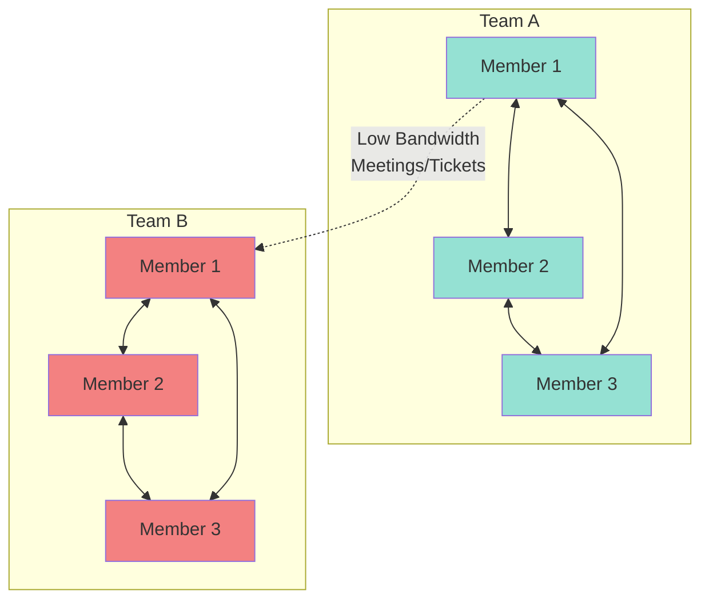
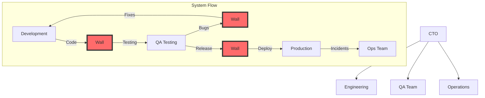
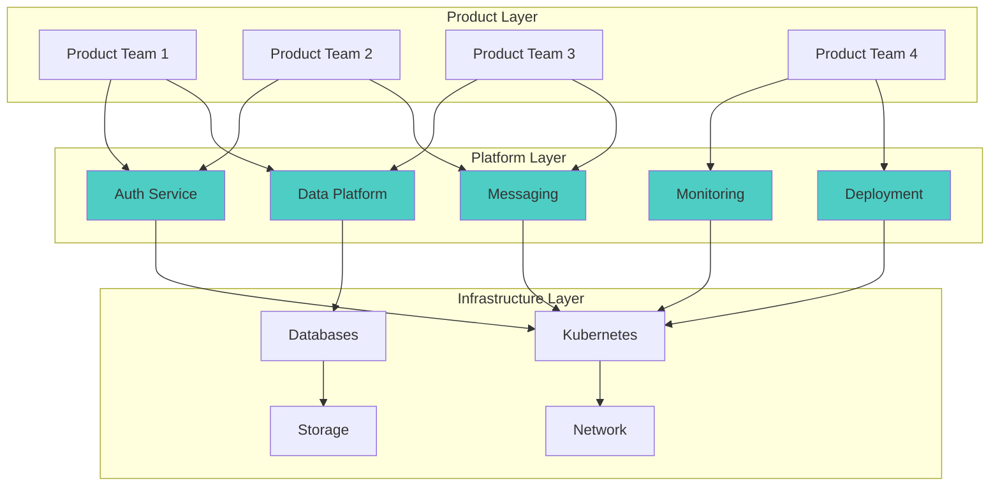

<!-- Navigation -->
[Home](../index.md) → [Part V: Human Factors](index.md) → **Org-Structure Physics**

# Org-Structure Physics

**Conway's Law in action: You ship your org chart**

## Conway's Law

"Organizations produce designs that copy their communication structures." - Conway, 1967

Not a suggestion. It's physics.

## Why Conway's Law is Inevitable

### Communication Bandwidth



Result: Module boundaries = team boundaries.

### The Physics

1. **Information flow follows org structure**
   - Same team: Rich communication
   - Different teams: Meetings, tickets
   - Different orgs: Contracts, APIs

2. **Interfaces emerge at boundaries**
   - Within team: Method calls
   - Between teams: REST APIs
   - Between companies: Public APIs

3. **Architecture mirrors hierarchy**
   - Monolith ← Single team
   - Services ← Multiple teams
   - Platforms ← Org divisions

## Organizational Patterns

### 1. Functional Organization



**System Architecture:**
- Dev throws code over wall to QA
- QA throws bugs back to Dev
- Ops throws incidents back to everyone

**Result:** Waterfall process, slow delivery

### 2. Product Teams

```mermaid
graph TB
    PO[Product Organization]
    
    subgraph "Cross-Functional Teams"
        subgraph "Team A"
            A_FE[Frontend]
            A_BE[Backend]
            A_DB[Database]
            A_OPS[DevOps]
        end
        
        subgraph "Team B"
            B_FE[Frontend]
            B_BE[Backend]
            B_DB[Database]
            B_OPS[DevOps]
        end
        
        subgraph "Team C"
            C_FE[Frontend]
            C_BE[Backend]
            C_DB[Database]
            C_OPS[DevOps]
        end
    end
    
    PO --> Team A
    PO --> Team B
    PO --> Team C
    
    subgraph "System Architecture"
        SA[Service A] <-->|API| SB[Service B]
        SB <-->|API| SC[Service C]
        SA <-->|API| SC
    end
    
    Team A -.->|Owns| SA
    Team B -.->|Owns| SB
    Team C -.->|Owns| SC
    
    style SA fill:#95e1d3
    style SB fill:#f7dc6f
    style SC fill:#bb8fce
```

**System Architecture:**
- Service A (owned by Team A)
- Service B (owned by Team B)
- Service C (owned by Team C)
- APIs between services

**Result:** Microservices, clear ownership

### 3. Platform Model



**System Architecture:**
- Standardized platform APIs
- Self-service infrastructure
- Clear abstraction layers

**Result:** Scalable development

### 4. Matrix Organization

```text
   Feature Teams ←→ Component Teams
        ↓               ↓
   Product Focus    Technical Focus
```

**System Architecture:**
- Shared components
- Complex dependencies
- Conflicting priorities

**Result:** Coordination overhead

## Team Topologies

### Stream-Aligned Teams
**Purpose:** Deliver value streams
- Own entire feature/product
- Direct customer value
- 5-9 people
- One domain focus

### Platform Teams
**Purpose:** Enable stream teams
- Build internal products
- Self-service APIs
- Success = adoption rate

### Enabling Teams
**Purpose:** Help teams adopt practices
- Coaching mode
- 3-6 month engagements
- Goal: self-sufficiency

### Complicated Subsystem Teams
**Purpose:** Own complex domains
- Deep expertise (ML, crypto, codecs)
- Simple API hiding complexity

## Communication Patterns

### Team Interaction Modes

**1. Collaboration**: Fuzzy boundaries, innovation
**2. X-as-a-Service**: Clear API, execution
**3. Facilitating**: Coaching, temporary

### Choosing Interaction Modes

```python
def select_interaction_mode(context):
    if context.exploring_new_tech:
        return "collaboration"
    elif context.established_pattern:
        return "x-as-a-service"
    elif context.capability_gap:
        return "facilitating"
```

## The Inverse Conway Maneuver

### Definition

Deliberately structuring teams to achieve desired architecture.

### Process

1. **Design target architecture**
   ```text
   Ideal System Architecture
   ├── User Service
   ├── Order Service
   ├── Payment Service
   └── Notification Service
   ```

2. **Create matching org structure**
   ```
   Engineering Organization
   ├── User Team
   ├── Order Team
   ├── Payment Team
   └── Notification Team
   ```

3. **Let Conway's Law work**
   - Teams naturally build their services
   - Interfaces emerge at team boundaries
   - Architecture follows organization

### Example: Monolith to Microservices

**Before:**
```
Single Team → Monolith
```
**Transition:**
```python
# 1. Identify bounded contexts
contexts = [
    "user_management",
    "order_processing",
    "payment_handling",
    "notifications"
]

# 2. Create teams per context
for context in contexts:
    create_team(
        name=f"{context}_team",
        members=5,
        ownership=context
    )

# 3. Teams extract their services
# Architecture emerges naturally
```

**After:**
```
User Team → User Service
Order Team → Order Service  
Payment Team → Payment Service
Notification Team → Notification Service
```
## Anti-Patterns

### 1. Misaligned Architecture

**Symptom:** Cross-team dependencies everywhere

```
Team A owns: [ServiceA, half of ServiceB]
Team B owns: [half of ServiceB, ServiceC]
Result: Coordination nightmare
```

**Fix:** Align service boundaries with team boundaries

### 2. Shared Ownership

**Symptom:** "Everyone owns it" = "No one owns it"

```python
# Anti-pattern
service_owners = {
    "platform": ["team_a", "team_b", "team_c"],
    "result": "ignored_until_fire"
}

# Better
service_owners = {
    "platform": "platform_team",
    "sla": "99.9%",
    "on_call": "platform_team"
}
```bash
### 3. Cognitive Overload

**Symptom:** Team owns too many unrelated things

```
TeamX owns:
- User authentication
- Email service
- Report generation
- Data pipeline
- Mobile app
- Kitchen sink

Result: Nothing done well
```yaml
**Fix:** Split into focused teams

### 4. Awkward Handoffs

**Symptom:** Work ping-pongs between teams

```
Feature Flow:
Frontend Team → Backend Team → Frontend Team →
Database Team → Backend Team → Deploy Team →
Frontend Team → Done (6 months later)
```yaml
**Fix:** Stream-aligned teams with full ownership

## Scaling Patterns

### Dunbar's Number

Cognitive limit for relationships: ~150 people

**Implications:**
```
Team: 5-9 people (deep trust)
  ↓
Tribe: 50-150 people (know everyone)
  ↓
Division: 500-1500 people (know of everyone)
  ↓
Company: Federated divisions
```bash
### Scaling Models

**1. Spotify Model**
```
Squad (team) → Tribe (collection) → Guild (practice)
                                    ↓
                                Chapter (expertise)
```text
**2. Amazon Model**
```
Two-Pizza Team → Single-threaded owner → Full P&L
                                         ↓
                                    Service API
```text
**3. Google Model**
```
Small Team → Tech Lead/Manager → Director → VP
             ↓
        Engineering Excellence (SRE, EngProd)
```bash
## Measuring Organizational Effectiveness

### Team Health Metrics

```python
class TeamHealthCheck:
    def assess(self, team):
        return {
            'deployment_frequency': self.measure_deploy_freq(team),
            'lead_time': self.measure_commit_to_prod(team),
            'mttr': self.measure_recovery_time(team),
            'change_failure_rate': self.measure_failed_deploys(team),
            'cognitive_load': self.survey_team_stress(team),
            'dependencies': self.count_blocking_deps(team)
        }
```bash
### Communication Health

```sql
-- Meeting overhead by team
SELECT
    team,
    AVG(meetings_per_week) as avg_meetings,
    AVG(meeting_hours_per_week) as avg_hours,
    AVG(cross_team_meetings) as coordination_overhead
FROM team_calendars
GROUP BY team
ORDER BY coordination_overhead DESC;
```bash
### Architecture-Org Alignment

```python
def measure_conway_alignment(org_structure, system_architecture):
    """
    Measure how well org matches architecture
    """
    misalignments = []

    for service in system_architecture:
        owners = get_service_owners(service)
        if len(owners) > 1:
            misalignments.append({
                'service': service,
                'issue': 'multiple_owners',
                'owners': owners
            })

        dependencies = get_service_dependencies(service)
        for dep in dependencies:
            if not same_team(service.owner, dep.owner):
                if interaction_frequency(service, dep) > threshold:
                    misalignments.append({
                        'issue': 'high_coupling_across_teams',
                        'services': [service, dep]
                    })

    return misalignments
```proto
## Best Practices

1. **Design Organization Intentionally**: Org = architecture, plan together

2. **Minimize Cognitive Load**: One team, one domain, clear boundaries

3. **Optimize Communication**: Colocate for collab, APIs for execution

4. **Enable Team Autonomy**: Full ownership, minimal dependencies

5. **Evolve Thoughtfully**: Changes expensive, plan carefully

## Case Study: Ride-Sharing Reorg

**Initial Structure (Functional):**
```
Mobile Team → Backend Team → Data Team
Result: 3-month feature cycle
```yaml
**Problem:** Features required coordination across all teams

**Reorganization (Stream-aligned):**
```
Rider Team: [mobile, backend, data engineers]
Driver Team: [mobile, backend, data engineers]
Marketplace Team: [algorithms, backend, data]
```

**Results:**
- Feature cycle: 3 months → 2 weeks
- Deployments: Monthly → Daily
- Team satisfaction: 6/10 → 8.5/10

**Architecture evolved to match:**
- Rider Service (owned by Rider Team)
- Driver Service (owned by Driver Team)
- Matching Service (owned by Marketplace Team)
- Clean APIs between services

## Key Takeaways

- **Conway's Law is inevitable** - Work with it, not against it
- **Team Topologies matter** - Choose patterns that fit your goals
- **Cognitive load is real** - Respect human limitations
- **Architecture follows organization** - Design both together
- **Communication paths define systems** - Optimize for flow

Remember: You can't fight Conway's Law, but you can use it to your advantage. Design your organization to build the system you want.
