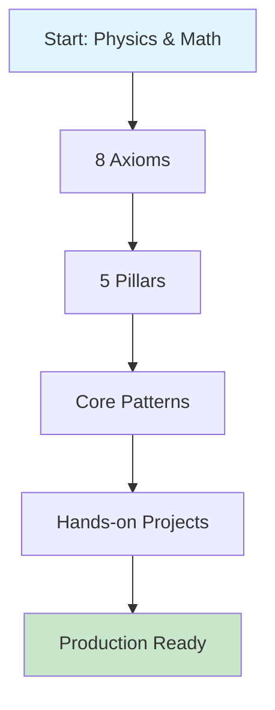
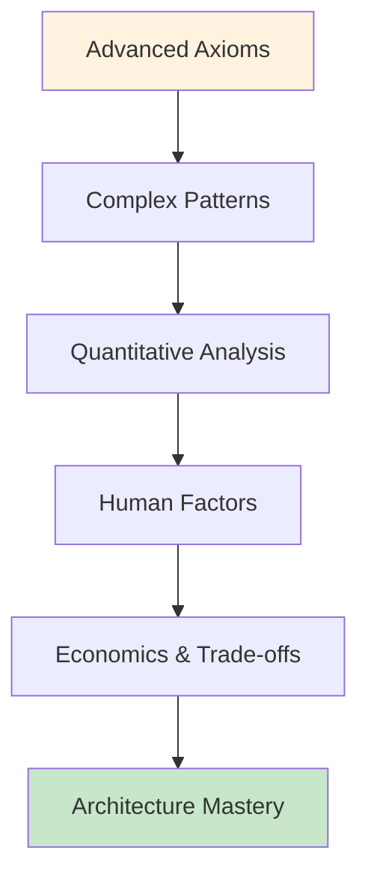
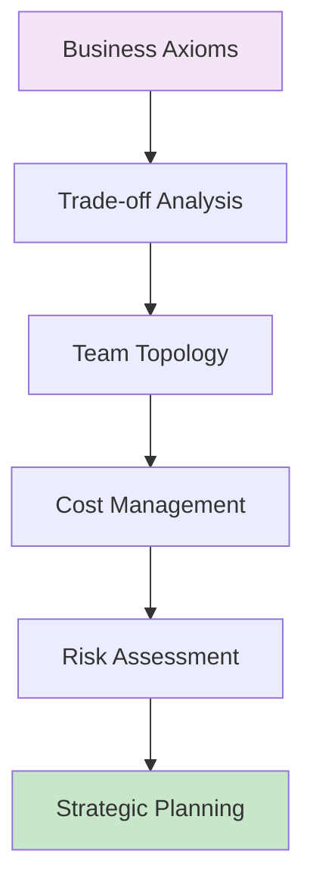
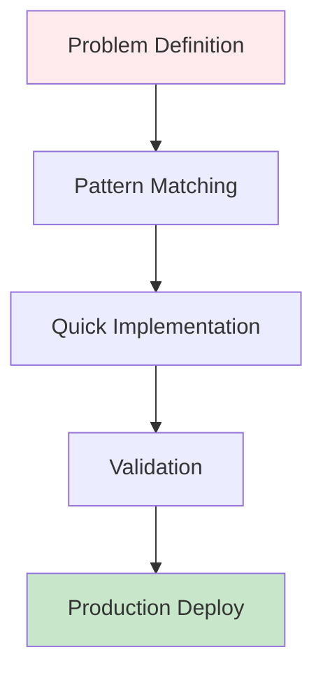

<!-- Navigation -->
[Home](/) → **The Compendium of Distributed Systems**


# The Compendium of Distributed Systems

<div class="hero-section">
  <h2>🌟 Master Distributed Systems Through First Principles</h2>
  <p class="hero-quote">"All distributed systems behavior emerges from physical and mathematical constraints"</p>
</div>

---

## 🗺️ Your Complete Learning Roadmap

<div class="roadmap-container">

### 🎯 Learning Paths - Choose Your Adventure

<div class="learning-paths-grid">

<div class="path-card beginner">
<h3>🟢 New Graduate Path</h3>
<div class="path-details">
<strong>Duration:</strong> 20-30 hours<br>
<strong>Goal:</strong> Strong distributed systems practitioner<br>
<strong>Prerequisites:</strong> Basic programming, CS fundamentals
</div>

**Your Journey:**


<div class="path-breakdown">
<details>
<summary><strong>📚 Week-by-Week Plan</strong></summary>

**Week 1: Foundation**
- Axiom 1-2: Latency & Capacity
- Quantitative basics: Little's Law
- Tool: Latency Calculator

**Week 2: Reliability** 
- Axiom 3: Failure Patterns
- Patterns: Circuit Breaker, Retry
- Case Study: Netflix Chaos Engineering

**Week 3: Coordination**
- Axiom 4-5: Concurrency & Coordination  
- Patterns: Consensus, Leader Election
- Project: Build a distributed lock

**Week 4: Production**
- Axiom 6-8: Observability, Human, Economics
- Patterns: Health Checks, Load Balancing
- Capstone: Design a complete system
</details>
</div>

<a href="/part1-axioms/" class="path-cta">Start Foundation Path →</a>
</div>

<div class="path-card intermediate">
<h3>🔵 Senior Engineer Path</h3>
<div class="path-details">
<strong>Duration:</strong> 40-60 hours<br>
<strong>Goal:</strong> Systems architect & design authority<br>
<strong>Prerequisites:</strong> Production experience, system design basics
</div>

**Your Journey:**


<div class="path-breakdown">
<details>
<summary><strong>🎯 Deep Dive Modules</strong></summary>

**Module 1: Advanced Foundations**
- All 8 Axioms with proofs
- Mathematical toolkit mastery
- Quantitative decision frameworks

**Module 2: Complex Patterns**
- Advanced consensus (Raft, PBFT)
- Event sourcing & CQRS
- Service mesh architectures

**Module 3: Production Excellence**
- SRE practices & chaos engineering
- Cost optimization strategies
- Organizational design impacts

**Module 4: Cutting Edge**
- Neuromorphic computing
- Quantum distributed systems
- ML-driven infrastructure
</details>
</div>

<a href="/part2-pillars/" class="path-cta">Advance Your Skills →</a>
</div>

<div class="path-card manager">
<h3>🟠 Engineering Manager Path</h3>
<div class="path-details">
<strong>Duration:</strong> 15-25 hours<br>
<strong>Goal:</strong> Technical leadership & business alignment<br>
<strong>Prerequisites:</strong> Team leadership, technical background
</div>

**Your Journey:**


<div class="path-breakdown">
<details>
<summary><strong>💼 Leadership Focus Areas</strong></summary>

**Focus 1: Technical Decision Making**
- Economics axiom deep dive
- Quantitative trade-off analysis
- Architecture decision records

**Focus 2: Team & Process**
- Human factors in system design
- Conway's Law applications
- Incident response culture

**Focus 3: Business Alignment**
- Cost optimization strategies
- Risk vs innovation balance
- Communication with executives

**Focus 4: Strategic Planning**
- Technology evolution roadmaps
- Capacity planning & budgeting
- Vendor evaluation frameworks
</details>
</div>

<a href="/human-factors/" class="path-cta">Lead Technical Teams →</a>
</div>

<div class="path-card express">
<h3>🔴 Express Problem-Solving Path</h3>
<div class="path-details">
<strong>Duration:</strong> 2-8 hours<br>
<strong>Goal:</strong> Solve immediate challenges<br>
<strong>Prerequisites:</strong> Specific problem to solve
</div>

**Your Journey:**


<div class="path-breakdown">
<details>
<summary><strong>⚡ Quick Solutions</strong></summary>

**Performance Issues:**
- Load balancing patterns
- Caching strategies  
- Capacity planning tools

**Reliability Problems:**
- Circuit breaker implementation
- Graceful degradation
- Health check patterns

**Scaling Challenges:**
- Auto-scaling patterns
- Sharding strategies
- Load shedding techniques

**Coordination Issues:**
- Consensus algorithms
- Distributed locking
- Leader election
</details>
</div>

<a href="/patterns/" class="path-cta">Find Solutions Now →</a>
</div>

</div>

---

## 📖 Complete Content Map

<div class="content-map">

### Part I: The Eight Fundamental Axioms
*Physics and mathematics that govern all distributed systems*

<div class="axioms-grid">
<div class="axiom-card physics">
<h4>🚀 Physics Axioms</h4>
<ul>
<li><a href="/part1-axioms/axiom1-latency/">1. Latency</a> - Speed of light limits</li>
<li><a href="/part1-axioms/axiom2-capacity/">2. Capacity</a> - Finite resources</li>
<li><a href="/part1-axioms/axiom3-failure/">3. Failure</a> - Partial failures</li>
</ul>
</div>

<div class="axiom-card coordination">
<h4>🤝 Coordination Axioms</h4>
<ul>
<li><a href="/part1-axioms/axiom4-concurrency/">4. Concurrency</a> - Simultaneous events</li>
<li><a href="/part1-axioms/axiom5-coordination/">5. Coordination</a> - Agreement protocols</li>
</ul>
</div>

<div class="axiom-card operational">
<h4>🔧 Operational Axioms</h4>
<ul>
<li><a href="/part1-axioms/axiom6-observability/">6. Observability</a> - System visibility</li>
<li><a href="/part1-axioms/axiom7-human/">7. Human Interface</a> - Operator constraints</li>
<li><a href="/part1-axioms/axiom8-economics/">8. Economics</a> - Cost considerations</li>
</ul>
</div>
</div>

### Part II: The Five Foundational Pillars
*How axioms combine to create system architectures*

<div class="pillars-overview">
```text
🏗️ Work        🗄️ State       🎯 Truth       ⚙️ Control     🧠 Intelligence
├─ Queues      ├─ Storage     ├─ Consensus   ├─ Workflow    ├─ ML/AI
├─ Streaming   ├─ Caching     ├─ Validation  ├─ Scheduling  ├─ Automation
├─ Batching    ├─ Replication ├─ Auditing    ├─ Monitoring  ├─ Adaptation
└─ Flow Control└─ Consistency └─ Lineage     └─ Governance  └─ Learning
```
</div>

### Part III: Modern Pattern Catalog
*Battle-tested solutions derived from first principles*

<div class="patterns-categories">

<div class="pattern-category">
<h4>🔄 Communication Patterns</h4>
<div class="pattern-list">
<a href="/patterns/service-discovery/">Service Discovery</a> •
<a href="/patterns/load-balancing/">Load Balancing</a> •
<a href="/patterns/service-mesh/">Service Mesh</a> •
<a href="/patterns/event-driven/">Event-Driven</a>
</div>
</div>

<div class="pattern-category">
<h4>🛡️ Reliability Patterns</h4>
<div class="pattern-list">
<a href="/patterns/circuit-breaker/">Circuit Breaker</a> •
<a href="/patterns/retry-backoff/">Retry & Backoff</a> •
<a href="/patterns/graceful-degradation/">Graceful Degradation</a> •
<a href="/patterns/bulkhead/">Bulkhead</a>
</div>
</div>

<div class="pattern-category">
<h4>📊 Data Patterns</h4>
<div class="pattern-list">
<a href="/patterns/cqrs/">CQRS</a> •
<a href="/patterns/event-sourcing/">Event Sourcing</a> •
<a href="/patterns/saga/">Saga</a> •
<a href="/patterns/outbox/">Outbox</a>
</div>
</div>

<div class="pattern-category">
<h4>⚖️ Scaling Patterns</h4>
<div class="pattern-list">
<a href="/patterns/sharding/">Sharding</a> •
<a href="/patterns/auto-scaling/">Auto-scaling</a> •
<a href="/patterns/load-shedding/">Load Shedding</a> •
<a href="/patterns/caching-strategies/">Caching</a>
</div>
</div>

</div>

### Part IV: Quantitative Toolkit
*Mathematics and economics for system design*

<div class="quantitative-tools">
<div class="tool-group">
<h4>📈 Performance Math</h4>
<ul>
<li><a href="/quantitative/littles-law/">Little's Law</a> - Queue analysis</li>
<li><a href="/quantitative/amdahl-gustafson/">Amdahl's Law</a> - Parallelization limits</li>
<li><a href="/quantitative/universal-scalability/">Universal Scalability</a> - Coherence costs</li>
</ul>
</div>

<div class="tool-group">
<h4>💰 Economic Analysis</h4>
<ul>
<li><a href="/quantitative/cache-economics/">Cache Economics</a> - Cost/benefit analysis</li>
<li><a href="/quantitative/coordination-costs/">Coordination Costs</a> - Agreement overheads</li>
<li><a href="/quantitative/capacity-planning/">Capacity Planning</a> - Resource sizing</li>
</ul>
</div>
</div>

### Part V: Human Factors
*The people side of distributed systems*

<div class="human-factors-overview">
<div class="human-factor">
<h4>🎯 Operational Excellence</h4>
<ul>
<li><a href="/human-factors/sre-practices/">SRE Practices</a></li>
<li><a href="/human-factors/chaos-engineering/">Chaos Engineering</a></li>
<li><a href="/human-factors/incident-response/">Incident Response</a></li>
</ul>
</div>

<div class="human-factor">
<h4>🏢 Organizational Design</h4>
<ul>
<li><a href="/human-factors/team-topologies/">Team Topologies</a></li>
<li><a href="/human-factors/knowledge-management/">Knowledge Management</a></li>
<li><a href="/human-factors/oncall-culture/">On-call Culture</a></li>
</ul>
</div>
</div>

</div>

---

## 🛠️ Interactive Learning Tools

<div class="tools-showcase">

<div class="tool-category">
<h3>⚡ Performance Calculators</h3>
<div class="tools-grid">
<a href="/tools/#latency-calculator" class="tool-card">
<span class="tool-icon">⏱️</span>
<span class="tool-name">Latency Calculator</span>
<span class="tool-desc">Global latency analysis</span>
</a>

<a href="/tools/#capacity-worksheet" class="tool-card">
<span class="tool-icon">📊</span>
<span class="tool-name">Capacity Planner</span>
<span class="tool-desc">Resource sizing tool</span>
</a>

<a href="/tools/#economics-calculator" class="tool-card">
<span class="tool-icon">💰</span>
<span class="tool-name">Cost Analyzer</span>
<span class="tool-desc">TCO calculations</span>
</a>
</div>
</div>

<div class="tool-category">
<h3>🔬 Analysis Frameworks</h3>
<div class="tools-grid">
<a href="/tools/#failure-framework" class="tool-card">
<span class="tool-icon">💥</span>
<span class="tool-name">Failure Analyzer</span>
<span class="tool-desc">Risk assessment matrix</span>
</a>

<a href="/tools/#consensus-matrix" class="tool-card">
<span class="tool-icon">🤝</span>
<span class="tool-name">Consensus Chooser</span>
<span class="tool-desc">Algorithm selection</span>
</a>

<a href="/tools/#decision-frameworks" class="tool-card">
<span class="tool-icon">⚡</span>
<span class="tool-name">Quick Decisions</span>
<span class="tool-desc">5-minute architecture</span>
</a>
</div>
</div>

</div>

---

## 📚 Real-World Case Studies

<div class="case-studies-preview">

<div class="case-study-card">
<h4>🎬 Netflix: Global Streaming at Scale</h4>
<p>How Netflix serves 240M+ users across 190 countries using distributed systems principles</p>
<div class="case-study-topics">
<span class="topic">Chaos Engineering</span>
<span class="topic">Microservices</span>
<span class="topic">Content Delivery</span>
</div>
<a href="/case-studies/netflix-chaos-engineering/">Explore Case Study →</a>
</div>

<div class="case-study-card">
<h4>🚗 Uber: Real-time Location at Planetary Scale</h4>
<p>Managing millions of real-time GPS coordinates with sub-second latency</p>
<div class="case-study-topics">
<span class="topic">Geo-distributed</span>
<span class="topic">Real-time</span>
<span class="topic">Sharding</span>
</div>
<a href="/case-studies/uber-location/">Explore Case Study →</a>
</div>

<div class="case-study-card">
<h4>💳 PayPal: Mission-Critical Payments</h4>
<p>Processing $1.36 trillion annually with 99.999% availability requirements</p>
<div class="case-study-topics">
<span class="topic">ACID Compliance</span>
<span class="topic">Fraud Detection</span>
<span class="topic">Global Scale</span>
</div>
<a href="/case-studies/paypal-payments/">Explore Case Study →</a>
</div>

</div>

---

## 🎯 Why This Approach Works

<div class="approach-comparison">

<div class="traditional-approach">
<h3>❌ Traditional Learning</h3>
<ul>
<li>Start with specific technologies (Kafka, K8s)</li>
<li>Learn by copying existing patterns</li>
<li>Debug through trial and error</li>
<li>Choose solutions by popularity</li>
<li>Struggle when technologies change</li>
</ul>
</div>

<div class="our-approach">
<h3>✅ First Principles Approach</h3>
<ul>
<li>Start with physics and mathematics</li>
<li>Derive patterns from constraints</li>
<li>Predict failures before they happen</li>
<li>Choose solutions through analysis</li>
<li>Adapt to any technology evolution</li>
</ul>
</div>

</div>

---

## 🚀 Start Your Mastery Journey

<div class="journey-cta">

<div class="cta-primary">
<h3>Ready to Begin?</h3>
<p>Start with the fundamentals and build unshakeable expertise</p>
<a href="/part1-axioms/axiom1-latency/" class="cta-button primary">
Begin with Axiom 1: Latency →
</a>
</div>

<div class="cta-secondary">
<h3>Need a Quick Solution?</h3>
<p>Jump directly to battle-tested patterns for immediate results</p>
<a href="/patterns/" class="cta-button secondary">
Browse Pattern Catalog
</a>
</div>

<div class="cta-tools">
<h3>Want to Calculate Trade-offs?</h3>
<p>Use our interactive tools for quantitative analysis</p>
<a href="/tools/" class="cta-button tools">
Open Calculator Suite
</a>
</div>

</div>

---

## 📖 About This Compendium

### Our Philosophy

This compendium teaches distributed systems from the ground up, starting with fundamental physics and mathematics rather than jumping straight into technologies. We derive patterns from constraints, not fashion.

**Why Another Systems Resource?**

Existing distributed systems literature falls into two camps: academic proofs divorced from practice, or engineering cookbooks lacking theoretical foundation. This resource uniquely provides the **'why from first principles.'**

We don't start with Kafka or Kubernetes. We start with the speed of light and the laws of thermodynamics. Every pattern emerges from inescapable constraints.

### Key Principles

1. **Physics First** - Begin with the laws of physics, not algorithms
2. **Build Systematically** - Each concept builds on previous foundations  
3. **Emphasize Trade-offs** - No perfect solutions, only informed choices
4. **Learn from Failures** - Real-world disasters teach more than theories
5. **Quantify Everything** - Mathematics beats intuition for complex systems

### Contributing & Community

We welcome contributions! This work is licensed under a Creative Commons Attribution 4.0 International License.

- **Repository**: [github.com/deepaucksharma/DStudio](https://github.com/deepaucksharma/DStudio)
- **Issues & Feedback**: [Report issues](https://github.com/deepaucksharma/DStudio/issues)
- **Discussions**: Share insights and ask questions

---

*"In distributed systems, the impossible becomes merely difficult, and the difficult becomes a career."*