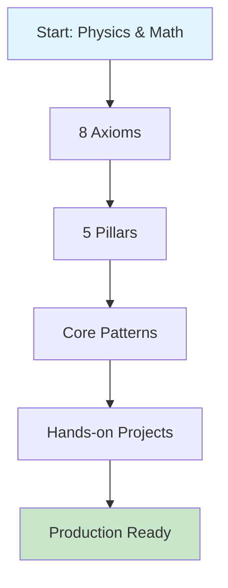
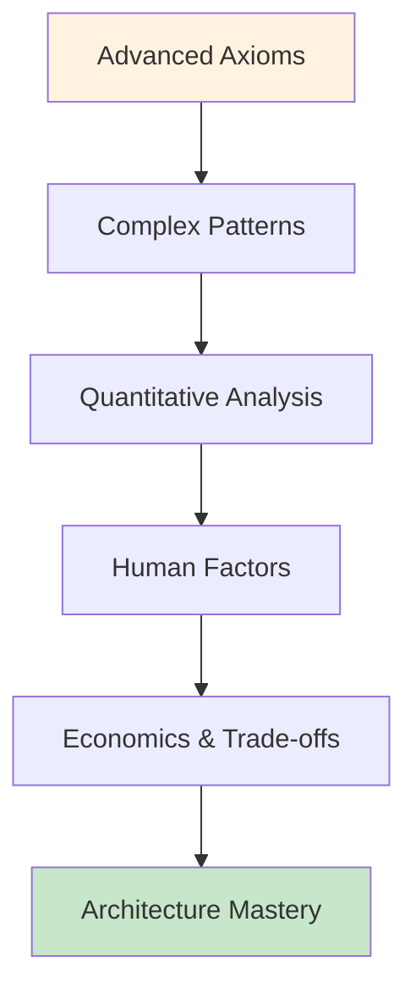
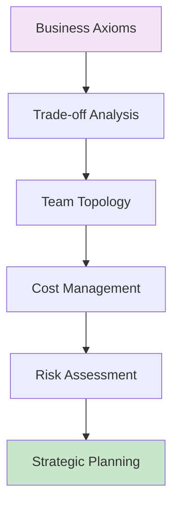
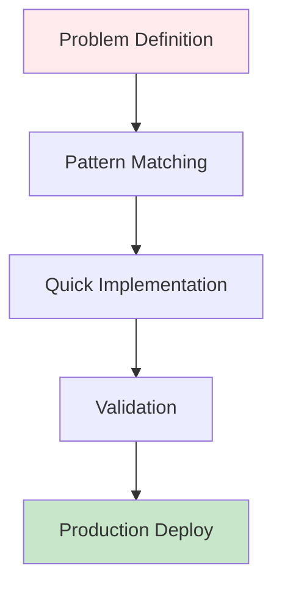

<!-- Navigation -->
[Home](/) → **The Compendium of Distributed Systems**

# The Compendium of Distributed Systems

---

## 🗺️ Your Complete Learning Roadmap

**Your Journey:**

<a href="/part1-axioms/" class="path-cta">Start Foundation Path →</a>

**Your Journey:**

<a href="/part2-pillars/" class="path-cta">Advance Your Skills →</a>

**Your Journey:**

<a href="/human-factors/" class="path-cta">Lead Technical Teams →</a>

**Your Journey:**

<a href="/patterns/" class="path-cta">Find Solutions Now →</a>

---

## 📖 Complete Content Map

### Part I: The Eight Fundamental Axioms
*Physics and mathematics that constrain all distributed systems*
- [Latency](/part1-axioms/axiom1-latency/) - Speed of light limits
- [Capacity](/part1-axioms/axiom2-capacity/) - Finite resources
- [Failure](/part1-axioms/axiom3-failure/) - Components break
- [Concurrency](/part1-axioms/axiom4-concurrency/) - Race conditions
- [Coordination](/part1-axioms/axiom5-coordination/) - Agreement costs
- [Observability](/part1-axioms/axiom6-observability/) - Limited visibility
- [Human Interface](/part1-axioms/axiom7-human/) - Cognitive limits
- [Economics](/part1-axioms/axiom8-economics/) - Everything has a cost

### Part II: The Five Foundational Pillars
*How axioms combine to create system architectures*
- [Work Distribution](/part2-pillars/work/) - Spreading computation
- [State Distribution](/part2-pillars/state/) - Managing data
- [Truth Distribution](/part2-pillars/truth/) - Achieving consistency
- [Control Distribution](/part2-pillars/control/) - Operational management
- [Intelligence Distribution](/part2-pillars/intelligence/) - Adaptive systems

### Part III: Modern Pattern Catalog
*Battle-tested solutions derived from first principles*
- [Core Patterns](/patterns/#core-patterns) - CQRS, Event Sourcing, Saga
- [Resilience Patterns](/patterns/#resilience-patterns) - Circuit Breaker, Retry, Timeout
- [Data Patterns](/patterns/#data-patterns) - Sharding, Caching, CDC
- [Coordination Patterns](/patterns/#coordination-patterns) - Leader Election, Distributed Lock
- [Operational Patterns](/patterns/#operational-patterns) - Service Mesh, Auto-scaling

### Part IV: Quantitative Toolkit
*Mathematics and economics for system design*
- [Latency & Performance](/quantitative/#latency--performance) - Little's Law, Queueing Theory
- [Scaling Laws](/quantitative/#scaling-laws) - Amdahl's Law, Universal Scalability
- [Economics & Planning](/quantitative/#economics--planning) - Capacity Planning, Cost Models

### Part V: Human Factors
*The people side of distributed systems*
- [Production Excellence](/human-factors/#production-excellence) - SRE, Chaos Engineering
- [Operational Practices](/human-factors/#operational-practices) - Runbooks, Incident Response
- [Team & Organization](/human-factors/#key-concepts) - Conway's Law, Team Topologies

---

## 🛠️ Interactive Learning Tools

### 📊 Latency Calculator
Calculate theoretical and practical latencies for your architecture
[**→ Launch Calculator**](/tools/#latency-calculator)

### 📦 Capacity Planner
Right-size your infrastructure based on load patterns
[**→ Plan Capacity**](/tools/#capacity-planner)

### 🎯 Pattern Selector
Find the right pattern for your specific constraints
[**→ Select Patterns**](/tools/#pattern-selector)

---

## 📚 Real-World Case Studies

### Uber: Real-Time Location at Scale
**Challenge**: Track 40M concurrent users with <100ms latency  
**Solution**: H3 hexagonal grid system + edge computing  
[**→ Read Case Study**](/case-studies/uber-location/)

### Amazon DynamoDB: Eventually Consistent by Design
**Challenge**: 99.999% availability for global e-commerce  
**Solution**: Masterless architecture + vector clocks  
[**→ Read Case Study**](/case-studies/amazon-dynamo/)

### Spotify: ML-Powered Recommendations
**Challenge**: 5B personalized recommendations daily  
**Solution**: Hybrid online/offline processing pipeline  
[**→ Read Case Study**](/case-studies/spotify-recommendations/)

---

## 🎯 Why This Approach Works

### 🏭️ Foundation First
We start with immutable laws of physics and mathematics, not trendy technologies. This gives you principles that remain true regardless of the current tech stack.

### 🧠 Mental Models
Each concept builds on previous ones, creating a complete mental framework for reasoning about distributed systems. You'll develop intuition, not just memorize patterns.

### 💔 Learn from Failures
Every pattern includes real production failures and their root causes. Understanding why systems break is the fastest path to building resilient ones.

### 📊 Quantitative Approach
Make decisions based on math, not opinions. Every trade-off can be quantified, measured, and optimized.

---

## 🚀 Start Your Mastery Journey

**Choose your path based on your experience:**

### 🌱 New to Distributed Systems?
Begin with [Introduction](/introduction/) → [Axioms](/part1-axioms/) → [Basic Patterns](/patterns/)

### 🌳 Experienced Engineer?
Jump to [Patterns](/patterns/) or [Case Studies](/case-studies/) for practical applications

### 🌲 Technical Leader?
Focus on [Human Factors](/human-factors/) and [Quantitative Analysis](/quantitative/)

### ⚡ Just Need a Quick Answer?
Check [Reference](/reference/) for definitions, formulas, and quick guides

---

## 📖 About This Compendium

### Our Philosophy

This compendium teaches distributed systems from the ground up, starting with fundamental physics and mathematics rather than jumping straight into technologies. We derive patterns from constraints, not fashion.

**Why Another Systems Resource?**

Existing distributed systems literature falls into two camps: academic proofs divorced from practice, or engineering cookbooks lacking theoretical foundation. This resource uniquely provides the **'why from first principles.'**

We don't start with Kafka or Kubernetes. We start with the speed of light and the laws of thermodynamics. Every pattern emerges from inescapable constraints.

### Key Principles

1. **Physics First** - Begin with the laws of physics, not algorithms
2. **Build Systematically** - Each concept builds on previous foundations
3. **Emphasize Trade-offs** - No perfect solutions, only informed choices
4. **Learn from Failures** - Real-world disasters teach more than theories
5. **Quantify Everything** - Mathematics beats intuition for complex systems

### Contributing & Community

We welcome contributions! This work is licensed under a Creative Commons Attribution 4.0 International License.

- **Repository**: [github.com/deepaucksharma/DStudio](https://github.com/deepaucksharma/DStudio)
- **Issues & Feedback**: [Report issues](https://github.com/deepaucksharma/DStudio/issues)
- **Discussions**: Share insights and ask questions

---

*"In distributed systems, the impossible becomes merely difficult, and the difficult becomes a career."*
