# The Compendium of Distributed Systems

!!! abstract "Core Philosophy"
    🎯 **Derive distributed systems from physics laws, not memorize patterns**
    
    **7 Fundamental Laws** • **5 Core Pillars** • **50+ Production Patterns** • **100+ Real Failures**

## Your Learning Journey

```mermaid
graph LR
    subgraph "Week 1-2: Foundation"
        A[Speed of Light] --> B[CAP Theorem]
        B --> C[FLP Result]
        C --> D[7 Laws]
    end
    
    subgraph "Week 3-6: Patterns"
        D --> E[Load Balancing]
        E --> F[Sharding]
        F --> G[Consensus]
        G --> H[50+ More]
    end
    
    subgraph "Week 7-12: Mastery"
        H --> I[Build Twitter Clone]
        I --> J[Design Uber]
        J --> K[Create New Patterns]
    end
    
    style A fill:#4CAF50,color:#fff
    style D fill:#2196F3,color:#fff
    style H fill:#FF9800,color:#fff
    style K fill:#9C27B0,color:#fff
```

- :material-rocket-launch:{ .lg } **Start Learning**
    
    ---
    
    [:octicons-arrow-right-24: Choose Your Path](/introduction/getting-started){ .md-button .md-button--primary }

- :material-compass:{ .lg } **Quick Navigator**
    
    ---
    
    [:octicons-arrow-right-24: Pattern Selector](/patterns/pattern-matrix){ .md-button }

## What You'll Master

- :material-atom:{ .lg .middle } **Foundation**
    
    ---
    
    **7 Fundamental Laws** derived from physics  
    **5 Core Pillars** organizing all patterns  
    **Mathematical proofs** for impossibility results

- :material-puzzle:{ .lg .middle } **Application**
    
    ---
    
    **50+ Patterns** from Google, Amazon, Netflix  
    **100+ Failures** analyzed with root causes  
    **Decision frameworks** for architecture choices

- :material-rocket:{ .lg .middle } **Outcome**
    
    ---
    
    **Design** systems that scale to millions  
    **Debug** any distributed system failure  
    **Lead** technical architecture decisions

## Start Here

- :material-play-circle:{ .lg .middle } __Getting Started__

 ---

 New to distributed systems? Start with our guided learning paths tailored to your experience level.

 [:octicons-arrow-right-24: Get Started](/introduction/getting-started)

- :material-scale-balance:{ .lg .middle } __The 7 Laws__

 ---

 Discover the fundamental laws derived from physics that govern all distributed systems.

 [:octicons-arrow-right-24: Explore Laws](/part1-axioms)

- :material-pillar:{ .lg .middle } __The 5 Pillars__

 ---

 Learn how to organize solutions around fundamental distributed concepts.

 [:octicons-arrow-right-24: Study Pillars](/part2-pillars)

- :material-puzzle:{ .lg .middle } __Design Patterns__

 ---

 Explore battle-tested patterns for building resilient, scalable distributed systems.

 [:octicons-arrow-right-24: Browse Patterns](/patterns)

## 🎯 Choose Your Learning Path

=== ":material-school: New Graduate"

    !!! success "Foundation Builder Path"
        
        **Duration:** 12 weeks | **Focus:** Laws → Patterns → Implementation
        
        Build deep understanding from physics up. Perfect for those with time to invest in fundamentals.
        
        [:octicons-arrow-right-24: Start Foundation Path](/introduction/getting-started#path-1-foundation-builder-new-graduates){ .md-button }

=== ":material-code-tags: Mid-Level"

    !!! info "Practical Problem Solver Path"
        
        **Duration:** 8 weeks | **Focus:** Patterns → Laws → Advanced Topics
        
        Apply patterns immediately while building theoretical foundation.
        
        [:octicons-arrow-right-24: Start Practical Path](/introduction/getting-started#path-2-practical-problem-solver-mid-level-engineers){ .md-button }

=== ":material-account-star: Senior"

    !!! tip "System Designer Path"
        
        **Duration:** 6 weeks | **Focus:** Advanced Patterns → Trade-offs → Architecture
        
        Master complex patterns and architectural decision-making.
        
        [:octicons-arrow-right-24: Start Advanced Path](/introduction/getting-started#path-3-system-designer-senior-engineers){ .md-button }

=== ":material-account-group: Manager"

    !!! example "Technical Leader Path"
        
        **Duration:** 4 weeks | **Focus:** Strategy → Economics → Team Building
        
        Strategic overview for technical decision makers.
        
        [:octicons-arrow-right-24: Start Leadership Path](/introduction/getting-started#path-4-technical-leader-managersarchitects){ .md-button }

## Why This Approach?

- :material-atom:{ .lg .middle } __Physics-Based__

 ---

 Every concept derives from fundamental constraints like the speed of light and thermodynamics.

- :material-infinity:{ .lg .middle } __Timeless Principles__

 ---

 Learn principles that remain true regardless of technology trends or vendor solutions.

- :material-cog:{ .lg .middle } __Practical Application__

 ---

 Each concept includes real-world case studies, failure scenarios, and implementation guidance.

## What You'll Learn

- :material-foundation:{ .lg .middle } __Foundations__

 ---

 - The 7 fundamental laws that govern all distributed systems
 - The 5 pillars of distributed system design 
 - How physics constrains what's possible

- :material-tools:{ .lg .middle } __Practical Skills__

 ---

 - Choosing the right consistency model
 - Designing for failure and partition tolerance
 - Scaling systems from 1 to 1 billion users
 - Debugging complex distributed failures

- :material-rocket-launch:{ .lg .middle } __Advanced Topics__

 ---

 - Consensus algorithms and their trade-offs
 - Global-scale system design
 - Edge computing architectures
 - Quantum-resistant distributed systems

## Latest Updates

!!! tip "Latest Updates"
    
    === "New Features"
        
        - :material-new-box: **Interactive Consistency Calculator** - Calculate CAP trade-offs visually
        - :material-chart-line: **Performance Visualizer** - See scaling laws in action
        - :material-calculator: **Capacity Planner** - Right-size your distributed system
    
    === "Updated Content"
        
        - :material-refresh: **Google Interview Guide** - Updated with 2025 questions
        - :material-file-document-edit: **Kubernetes Patterns** - Added service mesh examples
        - :material-bug-check: **Debugging Guide** - New distributed tracing section
    
    === "Case Studies"
        
        - :material-alert-circle: **AWS S3 Outage (2024)** - Cascading failure analysis
        - :material-server-network-off: **Meta WhatsApp Incident** - Split-brain recovery
        - :material-database-alert: **Cloudflare Memory Leak** - Performance degradation patterns

## Ready to Begin?

[Start Learning :fontawesome-solid-graduation-cap:](/introduction/getting-started){ .md-button .md-button--primary .md-button--stretch }