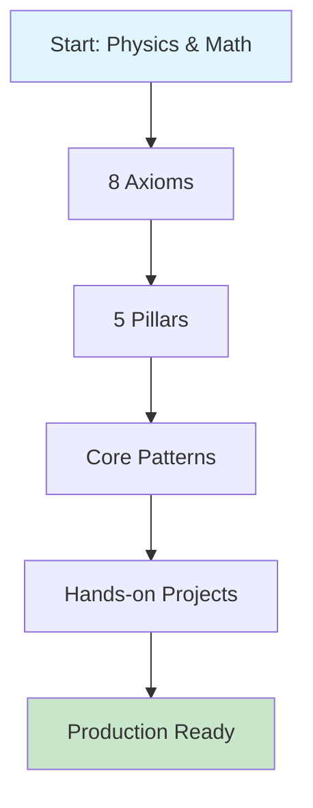
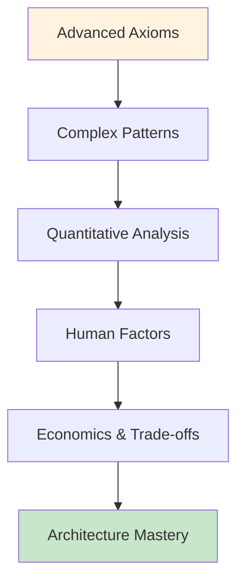
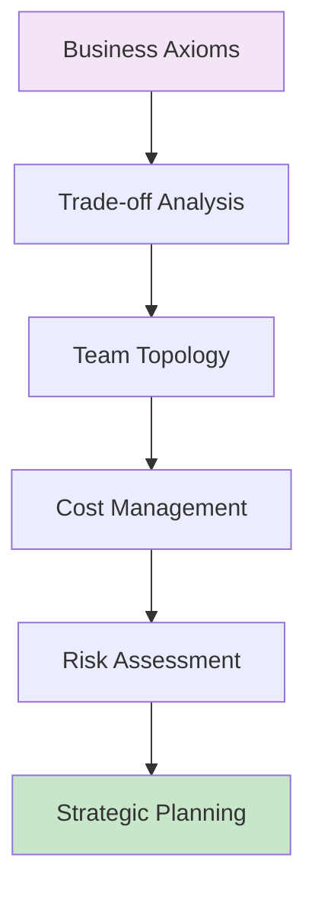
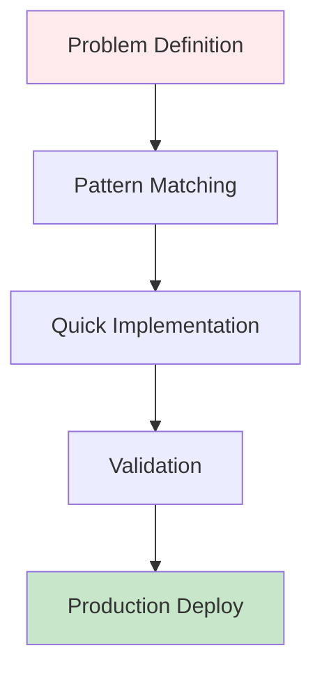

<!-- Navigation -->
[Home](/) → **The Compendium of Distributed Systems**

# The Compendium of Distributed Systems

---

## 🗺️ Your Complete Learning Roadmap

**Your Journey:**

<a href="/part1-axioms/" class="path-cta">Start Foundation Path →</a>

**Your Journey:**

<a href="/part2-pillars/" class="path-cta">Advance Your Skills →</a>

**Your Journey:**

<a href="/human-factors/" class="path-cta">Lead Technical Teams →</a>

**Your Journey:**

<a href="/patterns/" class="path-cta">Find Solutions Now →</a>

---

## 📖 Complete Content Map

### Part II: The Five Foundational Pillars
*How axioms combine to create system architectures*

### Part III: Modern Pattern Catalog
*Battle-tested solutions derived from first principles*

### Part IV: Quantitative Toolkit
*Mathematics and economics for system design*

### Part V: Human Factors
*The people side of distributed systems*

---

## 🛠️ Interactive Learning Tools

---

## 📚 Real-World Case Studies

<a href="/case-studies/netflix-chaos-engineering/">Explore Case Study →</a>

<a href="/case-studies/uber-location/">Explore Case Study →</a>

<a href="/case-studies/paypal-payments/">Explore Case Study →</a>

---

## 🎯 Why This Approach Works

---

## 🚀 Start Your Mastery Journey

---

## 📖 About This Compendium

### Our Philosophy

This compendium teaches distributed systems from the ground up, starting with fundamental physics and mathematics rather than jumping straight into technologies. We derive patterns from constraints, not fashion.

**Why Another Systems Resource?**

Existing distributed systems literature falls into two camps: academic proofs divorced from practice, or engineering cookbooks lacking theoretical foundation. This resource uniquely provides the **'why from first principles.'**

We don't start with Kafka or Kubernetes. We start with the speed of light and the laws of thermodynamics. Every pattern emerges from inescapable constraints.

### Key Principles

1. **Physics First** - Begin with the laws of physics, not algorithms
2. **Build Systematically** - Each concept builds on previous foundations
3. **Emphasize Trade-offs** - No perfect solutions, only informed choices
4. **Learn from Failures** - Real-world disasters teach more than theories
5. **Quantify Everything** - Mathematics beats intuition for complex systems

### Contributing & Community

We welcome contributions! This work is licensed under a Creative Commons Attribution 4.0 International License.

- **Repository**: [github.com/deepaucksharma/DStudio](https://github.com/deepaucksharma/DStudio)
- **Issues & Feedback**: [Report issues](https://github.com/deepaucksharma/DStudio/issues)
- **Discussions**: Share insights and ask questions

---

*"In distributed systems, the impossible becomes merely difficult, and the difficult becomes a career."*
