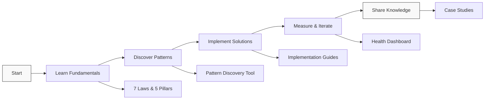

# Excellence Patterns Hub

**Transform your distributed systems with physics-based understanding and proven patterns.**

## Pattern Excellence Tiers

- **Gold Patterns (38)**
    
    ---
    
    Battle-tested at scale by FAANG companies. Production-ready with extensive documentation, monitoring guides, and proven ROI.

- **Silver Patterns (38)**
    
    ---
    
    Production-ready for specialized use cases. Well-documented with clear trade-offs and implementation guidance.

- **Bronze Patterns (25)**
    
    ---
    
    Legacy or transitional patterns. Includes migration paths to modern alternatives and deprecation timelines.

## Getting Started

- **New to Distributed Systems?**
    
    ---
    
    Start with our comprehensive introduction and guided learning paths tailored to your experience level.
    
    [:octicons-arrow-right-24: Introduction](introduction/getting-started){ .md-button .md-button--primary }

- **Pattern Discovery**
    
    ---
    
    Find the perfect patterns for your challenges using our interactive search and filtering tools.
    
    [:octicons-arrow-right-24: Discover Patterns](excellence/pattern-discovery){ .md-button }

- **Implementation Guides**
    
    ---
    
    Deep-dive guides for building resilient, scalable distributed systems.
    
    [:octicons-arrow-right-24: View Guides](excellence/implementation-guides){ .md-button }

- **Pattern Health Dashboard**
    
    ---
    
    Real-time adoption metrics and trend analysis across the industry.
    
    [:octicons-arrow-right-24: View Dashboard](reference/pattern-health-dashboard){ .md-button }

## Excellence Resources

- **Real-World Examples**
    
    ---
    
    Learn from Netflix, Amazon, Google, and Uber's production implementations.
    
    [:octicons-arrow-right-24: Case Studies](excellence/real-world-excellence){ .md-button }

- **Excellence Journeys**
    
    ---
    
    Guided transformation paths for startups, enterprises, and legacy systems.
    
    [:octicons-arrow-right-24: Start Journey](excellence/excellence-journeys){ .md-button }

- **Migration Center**
    
    ---
    
    Step-by-step guides for migrating from legacy to modern patterns.
    
    [:octicons-arrow-right-24: Migration Guides](excellence/migrations){ .md-button }

- **Quick Start Guides**
    
    ---
    
    Role-specific quick start guides for architects, teams, and organizations.
    
    [:octicons-arrow-right-24: Quick Start](excellence/quick-start){ .md-button }

## Learning Paths by Role

=== "New Graduate"

    **Foundation Excellence Path** (12 weeks)
    
    1. **Weeks 1-2**: Master the 7 Fundamental Laws
    2. **Week 3**: Understand the 5 Core Pillars
    3. **Weeks 4-7**: Explore Gold Patterns with examples
    4. **Weeks 8-10**: Study real-world implementations
    5. **Weeks 11-12**: Build your first distributed system
    
    [:octicons-arrow-right-24: Start Learning](learning-paths/new-graduate){ .md-button }

=== "Mid-Level Engineer"

    **Pattern Practitioner Path** (8 weeks)
    
    1. **Weeks 1-3**: Gold Pattern deep dives with hands-on labs
    2. **Weeks 4-5**: Implementation guides and best practices
    3. **Weeks 6-7**: Laws & Pillars theoretical foundation
    4. **Week 8**: Excellence project implementation
    
    [:octicons-arrow-right-24: Start Learning](learning-paths/senior-engineer){ .md-button }

=== "Senior Engineer"

    **Excellence Architect Path** (6 weeks)
    
    1. **Weeks 1-2**: Pattern selection and trade-off analysis
    2. **Weeks 3-4**: Architecture excellence and system design
    3. **Week 5**: Migration strategies and modernization
    4. **Week 6**: Technical leadership and team enablement
    
    [:octicons-arrow-right-24: Start Learning](learning-paths/architect){ .md-button }

=== "Engineering Manager"

    **Excellence Leader Path** (4 weeks)
    
    1. **Week 1**: Excellence strategy and organizational alignment
    2. **Week 2**: Pattern economics and ROI analysis
    3. **Week 3**: Team enablement and skill development
    4. **Week 4**: Metrics, monitoring, and continuous improvement
    
    [:octicons-arrow-right-24: Start Learning](learning-paths/manager){ .md-button }

## Core Foundations

- **The 7 Fundamental Laws**
    
    ---
    
    Physics-derived principles that govern all distributed systems:
    
    - Correlated Failure
    - Asynchronous Reality
    - Emergent Chaos
    - Multidimensional Optimization
    - Distributed Knowledge
    - Cognitive Load
    - Economic Reality
    
    [:octicons-arrow-right-24: Explore Laws](part1-axioms){ .md-button }

- **The 5 Core Pillars**
    
    ---
    
    Fundamental concepts for organizing distributed solutions:
    
    - Work Distribution
    - State Distribution
    - Truth Distribution
    - Control Distribution
    - Intelligence Distribution
    
    [:octicons-arrow-right-24: Study Pillars](part2-pillars){ .md-button }

## Tools & Resources

- [**Pattern Comparison Tool**](excellence/comparisons) - Compare similar patterns side-by-side
- [**Migration Playbooks**](excellence/migrations) - Step-by-step migration guides
- [**Implementation Calculator**](excellence/pattern-discovery/calculator) - Estimate effort and ROI
- [**Pattern Selector Wizard**](excellence/pattern-discovery/#wizard) - Interactive recommendations

## Excellence Metrics

| Metric | Value | Trend |
|--------|-------|-------|
| Total Patterns | 101 | - |
| Enhanced with Excellence | 57 | ↑ |
| Case Studies | 91 | ↑ |
| Real Examples | 150+ | ↑ |
| Visual Diagrams | 800+ | ↑ |
| Companies Featured | 50+ | ↑ |

## Featured This Week

!!! tip "Trending: Event Streaming"
    Event streaming adoption is up 45% this quarter. Companies are moving from batch to real-time processing for better responsiveness and scalability.
    
    [Explore Event Streaming →](patterns/event-streaming)

!!! example "Case Study: Discord's 5M Concurrent Users"
    How Discord scaled their voice infrastructure using WebSocket, edge computing, and selective forwarding units.
    
    [Read Full Analysis →](excellence/real-world-excellence/elite-engineering/discord-voice)

## Excellence Journey Roadmap

## Get Started

Choose your path to distributed systems excellence:

- [:octicons-search-24: Discover Patterns](excellence/pattern-discovery){ .md-button .md-button--primary }
- [:octicons-book-24: Implementation Guides](excellence/implementation-guides){ .md-button }
- [:octicons-graph-24: Pattern Health](reference/pattern-health-dashboard){ .md-button }
- [:octicons-people-24: Case Studies](excellence/real-world-excellence){ .md-button }

