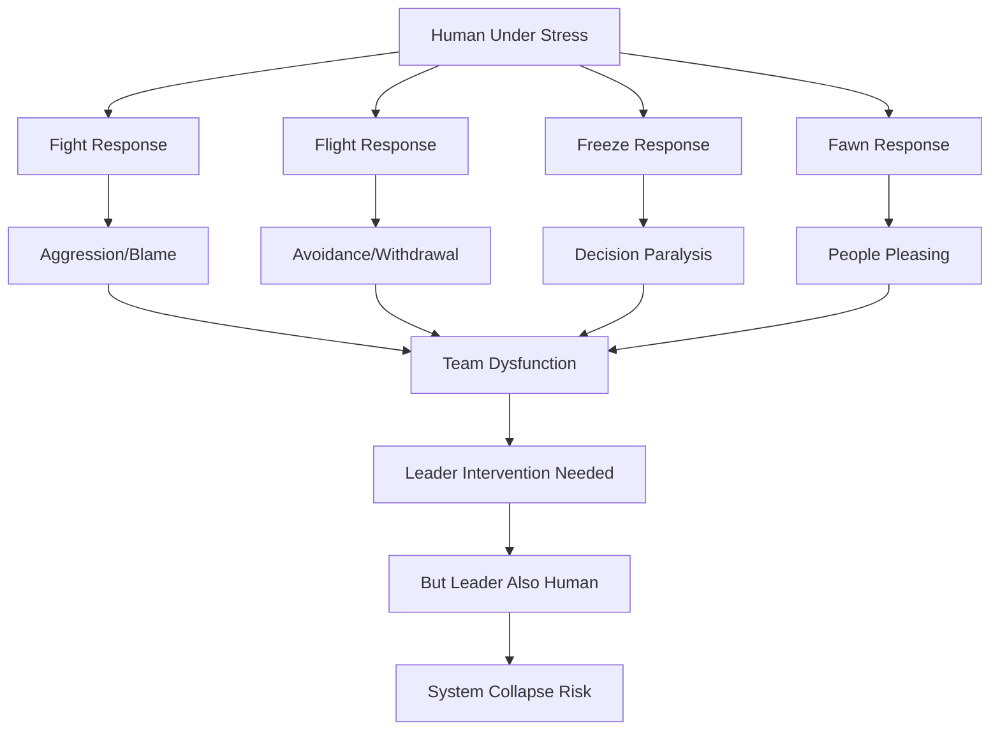

# The Human Cost: Mental Health, Burnout, and the Reality of Leading Humans


## Overview

The Human Cost: Mental Health, Burnout, and the Reality of Leading Humans
description: Leadership books talk about strategy and execution. They don't talk about the 2 AM panic attacks, the Sunday night dread, or holding someone while the
type: interview-guide
---

# The Human Cost: Mental Health, Burnout, and the Reality of Leading Humans

## Table of Contents

- [The Truth They Don't Tell You](#the-truth-they-dont-tell-you)
- [🧠 Framework Integration: Human Behavior Meets Personal Integrity](#-framework-integration-human-behavior-meets-personal-integrity)
  - [Understanding Human Systems Under Stress](#understanding-human-systems-under-stress)
  - [Behavioral Psychology in Crisis](#behavioral-psychology-in-crisis)
  - [The Integrity-Survival Paradox](#the-integrity-survival-paradox)
- [💔 When Life Happens to Your Team](#-when-life-happens-to-your-team)
  - [The Cancer Conversation](#the-cancer-conversation)
  - [The Suicide Attempt](#the-suicide-attempt)
  - [The Divorce Destruction](#the-divorce-destruction)
  - [The Death Response](#the-death-response)
- [🧠 The Mental Health Crisis Reality](#-the-mental-health-crisis-reality)
  - [Depression in High Performers](#depression-in-high-performers)
  - [The Intervention Conversation](#the-intervention-conversation)
  - [Supporting Anxiety Disorders](#supporting-anxiety-disorders)
- [🔥 The Burnout Epidemic](#-the-burnout-epidemic)
  - [Recognizing Burnout vs Stress](#recognizing-burnout-vs-stress)
  - [Managing Burnout in Others](#managing-burnout-in-others)
  - [Your Own Burnout](#your-own-burnout)
- [👥 The Addiction Reality](#-the-addiction-reality)
  - [When You Suspect Substance Abuse](#when-you-suspect-substance-abuse)
- [⚖️ Principle Conflicts in Human Leadership](#-principle-conflicts-in-human-leadership)
  - [When Caring Conflicts with Business](#when-caring-conflicts-with-business)
  - [The Decision Framework for Human Crises](#the-decision-framework-for-human-crises)
- [🌈 Supporting Marginalized Team Members](#-supporting-marginalized-team-members)
  - [The Additional Burden](#the-additional-burden)
- [🎯 Level-Specific Human Cost Wisdom](#-level-specific-human-cost-wisdom)
  - [Manager Level: First Exposure to Human Pain](#manager-level-first-exposure-to-human-pain)
  - [Senior Manager Level: Systematic Human Challenges](#senior-manager-level-systematic-human-challenges)
  - [Director Level: Organizational Trauma Management](#director-level-organizational-trauma-management)
  - [VP Level: The Weight of Thousands](#vp-level-the-weight-of-thousands)
- [🧠 Sophisticated Mental Models for Human Leadership](#-sophisticated-mental-models-for-human-leadership)
  - [The Wounded Healer Model](#the-wounded-healer-model)
  - [The Container Model](#the-container-model)
  - [The Aikido Model](#the-aikido-model)
- [💊 The Physical Toll](#-the-physical-toll)
  - [What Leadership Does to Your Body](#what-leadership-does-to-your-body)
  - [The Sunday Night Syndrome](#the-sunday-night-syndrome)
- [🛡️ Protecting Yourself While Caring](#-protecting-yourself-while-caring)
  - [Boundaries That Save You](#boundaries-that-save-you)
  - [Self-Care That Actually Works](#self-care-that-actually-works)
- [📖 Stories of Survival and Growth](#-stories-of-survival-and-growth)
  - [The Manager Who Saved My Life](#the-manager-who-saved-my-life)
  - [The Team That Healed Together](#the-team-that-healed-together)
  - [The Leader Who Stepped Back](#the-leader-who-stepped-back)
- [🌅 Finding Meaning in the Darkness](#-finding-meaning-in-the-darkness)
  - [Why We Keep Going](#why-we-keep-going)
- [🎭 Interview Application: Humanity Without TMI](#-interview-application-humanity-without-tmi)
  - [Translating Human Leadership for Interviews](#translating-human-leadership-for-interviews)
- [Final Truth: The Integration of Humanity and Leadership](#final-truth-the-integration-of-humanity-and-leadership)
  - [The Burden You Carry](#the-burden-you-carry)
  - [The Framework Integration](#the-framework-integration)
  - [The Integrity-Sustainability Balance](#the-integrity-sustainability-balance)
  - [The Honor You Hold](#the-honor-you-hold)


## The Truth They Don't Tell You

Leadership books talk about strategy and execution.

**Reading time:** ~16 minutes

## Table of Contents

- [The Truth They Don't Tell You](#the-truth-they-dont-tell-you)
- [🧠 Framework Integration: Human Behavior Meets Personal Integrity](#-framework-integration-human-behavior-meets-personal-integrity)
  - [Understanding Human Systems Under Stress](#understanding-human-systems-under-stress)
  - [Behavioral Psychology in Crisis](#behavioral-psychology-in-crisis)
  - [The Integrity-Survival Paradox](#the-integrity-survival-paradox)
- [💔 When Life Happens to Your Team](#-when-life-happens-to-your-team)
  - [The Cancer Conversation](#the-cancer-conversation)
  - [The Suicide Attempt](#the-suicide-attempt)
  - [The Divorce Destruction](#the-divorce-destruction)
  - [The Death Response](#the-death-response)
- [🧠 The Mental Health Crisis Reality](#-the-mental-health-crisis-reality)
  - [Depression in High Performers](#depression-in-high-performers)
  - [The Intervention Conversation](#the-intervention-conversation)
  - [Supporting Anxiety Disorders](#supporting-anxiety-disorders)
- [🔥 The Burnout Epidemic](#-the-burnout-epidemic)
  - [Recognizing Burnout vs Stress](#recognizing-burnout-vs-stress)
  - [Managing Burnout in Others](#managing-burnout-in-others)
  - [Your Own Burnout](#your-own-burnout)
- [👥 The Addiction Reality](#-the-addiction-reality)
  - [When You Suspect Substance Abuse](#when-you-suspect-substance-abuse)
- [⚖️ Principle Conflicts in Human Leadership](#-principle-conflicts-in-human-leadership)
  - [When Caring Conflicts with Business](#when-caring-conflicts-with-business)
  - [The Decision Framework for Human Crises](#the-decision-framework-for-human-crises)
- [🌈 Supporting Marginalized Team Members](#-supporting-marginalized-team-members)
  - [The Additional Burden](#the-additional-burden)
- [🎯 Level-Specific Human Cost Wisdom](#-level-specific-human-cost-wisdom)
  - [Manager Level: First Exposure to Human Pain](#manager-level-first-exposure-to-human-pain)
  - [Senior Manager Level: Systematic Human Challenges](#senior-manager-level-systematic-human-challenges)
  - [Director Level: Organizational Trauma Management](#director-level-organizational-trauma-management)
  - [VP Level: The Weight of Thousands](#vp-level-the-weight-of-thousands)
- [🧠 Sophisticated Mental Models for Human Leadership](#-sophisticated-mental-models-for-human-leadership)
  - [The Wounded Healer Model](#the-wounded-healer-model)
  - [The Container Model](#the-container-model)
  - [The Aikido Model](#the-aikido-model)
- [💊 The Physical Toll](#-the-physical-toll)
  - [What Leadership Does to Your Body](#what-leadership-does-to-your-body)
  - [The Sunday Night Syndrome](#the-sunday-night-syndrome)
- [🛡️ Protecting Yourself While Caring](#-protecting-yourself-while-caring)
  - [Boundaries That Save You](#boundaries-that-save-you)
  - [Self-Care That Actually Works](#self-care-that-actually-works)
- [📖 Stories of Survival and Growth](#-stories-of-survival-and-growth)
  - [The Manager Who Saved My Life](#the-manager-who-saved-my-life)
  - [The Team That Healed Together](#the-team-that-healed-together)
  - [The Leader Who Stepped Back](#the-leader-who-stepped-back)
- [🌅 Finding Meaning in the Darkness](#-finding-meaning-in-the-darkness)
  - [Why We Keep Going](#why-we-keep-going)
- [🎭 Interview Application: Humanity Without TMI](#-interview-application-humanity-without-tmi)
  - [Translating Human Leadership for Interviews](#translating-human-leadership-for-interviews)
- [Final Truth: The Integration of Humanity and Leadership](#final-truth-the-integration-of-humanity-and-leadership)
  - [The Burden You Carry](#the-burden-you-carry)
  - [The Framework Integration](#the-framework-integration)
  - [The Integrity-Sustainability Balance](#the-integrity-sustainability-balance)
  - [The Honor You Hold](#the-honor-you-hold)


## The Truth They Don't Tell You

Leadership books talk about strategy and execution. They don't talk about the 2 AM panic attacks, the Sunday night dread, or holding someone while they sob about their dying parent. This guide covers the human cost of engineering leadership - the part that breaks leaders.

## 🧠 Framework Integration: Human Behavior Meets Personal Integrity

### Understanding Human Systems Under Stress

```python
class HumanSystemsDynamics:
    def map_stress_cascades(self):
        # Individual stress becomes system stress
        stress_propagation = {
            "individual": "Personal crisis or burnout",
            "team_impact": "Decreased performance, morale",
            "organizational": "Cultural degradation",
            "market": "Product quality, customer impact"
        }
        
        # Feedback loops in human systems
        reinforcing_cycles = [
            "Stress → Poor decisions → More stress",
            "Burnout → Cynicism → Team burnout",
            "Trust loss → Micromanagement → More trust loss",
            "Success pressure → Overwork → Failure"
        ]
        
        # Breaking negative cycles
        intervention_points = {
            "Early detection": "Behavioral change recognition",
            "Safe spaces": "Psychological safety creation",
            "Support systems": "EAP, therapy, community",
            "Cultural change": "Normalizing vulnerability"
        }
        
        return human_systems_thinking()
```

### Behavioral Psychology in Crisis



### The Integrity-Survival Paradox

```python
class IntegritySurvivalBalance:
    def navigate_human_cost(self):
        # What integrity demands
        integrity_requirements = [
            "Full transparency with team",
            "Taking unlimited emotional load",
            "Fighting every battle for everyone",
            "Never showing weakness",
            "Solving all personal problems"
        ]
        
        # What survival requires
        survival_requirements = [
            "Boundaries on emotional labor",
            "Self-care and recovery time",
            "Choosing battles wisely",
            "Vulnerability as strength",
            "Referring to professionals"
        ]
        
        # The integration path
        sustainable_leadership = {
            "Bounded caring": "Deep but not infinite",
            "Strategic transparency": "Honest but thoughtful",
            "Modeled humanity": "Strong and vulnerable",
            "Systems not heroes": "Build support structures",
            "Long-term view": "Marathon not sprint"
        }
```

## 💔 When Life Happens to Your Team

### The Cancer Conversation

**The Meeting That Changes Everything**:
```
Sarah: "I need to tell you something..."
[Closes door, sits down heavily]
Sarah: "I have cancer. Stage 3. I start chemo next week."
You: [World stops. Search for words that don't exist]
You: "I'm so sorry. What do you need?"
Sarah: "I don't know. I'm scared. Can I keep working?"
```

**The Reality You Navigate**:
- They need normalcy and flexibility
- Team needs to know but privacy matters
- Work becomes therapy and burden
- You become counselor not manager
- Everything else seems trivial

**What Actually Happens**:
```python
def support_through_cancer():
    immediate_actions = {
        "schedule": "Whatever works for treatment",
        "workload": "Redistribute without drama",
        "communication": "Let them control narrative",
        "benefits": "Max out everything available",
        "team": "Prepare for long journey"
    }
    
    ongoing_support = {
        "check_ins": "Personal before professional",
        "flexibility": "Bad days happen randomly",
        "boundaries": "Respect when they need space",
        "normalcy": "Treat them as person not patient",
        "coverage": "Plan for extended absence"
    }
    
    emotional_toll = {
        "on_them": "Identity crisis, mortality, fear",
        "on_team": "Helplessness, survivor guilt, anxiety",
        "on_you": "Carrying everyone's fear, own mortality"
    }
```

### The Suicide Attempt

**The Call You'll Never Forget**:
```
Friday, 11 PM: Phone rings
Unknown number: "This is [Hospital]. We have Eric here. 
He listed you as emergency contact."
You: "Is he okay?"
Nurse: "He attempted suicide. He's stable. Can you come?"
```

**The Aftermath Navigation**:
```python
class CrisisResponse:
    def handle_suicide_attempt(self):
        # Immediate (Hour 1-24)
        self.go_to_hospital()  # Yes, you go
        self.listen_without_fixing()
        self.connect_professional_help()
        self.ensure_safety_plan()
        
        # Short term (Week 1-4)
        self.coordinate_leave()
        self.manage_confidentiality()
        self.redistribute_work_quietly()
        self.check_in_appropriately()
        
        # Long term (Months)
        self.support_graduated_return()
        self.watch_for_warning_signs()
        self.maintain_boundaries()
        self.carry_this_forever()
```

**The Team Impact**:
- Some will know, some won't
- Survivors guilt is real
- Everyone questions their awareness
- Work seems meaningless
- Team bonds deepen or break

### The Divorce Destruction

**The Gradual Unraveling**:
```
Month 1: "Having some issues at home"
Month 2: Coming in late, leaving early
Month 3: "We're separating"
Month 4: Custody battle begins
Month 5: Living in apartment, kids weekends only
Month 6: Performance tanking, drinking suspected
```

**Your Impossible Balance**:
```python
def manage_through_divorce():
    compassion_actions = [
        "Flexible schedule for lawyer/court",
        "Work from home when has kids",
        "Reduce travel requirements",
        "Cover for emotional days",
        "Listen without judging"
    ]
    
    business_realities = [
        "Work still needs doing",
        "Team getting frustrated",
        "Deadlines still exist",
        "Quality standards matter",
        "Other lives depending on success"
    ]
    
    return find_impossible_balance()
```

### The Death Response

**Types of Loss You'll Navigate**:
- Parent dying (expected but devastating)
- Child death (destroys everything)
- Spouse death (identity crisis)
- Sibling suicide (guilt forever)
- Miscarriage (invisible grief)

**The Protocol That Doesn't Exist**:
```
What HR Says: "Bereavement leave is 3-5 days"
Reality: Grief lasts years

What You Actually Do:
- Immediate unlimited time
- Gradual return when ready
- Reduced responsibilities for months
- Check-ins that respect boundaries
- Accept performance will suffer
- Hold space for their pain
```

## 🧠 The Mental Health Crisis Reality

### Depression in High Performers

**The Hidden Epidemic**:
Your best engineers are often most at risk. The same traits that make them excellent make them vulnerable.

**Warning Signs You'll Miss**:
```python
class DepressionIndicators:
    subtle_signs = [
        "Camera always off now",
        "Stopped contributing ideas",
        "Working odd hours only",
        "Slack responses terse",
        "Avoiding optional meetings",
        "Deliveries technically correct but soulless"
    ]
    
    escalating_signs = [
        "Hygiene declining (when camera on)",
        "Missed deadlines (never happened before)",
        "Emotional regulation issues",
        "Isolation from team",
        "Self-deprecating 'jokes'",
        "Flat affect in 1:1s"
    ]
    
    crisis_signs = [
        "Giving away prized possessions",
        "Wrapping up all projects",
        "Saying goodbye subtly",
        "Sudden mood improvement",
        "Talk of 'not being burden'",
        "You have deep gut feeling"
    ]
```

### The Intervention Conversation

**The Approach That Works**:
```
You: "I've noticed you seem to be struggling. I'm concerned about you as a person, not your work."
Them: "I'm fine, just tired."
You: "I recognize that look. I've been there. You're not alone."
Them: [Silence or breakdown]
You: "Have you talked to someone professional?"
Them: "I can't afford..."
You: "We have EAP. I'll help you navigate it. Today."
```

**What Not to Say**:
- "Just think positive"
- "Others have it worse"
- "You have so much to be grateful for"
- "Maybe you need a vacation"
- "We all get sad sometimes"

### Supporting Anxiety Disorders

**The Panic Attack Protocol**:
```python
def handle_panic_attack():
    # In the moment
    if in_person:
        - Stay calm yourself
        - Don't crowd them
        - Speak slowly and softly
        - "You're safe. This will pass."
        - Count breathing with them
        
    if remote:
        - "I'm here with you"
        - Mute others if needed
        - Guide breathing
        - Stay on until it passes
        - Follow up privately
    
    # After
    - Never mention publicly
    - Check in later that day
    - Discuss accommodations
    - Normalize without minimizing
```

## 🔥 The Burnout Epidemic

### Recognizing Burnout vs Stress

**Stress**: "I have too much to do"
**Burnout**: "Nothing I do matters"

**The Burnout Progression**:
```
Stage 1: Honeymoon
- High energy and commitment
- Putting in extra hours happily
- Taking on everything

Stage 2: Onset of Stress
- Occasional fatigue and irritability
- Some days feeling ineffective
- Starting to skip personal activities

Stage 3: Chronic Stress
- Persistent exhaustion
- Cynicism emerging
- Physical symptoms appearing
- Relationships suffering

Stage 4: Burnout
- Complete physical/emotional exhaustion
- Detachment from work/people
- Feeling incompetent/unsuccessful
- Health problems manifesting

Stage 5: Habitual Burnout
- Chronic mental/physical symptoms
- Complete disengagement
- May need medical leave
- Career/life crisis
```

### Managing Burnout in Others

**The Intervention Playbook**:
```python
class BurnoutIntervention:
    def recognize_and_act(self, engineer):
        if stage <= 2:
            actions = [
                "Mandatory PTO",
                "Workload reduction",
                "Project rotation",
                "Skill development time"
            ]
            
        elif stage <= 3:
            actions = [
                "Extended time off",
                "Significant scope reduction",
                "Flexible schedule",
                "Professional support"
            ]
            
        else:  # Stage 4-5
            actions = [
                "Medical leave discussion",
                "Complete project offload",
                "Recovery plan creation",
                "Long-term support"
            ]
            
        return execute_with_compassion(actions)
```

### Your Own Burnout

**The Leader's Paradox**: You're burning out while preventing others' burnout

**Your Warning Signs**:
- Sunday night dread increasing
- Fantasizing about quitting daily
- Physical symptoms (chest pain, insomnia)
- Emotional numbness to team
- Making uncharacteristic mistakes
- Family commenting on changes

**The Options No One Talks About**:
1. **Sabbatical** (if company allows)
2. **Step down** (lateral move)
3. **Leave management** (become IC)
4. **Change companies** (reset)
5. **Leave tech** (nuclear option)

## 👥 The Addiction Reality

### When You Suspect Substance Abuse

**The Signs**:
```
Morning: Smell of alcohol (explained as mouthwash)
Meetings: Erratic behavior/mood swings
Code Reviews: Quality wildly inconsistent
Team Events: Always drinking, last to leave
Slack: 3 AM messages, then late arrival
Physical: Weight changes, hygiene decline
```

**The Impossible Conversation**:
```
You: "I'm concerned about you. Is everything okay?"
Them: "Yeah, why?"
You: "I've noticed some changes that worry me..."
Them: "Are you accusing me of something?"
You: "I'm trying to help. If you're struggling..."
Them: "I'm fine. Is my work suffering?"
You: [The trap - yes means PIP, no enables]
```

**Your Limited Options**:
- Document behavioral impacts only
- Focus on work performance
- Offer EAP resources
- Cannot force help
- Prepare for denial/anger
- Protect team from impact
- Accept you might lose them

## ⚖️ Principle Conflicts in Human Leadership

### When Caring Conflicts with Business

```python
class HumanLeadershipConflicts:
    def navigate_principle_tensions(self):
        core_conflicts = {
            "Performance vs Compassion": {
                "situation": "Depressed high performer declining",
                "performance": "Address output issues",
                "compassion": "Give unlimited support",
                "integration": "Bounded support with clear plan"
            },
            
            "Transparency vs Privacy": {
                "situation": "Team member's mental health crisis",
                "transparency": "Team needs to know why",
                "privacy": "Personal medical information",
                "integration": "Share impact, not details"
            },
            
            "Individual vs Team": {
                "situation": "One person's crisis affecting all",
                "individual": "Support struggling person",
                "team": "Protect team from burnout",
                "integration": "Time-boxed accommodation"
            },
            
            "Equity vs Equality": {
                "situation": "Different people need different support",
                "equality": "Same treatment for all",
                "equity": "More help for those who need it",
                "integration": "Fair but not identical"
            }
        }
        
        return find_sustainable_middle_path()
```

### The Decision Framework for Human Crises

```python
class CrisisDecisionFramework:
    def human_centered_decisions(self, crisis):
        # Modified SPADE for human situations
        
        # Setting (with human context)
        context = {
            "business_needs": "What must continue",
            "human_needs": "What person requires",
            "team_needs": "What others need",
            "your_capacity": "What you can give"
        }
        
        # People (concentric circles of impact)
        stakeholders = {
            "inner": "Person in crisis",
            "immediate": "Their team/family",
            "extended": "Broader organization",
            "self": "Your own well-being"
        }
        
        # Alternatives (with humanity)
        options = [
            "Full support (unsustainable)",
            "No support (inhumane)",
            "Bounded support (sustainable)",
            "External support (professional)"
        ]
        
        # Decide (with compassion)
        decision_criteria = {
            "Immediate safety": "First priority",
            "Long-term sustainability": "Must consider",
            "Precedent setting": "Others watching",
            "Resource availability": "Real constraints"
        }
        
        # Execute (with grace)
        execution = {
            "Clear communication": "Boundaries with care",
            "Follow-through": "Promises kept",
            "Check-ins": "Ongoing support",
            "Self-care": "Your oxygen mask first"
        }
```

## 🌈 Supporting Marginalized Team Members

### The Additional Burden

**What They Face**:
- Microaggressions daily
- Imposter syndrome amplified
- Code-switching exhaustion
- Representation pressure
- Tokenism burden
- Systemic barriers

**Real Support Actions**:
```python
def support_marginalized_engineers():
    visible_actions = [
        "Call out bias in real-time",
        "Amplify their voices in meetings",
        "Ensure equal opportunity distribution",
        "Protect from 'diversity' extra work",
        "Compensate cultural contributions"
    ]
    
    invisible_actions = [
        "Educate yourself constantly",
        "Check your own biases",
        "Create psychological safety",
        "Build sponsorship (not just mentorship)",
        "Fight systemic battles they can't"
    ]
    
    return consistent_allyship_not_performance
```

## 🎯 Level-Specific Human Cost Wisdom

### Manager Level: First Exposure to Human Pain

```python
class ManagerLevelHumanCost:
    def early_leadership_trauma(self):
        first_exposures = [
            "First person crying in your office",
            "First mental health disclosure",
            "First family crisis affecting work",
            "First time being emotional support",
            "First realization: I'm not qualified for this"
        ]
        
        common_mistakes = [
            "Trying to fix everything",
            "Taking on their emotions",
            "Becoming therapist",
            "Ignoring own needs",
            "Breaking boundaries"
        ]
        
        survival_skills = {
            "Listen without solving": "Presence over solutions",
            "Know your limits": "When to refer out",
            "Document with care": "Legal but human",
            "Build support network": "You need help too"
        }
        
        # Interview Application
        interview_story = {
            "Situation": "Team member facing challenge",
            "Response": "Balanced support with boundaries",
            "Result": "Maintained performance and morale",
            "Never_mention": "The nights you couldn't sleep"
        }
```

### Senior Manager Level: Systematic Human Challenges

```python
class SeniorManagerHumanCost:
    def organizational_emotional_labor(self):
        scaled_challenges = [
            "Multiple simultaneous crises",
            "Choosing who gets support",
            "Managing managers' burnout",
            "Organizational mental health",
            "Your own breaking point"
        ]
        
        boundary_management = {
            "Time boundaries": "Not available 24/7",
            "Emotional boundaries": "Care but detach",
            "Role boundaries": "Leader not savior",
            "Resource boundaries": "Limited capacity"
        }
        
        # Interview Translation
        executive_framing = {
            "Story": "Built resilient team culture",
            "Focus": "Systematic support structures",
            "Metrics": "Retention and engagement",
            "Hidden": "Personal cost to you"
        }
```

### Director Level: Organizational Trauma Management

```python
class DirectorLevelHumanity:
    def lead_through_organizational_trauma(self):
        organizational_crises = [
            "Mass layoff aftermath",
            "Suicide impact on organization",
            "Public failure trauma",
            "Merger culture destruction",
            "Pandemic-scale crisis"
        ]
        
        leadership_approach = {
            "Visible vulnerability": "Model human response",
            "Systematic support": "Infrastructure not heroes",
            "Cultural healing": "Long-term process",
            "External resources": "Professional help",
            "Personal sustainability": "You're human too"
        }
        
        # Interview Narrative
        board_appropriate_story = {
            "Challenge": "Led through organizational change",
            "Approach": "Human-centered transformation",
            "Results": "Maintained culture and performance",
            "Omit": "The therapy you needed after"
        }
```

### VP Level: The Weight of Thousands

```python
class VPLevelHumanBurden:
    def carry_organizational_humanity(self):
        executive_human_challenges = [
            "Deciding healthcare benefits (life/death)",
            "Mental health budget allocation",
            "Work-life balance policy (affects thousands)",
            "Culture that enables or destroys",
            "Your visible humanity sets tone"
        ]
        
        impossible_balance = {
            "Shareholder demands": "Maximize profit",
            "Employee needs": "Human sustainability",
            "Your integrity": "Sleep at night",
            "Market reality": "Competitive pressure",
            "Long-term thinking": "People before quarter"
        }
        
        # What You Can Never Say
        executive_secrets = [
            "How many antidepressants in C-suite",
            "The executives who broke down",
            "Suicide attempts you prevented",
            "Your own therapy schedule",
            "The human cost of profit"
        ]
```

## 🧠 Sophisticated Mental Models for Human Leadership

### The Wounded Healer Model

```python
class WoundedHealerLeadership:
    """Leading through shared humanity"""
    
    def integrated_leadership(self):
        # Your wounds become wisdom
        transformation_path = {
            "Personal trauma": "Understanding others' pain",
            "Past failures": "Compassion for struggle",
            "Mental health journey": "Destigmatizing for others",
            "Family challenges": "Work-life integration",
            "Career setbacks": "Resilience modeling"
        }
        
        # Boundaries still matter
        healthy_disclosure = {
            "Share journey": "Not active crisis",
            "Show scars": "Not open wounds",
            "Model recovery": "Not ongoing struggle",
            "Inspire hope": "Not burden others"
        }
        
        leadership_gift = [
            "Authenticity that heals",
            "Permission to be human",
            "Safety in vulnerability",
            "Strength through struggle",
            "Community in pain"
        ]
```

### The Container Model

```python
class EmotionalContainerLeadership:
    """Holding space without absorbing"""
    
    def container_practices(self):
        # You are container, not sponge
        container_properties = {
            "Strong walls": "Boundaries that hold",
            "Clear space": "Room for their emotions",
            "Drainage system": "Release what's not yours",
            "Regular cleaning": "Self-care practices",
            "Appropriate size": "Not infinite capacity"
        }
        
        daily_practices = [
            "Morning: Set intention",
            "During: Hold space",
            "Breaks: Release energy",
            "Evening: Clear container",
            "Night: Seal boundaries"
        ]
        
        when_container_breaks = {
            "Recognize signs": "Absorbing others' pain",
            "Step back": "Temporary withdrawal",
            "Repair": "Therapy, rest, recovery",
            "Reinforce": "Stronger boundaries",
            "Return": "With better structure"
        }
```

### The Aikido Model

```python
class EmotionalAikido:
    """Redirecting emotional energy skillfully"""
    
    def redirect_not_absorb(self):
        emotional_techniques = {
            "Anger at you": "Redirect to problem",
            "Despair dumping": "Redirect to action",
            "Blame placing": "Redirect to ownership",
            "Chaos creating": "Redirect to structure",
            "Dependency forming": "Redirect to strength"
        }
        
        verbal_aikido = [
            "I hear your pain AND what do you need?",
            "This is hard AND you're strong",
            "I understand AND what's next?",
            "That's valid AND what helps?",
            "I'm here AND you've got this"
        ]
```

## 💊 The Physical Toll

### What Leadership Does to Your Body

**Year 1-2**: 
- Sleep disruption begins
- Stress eating/not eating
- Exercise routine dies
- Coffee consumption triples

**Year 3-5**:
- Chronic back/neck pain
- Tension headaches weekly
- Digestive issues emerge
- Blood pressure rising

**Year 5-10**:
- Medication likely needed
- Chronic conditions develop
- Aging accelerated visibly
- Relationship stress physical

**Year 10+**:
- Body keeps the score
- Irreversible changes
- Health becomes priority
- Or you don't make it

### The Sunday Night Syndrome

```python
class SundayNightAnxiety:
    def weekly_spiral(self):
        3_pm = "Weekend ending dread begins"
        5_pm = "Checking Slack reluctantly"
        7_pm = "Stomach knots forming"
        9_pm = "Reviewing calendar, despair growing"
        11_pm = "Can't sleep, running scenarios"
        1_am = "Still awake, exhausted for Monday"
        
        return chronic_anxiety_condition()
```

## 🛡️ Protecting Yourself While Caring

### Boundaries That Save You

**Essential Boundaries**:
1. **Emotional**: Care deeply, attach loosely
2. **Time**: Off means off (mostly)
3. **Responsibility**: Support, don't save
4. **Professional**: Leader, not therapist
5. **Personal**: Your family comes first

**Boundary Setting Language**:
- "I care about you AND need to maintain boundaries"
- "I can support you in these ways..."
- "Have you considered professional help?"
- "Let's find resources together"
- "I need to take care of myself to help others"

### Self-Care That Actually Works

**Beyond Bubble Baths**:
```python
def real_self_care():
    daily_practices = [
        "5-minute morning meditation",
        "Walk between meetings",
        "Actual lunch break",
        "Phone off at 9 PM",
        "Gratitude practice (even forced)"
    ]
    
    weekly_practices = [
        "Therapy (non-negotiable)",
        "Exercise 3x minimum",
        "One full day offline",
        "Something creative/fun",
        "Connection with friends"
    ]
    
    monthly_practices = [
        "Long weekend away",
        "Professional development",
        "Health checkups",
        "Relationship investment",
        "Reevaluate boundaries"
    ]
```

## 📖 Stories of Survival and Growth

### The Manager Who Saved My Life

"I was spiraling. Divorce, dad dying, project failing. Putting on brave face. My manager saw through it. She said 'Take the month. Your job will be here. You won't be if you continue.' That month saved my life. I try to be that manager now."

### The Team That Healed Together

"We lost a teammate to suicide. None of us saw it coming. We spent weeks in group therapy together, on company time. We created mental health check-ins as part of standup. We talk about feelings in retro. We're weird by tech standards. We're also alive."

### The Leader Who Stepped Back

"After my third panic attack in a month, I stepped down from Director to Senior Manager. Everyone said I was crazy. My family got me back. My health improved. I'm a better leader at smaller scope than I was dying at larger scope."

## 🌅 Finding Meaning in the Darkness

### Why We Keep Going

**The Moments That Matter**:
- Engineer thanks you years later
- Someone says you saved their career
- Team member names kid after you
- Former report becomes CEO
- Lives literally saved

**The Growth Through Pain**:
- Deeper empathy developed
- Perspective permanently shifted
- Trivial things stop mattering
- Real connections formed
- Authentic leadership emerged

## 🎭 Interview Application: Humanity Without TMI

### Translating Human Leadership for Interviews

```python
class HumanStoryTranslation:
    def professional_narrative(self, real_story):
        # The sanitization matrix
        translations = {
            "Held crying employee": "Supported team through challenge",
            "Managed mental health crisis": "Built psychological safety",
            "Dealt with addiction": "Performance improvement process",
            "Navigated suicide attempt": "Crisis management experience",
            "Personal therapy needed": "Invested in leadership development"
        }
        
        # The story framework
        interview_structure = {
            "Situation": "Team member facing challenges",
            "Approach": "Balanced support with boundaries",
            "Actions": "Connected with resources",
            "Result": "Retained valuable contributor",
            "Learning": "Importance of human-centered leadership"
        }
        
        # Topics to avoid
        never_discuss = [
            "Specific mental health details",
            "Your emotional impact",
            "Boundary violations",
            "Personal therapy",
            "Crying in car after"
        ]
```

## Final Truth: The Integration of Humanity and Leadership

### The Burden You Carry

Engineering leadership isn't about code or systems or processes. It's about holding space for human experiences while delivering business results. It's about being strong when others can't be, and admitting weakness so others feel safe.

### The Framework Integration

The most sophisticated leaders understand:
- **Human Behavior**: People under stress need containers, not solutions
- **Systems Thinking**: Individual pain creates organizational ripples
- **Decision Making**: Sometimes all choices have human costs
- **Strategy**: Sustainable humanity is competitive advantage
- **Integrity**: Boundaries enable long-term caring

### The Integrity-Sustainability Balance

```python
def sustainable_human_leadership():
    integrity_maintained = {
        "Deep caring": "Within boundaries",
        "Full presence": "During work hours",
        "Authentic vulnerability": "Without dependency",
        "Professional support": "Not personal savior",
        "Long-term view": "Marathon not sprint"
    }
    
    sustainability_practices = [
        "Therapy (non-negotiable)",
        "Clear boundaries",
        "Support network",
        "Regular breaks",
        "Meaning-making"
    ]
    
    the_paradox = {
        "Care deeply": "But don't drown",
        "Be available": "But not always",
        "Show humanity": "But maintain strength",
        "Feel their pain": "But don't absorb it",
        "Save who you can": "Accept who you can't"
    }
    
    return leader_who_lasts()
```

### The Honor You Hold

You'll be the manager someone mentions in their wedding speech. The leader who saw potential when they couldn't. The person who held them while they broke and helped them rebuild.

This is the human cost of leadership. It's also the human glory of leadership.

The price is high. The meaning is higher.

But sustainability matters. You can't pour from an empty cup. The most profound service you can offer your team is modeling how to be deeply human while maintaining boundaries, how to care profoundly while staying whole, how to lead with heart while keeping your sanity.

Take care of them. Take care of yourself. Not in that order - simultaneously, because both are essential.

---

*"I've held more crying engineers than I can count. Each one took a piece of me and gave me a piece of wisdom. The job isn't to fix their pain but to witness it with grace. That's the most human thing we do as leaders." - 15-year Engineering Director*

*"The frameworks don't make the human cost easier. They make it sustainable. The difference between burning out in 2 years and leading with humanity for 20." - VP who learned the hard way*