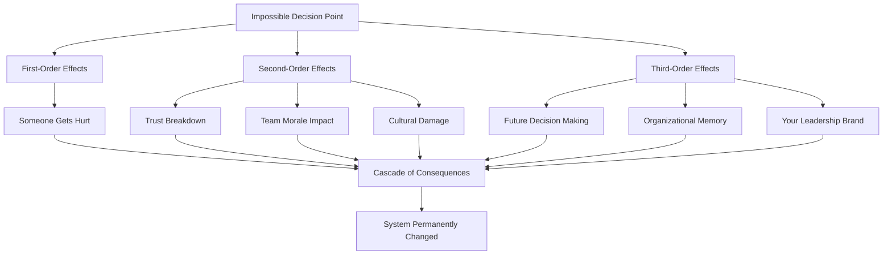

# Impossible Decisions: No-Win Scenarios in Engineering Leadership


## Overview

Impossible Decisions: No-Win Scenarios in Engineering Leadership
description: Some decisions have no good options. No framework helps.

**Reading time:** ~17 minutes

## Table of Contents

- [The Weight of Command](#the-weight-of-command)
- [🤯 Framework Integration: When Decision-Making Principles Collide](#-framework-integration-when-decision-making-principles-collide)
  - [The Paradox of Rational Decision-Making](#the-paradox-of-rational-decision-making)
  - [Systems Thinking in Crisis Decisions](#systems-thinking-in-crisis-decisions)
  - [The Trolley Problem in Engineering Leadership](#the-trolley-problem-in-engineering-leadership)
- [💔 The Hierarchy of Impossible Choices](#-the-hierarchy-of-impossible-choices)
  - [Level 1: Career Damage](#level-1-career-damage)
  - [Level 2: Human Cost  ](#level-2-human-cost-)
  - [Level 3: Soul Crushing](#level-3-soul-crushing)
  - [Level 4: Existential](#level-4-existential)
- [🗡️ The Layoff Selection: Playing God with Careers](#-the-layoff-selection-playing-god-with-careers)
  - [The Scenario You'll Face](#the-scenario-youll-face)
  - [The Impossible Calculation](#the-impossible-calculation)
  - [The Night Before](#the-night-before)
  - [The Conversations](#the-conversations)
  - [Living With It](#living-with-it)
- [🎭 The Promotion Betrayal](#-the-promotion-betrayal)
  - [Choosing Between Equals](#choosing-between-equals)
  - [The Political Reality](#the-political-reality)
  - [The Aftermath Scenarios](#the-aftermath-scenarios)
  - [The Middle Path That Doesn't Exist](#the-middle-path-that-doesnt-exist)
- [💼 Killing Your Baby: Sunset Your Own Success](#-killing-your-baby-sunset-your-own-success)
  - [The Project That Made Your Career](#the-project-that-made-your-career)
  - [The Impossible Logic](#the-impossible-logic)
  - [The Decision Meeting](#the-decision-meeting)
  - [The Execution](#the-execution)
  - [What You Gain and Lose](#what-you-gain-and-lose)
- [⚖️ Principle Conflicts in Impossible Decisions](#-principle-conflicts-in-impossible-decisions)
  - [When Every Principle Fails](#when-every-principle-fails)
  - [Decision-Making Under Moral Distress](#decision-making-under-moral-distress)
- [🌏 The Visa Trap: When Immigration Meets Corporate](#-the-visa-trap-when-immigration-meets-corporate)
  - [The H1B Nightmare](#the-h1b-nightmare)
  - [The Visa Holder's Reality](#the-visa-holders-reality)
  - [The Decision That Haunts You](#the-decision-that-haunts-you)
- [🎪 The Founder Problem](#-the-founder-problem)
  - [Managing Out a Founder](#managing-out-a-founder)
  - [The Political Minefield](#the-political-minefield)
  - [The Execution Paths](#the-execution-paths)
  - [The Human Cost](#the-human-cost)
- [🔮 The Whistleblower's Dilemma](#-the-whistleblowers-dilemma)
  - [When You Discover the Unthinkable](#when-you-discover-the-unthinkable)
  - [The Calculation Matrix](#the-calculation-matrix)
  - [The Night of Decision](#the-night-of-decision)
  - [The Aftermath Realities](#the-aftermath-realities)
- [🎯 Level-Specific Impossible Decisions](#-level-specific-impossible-decisions)
  - [Manager Level: First Blood](#manager-level-first-blood)
  - [Senior Manager Level: The Calculations Get Harder](#senior-manager-level-the-calculations-get-harder)
  - [Director Level: Playing God](#director-level-playing-god)
  - [VP Level: The Loneliest Decisions](#vp-level-the-loneliest-decisions)
- [🧠 Advanced Mental Models for Impossible Decisions](#-advanced-mental-models-for-impossible-decisions)
  - [The Stoic Leader Model](#the-stoic-leader-model)
  - [The Battlefield Commander Model](#the-battlefield-commander-model)
  - [The Emergency Room Model](#the-emergency-room-model)
- [🎯 The Ultimate No-Win: Choosing Who to Save](#-the-ultimate-no-win-choosing-who-to-save)
  - [When You Can Only Save Some](#when-you-can-only-save-some)
- [📚 Living With Impossible Decisions](#-living-with-impossible-decisions)
  - [The Scars You'll Carry](#the-scars-youll-carry)
  - [The Coping Mechanisms](#the-coping-mechanisms)
  - [The Wisdom Earned](#the-wisdom-earned)
- [🌅 Finding Peace](#-finding-peace)
  - [The Integration Process](#the-integration-process)
  - [The Leadership Prayer](#the-leadership-prayer)
- [🎭 Interview Application: Sanitizing Tragedy](#-interview-application-sanitizing-tragedy)
  - [How to Talk About Impossible Decisions](#how-to-talk-about-impossible-decisions)
- [Final Truth: The Integration of Suffering and Leadership](#final-truth-the-integration-of-suffering-and-leadership)
  - [The Price of Leadership](#the-price-of-leadership)
  - [When All Frameworks Fail](#when-all-frameworks-fail)
  - [The Paradox of Growth Through Trauma](#the-paradox-of-growth-through-trauma)
  - [The Ultimate Integration](#the-ultimate-integration)


## The Weight of Command

Some decisions have no good options. No framework helps. No mentor has the answer. You'll make the choice, live with the consequences, and carry the weight forever. This guide explores the decisions that keep engineering leaders awake at night.

## 🤯 Framework Integration: When Decision-Making Principles Collide

### The Paradox of Rational Decision-Making

```python
class ImpossibleDecisionFramework:
    def when_all_frameworks_fail(self):
        # Traditional frameworks assume good options exist
        traditional_approaches = {
            "Cost-Benefit Analysis": "All costs, no benefits",
            "Decision Matrix": "All options score negative",
            "SWOT Analysis": "Threats and Weaknesses only",
            "Risk Assessment": "Only certainty is damage"
        }
        
        # The meta-framework for impossible choices
        impossible_choice_framework = {
            "Accept": "There is no good outcome",
            "Minimize": "Choose least harm",
            "Prepare": "For all consequences",
            "Execute": "With full commitment",
            "Carry": "The weight forever"
        }
        
        # Decision principles in conflict
        principle_conflicts = [
            ("Utilitarian", "Greatest good for greatest number"),
            ("Deontological", "Some things are always wrong"),
            ("Virtue Ethics", "What would good person do"),
            ("Care Ethics", "Preserve relationships"),
            ("Justice", "Fairness and equality")
        ]
        
        return choose_which_principle_to_violate()
```

### Systems Thinking in Crisis Decisions



### The Trolley Problem in Engineering Leadership

```python
def engineering_trolley_problems():
    scenarios = [
        {
            "situation": "Layoff Selection",
            "track_A": "Fire 5 average performers",
            "track_B": "Fire 2 high performers",
            "twist": "High performers have families, visas"
        },
        {
            "situation": "Project Failure",
            "track_A": "Blame the team (they survive)",
            "track_B": "Take blame (you're sacrificed)",
            "twist": "Team needs your protection for next project"
        },
        {
            "situation": "Ethical Violation",
            "track_A": "Report it (company may fail)",
            "track_B": "Stay quiet (customers harmed)",
            "twist": "1000 employees vs million users"
        }
    ]
    
    # No framework solves these
    # Only human judgment in impossible moments
    return carry_the_choice_forever()
```

## 💔 The Hierarchy of Impossible Choices

### Level 1: Career Damage
- Killing your own successful project
- Promoting the wrong person
- Taking blame for peer's failure

### Level 2: Human Cost  
- Choosing who to lay off
- Firing a friend
- Managing out a founder

### Level 3: Soul Crushing
- Betraying someone's trust for company
- Choosing between equally deserving people
- Deciding who loses their visa

### Level 4: Existential
- Whistleblowing vs family security
- Integrity vs survival
- Truth vs loyalty

## 🗡️ The Layoff Selection: Playing God with Careers

### The Scenario You'll Face

**The Call**: "We need to cut 30%. List by EOD tomorrow."

**The Reality**: You have 15 engineers. You must choose 5 lives to destroy.

### The Impossible Calculation

```python
class ImpossibleChoice:
    def choose_who_dies(self, team):
        # The spreadsheet of souls
        factors = {
            "Alice": {
                "performance": "excellent",
                "tenure": "6 years", 
                "personal": "single mom, 2 kids",
                "visa": "citizen",
                "unique_knowledge": "auth system expert"
            },
            "Bob": {
                "performance": "good",
                "tenure": "2 years",
                "personal": "wife pregnant, just bought house",
                "visa": "citizen", 
                "unique_knowledge": "replaceable"
            },
            "Chen": {
                "performance": "excellent",
                "tenure": "3 years",
                "personal": "supporting parents overseas",
                "visa": "H1B - must leave country if fired",
                "unique_knowledge": "ML pipeline expert"
            },
            "Diana": {
                "performance": "adequate",
                "tenure": "8 years",
                "personal": "going through divorce",
                "visa": "citizen",
                "unique_knowledge": "institutional knowledge"
            },
            "Eric": {
                "performance": "struggling",
                "tenure": "1 year",
                "personal": "young, single, flexible",
                "visa": "citizen",
                "unique_knowledge": "none yet"
            }
        }
        
        # The cruel logic
        if optimize_for_performance:
            cut = ["Diana", "Eric", "Bob", ...]  # Destroy families
            
        if optimize_for_humanity:
            cut = ["Eric", "Junior1", "Junior2", ...]  # Destroy careers
            
        if optimize_for_business:
            cut = ["Bob", "Diana", "Junior1", ...]  # Destroy loyalty
            
        # The truth: Every choice is wrong
        return soul_crushing_decision
```

### The Night Before

**10 PM**: Starting at spreadsheets, calculating lives
**11 PM**: Third whiskey, names becoming people
**12 AM**: Texting wife "Still at office, bad day tomorrow"
**1 AM**: Moving names in and out of death list
**2 AM**: Googling "manager support groups"
**3 AM**: Final list. Hate every name on it.
**4 AM**: Email to HR. Can't sleep anyway.

### The Conversations

**The Script That Haunts You**:
```
You: "I have difficult news. Your position has been eliminated."
Them: "But... my visa... I have 60 days..."
You: "I know. I'm so sorry. I'll do everything I can to help."
Them: "My kids... we just moved here for this job..."
You: [Dies inside] "Here's the severance package..."
```

### Living With It

**Year 1**: Check their LinkedIn obsessively
**Year 2**: Still send holiday cards
**Year 3**: They find new job, you exhale slightly
**Year 10**: Still remember their face that day
**Forever**: Wonder if you chose right

## 🎭 The Promotion Betrayal

### Choosing Between Equals

**The Setup**: One promotion slot. Two deserving candidates.

**Sarah**: 
- Brilliant technically
- Loved by team
- Diverse candidate
- Quiet leadership style
- Your personal favorite

**Mike**:
- Good technically
- Better at managing up
- Plays politics well
- Takes credit aggressively
- Executive's favorite

### The Political Reality

```python
def promotion_decision():
    # What you want to do
    if merit_based:
        promote(Sarah)  # Right choice
        
    # What happens if you do
    if promote(Sarah):
        Mike.becomes_enemy()
        Executive.questions_judgment()
        Sarah.faces_hostile_environment()
        You.lose_political_capital()
        
    # What happens if you don't
    if promote(Mike):
        Sarah.feels_betrayed()
        Team.loses_faith()
        You.hate_yourself()
        Mike.makes_Sarah_quit()
        
    # The impossible choice
    return decision_you_ll_regret_either_way
```

### The Aftermath Scenarios

**If You Choose Sarah**:
- Mike undermines her constantly
- Executive "checks in" on her frequently
- She struggles without political support
- You fight battles for her daily
- She succeeds or fails on your shield

**If You Choose Mike**:
- Sarah's eyes when you tell her
- Team morale plummets
- Your best people start leaving
- Mike claims credit for everything
- You enabled a politician over a leader

### The Middle Path That Doesn't Exist

You'll try to find compromise:
- "Let's promote both!" (No budget)
- "Let's wait a cycle!" (One will leave)
- "Let's split the role!" (Sets both up to fail)
- "Let's be transparent!" (Destroys one publicly)

There is no middle path. Choose and live with ghosts.

## 💼 Killing Your Baby: Sunset Your Own Success

### The Project That Made Your Career

You built it. Scaled it. It's your legacy. Now you must kill it.

**The Situation**:
- Your platform serves 1M users
- Team of 12 maintaining it
- Company pivoting to new direction
- Your baby doesn't fit new strategy
- You must recommend: sunset or maintain

### The Impossible Logic

```markdown
Business Case for Shutdown:
- Saves $3M annually
- Frees 12 engineers for new priority
- Reduces technical complexity
- Aligns with strategy

Human Case Against Shutdown:
- 1M users depend on it
- Team's whole career invested
- Your reputation built on it
- Industry recognition for it
- It still works perfectly
```

### The Decision Meeting

```
CEO: "What's your recommendation?"
You: [Long pause] "We should sunset it."
CEO: "But this is your project?"
You: "That's why you should trust my judgment."
Team: [Feeling utterly betrayed]
Users: [About to hate you]
You: [Professional suicide for company good]
```

### The Execution

**Month 1**: Announce internally (team devastated)
**Month 2**: Announce externally (users riot)
**Month 3**: Migration plan (everyone angry)
**Month 6**: Features frozen (team leaving)
**Month 9**: Shutdown begins (legacy crumbles)
**Month 12**: It's gone (so is your soul)

### What You Gain and Lose

**Gain**:
- Executive trust (killed your own baby)
- Strategic thinking reputation
- Political capital for next project

**Lose**:
- Team loyalty (many never forgive)
- Industry reputation (killer of good things)
- Part of your identity
- The thing you were proudest of

## ⚖️ Principle Conflicts in Impossible Decisions

### When Every Principle Fails

```python
class PrincipleCollisions:
    def analyze_conflicts(self, decision):
        # Fairness vs Compassion
        layoff_dilemma = {
            "fair_approach": "Performance-based selection",
            "compassionate_approach": "Consider personal situations",
            "conflict": "Fair means destroying vulnerable lives",
            "resolution": "There isn't one"
        }
        
        # Transparency vs Kindness  
        terminal_project = {
            "transparent": "Tell team project is doomed",
            "kind": "Let them hope while finding new roles",
            "conflict": "Truth destroys morale, lies destroy trust",
            "resolution": "Managed transparency with support"
        }
        
        # Loyalty vs Integrity
        covering_failure = {
            "loyal": "Protect the person who failed",
            "integrity": "Report the truth",
            "conflict": "Career vs conscience",
            "resolution": "Partial truth with consequences"
        }
        
        # Individual vs Collective
        resource_allocation = {
            "individual": "Save the struggling team member",
            "collective": "Redirect resources to team",
            "conflict": "One person's career vs team success",
            "resolution": "Usually sacrifice individual"
        }
```

### Decision-Making Under Moral Distress

```python
class MoralDistressDecisions:
    """When right action is blocked by constraints"""
    
    def navigate_moral_injury(self):
        # You know what's right but can't do it
        moral_injuries = [
            "Laying off better person for politics",
            "Promoting worse candidate for diversity",
            "Hiding information that would help team",
            "Following orders that harm people",
            "Choosing company over human dignity"
        ]
        
        # The accumulation effect
        stages_of_moral_injury = [
            "Initial compromise (feels wrong)",
            "Rationalization (necessary evil)",
            "Normalization (part of job)",
            "Numbness (stop feeling)",
            "Cynicism (nothing matters)",
            "Burnout (can't continue)"
        ]
        
        # Mitigation strategies
        harm_reduction = {
            "Document reasoning": "For future reflection",
            "Seek witnesses": "Share burden of decision",
            "Set boundaries": "Define your limits",
            "Plan recovery": "How to help victims later",
            "Time limit": "How long you'll tolerate"
        }
```

## 🌏 The Visa Trap: When Immigration Meets Corporate

### The H1B Nightmare

**Scenario**: Must lay off 3 people. Your team:
- 5 on H1B visas (must leave country if fired)
- 7 citizens (have safety nets)

**The Cruel Math**:
```python
if optimize_for_fairness:
    # Performance-based selection
    laid_off = ["H1B_top_performer", "Citizen_average", "H1B_good"]
    # Result: Destroy lives, force deportation
    
if optimize_for_humanity:
    # Protect visa holders
    laid_off = ["Citizen_good", "Citizen_average", "Citizen_okay"]
    # Result: Unfair, legal risk, team resentment
    
if follow_legal_advice:
    # "No special consideration for visa status"
    laid_off = purely_performance_based()
    # Result: Lawyers happy, humans destroyed
```

### The Visa Holder's Reality

**What happens when laid off**:
- Day 1: Termination, 60-day clock starts
- Day 10: Frantically applying everywhere
- Day 30: Considering moving family back
- Day 45: Selling possessions
- Day 55: Accepting any offer
- Day 60: Leaving country, kids from school
- Day 90: Starting over in home country

### The Decision That Haunts You

**Option A**: Protect visa holders
- Risk: Discrimination lawsuit from citizens
- Reality: Saving families from deportation
- Cost: Your fairness principles

**Option B**: Ignore visa status
- Risk: Destroying lives unnecessarily
- Reality: Following legal guidance
- Cost: Your humanity

**Option C**: Creative solutions
- Convert to contractor? (Usually illegal)
- Transfer to subsidiary? (If exists)
- Negotiate longer runway? (Rarely works)

**The Truth**: There's no good option. Choose your guilt.

## 🎪 The Founder Problem

### Managing Out a Founder

**The Situation**:
- Early employee/co-founder
- Doesn't scale with company
- Protected by CEO emotions
- Team suffering under them
- You must fix it

### The Political Minefield

```python
class FounderProblem:
    def navigate_minefield(self):
        obstacles = {
            "emotional": "CEO's personal friend",
            "political": "Board knows them",
            "practical": "Owns critical knowledge",
            "cultural": "Employee #1 mythology",
            "legal": "Significant equity stake"
        }
        
        approaches = {
            "direct": self.certain_death(),
            "indirect": self.slow_suffocation(),
            "collaborative": self.unlikely_success(),
            "wait_out": self.team_exodus()
        }
        
        return no_good_options
```

### The Execution Paths

**Path 1: The Direct Confrontation**
```
You: "We need to talk about Dave's impact..."
CEO: "Dave built this company!"
You: "I understand, but currently he's..."
CEO: "Make it work. Dave stays."
Result: You're now the problem
```

**Path 2: The Slow Transition**
- Gradually reduce responsibilities
- Move to "advisory" role
- Create parallel structures
- Wait for natural exit
- Risk: Takes 18+ months, team suffers

**Path 3: The Alliance Building**
- Document impact carefully
- Build peer consensus
- Get customer complaints
- Present united front
- Risk: Seen as coup attempt

### The Human Cost

**Dave's Perspective**:
- Built this from nothing
- Watching his baby outgrow him
- Identity tied to company
- Ego can't accept change
- Becomes defensive/destructive

**Your Perspective**:
- Team begging for help
- Metrics showing damage
- Caught between loyalty and duty
- No winning move
- Career risk either way

## 🔮 The Whistleblower's Dilemma

### When You Discover the Unthinkable

**What You Found**:
- Financial fraud
- Safety violations
- Data breach coverup
- Discrimination systematic
- Customer deception

### The Calculation Matrix

```python
class WhistleblowerDilemma:
    def calculate_paths(self):
        if report_internally:
            outcomes = [
                "Fixed quietly (5% chance)",
                "Buried and you're marked (60% chance)",
                "Retaliation begins (30% chance)",
                "Token fix, problem continues (5% chance)"
            ]
            
        if report_externally:
            outcomes = [
                "Company fixes, you're fired (90% chance)",
                "Legal protection, career damaged (8% chance)",
                "Becomes public hero, unemployable (2% chance)"
            ]
            
        if stay_silent:
            outcomes = [
                "Complicit in harm (100% chance)",
                "Eventually comes out anyway (70% chance)",
                "Live with guilt forever (100% chance)",
                "May face legal consequences (30% chance)"
            ]
            
        return all_paths_lead_to_suffering
```

### The Night of Decision

**2 AM Thoughts**:
- "My kids' college funds..."
- "Those customers trusting us..."
- "My team doesn't know..."
- "My mortgage payments..."
- "Can I live with this?"
- "Can I live without a job?"
- "What would I want someone to do?"

### The Aftermath Realities

**If You Whistleblow**:
- Industry blacklisting (subtle but real)
- Legal proceedings (years of stress)
- Financial destruction (lawyers expensive)
- Family stress (relationship test)
- Hero to some, traitor to others

**If You Don't**:
- Moral injury (permanent)
- Anxiety/depression (common)
- Waiting for exposure (always)
- Complicity guilt (forever)
- Loss of self-respect

## 🎯 Level-Specific Impossible Decisions

### Manager Level: First Blood

```python
class ManagerImpossibleDecisions:
    def early_career_dilemmas(self):
        first_impossible_choices = [
            "First time firing someone (they're trying hard)",
            "Choosing between two friends for promotion",
            "Reporting your mentor's mistake",
            "Denying PTO for employee's wedding",
            "Breaking promise due to budget cuts"
        ]
        
        emotional_impact = {
            "shock": "This isn't what I signed up for",
            "guilt": "I hurt someone who trusted me",
            "doubt": "Am I cut out for this?",
            "anger": "At system that forced choice",
            "growth": "Understanding weight of leadership"
        }
        
        # Interview Application
        interview_framing = {
            "Story": "Difficult performance decision",
            "Focus": "Balancing compassion with business needs",
            "Learning": "Importance of clear communication",
            "Avoid": "Emotional devastation details"
        }
```

### Senior Manager Level: The Calculations Get Harder

```python
class SeniorManagerImpossibles:
    def mid_level_tragedies(self):
        complex_decisions = [
            "Sunset product with devoted users",
            "Choose which team to eliminate in merger",
            "Decide who gets scarce L5 promo slots",
            "Kill innovation for quarterly numbers",
            "Betray peer to protect team"
        ]
        
        stakeholder_calculus = {
            "team": "Who you directly destroy",
            "peers": "Who becomes enemy",
            "leadership": "Whose trust you need",
            "customers": "Who you abandon",
            "self": "What part dies"
        }
        
        # Interview Application
        executive_positioning = {
            "Story": "Strategic trade-off decision",
            "Focus": "Balancing multiple stakeholder needs",
            "Metrics": "Long-term value creation",
            "Avoid": "Human cost details"
        }
```

### Director Level: Playing God

```python
class DirectorLevelHorrors:
    def organizational_triage(self):
        systemic_decisions = [
            "40% reduction: Choose which teams die",
            "Merge decision: Whose culture survives",
            "Strategy pivot: Abandon loyal customers",
            "Reorg design: Destroy careers for efficiency",
            "Succession: Anoint winner among equals"
        ]
        
        scale_of_impact = {
            "direct_casualties": "50-200 careers",
            "indirect_damage": "Families, communities",
            "cultural_impact": "Years to recover",
            "market_effect": "Customer trust",
            "personal_cost": "Industry reputation"
        }
        
        # Interview Application
        board_level_narrative = {
            "Story": "Led organizational transformation",
            "Focus": "Strategic clarity and execution",
            "Results": "Improved efficiency/growth",
            "Never_mention": "Human wreckage"
        }
```

### VP Level: The Loneliest Decisions

```python
class VPImpossibleChoices:
    def executive_isolation(self):
        ultimate_decisions = [
            "Acquire and destroy competitor (friends work there)",
            "Testify against former company (NDA vs truth)",
            "Choose successor knowing others will leave",
            "Implement AI knowing job displacement",
            "Sell company knowing cultural death"
        ]
        
        no_one_to_tell = {
            "board": "Wants clean narrative",
            "peers": "Competition not support",
            "directs": "Need you strong",
            "family": "Can't understand",
            "therapist": "Bound by NDA"
        }
        
        # Interview Reality
        what_you_can_never_say = [
            "The nights you couldn't sleep",
            "The careers you destroyed",
            "The promises you broke",
            "The people you sacrificed",
            "The part of soul you sold"
        ]
```

## 🧠 Advanced Mental Models for Impossible Decisions

### The Stoic Leader Model

```python
class StoicDecisionMaking:
    """Acceptance of what cannot be changed"""
    
    def stoic_framework(self):
        dichotomy_of_control = {
            "In your control": [
                "Your decision process",
                "Your communication",
                "Your follow-through",
                "Your conscience"
            ],
            "Outside control": [
                "Others' reactions",
                "Systemic constraints",
                "Unintended consequences",
                "Historical judgment"
            ]
        }
        
        stoic_practices = [
            "Premeditatio malorum (visualize worst case)",
            "Memento mori (remember mortality)",
            "Amor fati (love your fate)",
            "View from above (cosmic perspective)"
        ]
        
        decision_preparation = {
            "Morning": "Prepare for impossible choice",
            "Moment": "Act with full presence",
            "Evening": "Accept what was done",
            "Night": "Release what you can't change"
        }
```

### The Battlefield Commander Model

```python
class BattlefieldEthics:
    """Triage when all options cause casualties"""
    
    def command_decisions(self):
        military_wisdom = {
            "No plan survives": "Accept chaos",
            "Fog of war": "Decide with incomplete info",
            "Acceptable losses": "Some casualties inevitable",
            "Mission first": "Individual cost for group survival",
            "Leave no one behind": "But sometimes you must"
        }
        
        leadership_burden = [
            "Send people into harm's way",
            "Make peace with casualties",
            "Carry names forever",
            "Lead from front anyway",
            "Never show the weight"
        ]
```

### The Emergency Room Model

```python
class TriageEthics:
    """When you can't save everyone"""
    
    def triage_framework(self):
        priority_matrix = {
            "Critical + Saveable": "First priority",
            "Critical + Unsaveable": "Comfort only",
            "Serious + Stable": "Can wait",
            "Minor injuries": "Last priority"
        }
        
        applied_to_layoffs = {
            "High performer + Recoverable": "Try to save",
            "High performer + Visa issues": "Document tragedy",
            "Average + Flexible": "Standard process",
            "Low performer": "Clear decision"
        }
        
        emotional_management = [
            "Compartmentalize during",
            "Process after",
            "Accept imperfection",
            "Focus on those saved",
            "Honor those lost"
        ]
```

## 🎯 The Ultimate No-Win: Choosing Who to Save

### When You Can Only Save Some

**Crisis Scenario**: Company failing, can transition 3 of 10 people to new roles

**The Brutal Triage**:
```python
def choose_who_to_save(team):
    factors_considered = {
        "performance": "Save the best?",
        "need": "Save those who need it most?",
        "loyalty": "Save those here longest?",
        "potential": "Save the youngest?",
        "friendship": "Save those you like?",
        "politics": "Save those with connections?"
    }
    
    # Every algorithm feels wrong
    # Every choice haunts you
    # Everyone not saved remembers
    
    return broken_relationships_forever
```

## 📚 Living With Impossible Decisions

### The Scars You'll Carry

**Physical**:
- Sleep problems (permanent)
- Stress symptoms (varied)
- Aged 10 years in 2
- Gray hair trophies

**Emotional**:
- Imposter syndrome intensified
- Decision paralysis in life
- Trust issues developed
- Cynicism as armor

**Spiritual**:
- Question capitalism regularly
- Loss of innocence
- Meaning searching
- Values clarification

### The Coping Mechanisms

**Healthy**:
- Therapy (non-negotiable)
- Exercise (anger outlet)
- Journaling (process guilt)
- Mentoring (meaning from pain)

**Unhealthy**:
- Alcohol (numbing agent)
- Workaholism (avoiding home)
- Isolation (shame hiding)
- Cynicism (protective shell)

### The Wisdom Earned

**What You Learn**:
1. **There are no heroes** - Only people doing their best
2. **Context matters** - Judgment requires full picture
3. **Everyone has reasons** - Even "villains" are human
4. **Systems create outcomes** - Individuals rarely to blame
5. **Leadership is lonely** - The buck really stops with you

**What You Become**:
- Slower to judge others
- Faster to show compassion
- Better at hard conversations
- Worse at small talk
- Comfortable with ambiguity
- Uncomfortable with absolutes

## 🌅 Finding Peace

### The Integration Process

**Year 1**: Acute pain, constant replay
**Year 2**: Acceptance beginning
**Year 3**: Wisdom emerging
**Year 5**: Stories to share
**Year 10**: Grateful for growth

### The Leadership Prayer

*"Grant me the serenity to accept the decisions I cannot undo,
The courage to make impossible choices when I must,
And the wisdom to know that sometimes there are no good options,
Only the least harmful path forward."*

## 🎭 Interview Application: Sanitizing Tragedy

### How to Talk About Impossible Decisions

```python
class InterviewTranslation:
    def sanitize_for_interview(self, real_trauma):
        # The translation matrix
        interview_versions = {
            "Laid off single parent": "Made difficult workforce decisions",
            "Killed beloved product": "Sunset initiative for strategic focus",
            "Chose between friends": "Managed competing talent priorities",
            "Betrayed trust for company": "Balanced stakeholder interests",
            "Destroyed team for numbers": "Drove operational efficiency"
        }
        
        # The story structure
        safe_framework = {
            "Situation": "Faced strategic constraint",
            "Challenge": "Multiple stakeholder needs",
            "Action": "Data-driven decision process",
            "Result": "Achieved business objective",
            "Learning": "Importance of communication"
        }
        
        # What to never reveal
        keep_buried = [
            "The crying",
            "The sleepless nights",
            "The therapy needed",
            "The relationships lost",
            "The ongoing guilt"
        ]
        
        return professional_veneer(real_trauma)
```

## Final Truth: The Integration of Suffering and Leadership

### The Price of Leadership

Every leader has a graveyard of impossible decisions. The ghosts visit at 3 AM. The what-ifs never fully fade. This is the price of leadership that no one mentions in management training.

### When All Frameworks Fail

The most sophisticated mental models, the best decision frameworks, the wisest mentors - none can eliminate the reality that leadership means making choices where people get hurt. The frameworks just help you:
- Make the harm intentional rather than random
- Distribute the pain more fairly
- Prepare for the consequences
- Process the trauma afterward
- Carry the weight with more grace

### The Paradox of Growth Through Trauma

```python
def leadership_transformation():
    before_impossible_decisions = {
        "Belief": "Good process yields good outcomes",
        "Focus": "Optimization and win-wins",
        "Sleep": "Peaceful and uninterrupted",
        "Identity": "Builder and creator"
    }
    
    after_impossible_decisions = {
        "Belief": "Sometimes only least-bad exists",
        "Focus": "Harm reduction and humanity",
        "Sleep": "Haunted but accepting",
        "Identity": "Guardian who sometimes fails"
    }
    
    wisdom_gained = [
        "Humility before complex systems",
        "Compassion for other leaders",
        "Acceptance of imperfection",
        "Strength to continue anyway",
        "Grace in carrying weight"
    ]
    
    return deeper_leader_but_scarred_human()
```

### The Ultimate Integration

You'll make impossible choices. You'll hurt people you care about. You'll compromise values you hold dear. You'll save who you can and mourn who you couldn't.

This doesn't make you a bad leader. It makes you a real one.

The measure isn't whether you make perfect decisions. It's whether you:
- Use every framework to minimize harm
- Consider every stakeholder perspective  
- Execute with full commitment despite doubt
- Own the consequences completely
- Learn to live with the weight
- Help others when they face their impossible choices

Welcome to real leadership. The view from here is heavy, but the company is honest.

---

*"I've made every impossible decision in this guide. Each one took a piece of me. But my teams knew that when I made the hard choice, it wasn't made lightly. That's all we can offer - to carry the weight with grace." - Anonymous VP who's seen too much*

*"The frameworks don't make the decisions easier. They make you more conscious of exactly how and why you're failing someone. That consciousness is both the burden and the gift of leadership." - Director, 10 years in*