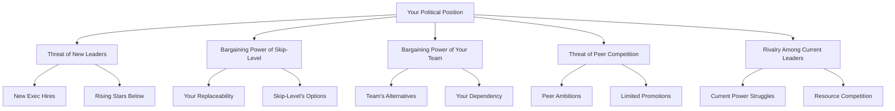

# Organizational Politics: The Game You Must Master

## The Uncomfortable Truth

Technical excellence gets you to senior engineer. People management gets you to manager. But mastering organizational politics? That's what separates managers from executives. This guide reveals the real game being played in conference rooms and hallway conversations.

## 🎯 Framework Integration: Systems Thinking Meets Political Reality

### The Political System Map

```python
class PoliticalSystemsThinking:
    def map_organizational_dynamics(self):
        # Formal System (What's Visible)
        formal_structure = {
            "hierarchy": "Org chart reporting lines",
            "processes": "Official decision frameworks",
            "metrics": "Published KPIs and OKRs",
            "communications": "All-hands and emails"
        }
        
        # Shadow System (What Actually Drives Decisions)
        shadow_structure = {
            "influence_networks": "Who really decides",
            "information_brokers": "Who knows first",
            "king_makers": "Who anoints leaders",
            "veto_powers": "Who can kill anything"
        }
        
        # Feedback Loops That Matter
        reinforcing_loops = [
            "Success → Visibility → Access → More Success",
            "Alliance → Information → Power → Stronger Alliance",
            "Trust → Delegation → Results → More Trust"
        ]
        
        # System Leverage Points
        leverage_points = {
            "narrative_control": "Who tells the story",
            "resource_allocation": "Who controls budget",
            "talent_flow": "Who gets best people",
            "strategic_alignment": "Who defines success"
        }
        
        return analyze_system_dynamics()
```

### Strategy Development in Political Context

**Porter's Five Forces - Political Edition**:



### OODA Loop for Political Maneuvering

```python
def political_ooda_loop():
    while in_organization:
        # Observe
        observations = {
            "meeting_dynamics": watch_who_speaks_when(),
            "decision_patterns": track_what_gets_funded(),
            "alliance_shifts": monitor_coffee_meetings(),
            "power_indicators": note_who_gets_copied()
        }
        
        # Orient
        orientation = {
            "current_position": assess_your_standing(),
            "threat_assessment": identify_challenges(),
            "opportunity_scan": spot_power_vacuums(),
            "ally_strength": evaluate_network_health()
        }
        
        # Decide
        decision = choose_action([
            "strengthen_position",
            "form_new_alliance",
            "preemptive_strike",
            "strategic_retreat",
            "information_campaign"
        ])
        
        # Act
        execute_with_plausible_deniability(decision)
        
        # Learn and Adjust
        measure_impact_subtly()
```

## 🎭 The Political Landscape Decoder

### The Real Org Chart

**What's Published**:
```
          CEO
           |
    -------+-------
    |             |
   CTO           VP Eng
    |             |
  Staff Eng    Directors
```

**What Actually Matters**:
```
       CEO (golf buddies with board member)
         |
    [Shadow Power: CEO's Chief of Staff]
         |
    -----+-----+-----+-----
    |         |          | 
   CTO    VP Eng    VP Product
   (former   (CEO's     (having
   rivals)   favorite)   affair)
                |
            Director A  Director B
            (rising)    (falling)
                |
               You (trying to survive)
```

### The Power Currency Exchange

**Official Currency**: Title, salary, headcount, budget

**Real Currency**: 
- Access to CEO/board
- Control of strategic projects  
- Information flow
- Ability to say "no"
- Narrative control
- Alliance strength

## 🕸️ Building Your Power Network

### The Strategic Coffee Map

**Weekly Coffee Roulette**:
```python
power_network = {
    # Inner Circle (weekly)
    "your_boss": "Monday 9am - temperature check",
    "peer_ally": "Tuesday 2pm - information exchange",
    "key_architect": "Wednesday 4pm - technical credibility",
    "hr_partner": "Thursday 10am - people intelligence",
    
    # Outer Circle (bi-weekly)
    "finance_partner": "Know your numbers",
    "influential_senior_eng": "Technical reputation",
    "rising_star_peer": "Future alliance",
    "admin_assistant": "Calendar intelligence",
    
    # Strategic Touches (monthly)
    "skip_level": "Visibility and protection",
    "other_dept_director": "Cross-functional capital",
    "departed_colleague": "Industry intelligence",
    "board_member": "If accessible"
}
```

### Information as Weapon and Shield

**The Information Gradient**:
1. **Public**: All-hands announcements
2. **Semi-Public**: Team meetings, Slack
3. **Privileged**: Leadership meetings
4. **Confidential**: 1:1s with boss
5. **Secret**: Hallway conversations
6. **Classified**: What you overhead

**Information Trading Rules**:
```python
def information_exchange(intel_received, person):
    if person.trust_level < VERIFIED_ALLY:
        return generic_public_info()
    
    if intel_received.value > MEDIUM:
        return match_value_information()
    
    if person.is_rising_power:
        return invest_valuable_intel()
    
    if person.is_falling_power:
        return minimal_safe_info()
```

### The Alliance Architecture

**Types of Alliances**:

**1. The Mutual Protection Pact**
- With peer managers
- "If they come for you, I've got your back"
- Share intelligence on threats
- Coordinate in calibrations
- Never compete directly

**2. The Mentor Shield**
- With senior leader (not direct chain)
- Provides air cover
- Opens doors
- Shares unwritten rules
- Protects during transitions

**3. The Information Network**
- With admins, IT, Finance
- Early warning system
- Process intelligence
- Calendar insights
- Budget realities

**4. The Technical Credibility**
- With respected architects/principals
- Validates your decisions
- Provides technical air cover
- Influences without politics
- Bridges to engineering

## ⚔️ Political Combat Techniques

### The Character Assassination Defense

**When Someone Undermines You**:

**The Attack**: "I have concerns about Sarah's technical judgment..."

**Bad Defense**: Get defensive, argue technical merits

**Good Defense**: 
```
"Interesting perspective. Let's look at the data:
- Project X: Delivered on time, scaled to 1M users
- Architecture decision Y: Saved $2M annually  
- Team retention: 95% over 2 years

Happy to deep dive on any specific concerns."
```

**Great Defense**:
```
"I appreciate the feedback. [Person], since you have concerns,
I'd love your expertise on our upcoming architecture review.
Your experience with [their failure] would be invaluable."

[Turn attacker into participant]
```

### The Credit Theft Recovery

**Scenario**: Your peer presents your idea as theirs to executives

**Immediate Response**:
```
In meeting: "Great presentation of the concept. As we discussed 
when I originally proposed this in our 1:1 last month, the key 
innovation is..."

[Reclaim gracefully but publicly]
```

**Follow-up Actions**:
1. Email summary: "As discussed, my original proposal..."
2. CC strategic people on "clarification"
3. Document everything going forward
4. Never share early with them again
5. Build coalition against repeat offense

### The Budget Battle Playbook

**The Annual Hunger Games**:
```
Scene: Budget planning meeting
Players: All directors fighting for limited resources
Stakes: Your team's survival and growth
```

**Pre-Battle Preparation**:
- Know everyone's asks
- Identify natural allies
- Prepare multiple scenarios
- Build compelling narrative
- Have sacrifice ready

**Battle Tactics**:
```python
def budget_negotiation():
    # Opening move
    present_ambitious_but_justified_ask()
    
    # Middle game
    if peer_attacks_your_budget:
        redirect_to_their_inefficiencies()
    
    if boss_wants_cuts:
        offer_strategic_trade_offs()
        
    if running_out_of_time:
        propose_phase_approach()
    
    # End game
    claim_victory_on_core_needs()
    bank_political_capital_for_next_time()
```

### The Reorg Survival Guide

**Early Warning Signs**:
- New executive hired above you
- Sudden interest in "synergies"
- Consultants appearing
- Your boss excluded from meetings
- Hiring freeze "to assess needs"

**Survival Strategies**:

**1. The Proactive Merge**
```
You: "I've been thinking about efficiency. What if we 
combined Teams A and B under unified structure?"

[Control your destiny by proposing it first]
```

**2. The Indispensable Position**
```
Quickly become owner of:
- Critical system no one understands
- Key customer relationship
- Board-level project
- Regulatory compliance

[Make elimination too expensive]
```

**3. The Alliance Play**
```
Form coalition with peers:
"If we present unified front with combined proposal,
we control the narrative vs being reorg'd"

[Strength in numbers]
```

## 🎪 Advanced Political Maneuvers

### The Kingmaker Strategy

**Instead of competing, make others successful**:

```python
def become_kingmaker():
    # Identify rising star
    target = find_high_potential_peer()
    
    # Enable their success
    provide_critical_support(target)
    share_credit_publicly(target)
    recommend_for_visibility(target)
    
    # Bank the loyalty
    when target.gets_promoted:
        you.gain_powerful_ally()
        you.gain_reputation_as_maker()
        you.gain_protection_from_above()
```

**Real Example**:
"Helped peer Jim get promoted to VP by giving him my best architect for critical project. Jim now pulls me into VP-level discussions and protects my budget. ROI: 1000%"

### The Strategic Failure

**Sometimes losing is winning**:

**Scenario**: Asked to lead doomed project

**Options**:
1. **Hero Mode**: Try to save it, likely fail, damage reputation
2. **Decline**: Look like you're not a team player
3. **Strategic Failure**: Take it with conditions

**The Play**:
```
"I'll take on Project X with these conditions:
- Public acknowledgment of inherited challenges
- Specific success metrics (achievable ones)
- Resources to do post-mortem properly
- Freedom to restructure approach

If we fail, we learn. If we succeed, we're heroes."
```

### The Information Arbitrage

**Controlling information flow = Power**:

```python
class InformationBroker:
    def __init__(self):
        self.networks = ["exec_assistants", "senior_engineers", 
                        "finance_team", "hr_partners"]
    
    def gather_intelligence(self):
        # Collect from multiple sources
        for network in self.networks:
            intel = casual_conversation(network)
            self.validate_cross_reference(intel)
    
    def strategic_distribution(self):
        # Share selectively for maximum value
        if intel.type == "reorg_coming":
            share_with_allies_first()
            prepare_defensive_positions()
            
        if intel.type == "budget_increase":
            position_for_capture()
            build_supporting_coalition()
```

## 🎖️ Principle Conflicts in Political Navigation

### When Core Principles Collide

```python
class PrincipleConflicts:
    def navigate_ethical_dilemmas(self):
        conflicts = {
            "Transparency vs Strategy": {
                "situation": "Know about upcoming layoffs",
                "transparent": "Tell team immediately",
                "strategic": "Time disclosure for least damage",
                "resolution": "Selective transparency with purpose"
            },
            
            "Loyalty vs Integrity": {
                "situation": "Boss asks you to lie",
                "loyal": "Follow orders, maintain trust",
                "integrity": "Refuse and risk relationship",
                "resolution": "Reframe to avoid lying"
            },
            
            "Team vs Organization": {
                "situation": "Reorg will hurt your team",
                "team_first": "Fight it publicly",
                "org_first": "Accept for greater good",
                "resolution": "Negotiate best transition"
            },
            
            "Fairness vs Pragmatism": {
                "situation": "Promotion decision",
                "fair": "Best performer wins",
                "pragmatic": "Political necessity wins",
                "resolution": "Long game for both"
            }
        }
        
        return find_least_harmful_path()
```

### The Decision-Making Framework Under Political Pressure

**Modified SPADE for Political Decisions**:

```python
def political_spade_framework(decision):
    # Setting (with hidden context)
    visible_setting = "What everyone sees"
    hidden_setting = "Political undercurrents"
    
    # People (and their agendas)
    stakeholders = map_visible_stakeholders()
    shadow_influencers = identify_hidden_players()
    
    # Alternatives (including unspoken)
    public_options = ["A", "B", "C"]
    private_options = ["D (political suicide)", 
                      "E (career limiting)",
                      "F (machiavellian play)"]
    
    # Decide (with second-order effects)
    first_order = "Immediate impact"
    second_order = "Political ripples"
    third_order = "Long-term positioning"
    
    # Execute (with escape routes)
    primary_plan = "Optimal path"
    contingencies = [
        "If backstabbed",
        "If plan leaked",
        "If allies defect"
    ]
    
    return decision_with_protection()
```

### Human Behavior in Political Context

**Behavioral Economics of Politics**:

```python
class PoliticalBehaviorPatterns:
    def understand_motivations(self):
        # Loss Aversion in Politics
        people_fight_harder_to_keep = [
            "Current power/status",
            "Team size",
            "Budget control",
            "Executive access"
        ]
        
        # Social Proof in Leadership
        influence_indicators = [
            "Who gets invited to strategic planning",
            "Whose ideas get repeated by CEO",
            "Who gets asked for input privately",
            "Whose protégés get promoted"
        ]
        
        # Reciprocity as Currency
        political_trades = {
            "Information for support",
            "Resources for alliance",
            "Credit for protection",
            "Silence for future favor"
        }
        
        # Commitment Escalation Traps
        political_quicksand = [
            "Defending bad hire because you vouched",
            "Supporting doomed project you championed",
            "Maintaining alliance with falling star",
            "Doubling down on failed strategy"
        ]
```

## 🏛️ The Executive Translation Layer

### Speaking Power

**Engineering Language**:
"We have technical debt in the authentication service causing intermittent failures requiring significant refactoring"

**Power Language**:
"Customer login reliability is at risk. $2M revenue impact without intervention. Need 2 engineers for 4 weeks to permanently resolve."

### The Executive Presence Formula

**Components**:
```
Presence = Confidence + Brevity + Solutions + Outcomes

- Confidence: Never say "I think" or "maybe"
- Brevity: If it takes > 2 min, it's too long  
- Solutions: Never bring problems without options
- Outcomes: Always connect to money/customers
```

### Managing Executive Relationships

**The Skip-Level Relationship**:

**Monthly Check-in Agenda**:
```
1. Business Impact Update (2 min)
   - Key metrics improved
   - Revenue/cost impact
   - Customer wins

2. Strategic Alignment (3 min)
   - How supporting company goals
   - Future planning thoughts
   - Resource needs/trade-offs

3. Team Highlights (2 min)
   - Key promotions/wins
   - Culture initiatives
   - Succession planning

4. Ask One Question (3 min)
   - Strategic direction
   - Organizational changes
   - Career guidance
```

## 🎰 High-Stakes Political Moments

### The Coup Attempt

**When Someone Tries to Take Your Job**:

**Warning Signs**:
- Skip-level suddenly very interested in details
- Peer asking your team about "concerns"
- Your scope being "redistributed" gradually
- Exclusion from strategic meetings
- "Feedback" about your leadership style

**Counter-Coup Playbook**:
1. **Document everything** - Start immediately
2. **Strengthen alliances** - Cash in favors
3. **Deliver visible win** - Nothing beats results
4. **Control narrative** - Get ahead of story
5. **Nuclear option** - Threaten to leave with key people

### The Political Sacrifice

**When You Must Throw Someone Under the Bus**:

**The Situation**: Major failure, heads must roll

**The Calculation**:
```python
if scapegoat_required():
    if can_protect_team():
        sacrifice = yourself  # Take the hit
    elif political_capital_sufficient():
        negotiate_minimal_damage()
    else:
        # The horrible choice
        select_least_damage_option()
        support_their_landing()
        carry_guilt_forever()
```

**The Execution**:
"The integration failure was due to incomplete requirements. As the accountable leader, I take responsibility. Here's how we'll prevent recurrence..."

[Fall on sword partially, live to fight another day]

## 🎓 Level-Specific Political Wisdom

### Manager Level: Learning the Game

```python
class ManagerPolitics:
    def survival_basics(self):
        focus_areas = [
            "Build peer relationships (future allies)",
            "Master upward communication",
            "Learn information flow patterns",
            "Develop one executive sponsor",
            "Stay out of existing feuds"
        ]
        
        common_mistakes = [
            "Thinking work quality is enough",
            "Ignoring peer relationships",
            "Being too transparent",
            "Picking fights you can't win",
            "Trusting everyone equally"
        ]
        
        # Interview Application
        interview_stories = {
            "Influence without authority": "Peer coalition building",
            "Stakeholder management": "Managing up effectively",
            "Conflict resolution": "Navigating peer competition"
        }
```

### Senior Manager Level: Playing to Win

```python
class SeniorManagerPolitics:
    def advanced_gameplay(self):
        power_building = [
            "Control narrative on key initiatives",
            "Build cross-functional alliances",
            "Become indispensable to executive",
            "Mentor future power players",
            "Create information asymmetry"
        ]
        
        defensive_strategies = [
            "Document everything subtly",
            "Build coalition before needed",
            "Have exit strategy ready",
            "Maintain external options",
            "Never fully trust anyone"
        ]
        
        # Interview Application
        interview_examples = {
            "Strategic thinking": "Positioning for reorg success",
            "Executive communication": "Managing competing SVP interests",
            "Organizational influence": "Driving change through alliances"
        }
```

### Director Level: The Power Broker

```python
class DirectorPolitics:
    def power_broker_playbook(self):
        influence_multiplication = [
            "Place allies in key positions",
            "Control critical resource allocation",
            "Shape organizational narrative",
            "Broker executive relationships",
            "Build external power base"
        ]
        
        kingdom_building = {
            "Talent pipeline": "Control who rises",
            "Budget control": "Resource allocation power",
            "Information flow": "Be the hub",
            "External relationships": "Board/customer access",
            "Succession planning": "Anoint next generation"
        }
        
        # Interview Application
        executive_stories = {
            "Organizational transformation": "Political capital mobilization",
            "C-suite influence": "Shaping strategic direction",
            "Board interaction": "Managing stakeholder politics"
        }
```

### VP Level: The Strategic Politician

```python
class VPPolitics:
    def executive_maneuvering(self):
        board_level_games = [
            "Manage board member relationships",
            "Control strategic narrative",
            "Position for C-suite",
            "Build external CEO options",
            "Shape succession planning"
        ]
        
        empire_protection = {
            "Defensive alliances": "Mutual protection pacts",
            "Offensive capabilities": "Ability to eliminate threats",
            "Information warfare": "Control narrative completely",
            "Succession insurance": "Multiple paths up",
            "Golden parachute": "Negotiate exit terms early"
        }
        
        # Interview Application
        board_level_stories = {
            "CEO partnership": "Managing peer VP competition",
            "Board management": "Controlling information flow up",
            "Industry influence": "External power as internal leverage"
        }
```

## 🧠 Sophisticated Mental Models for Political Mastery

### The Godfather Framework

```python
class GodfatherPolitics:
    """Keep your friends close, enemies closer"""
    
    def build_family(self):
        inner_circle = {
            "consigliere": "Trusted advisor who knows all",
            "capos": "Loyal lieutenants who execute",
            "soldiers": "Team members who deliver",
            "associates": "Useful external relationships"
        }
        
        favor_economy = {
            "Small favors": "Build obligation bank",
            "Information gifts": "Create dependence",
            "Protection services": "Become indispensable",
            "Strategic introductions": "Control networks"
        }
        
        rules = [
            "Never act on emotion",
            "Make them an offer they can't refuse",
            "Revenge is a dish best served cold",
            "It's not personal, it's business",
            "Leave the gun, take the cannoli"
        ]
```

### The Game of Thrones Model

```python
class ThronesPolitics:
    """When you play the game of thrones..."""
    
    def play_the_game(self):
        house_building = {
            "Stark": "Honor-based (usually dies)",
            "Lannister": "Debt-based power",
            "Targaryen": "Legacy/credential power",
            "Baelish": "Information broker model",
            "Varys": "Shadow influence model"
        }
        
        survival_rules = [
            "Trust no one completely",
            "Information is power",
            "Chaos is a ladder",
            "Power is power",
            "Winter is always coming"
        ]
        
        alliance_dynamics = {
            "Marriage": "Strategic team mergers",
            "Hostages": "Key person dependencies",
            "Debts": "Favor obligations",
            "Blackmail": "Information leverage",
            "Dragons": "Unique irreplaceable assets"
        }
```

### The Machiavellian Matrix

```python
class MachiavellianWisdom:
    def prince_playbook(self):
        # Better to be feared or loved?
        optimal_state = "Respected with hint of fear"
        
        power_maintenance = {
            "Divide and conquer": "Keep lieutenants competing",
            "Controlled conflict": "Channel competition productively",
            "Strategic generosity": "Public gifts, private debts",
            "Calculated mercy": "Forgive strategically",
            "Decisive cruelty": "When necessary, be thorough"
        }
        
        # The Lion and the Fox
        dual_nature = {
            "Lion": "Strength when needed",
            "Fox": "Cunning always",
            "Balance": "Know when to be which"
        }
```

## 🎯 Interview Application: Political Stories

### Translating Politics for Interviews

```python
class PoliticalStoriesForInterviews:
    def sanitize_for_interview(self, real_story):
        # Real: "Outmaneuvered toxic peer for promotion"
        # Interview: "Built coalition for organizational change"
        
        translations = {
            "Political maneuvering": "Stakeholder alignment",
            "Information control": "Communication strategy",
            "Alliance building": "Cross-functional collaboration",
            "Power accumulation": "Influence without authority",
            "Competitive destruction": "Market differentiation"
        }
        
        story_framework = {
            "Situation": "Complex stakeholder environment",
            "Task": "Align competing interests",
            "Action": "Built consensus through 1:1s",
            "Result": "Achieved buy-in for transformation",
            "Learning": "Importance of relationships"
        }
        
        # Never mention in interviews
        forbidden_topics = [
            "Actual political maneuvering",
            "Undermining competitors",
            "Information as weapon",
            "Strategic betrayals",
            "Power plays"
        ]
```

## 🎓 Political Mastery Lessons

### The Ten Laws of Organizational Politics

1. **Power abhors a vacuum** - If you don't take it, someone else will
2. **Perception is reality** - Managing narrative > being right
3. **Allies are temporary** - Today's friend, tomorrow's rival
4. **Information is currency** - Hoard and spend wisely
5. **Timing beats brilliance** - Right idea, wrong time = failure
6. **Credit is infinite** - Share generously, builds capital
7. **Blame is expensive** - Accept rarely, deflect skillfully
8. **Visibility drives opportunity** - Hidden work = no work
9. **Networks beat hierarchies** - Informal power > formal power
10. **Everyone has an agenda** - Including you, that's OK

### The Dark Arts You'll Need

**Selective Truth Telling**:
Not lying, but choosing which truths to emphasize

**Strategic Incompetence**:
Sometimes being "unable" is better than unwilling

**Calculated Vulnerability**:
Show weakness strategically to build trust

**Plausible Deniability**:
"I had no idea that would happen" *wink*

**The Long Game**:
Revenge is a dish best served with compound interest

## 📚 War Stories from the Trenches

### The Great Betrayal of 2018

"My peer and I agreed to propose joint reorg to save both teams. Morning of meeting, discovered he'd pitched keeping his team and eliminating mine the night before. I survived by having pre-meeting with CEO that morning 'to prep.' Lesson: Trust but verify, especially near reorgs."

### The Budget Coup of 2020

"New VP wanted to cut my budget 50% to fund his former colleague's team. Built coalition of peers, showed combined impact of cuts. Night before decision, got customer to call CEO about how critical we were. Kept full budget, VP lasted 6 months. Lesson: External validation beats internal politics."

### The Promotion Block of 2019

"Boss blocked my promotion three cycles claiming 'not ready' while promoting his friend. Built relationship with skip-level, delivered project so visible board knew my name. Got promoted over boss's objection. He was managed out 3 months later. Lesson: Sometimes you must go around blockers."

## 🛡️ Protecting Your Soul

### Staying Human in the Game

**Rules for Maintaining Integrity**:
1. Play the game but remember it's a game
2. Protect those who can't protect themselves
3. Win with grace, lose with dignity
4. Build people up more than you tear down
5. Remember why you became a leader

**When to Walk Away**:
- When winning requires becoming someone you hate
- When the politics overshadow the mission
- When you can't sleep at night
- When your family doesn't recognize you
- When the cost exceeds any possible reward

## 🎯 Final Wisdom: The Integration

### The Political Leader's Paradox

You must master organizational politics to protect your team from organizational politics. The better you play the game, the less your team has to. This is the burden of leadership - to swim with sharks so your team can focus on building.

### Systems Thinking + Strategy = Political Mastery

The most sophisticated political operators understand organizations as complex adaptive systems. They see:
- Feedback loops that amplify or dampen power
- Emergence of informal power structures
- Network effects in influence building
- System boundaries that can be exploited
- Leverage points for maximum impact

### The Integrity Question

```python
def maintain_soul_while_playing():
    principles = {
        "Play the game": "But don't become the game",
        "Use power": "But for worthy ends",
        "Form alliances": "But honor core ones",
        "Manage perception": "But stay authentic",
        "Win battles": "But choose them wisely"
    }
    
    daily_check = [
        "Would I respect myself?",
        "Am I building or destroying?",
        "Is this who I want to be?",
        "What example am I setting?",
        "Can I sleep at night?"
    ]
    
    return balance_power_with_purpose()
```

### The Ultimate Truth

Every leader who says "I don't play politics" is either lying or losing. Politics is how decisions get made, resources get allocated, and power gets distributed. You can pretend it doesn't exist, or you can master it to achieve your goals.

But mastery means understanding the system deeply enough to navigate it while maintaining your integrity. The best political operators are systems thinkers who play the long game, build genuine relationships even within political contexts, and use their power to create positive outcomes.

The choice is yours. But remember: those who don't play politics are governed by those who do.

---

*"I spent 10 years thinking good work spoke for itself. Then I spent 10 years learning why I was wrong. The best politicians are those who don't seem political at all. They understand the system so deeply that their moves appear natural, their power seems earned, and their integrity remains intact." - Fortune 500 CTO*

*"Politics is applied systems thinking with human behavior as the primary variable. Master both, and you master organizations." - Tech Industry VP*