# Engineering Leadership Interview Guide

> Master the art of Engineering Manager and Director interviews at FAANG and top tech companies

## The Four-Level Framework {#framework-overview}

Our comprehensive guide is built on a principled framework that integrates elite business school concepts with engineering leadership practice:

```mermaid
graph TD
    subgraph "Engineering Leadership Framework"
        IV["🎯 Level IV: Interview Execution<br/>THE PROOF<br/>• Behavioral Mastery<br/>• Technical Leadership<br/>• System & Org Design<br/>• Culture Alignment"] 
        
        III["⚙️ Level III: Engineering Applications<br/>THE PRACTICAL 'WHAT'<br/>• People Management<br/>• Technical Leadership<br/>• Organizational Design<br/>• Business Acumen"]
        
        II["💼 Level II: Core Business Concepts<br/>THE STRATEGIC 'HOW'<br/>• Strategy & Leadership<br/>• Operations & Finance<br/>• Risk & Governance"]
        
        I["📐 Level I: First Principles<br/>THE FOUNDATIONAL 'WHY'<br/>• Value Creation<br/>• Decision Making<br/>• Human Behavior<br/>• Systems Thinking<br/>• Integrity & Ethics"]
    end
    
    I --> II
    II --> III
    III --> IV
    
    classDef level1 fill:#e8f4fd,stroke:#1976d2,stroke-width:3px
    classDef level2 fill:#f3e5f5,stroke:#7b1fa2,stroke-width:3px
    classDef level3 fill:#e8f5e8,stroke:#388e3c,stroke-width:3px
    classDef level4 fill:#fff3e0,stroke:#f57c00,stroke-width:3px
    
    class I level1
    class II level2
    class III level3
    class IV level4
```

### Level I: First Principles {#level-1}
**The Foundational "Why"** — Universal truths that justify every leadership action
- [Value Creation](../interview-prep/engineering-leadership/level-1-first-principles/value-creation/index.md): Business exists to solve problems profitably
- [Decision-Making](../interview-prep/engineering-leadership/level-1-first-principles/decision-making/index.md): Progress requires quality choices under uncertainty
- [Human Behavior](../interview-prep/engineering-leadership/level-1-first-principles/human-behavior/index.md): Culture and motivation drive execution
- [Systems Thinking](../interview-prep/engineering-leadership/level-1-first-principles/systems-thinking/index.md): Organizations are interconnected systems
- [Integrity & Ethics](../interview-prep/engineering-leadership/level-1-first-principles/integrity-ethics/index.md): Trust is the ultimate advantage

### Level II: Core Business Concepts {#level-2}
**The Strategic "How"** — MBA-level disciplines for creating competitive advantage
- [Strategy](../interview-prep/engineering-leadership/level-2-core-business/strategy/index.md): Making integrated choices for unique value
- [Leadership](../interview-prep/engineering-leadership/level-2-core-business/leadership/index.md): Mobilizing humans toward shared goals
- [Operations](../interview-prep/engineering-leadership/level-2-core-business/operations/index.md): Building the engine of execution
- [Finance](../interview-prep/engineering-leadership/level-2-core-business/finance/index.md): Understanding and creating economic value
- [Risk & Governance](../interview-prep/engineering-leadership/level-2-core-business/risk-governance/index.md): Managing uncertainty and accountability

### Level III: Engineering Applications {#level-3}
**The Practical "What"** — Day-to-day domains where leaders apply principles
- [People Management](../interview-prep/engineering-leadership/level-3-applications/people-management/index.md): Hire → Inspire → Grow → Retain
- [Technical Leadership](../interview-prep/engineering-leadership/level-3-applications/technical-leadership/index.md): Innovate → Build → Stabilize
- [Organizational Design](../interview-prep/engineering-leadership/level-3-applications/organizational-design/index.md): Structure → Align → Evolve
- [Business Acumen](../interview-prep/engineering-leadership/level-3-applications/business-acumen/index.md): Translate → Partner → Influence

### Level IV: Interview Execution {#level-4}
**The "Proof"** — Demonstrating mastery under interview pressure
- [Behavioral](../interview-prep/engineering-leadership/level-4-interview-execution/behavioral/index.md): Past performance predicting future
- [Technical Leadership](../interview-prep/engineering-leadership/level-4-interview-execution/technical-leadership/index.md): Depth meets breadth
- [System Design](../interview-prep/engineering-leadership/level-4-interview-execution/system-org-design/index.md): Architecture and organization
- [Culture Fit](../interview-prep/engineering-leadership/level-4-interview-execution/culture-values/index.md): Authentic alignment

## Who This Guide Is For {#target-audience}

This comprehensive guide is designed for:
- **Senior Engineers** transitioning to Engineering Manager roles (L5→L6)
- **Engineering Managers** targeting senior positions (L6→L7)
- **Senior Managers** aspiring to Director roles (L7→L8)
- **Directors** preparing for Senior Director or VP positions (L8+)

## Start Your Journey {#start-journey}

- :material-navigation:{ .lg } **[🧭 Navigation Guide](../reference/navigation-guide.md)**
    
    ---
    
    **NEW!** Find your personalized learning path based on experience level and timeline

- :material-compass:{ .lg } **[Framework Overview](../interview-prep/engineering-leadership/framework-index.md)**
    
    ---
    
    Understand the complete 4-level system and how principles flow into practice

- :material-rocket-launch-outline:{ .lg } **[Quick Start Guide](../interview-prep/engineering-leadership/level-4-interview-execution/index.md)**
    
    ---
    
    Jump straight to interview preparation if you're short on time

- :material-school:{ .lg } **[First Principles](../interview-prep/engineering-leadership/level-1-first-principles/index.md)**
    
    ---
    
    Build deep understanding from foundational concepts

- :material-briefcase:{ .lg } **[Business Concepts](../interview-prep/engineering-leadership/level-2-core-business/index.md)**
    
    ---
    
    Master strategy, finance, operations, and leadership

- :material-hammer-wrench:{ .lg } **[Practical Applications](../interview-prep/engineering-leadership/level-3-applications/index.md)**
    
    ---
    
    Apply concepts to real engineering leadership challenges

- :material-timer:{ .lg } **[Interactive Practice](../interview-prep/engineering-leadership/level-4-interview-execution/tools/interactive/index.md)**
    
    ---
    
    Use timers, assessments, and tools to prepare

## Interview Components Breakdown {#components-breakdown}

- :material-account-group:{ .lg } **[People Management](../interview-prep/engineering-leadership/level-3-applications/people-management/index.md)** - 40%
    
    ---
    
    Master behavioral interviews focused on team leadership, performance management, and organizational growth
    
    **Key Topics**: Team building, conflict resolution, performance coaching, diversity & inclusion

- :material-rocket-launch:{ .lg } **[Technical Leadership](../interview-prep/engineering-leadership/level-3-applications/technical-leadership/index.md)** - 25%
    
    ---
    
    Demonstrate technical depth while leading at scale
    
    **Key Topics**: Architecture reviews, technical strategy, platform thinking, innovation

- :material-sitemap:{ .lg } **[Organizational Design](../interview-prep/engineering-leadership/level-3-applications/organizational-design/index.md)** - 15%
    
    ---
    
    Design and scale engineering organizations effectively
    
    **Key Topics**: Team topologies, Conway's Law, communication patterns, decision frameworks

- :material-chart-line:{ .lg } **[Business Acumen](../interview-prep/engineering-leadership/level-3-applications/business-acumen/index.md)** - 10%
    
    ---
    
    Connect engineering excellence to business outcomes
    
    **Key Topics**: OKRs, resource allocation, cost optimization, stakeholder management

- :material-architecture:{ .lg } **[System Design](../interview-prep/engineering-leadership/level-4-interview-execution/system-org-design/index.md)** - 10%
    
    ---
    
    System design from a leadership perspective
    
    **Key Topics**: Organizational systems, cross-team dependencies, platform strategies

## Company-Specific Preparation {#company-specific}

- **[Amazon](../interview-prep/engineering-leadership/company-specific/amazon/index.md)** - Leadership Principles mastery
- **[Google](../interview-prep/engineering-leadership/company-specific/google/index.md)** - Googleyness & technical excellence  
- **[Meta](../interview-prep/engineering-leadership/company-specific/meta/index.md)** - Move fast culture & impact
- **[Apple](../interview-prep/engineering-leadership/company-specific/apple/index.md)** - Quality bar & functional excellence
- **[Microsoft](../interview-prep/engineering-leadership/company-specific/microsoft/index.md)** - Growth mindset & transformation
- **[Netflix](../interview-prep/engineering-leadership/company-specific/netflix/index.md)** - Freedom & responsibility culture

## Success Metrics You'll Need to Demonstrate {#success-metrics}

### Engineering Productivity
| Metric | Senior Manager | Director | Senior Director |
|--------|---------------|----------|-----------------|
| Team Size | 10-20 engineers | 30-50 engineers | 100+ engineers |
| Deployment Frequency | Weekly → Daily | Daily → Continuous | Platform-level CI/CD |
| Lead Time | Days → Hours | Hours → Minutes | Automated pipelines |
| MTTR | Hours → Minutes | Minutes → Seconds | Self-healing systems |

### Business Impact
| Level | Revenue Impact | Cost Optimization | User Scale |
|-------|---------------|-------------------|------------|
| L6/M1 | $1-5M | 10-20% efficiency | 100K-1M users |
| L7/M2 | $5-50M | 20-30% efficiency | 1M-10M users |
| L8+ | $50M+ | 30%+ efficiency | 10M+ users |

### People Leadership
- **Retention**: 90%+ top performer retention
- **Growth**: 20%+ annual team promotions
- **Diversity**: 30%+ underrepresented groups
- **Engagement**: 80%+ satisfaction scores

## Preparation Journey {#preparation-phases}

### Phase 1: Foundation (Weeks 1-4)
1. **Principles Study** - Master [First Principles](../interview-prep/engineering-leadership/level-1-first-principles/index.md) and [Business Concepts](../interview-prep/engineering-leadership/level-2-core-business/index.md)
2. **Story Building** - Develop 20-30 stories using the [Story Portfolio Framework](../interview-prep/engineering-leadership/level-4-interview-execution/tools/story-portfolio/index.md)
3. **Company Research** - Deep dive into culture and values
4. **Technical Refresh** - Update on latest technologies

### Phase 2: Practice (Weeks 5-8)
1. **Mock Interviews** - 2-3 per week with peers
2. **Case Studies** - Work through [practice scenarios](../interview-prep/engineering-leadership/practice-scenarios/index.md)
3. **Presentation Skills** - Executive communication
4. **Feedback Integration** - Iterate on weak areas

### Phase 3: Final Prep (Weeks 9-12)
1. **Company Specific** - Tailor stories using [Principle Hooks](../interview-prep/engineering-leadership/level-4-interview-execution/tools/principle-hooks/index.md)
2. **Question Practice** - 100+ behavioral questions
3. **System Design** - Leadership-focused problems
4. **Confidence Building** - Visualization and prep

## Key Differentiators {#differentiators}

### What Separates Good from Great {#good-vs-great}

!!! info "✅ Good Candidates - Operational Excellence"
    - **Manage teams effectively** - Keep people productive and aligned
    - **Deliver projects on time** - Execute reliably within scope
    - **Handle day-to-day operations** - Maintain stable systems and processes
    - **Resolve conflicts** - Address interpersonal and technical issues

!!! tip "🌟 Great Candidates - Transformational Leadership"
    - **Transform organizations** - Drive meaningful change at scale
    - **Drive strategic initiatives** - Lead cross-functional efforts
    - **Build lasting cultures** - Create environments where people thrive
    - **Develop future leaders** - Multiply impact through others
    - **Create multiplier effects** - Generate value beyond direct reports
    - **Influence without authority** - Lead through vision and expertise
    - **Think in first principles** - Apply foundational reasoning frameworks
    - **Apply business frameworks** - Connect engineering to business outcomes

## Essential Resources {#resources}

### Core Reading by Level
**Level I - First Principles**:
- "Good Strategy Bad Strategy" - Rumelt
- "Thinking, Fast and Slow" - Kahneman

**Level II - Business Concepts**:
- "The Manager's Path" - Fournier
- "An Elegant Puzzle" - Larson

**Level III - Applications**:
- "Team Topologies" - Skelton & Pais
- "Accelerate" - Forsgren, Humble & Kim

**Level IV - Execution**:
- "Crucial Conversations" - Patterson et al.
- "The Culture Map" - Meyer

### Online Resources
- **[StaffEng.com](https://staffeng.com/index.md)** - Staff+ engineering stories
- **[LeadDev.com](https://leaddev.com/index.md)** - Engineering leadership content
- **[The Pragmatic Engineer](https://blog.pragmaticengineer.com/index.md)** - Industry insights

## Interactive Practice Tools {#practice-tools}

Enhance your preparation with our execution tools:

- :material-timer-outline:{ .lg } **[Interview Timer](../interview-prep/engineering-leadership/level-4-interview-execution/tools/interactive/interview-timer.md)**
    
    ---
    
    Practice with realistic time constraints

- :material-clipboard-check:{ .lg } **[Self-Assessment](../interview-prep/engineering-leadership/level-4-interview-execution/tools/interactive/self-assessment.md)**
    
    ---
    
    Score yourself against FAANG criteria

- :material-sitemap:{ .lg } **[Decision Trees](../interview-prep/engineering-leadership/level-4-interview-execution/tools/interactive/decision-trees.md)**
    
    ---
    
    Navigate complex scenarios

- :material-magnify:{ .lg } **[STAR Story Matcher](../interview-prep/engineering-leadership/level-4-interview-execution/tools/interactive/star-matcher.md)**
    
    ---
    
    Match experiences to questions

- :material-database:{ .lg } **[Question Bank](../interview-prep/engineering-leadership/level-4-interview-execution/tools/interactive/question-bank.md)**
    
    ---
    
    Browse 500+ real questions

## Pro Tips {#pro-tips}

### From Successful Candidates

> "Understanding first principles like Value Creation changed how I approached every answer. Instead of just describing what I did, I could explain why it mattered." - *L7 at Google*

> "The business concepts framework gave me the vocabulary to speak like an executive. Finance and strategy fluency made all the difference." - *Director at Meta*

> "The story portfolio system was game-changing. Having 30 stories mapped to principles meant I was never caught off-guard." - *Senior Manager at Amazon*

## Hard-Earned Wisdom {#wisdom}

For those ready to go deeper, explore our [Hard-Earned Wisdom](../interview-prep/engineering-leadership/hard-earned-wisdom/index.md) section covering the realities rarely discussed:
- Managing up and organizational politics
- Performance management truths
- Crisis leadership under pressure
- The human cost of leadership

---

## Quick Start Paths {#quick-start}

### "I have an interview in 2 weeks"
🏃 Fast Track:
1. [Level IV: Interview Execution](../interview-prep/engineering-leadership/level-4-interview-execution/index.md) - Interview formats and expectations
2. [STAR+ Framework](../interview-prep/engineering-leadership/level-4-interview-execution/tools/star-framework/index.md) - Structure your stories
3. [Interactive Tools](../interview-prep/engineering-leadership/level-4-interview-execution/tools/interactive/index.md) - Practice with timers and assessments
4. [Company Guides](../company-specific/index.md) - Tailor to your target

### "I want to deeply prepare"
🏊 Comprehensive Path:
1. [Framework Overview](../interview-prep/engineering-leadership/framework-index.md) - Understand the full system
2. [First Principles](../interview-prep/engineering-leadership/level-1-first-principles/index.md) - Build your foundation
3. [Practice Scenarios](../interview-prep/engineering-leadership/practice-scenarios/index.md) - Apply your knowledge
4. [Story Portfolio](../interview-prep/engineering-leadership/level-4-interview-execution/tools/story-portfolio/index.md) - Organize experiences

### "I'm growing as a leader"
🌱 Development Path:
1. [Self-Assessment](../interview-prep/engineering-leadership/level-4-interview-execution/tools/interactive/self-assessment.md) - Identify gaps
2. [Level III Applications](../interview-prep/engineering-leadership/level-3-applications/index.md) - Target weak areas
3. [Hard-Earned Wisdom](../interview-prep/engineering-leadership/hard-earned-wisdom/index.md) - Learn from experience
4. Apply in your current role

## Related Resources {#related-resources}

### For Individual Contributors
If you're still in an IC role or want to strengthen your technical foundation:

- :material-code-tags:{ .lg } **[IC Interviews Guide](../interview-prep/ic-interviews/index.md)**
    
    ---
    
    Complete guide for Software Engineer interviews (L3-L5)
    
    **Covers**: System design, behavioral interviews, technical leadership without authority

- :material-graph-outline:{ .lg } **[System Design for Leaders](../interview-prep/ic-interviews/frameworks/index.md)**
    
    ---
    
    Design thinking frameworks that apply to both IC and leadership roles
    
    **Essential**: Architecture thinking scales from code to organizations

### Career Transition Resources
- **IC → Manager**: Focus on [People Management](../interview-prep/engineering-leadership/level-3-applications/people-management/index.md) first
- **Strong IC → Staff+**: Use both guides - technical depth + leadership influence
- **Manager → IC**: [System Design refresher](../interview-prep/ic-interviews/common-problems/index.md) + technical credibility

---

**Ready to begin?** Choose your path above, or explore the [complete Framework Overview](../interview-prep/engineering-leadership/framework-index.md) to understand how all pieces connect. Remember: The framework is designed to be navigated in any direction—start where you need it most.