# Engineering Leadership Interview Guide

Master the art of Engineering Manager and Director interviews at FAANG and top tech companies

## The Four-Level Framework

Our comprehensive guide builds mastery through four interconnected layers:

```mermaid
graph TD
    subgraph "Engineering Leadership Interview Framework"
        IV["🎯 Level IV: Interview Execution<br/>THE PROOF<br/>• Behavioral Mastery<br/>• Technical Leadership<br/>• System & Org Design<br/>• Culture Alignment"] 
        
        III["⚙️ Level III: Engineering Applications<br/>THE PRACTICE<br/>• People Management<br/>• Technical Leadership<br/>• Organizational Design<br/>• Business Acumen"]
        
        II["💼 Level II: Core Business Concepts<br/>THE STRATEGY<br/>• Strategy & Leadership<br/>• Operations & Finance<br/>• Risk & Governance"]
        
        I["📐 Level I: First Principles<br/>THE FOUNDATION<br/>• Value Creation<br/>• Decision Making<br/>• Human Behavior<br/>• Systems Thinking<br/>• Integrity & Ethics"]
    end
    
    I --> II
    II --> III
    III --> IV
    
    classDef level1 fill:#e8f4fd,stroke:#1976d2,stroke-width:3px
    classDef level2 fill:#f3e5f5,stroke:#7b1fa2,stroke-width:3px
    classDef level3 fill:#e8f5e8,stroke:#388e3c,stroke-width:3px
    classDef level4 fill:#fff3e0,stroke:#f57c00,stroke-width:3px
    
    class I level1
    class II level2
    class III level3
    class IV level4
```

### Level I: First Principles
**The Foundational "Why"** — Universal truths that justify every leadership action
- [Value Creation](level-1-first-principles/value-creation/index.md): Business exists to solve problems profitably
- [Decision-Making](level-1-first-principles/decision-making/index.md): Progress requires quality choices under uncertainty
- [Human Behavior](level-1-first-principles/human-behavior/index.md): Culture and motivation drive execution
- [Systems Thinking](level-1-first-principles/systems-thinking/index.md): Organizations are interconnected systems
- [Integrity & Ethics](level-1-first-principles/integrity-ethics/index.md): Trust is the ultimate advantage

### Level II: Core Business Concepts
**The Strategic "How"** — MBA-level disciplines for creating competitive advantage
- [Strategy](level-2-core-business/strategy/index.md): Making integrated choices for unique value
- [Leadership](level-2-core-business/leadership/index.md): Mobilizing humans toward shared goals
- [Operations](level-2-core-business/operations/index.md): Building the engine of execution
- [Finance](level-2-core-business/finance/index.md): Understanding and creating economic value
- [Risk & Governance](level-2-core-business/risk-governance/index.md): Managing uncertainty and accountability

### Level III: Engineering Applications
**The Practical "What"** — Day-to-day domains where leaders apply principles
- [People Management](level-3-applications/people-management/index.md): Hire → Inspire → Grow → Retain
- [Technical Leadership](level-3-applications/technical-leadership/index.md): Innovate → Build → Stabilize
- [Organizational Design](level-3-applications/organizational-design/index.md): Structure → Align → Evolve
- [Business Acumen](level-3-applications/business-acumen/index.md): Translate → Partner → Influence

### Level IV: Interview Execution
**The "Proof"** — Demonstrating mastery under interview pressure
- [Behavioral](level-4-interview-execution/behavioral/index.md): Past performance predicting future
- [Technical Leadership](level-4-interview-execution/technical-leadership/index.md): Depth meets breadth
- [System Design](level-4-interview-execution/system-org-design/index.md): Architecture and organization
- [Culture Fit](level-4-interview-execution/culture-values/index.md): Authentic alignment

## Who This Guide Is For

This comprehensive guide is designed for:
- **Senior Engineers** transitioning to Engineering Manager roles (L5→L6)
- **Engineering Managers** targeting senior positions (L6→L7)
- **Senior Managers** aspiring to Director roles (L7→L8)
- **Directors** preparing for Senior Director or VP positions (L8+)

## Quick Start Paths

### 🏃 "I have an interview in 2 weeks"
1. [Self-Assessment](level-4-interview-execution/tools/interactive/self-assessment.md) - Identify critical gaps
2. [STAR+ Framework](level-4-interview-execution/tools/star-framework/index.md) - Structure your stories
3. [Company Guide](company-specific/index.md) - Target company values
4. [Mock Interview Guide](level-4-interview-execution/tools/mock-interview-guide.md) - Practice execution

### 🎯 "I want focused preparation" (4 weeks)
1. [Framework Overview](framework-index.md) - Understand the system
2. [Level III Applications](level-3-applications/index.md) - Focus on practical skills
3. [Practice Scenarios](practice-scenarios/index.md) - Apply knowledge
4. [Story Portfolio](level-4-interview-execution/tools/story-portfolio/index.md) - Build narratives

### 🌟 "I want comprehensive mastery" (8+ weeks)
1. [Navigation Guide](navigation-guide.md) - Plan your journey
2. [First Principles](level-1-first-principles/index.md) - Build foundation
3. [Business Concepts](level-2-core-business/index.md) - Strategic thinking
4. Complete all four levels systematically

## Interview Components Breakdown

| Component | Weight | Focus Areas |
|-----------|--------|-------------|
| **People Management** | 40% | Team building, conflict resolution, performance coaching, D&I |
| **Technical Leadership** | 25% | Architecture, technical strategy, platform thinking, innovation |
| **Organizational Design** | 15% | Team topologies, Conway's Law, communication patterns |
| **Business Acumen** | 10% | OKRs, resource allocation, cost optimization, stakeholder management |
| **System Design** | 10% | Organizational systems, cross-team dependencies, platform strategies |

## Company-Specific Preparation

- **[Amazon](company-specific/amazon/index.md)** - Master the 16 Leadership Principles
- **[Google](company-specific/google/index.md)** - Googleyness & technical excellence
- **[Meta](company-specific/meta/index.md)** - Move fast culture & impact focus
- **[Apple](company-specific/apple/index.md)** - Quality bar & functional excellence
- **[Microsoft](company-specific/microsoft/index.md)** - Growth mindset & transformation
- **[Netflix](company-specific/netflix/index.md)** - Freedom & responsibility culture

## Success Metrics by Level

### Engineering Productivity
| Level | Team Size | Deployment | Lead Time | MTTR |
|-------|-----------|------------|-----------|------|
| L6/EM | 10-20 | Weekly→Daily | Days→Hours | Hours→Minutes |
| L7/Senior EM | 30-50 | Daily→Continuous | Hours→Minutes | Minutes→Seconds |
| L8/Director+ | 100+ | Platform CI/CD | Automated | Self-healing |

### Business Impact
| Level | Revenue Impact | Cost Optimization | User Scale |
|-------|---------------|-------------------|------------|
| L6/M1 | $1-5M | 10-20% efficiency | 100K-1M |
| L7/M2 | $5-50M | 20-30% efficiency | 1M-10M |
| L8+ | $50M+ | 30%+ efficiency | 10M+ |

### People Leadership
- **Retention**: 90%+ top performer retention
- **Growth**: 20%+ annual team promotions
- **Diversity**: 30%+ underrepresented groups
- **Engagement**: 80%+ satisfaction scores

## Interactive Practice Tools

- **[Interview Timer](level-4-interview-execution/tools/interactive/interview-timer.md)** - Practice with time constraints
- **[Self-Assessment](level-4-interview-execution/tools/interactive/self-assessment.md)** - Score against FAANG criteria
- **[Decision Trees](level-4-interview-execution/tools/interactive/decision-trees.md)** - Navigate complex scenarios
- **[STAR Story Matcher](level-4-interview-execution/tools/interactive/star-matcher.md)** - Match stories to questions
- **[Question Bank](level-4-interview-execution/tools/interactive/question-bank.md)** - 500+ real interview questions

## Practice Scenarios

Real-world situations you'll face in interviews:
- [Managing Underperformers](practice-scenarios/underperformer-scenario.md)
- [Team Conflict Resolution](practice-scenarios/team-conflict-scenario.md)
- [Tight Deadline Crunch](practice-scenarios/tight-deadline-scenario.md)
- [Reorganization Leadership](practice-scenarios/reorg-scenario.md)
- [Delivering Bad News](practice-scenarios/bad-news-scenario.md)
- [Stakeholder Negotiation](practice-scenarios/stakeholder-negotiation-scenario.md)
- [Managing Up](practice-scenarios/managing-up-scenario.md)

## What Separates Good from Great

### ✅ Good Candidates - Operational Excellence
- Manage teams effectively
- Deliver projects on time
- Handle day-to-day operations
- Resolve conflicts

### 🌟 Great Candidates - Transformational Leadership
- Transform organizations at scale
- Drive strategic initiatives
- Build lasting cultures
- Develop future leaders
- Create multiplier effects
- Influence without authority
- Think in first principles
- Connect engineering to business outcomes

## Hard-Earned Wisdom

For those ready to go deeper, explore insights rarely discussed:
- [Managing Up: The Dark Art](hard-earned-wisdom/managing-up-dark-art.md)
- [Performance Management Reality](hard-earned-wisdom/performance-management-reality.md)
- [Crisis Leadership Reality](hard-earned-wisdom/crisis-leadership-reality.md)
- [Organizational Politics Mastery](hard-earned-wisdom/organizational-politics-mastery.md)
- [Impossible Decisions](hard-earned-wisdom/impossible-decisions.md)
- [The Human Cost](hard-earned-wisdom/human-cost-leadership.md)

## Essential Resources

### Core Reading by Level
**Level I - First Principles**:
- "Good Strategy Bad Strategy" - Rumelt
- "Thinking, Fast and Slow" - Kahneman

**Level II - Business Concepts**:
- "The Manager's Path" - Fournier
- "An Elegant Puzzle" - Larson

**Level III - Applications**:
- "Team Topologies" - Skelton & Pais
- "Accelerate" - Forsgren, Humble & Kim

**Level IV - Execution**:
- "Crucial Conversations" - Patterson et al.
- "The Culture Map" - Meyer

### Online Resources
- [StaffEng.com](https://staffeng.com/) - Staff+ engineering stories
- [LeadDev.com](https://leaddev.com/) - Engineering leadership content
- [The Pragmatic Engineer](https://blog.pragmaticengineer.com/) - Industry insights

## Preparation Timeline

### Phase 1: Foundation (Weeks 1-4)
1. Master [First Principles](level-1-first-principles/index.md) and [Business Concepts](level-2-core-business/index.md)
2. Develop 20-30 stories using [Story Portfolio Framework](level-4-interview-execution/tools/story-portfolio/index.md)
3. Deep dive into company culture and values
4. Refresh technical knowledge

### Phase 2: Practice (Weeks 5-8)
1. 2-3 mock interviews per week
2. Work through [practice scenarios](practice-scenarios/index.md)
3. Refine executive communication
4. Iterate on weak areas

### Phase 3: Final Prep (Week 9+)
1. Company-specific story tailoring
2. Practice 100+ behavioral questions
3. Leadership-focused system design
4. Confidence building

## Success Testimonials

> "Understanding first principles like Value Creation changed how I approached every answer. Instead of just describing what I did, I could explain why it mattered." - *L7 at Google*

> "The business concepts framework gave me the vocabulary to speak like an executive. Finance and strategy fluency made all the difference." - *Director at Meta*

> "The story portfolio system was game-changing. Having 30 stories mapped to principles meant I was never caught off-guard." - *Senior Manager at Amazon*

## Get Started Now

1. **[Take the Self-Assessment](level-4-interview-execution/tools/interactive/self-assessment.md)** - Identify your gaps
2. **[Review the Framework](FRAMEWORK_ORGANIZATION.md)** - Understand the system
3. **[Choose Your Path](navigation-guide.md)** - Plan your journey
4. **[Build Your Stories](level-4-interview-execution/tools/story-portfolio/index.md)** - Craft narratives
5. **[Practice Scenarios](practice-scenarios/index.md)** - Apply knowledge

---

> 💡 **Remember**: Leadership interviews aren't just about what you've done—they're about how you think, how you lead, and how you'll add value in the future. This framework helps you demonstrate all three.

**Ready to begin?** Explore the [Framework Overview](../ENGINEERING_LEADERSHIP_INTERVIEW_FRAMEWORK.md) or jump directly to your [target level](framework-index.md).