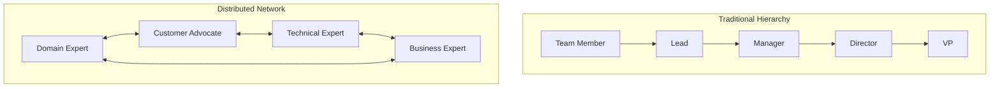
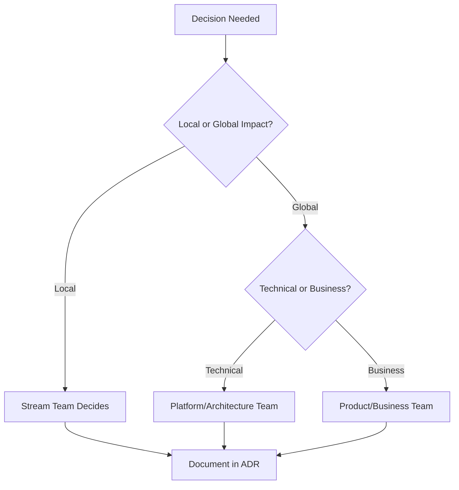
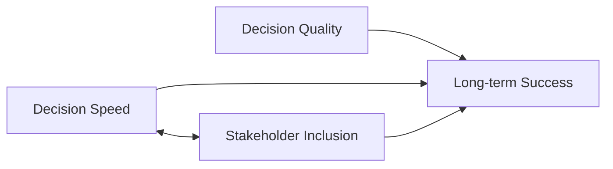

# First Principle #2: Decision-Making

> "In any moment of decision, the best thing you can do is the right thing, the next best thing is the wrong thing, and the worst thing you can do is nothing." - Theodore Roosevelt

## Definition

Decision-Making is the engine that converts potential into reality. It's the discipline of making timely, informed choices under conditions of uncertainty, complexity, and competing priorities. For engineering leaders, mastering decision-making means building systems that consistently produce good outcomes, not just good intentions.

## The Anatomy of Engineering Decisions

### Types of Decisions

<div class="decision-matrix">

| Type | Reversibility | Time Horizon | Examples | Approach |
|------|--------------|--------------|----------|----------|
| **Type 1: One-Way Doors** | Irreversible | Years | Architecture choices, Hiring, Major platform decisions | Slow down, gather data, seek consensus |
| **Type 2: Two-Way Doors** | Reversible | Months | Feature flags, Experiment designs, Tool choices | Move fast, learn quickly |
| **Type 3: Daily Operations** | Easily changed | Days | Code reviews, Sprint planning, Bug priorities | Delegate with guidelines |
| **Type 4: Crisis Response** | Context-dependent | Hours | Production outages, Security incidents | Clear chain of command |

</div>

## Real-World Decision-Making Stories

### Case Study 1: The AWS S3 "Eventually Consistent" Decision That Changed Everything

**Context**: 2006, Amazon was building S3. The team faced a critical architectural choice: strong consistency (familiar) vs. eventual consistency (radical).

**The Stakes**: 
- Strong consistency: Familiar to developers, slower performance, harder to scale
- Eventual consistency: Confusing to developers, faster performance, massive scale potential
- Decision would affect millions of future applications

**Decision Process**:
1. **Type Classification**: Type 1 (one-way door) - changing later would be nearly impossible
2. **Stakeholder Input**: 
   - Developers: "Eventual consistency is too weird"
   - Infrastructure: "Strong consistency won't scale"
   - Product: "Customers want speed and reliability"
3. **Future Modeling**: Asked "What happens in 10 years if we're successful?"
   - Strong consistency: S3 becomes a bottleneck limiting entire AWS ecosystem
   - Eventual consistency: S3 becomes foundation for global-scale applications

**The Courage Decision**: Werner Vogels (CTO) chose eventual consistency despite team concerns. His reasoning: "We're not building for today's developers. We're building for tomorrow's scale."

**Result**: 
- S3 became foundation of modern cloud computing
- Enabled applications at previously impossible scale
- $70B+ annual AWS revenue
- Changed how entire industry thinks about consistency

**Wisdom from the Field**: "The best architectural decisions optimize for the problem you'll have, not the problem you have."

### Case Study 2: Instagram's "No Android" Decision - When Timing Trumps Features

**Context**: 2010, Instagram had 2 engineers and limited runway. Android had 25% market share and growing. The team debated: build Android app or perfect iOS?

**Decision Matrix**:
```
Option A: Build Android App
Pros: 25% more market, competitive parity
Cons: Split engineering focus, slower iOS iteration

Option B: Perfect iOS First  
Pros: Best user experience, faster iteration
Cons: Missing 25% of market, competitive risk
```

**Critical Insight**: Kevin Systrom realized this was about learning velocity, not market coverage. His logic: "We can learn faster with one perfect product than two mediocre ones."

**Decision Framework Applied**:
- **ICE Analysis**: Perfect iOS had higher confidence (100% vs 70%) and lower effort
- **Two-Way Door**: Could build Android later if needed
- **Learning Priority**: Faster feedback loops > broader coverage

**Result**: 
- iOS app gained 1M users in 2 months
- Perfect product-market fit before competitors arrived
- $1B Facebook acquisition (partly due to iOS excellence)
- Android app later built with deep market understanding

**Wisdom from the Field**: "In resource-constrained environments, excellence beats breadth. Better to own one platform perfectly than serve two platforms poorly."

### Case Study 3: Slack's Database Migration - The $10M Weekend Decision

**Context**: 2015, Slack's growth was outpacing their database. Every weekend, they hit scaling limits. Two options emerged:

**Option A**: Gradual migration over 6 months
- Pros: Lower risk, normal operations continue
- Cons: 6 months of weekend outages, customer frustration

**Option B**: Big-bang migration over one weekend
- Pros: Solves problem immediately, shows customer commitment
- Cons: If it fails, company could be dead Monday

**The $10M Calculation**: 
- Each weekend outage cost $500K in customer churn
- 24 weekends × $500K = $12M cost of gradual approach
- Big-bang failure risk: 30% chance of major issues
- Expected value: Big-bang was better despite higher single-point risk

**Decision Process**:
1. **Risk Mitigation**: Built complete rollback plan, tested on staging 50 times
2. **Team Buy-in**: Entire engineering team volunteered for weekend work
3. **Customer Communication**: Transparent about risks and reasons
4. **Success Metrics**: Defined exactly what "success" looked like

**The Weekend**: 48 hours of intense work, minor issues but rollback plan worked perfectly.

**Result**: 
- Zero customer-facing downtime
- Database scaling issues solved permanently  
- Team confidence in big decisions increased
- Customer trust deepened (they saw Slack prioritize their success)

**Wisdom from the Field**: "Sometimes the highest-risk decision is actually the lowest-risk option when you factor in the cost of inaction."

## Distributed Decision-Making Systems

### The Modern Reality: Decision Distribution

**Traditional Model**: Hierarchical decisions flow up for approval
**Modern Model**: Distributed decisions flow to the most informed person



**Key Insight**: In distributed systems, the best decisions happen closest to the information, not highest in the hierarchy.

### Team Topologies for Decision Rights

**Based on Team Topologies by Matthew Skelton & Manuel Pais**

| Team Type | Decision Authority | Examples | Autonomy Level |
|-----------|-------------------|----------|----------------|
| **Stream-Aligned** | Feature delivery, tech stack choices | Product teams, service teams | High - Own their value stream |
| **Platform** | Infrastructure standards, developer experience | DevOps, Internal tools | Medium - Enable other teams |
| **Complicated Subsystem** | Deep technical domain decisions | ML platform, payment processing | High - Domain expertise |
| **Enabling** | Best practice recommendations | Architecture, security guidance | Low - Advisory role |

**Decision Escalation Matrix**:



## Core Decision-Making Frameworks

### 1. The RAPID Framework (Bain & Company)

| Role | Responsibility | Description |
|------|----------------|-------------|
| **R**ecommend | Propose solutions | Who researches and proposes options? |
| **A**gree | Must agree for success | Who has veto power or must buy in? |
| **P**erform | Execute the decision | Who actually does the work? |
| **I**nput | Provide crucial information | Who has essential expertise/data? |
| **D**ecide | Make the final call | Who has ultimate accountability? |

**Engineering Application**: Technical design decisions

| Role | Owner |
|------|-------|
| **Recommend** | Tech Lead |
| **Agree** | Security, Platform teams |
| **Perform** | Development team |
| **Input** | Product, SRE, Architecture |
| **Decide** | Engineering Manager |

### 2. The ICE Prioritization Model

**Formula**: Impact × Confidence × Ease = Priority Score

| Factor | Scale | Definition |
|--------|-------|------------|
| **Impact** | 1-10 | Value creation potential |
| **Confidence** | 0-100% | Success probability |
| **Ease** | 1-10 | Inverse of effort/complexity |

Applied to technical decisions:
```python
def calculate_priority(decision):
    impact = estimate_value_creation()      # 1-10 scale
    confidence = assess_success_probability()  # 0-100%
    ease = 11 - estimate_effort()          # Inverse of effort (1-10)
    return impact * confidence * ease
```

### 3. The Cynefin Framework

<div class="cynefin-quadrants">

| Domain | Characteristics | Decision Approach | Engineering Examples |
|--------|----------------|-------------------|---------------------|
| **Simple** | Best practices exist | Sense → Categorize → Respond | Bug fixes, routine updates |
| **Complicated** | Good practices exist | Sense → Analyze → Respond | Performance optimization, scaling |
| **Complex** | Emergent practices | Probe → Sense → Respond | New product development, ML models |
| **Chaotic** | No patterns | Act → Sense → Respond | Production fires, security breaches |

</div>

### 4. Decision Frameworks That Enable Autonomy

**The Autonomy-Authority Matrix**: Match decision-making authority with required autonomy level

| Decision Type | Authority Level | Tools | Example |
|---------------|----------------|-------|----------|
| **Reversible, Low Impact** | Individual | Personal judgment | Code style, minor refactoring |
| **Reversible, High Impact** | Team consensus | RFC, team vote | Architecture experiment |
| **Irreversible, Low Impact** | Team lead | Consultation | Library choice |
| **Irreversible, High Impact** | Stakeholder alignment | ADR, formal review | Platform migration |

**Autonomy Enablement Framework**:

1. **Clear Context**: Provide business context and constraints
2. **Defined Boundaries**: Specify what teams can/cannot decide
3. **Decision Principles**: Share decision-making criteria
4. **Escalation Paths**: Clear routes for complex decisions
5. **Learning Loops**: Regular review and adjustment

**Example: Netflix's "Keeper Test" Decision Framework**:
- **Context**: Maintain high performance culture
- **Principle**: Keep only those you'd fight to retain
- **Authority**: Managers decide, with HR partnership
- **Boundaries**: Must follow legal/ethical guidelines
- **Review**: Regular calibration across teams

## Decision Velocity vs. Decision Quality

### The Speed-Quality Trade-off

```
Decision Value = Quality × Speed × Learning Rate
                 ________________________________
                        Decision Debt
```

Where:
- **Quality**: How good is the outcome?
- **Speed**: How quickly was it made?
- **Learning Rate**: How much did we learn?
- **Decision Debt**: Future cost of poor decisions

### Optimizing for Learning

Fast decisions with feedback loops often beat slow "perfect" decisions:

```mermaid
graph LR
    A[Quick Decision] --> B[Fast Feedback]
    B --> C[Course Correction]
    C --> D[Better Outcome]
    
    E[Slow "Perfect" Decision] --> F[Delayed Feedback]
    F --> G[Missed Opportunity]
    G --> H[Worse Outcome]
```

## Common Decision-Making Anti-Patterns

### 1. Analysis Paralysis
**Symptoms**: Endless research, seeking perfect information
**Cure**: Set decision deadlines, accept 70% confidence

### 2. Decision by Committee
**Symptoms**: Everyone has veto power, no clear owner
**Cure**: RAPID framework, single decision-maker

### 3. HiPPO (Highest Paid Person's Opinion)
**Symptoms**: Deferring to seniority over expertise
**Cure**: Data-driven culture, rotating decision rights

### 4. Decision Cycling
**Symptoms**: Revisiting decided issues repeatedly
**Cure**: Document decisions, commit to timeframes

## Building Decision-Making Systems

### 1. Architecture Decision Records (ADRs)

**Modern Decision Documentation**: ADRs provide lightweight, version-controlled decision tracking.

**ADR Template**:
```markdown
# ADR-023: Migrate to Event Sourcing for Order Service

## Status
Accepted - 2024-01-15

## Context
- Current order system can't handle audit requirements
- Regulatory compliance needs full history
- System experiencing data consistency issues
- Need to support complex business rule changes

## Decision
Implement Event Sourcing pattern for order management

## Alternatives Considered
1. **Database triggers + audit tables** - Simple but fragile
2. **Change Data Capture (CDC)** - Good for existing systems
3. **Event Sourcing** - Full auditability and flexibility
4. **Do nothing** - Accept compliance risk

## Consequences
### Positive
- Complete audit trail by design
- Easy to replay events for debugging
- Support for temporal queries
- Better scalability through event streams

### Negative
- Learning curve for team
- More complex query patterns
- Eventual consistency challenges
- Additional infrastructure complexity

### Neutral
- Need event store infrastructure
- Requires event versioning strategy

## Implementation Plan
- Week 1-2: Event store setup (EventStore DB)
- Week 3-4: Event models and aggregates
- Week 5-6: Command handlers
- Week 7-8: Read model projections
- Week 9-10: Migration and testing

## Success Metrics
- 100% audit compliance (vs. current 60%)
- <200ms query response time maintained
- Zero data consistency issues
- Team velocity maintained after 4 weeks

## Review Date
2024-04-15 (3 months post-implementation)

## Related ADRs
- ADR-019: Microservices Architecture
- ADR-021: CQRS Implementation
```

**ADR Tools and Integration**:
- **Storage**: Git repository with docs/adr/ folder
- **Templates**: adr-tools, ADR Manager
- **Review Process**: PR-based with stakeholder approval
- **Discovery**: Searchable, tagged, cross-referenced

### 2. Request for Comments (RFC) Process

**For Complex, Cross-Team Decisions**

**RFC Template**:
```markdown
# RFC: Standardize API Authentication Across Services

## Summary
Propose OAuth 2.0 + JWT standard for all internal APIs

## Motivation
- 15 different auth mechanisms across services
- Security audit found 3 vulnerable implementations
- Developer onboarding takes 2x longer due to auth complexity
- Cannot implement proper RBAC without standardization

## Detailed Design
### Authentication Flow
[Detailed technical design]

### Migration Strategy
[Step-by-step migration plan]

### Backward Compatibility
[How to maintain existing integrations]

## Alternatives Considered
1. **Status Quo** - Keep existing diverse approaches
2. **Custom SSO** - Build internal solution
3. **OAuth 2.0 Standard** - (Proposed)
4. **Service Mesh Auth** - Istio/Envoy-based

## Unresolved Questions
- Token refresh strategy for long-running services?
- Performance impact on high-frequency API calls?

## Timeline
- RFC Review Period: 2 weeks
- Implementation: 8 weeks
- Migration: 12 weeks

## Stakeholders
- Security Team (approval required)
- Platform Team (implementation)
- All service teams (migration)
```

**RFC Process Flow**:
1. **Draft**: Author creates RFC document
2. **Review**: 2-week stakeholder review period
3. **Discussion**: Async comments, sync meetings
4. **Decision**: Accept/Reject/Iterate
5. **Implementation**: Track progress against RFC

### 3. The Enhanced Decision Journal

**Individual Decision Tracking with Modern Tools**:

```markdown
## Decision: [Title] - [Date]

### Context & Constraints
- Business context: [Why now?]
- Technical constraints: [What limits us?]
- Resource constraints: [Time, people, budget]
- Stakeholder views: [Who cares and why?]

### Options Analysis
| Option | Pros | Cons | Risk Level | Effort |
|--------|------|------|------------|--------|
| A | [Benefits] | [Downsides] | [H/M/L] | [Weeks] |
| B | [Benefits] | [Downsides] | [H/M/L] | [Weeks] |
| C | [Benefits] | [Downsides] | [H/M/L] | [Weeks] |

### Decision Framework Applied
- **Type**: [One-way/Two-way door]
- **Domain**: [Simple/Complicated/Complex/Chaotic]
- **Authority**: [Who has final say?]
- **Timeframe**: [When must we decide?]

### Decision Made
**Choice**: [Selected option]
**Rationale**: [Why this option?]
**Assumptions**: [What we're betting on]

### Success Criteria
- Leading indicators: [Early signals]
- Lagging indicators: [Final outcomes]
- Review triggers: [When to reassess]

### Risk Mitigation
- **Top Risk**: [Biggest threat]
- **Mitigation**: [How we'll handle it]
- **Fallback Plan**: [If it goes wrong]

### Review & Learning
**Review Date**: [When to assess]
**Actual Outcome**: [What happened]
**Key Learnings**: [What we learned]
**Would Do Differently**: [Next time changes]
```

### 2. The Pre-Mortem Technique
Before executing, imagine failure:
1. Assume the decision failed spectacularly
2. Work backward to identify causes
3. Build preventive measures
4. Adjust decision or execution plan

### 3. The Options Framework
Always generate at least three options:
- **Option A**: The obvious choice
- **Option B**: The opposite approach
- **Option C**: The creative combination
- **Option D**: Do nothing (baseline)

## Decision-Making in Different Contexts

### Technical Architecture Decisions

**Framework**: Architecture Decision Records (ADRs)
```markdown
# ADR-001: Microservices Migration

## Status
Accepted

## Context
Monolith limiting deployment velocity and team autonomy

## Decision
Migrate to microservices using strangler fig pattern

## Consequences
- Positive: Independent deployments, team autonomy
- Negative: Operational complexity, distributed systems challenges
- Neutral: Need service mesh and observability investment
```

### People Decisions

**Framework**: The Hiring Decision Matrix
```
Evaluation = (Technical Skills × Cultural Add × Growth Potential)
            ________________________________________________
                    (Risk Factors × Opportunity Cost)
```

### Resource Allocation Decisions

**Framework**: Portfolio Theory Applied
- **70%** Core: Proven, value-driving work
- **20%** Adjacent: Calculated bets
- **10%** Transformational: High-risk, high-reward

## Psychological Factors in Decision-Making

### Cognitive Biases to Counter

1. **Confirmation Bias**: Seeking supporting evidence
   - **Counter**: Actively seek disconfirming data
   
2. **Anchoring Bias**: Over-weighting first information
   - **Counter**: Consider multiple starting points
   
3. **Sunk Cost Fallacy**: Throwing good money after bad
   - **Counter**: Evaluate from zero base
   
4. **Availability Heuristic**: Overweighting recent events
   - **Counter**: Look at base rates and history

### Building Psychological Safety for Decisions

Create an environment where people can:
- Propose "crazy" ideas without judgment
- Admit uncertainty without appearing weak
- Change their minds with new information
- Learn from failures without blame

## Measuring Decision-Making Effectiveness

### Leading Indicators
- Decision velocity (time from problem to decision)
- Decision reversal rate
- Stakeholder alignment scores
- Option generation quality

### Lagging Indicators
- Outcome achievement rate
- ROI on major decisions
- Team satisfaction with decision process
- Learning capture rate

## Decision-Making in Crisis

### The OODA Loop (Observe, Orient, Decide, Act)
Originally military doctrine, perfectly suited for incidents:

1. **Observe**: What's actually happening?
2. **Orient**: What does this mean?
3. **Decide**: What should we do?
4. **Act**: Execute and monitor

The key: Cycling through OODA faster than the problem evolves.

### Crisis Decision Principles
- Communicate more than feels necessary
- Make reversible decisions fast
- Preserve optionality
- Document for learning
- Care for people first

## Interview Applications

### The Decision Story Structure
```
Situation: High-stakes decision context
Options: Multiple paths considered
Analysis: How you evaluated options
Decision: What you chose and why
Execution: How you implemented
Outcome: Results and metrics
Learning: What you'd do differently
```

### Power Phrases for Interviews
- "Given the reversible nature of this decision..."
- "To maximize learning velocity, we chose..."
- "The decision framework we applied..."
- "Balancing speed with quality, we..."
- "The key insight that drove our decision..."

## Developing Your Decision-Making Skills

### Daily Practice
- Make small decisions quickly and track outcomes
- Practice generating three options for everything
- Document your reasoning before knowing results

### Weekly Reflection
- Review your decision journal
- Identify patterns in your successes/failures
- Adjust your decision frameworks

### Monthly Upgrades
- Study a new decision framework
- Analyze a famous good/bad decision
- Teach decision-making to your team

## Decision-Making in Remote-First Organizations

### Async-First Decision Making

**Challenge**: Traditional decision-making assumes synchronous collaboration. Modern distributed teams need async-friendly processes.

**Async Decision Framework**:

| Phase | Duration | Activities | Tools |
|-------|----------|------------|-------|
| **Context Setting** | 1-2 days | Document problem, constraints, stakeholders | Notion, Confluence |
| **Option Generation** | 3-5 days | Parallel research, individual proposals | Miro, FigJam |
| **Async Review** | 5-7 days | Written feedback, questions, concerns | Google Docs, Linear |
| **Sync Alignment** | 1-2 hours | Final discussion, decision | Zoom, Slack Huddle |
| **Documentation** | 1 day | Record decision, next steps | ADR, RFC |

**Benefits of Async Decision Making**:
- **Inclusion**: All voices heard regardless of timezone
- **Quality**: More thoughtful, researched input
- **Documentation**: Built-in decision trail
- **Scalability**: Doesn't require everyone in same meeting

### Decision Velocity in Distributed Teams

**Speed vs. Inclusion Trade-off**:



**Optimization Strategies**:
1. **Clear Decision Rights**: Who decides what?
2. **Default to Async**: Sync only when necessary
3. **Time-boxed Input**: Deadline for feedback
4. **Escalation Clarity**: When to make call without consensus

## Connection to Other Principles

- **[Value Creation](../../engineering-leadership/level-1-first-principles/value-creation/index.md)**: Every decision should maximize value - use value as your north star metric
- **[Human Behavior](../../engineering-leadership/level-1-first-principles/human-behavior/index.md)**: Consider how decisions affect people - great decisions with poor buy-in fail
- **[Systems Thinking](../../engineering-leadership/level-1-first-principles/systems-thinking/index.md)**: Understand decision ripple effects - local optimization can harm the whole
- **[Integrity & Ethics](../../engineering-leadership/level-1-first-principles/integrity-ethics/index.md)**: Make decisions you can defend publicly - trust accelerates future decisions

## Application in Other Levels

### Level II: Core Business Concepts
- **[Strategy](../../engineering-leadership/level-2-core-business/strategy/index.md)**: Strategic decisions shape organizational direction
- **[Leadership](../../engineering-leadership/level-2-core-business/leadership/index.md)**: Leaders create decision-making systems
- **[Risk & Governance](../../engineering-leadership/level-2-core-business/risk-governance/index.md)**: Managing decision risks and accountability

### Level III: Engineering Applications
- **[Technical Leadership](../../engineering-leadership/level-3-applications/technical-leadership/index.md)**: Architecture decisions and technical trade-offs
- **[Organizational Design](../../engineering-leadership/level-3-applications/organizational-design/index.md)**: Structuring teams for effective decisions
- **[People Management](../../engineering-leadership/level-3-applications/people-management/index.md)**: Empowering teams to make quality decisions

### Level IV: Interview Execution
- **[Behavioral Stories](../../engineering-leadership/level-4-interview-execution/behavioral/index.md)**: Showcasing decision-making prowess
- **[System Design](../../engineering-leadership/level-4-interview-execution/system-org-design/index.md)**: Real-time decision-making under pressure

## The Decision-Making Interview Toolkit

### Five Essential Decision Stories to Prepare

1. **The Technical Architecture Decision**
   - Example: Database choice, framework selection, deployment strategy
   - Shows: Technical judgment, trade-off analysis, future thinking

2. **The Resource Allocation Decision**
   - Example: Team size, hiring vs. consulting, build vs. buy
   - Shows: Business acumen, ROI thinking, constraint management

3. **The Crisis Response Decision**
   - Example: Production outage, security breach, critical bug
   - Shows: Pressure management, stakeholder communication, learning

4. **The People Decision**
   - Example: Hiring, promotion, team restructuring, difficult conversation
   - Shows: Human judgment, cultural awareness, leadership courage

5. **The Strategic Pivot Decision**
   - Example: Technology change, product direction, market response
   - Shows: Vision, adaptability, change management

### Decision-Making Power Phrases for Interviews

- "Given the irreversible nature of this choice, I slowed down to gather more data..."
- "The decision framework I applied was..."
- "To maximize learning velocity while minimizing risk..."
- "The key stakeholders I needed alignment from were..."
- "When I realized this was actually a systems problem, not a technology problem..."
- "The unintended consequences I anticipated and mitigated were..."
- "My decision criteria were weighted as follows..."

### The "Decision Archaeology" Exercise

For each story, be ready to explain:
1. **Context**: What made this decision necessary and urgent?
2. **Options**: What alternatives did you consider? (Always have 3+)
3. **Framework**: What decision-making process did you use?
4. **Stakeholders**: Who did you involve and how?
5. **Trade-offs**: What did you sacrifice and why?
6. **Risk Mitigation**: How did you handle uncertainty?
7. **Outcome**: What actually happened vs. what you expected?
8. **Learning**: What would you do differently?

## Next Steps

### Implementation Roadmap

1. **Today**: Document a recent major decision using the enhanced journal template
2. **This Week**: 
   - Apply RAPID framework to a current decision
   - Set up ADR repository for your team
3. **This Month**: 
   - Implement RFC process for architectural decisions
   - Define decision rights matrix using team topologies
   - Build decision-making culture in your team
4. **This Quarter**:
   - Measure decision velocity and quality
   - Train team on distributed decision-making
   - Implement async-first decision processes
5. **For Interviews**: Prepare 5 decision stories across different contexts using the toolkit above
6. **Advanced**: Practice "decision archaeology" on a decision that didn't go as planned

### Modern Decision-Making Toolkit

**Essential Tools to Implement**:
- **ADR Repository**: Version-controlled decision tracking
- **RFC Process**: Cross-team alignment on complex decisions  
- **Decision Rights Matrix**: Clear authority and accountability
- **Async Decision Templates**: Remote-friendly processes
- **Decision Metrics**: Velocity, quality, and outcome tracking

---

*Continue your journey: Explore how [Human Behavior](../../engineering-leadership/level-1-first-principles/human-behavior/index.md) shapes the execution of our decisions, or dive into [Leadership](../../engineering-leadership/level-2-core-business/leadership/index.md) to build decision-making systems.*