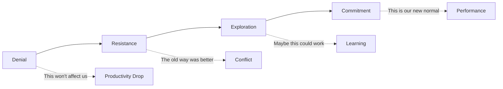

# First Principle #3: Human Behavior

> "Culture eats strategy for breakfast." - Peter Drucker

## Definition

Human Behavior is the recognition that all business outcomes flow through people. It's the science and art of understanding, motivating, and aligning human actions toward shared goals. For engineering leaders, this means creating environments where talented people can do their best work, sustainably.

## The Human Reality in Engineering

### The Paradox
Engineers build logical systems but are themselves emotional beings. The best technical solution often fails because it ignored human factors: resistance to change, ego, fear, ambition, burnout, or simple miscommunication.

### The Multiplier Effect
```
Individual Capability × Motivation × Collaboration = Team Output
                    × Trust × Psychological Safety
```

A 10x engineer isn't someone who codes 10x faster—it's someone who makes their team 10x more effective.

## Core Concepts of Human Behavior

### 1. Motivation Theory

#### Intrinsic vs. Extrinsic Motivation

| Type | Examples | Duration | Quality |
|------|----------|----------|---------|
| **Intrinsic** | Mastery, Purpose, Autonomy | Long-lasting | Deep engagement |
| **Extrinsic** | Salary, Title, Perks | Short-term | Surface compliance |

**Engineering Application**: Design work that maximizes intrinsic motivators:
- **Mastery**: Challenging problems, learning opportunities
- **Purpose**: Connect code to customer impact
- **Autonomy**: Ownership over solutions, not just tasks

### 2. Psychological Safety (Amy Edmondson) - The Google Project Aristotle Discovery

**The Research**: Google spent 2 years studying 180+ teams to find what makes teams effective. They expected technical skills, personality types, or seniority to matter most.

**The Surprise**: The #1 factor wasn't technical—it was psychological safety. High-performing teams had members who felt safe to take risks and make mistakes.

**The Data**:
- Teams with high psychological safety were 67% more likely to avoid failures
- 47% increase in quality of ideas generated
- 27% reduction in turnover
- 12% increase in revenue

#### The Four Stages
1. **Inclusion Safety**: I belong
2. **Learner Safety**: I can ask questions
3. **Contributor Safety**: I can offer ideas
4. **Challenger Safety**: I can question status quo

**Real Engineering Team Example**:

**Before Psychological Safety (Team "Alpha")**:
- Junior engineer discovers critical bug, doesn't report it (fear of blame)
- Bug causes 4-hour outage costing $2M
- Post-mortem focuses on "who" not "how to prevent"
- Team becomes more risk-averse, innovation drops

**After Building Psychological Safety (Team "Beta")**:
- Same junior engineer discovers similar bug, immediately alerts team
- Team swarms to fix in 10 minutes, learns from near-miss
- Post-mortem becomes learning session
- Team trust increases, they start tackling harder problems

**Engineering Manifestation**:
```
Low Psychological Safety:
- "That's a stupid question"
- Hiding mistakes
- Silent disagreement
- Hero culture
- "Not my job" mentality

High Psychological Safety:
- "I don't know, let's figure it out"
- Blameless post-mortems
- Productive conflict
- Team ownership
- "How can we help?" mentality
```

**Wisdom from the Field**: "Psychological safety isn't about being nice. It's about making it safe to tell the truth, especially when the truth is uncomfortable." - Google Engineering Manager

### 3. Trust Dynamics

#### The Trust Equation
```
Trust = (Credibility + Reliability + Intimacy) / Self-Orientation
```

Where:
- **Credibility**: Technical competence
- **Reliability**: Consistent delivery
- **Intimacy**: Safe to be vulnerable
- **Self-Orientation**: Focus on team vs. self

### 4. Change Management

#### The Change Curve (Kübler-Ross adapted)


## Real-World Human Behavior Stories

### Case Study 1: The Netflix "Keeper Test" - When High Performance Meets Human Reality

**Context**: 2009, Netflix was scaling rapidly but noticed some teams were underperforming despite having talented individuals.

**The Discovery**: Reed Hastings realized they had a "brilliant jerk" problem. Technically excellent people were destroying team dynamics.

**The Human Reality**: One senior engineer (let's call him "Alex") could solve any technical problem but:
- Publicly criticized colleagues' code in meetings
- Refused to explain his solutions to junior developers
- Created features that only he could maintain
- Made others afraid to propose ideas

**The Data**: Alex's team had:
- 40% higher turnover than other teams
- 60% longer code review cycles (people avoided reviewing his code)
- 25% fewer innovative ideas proposed in planning
- Despite Alex's talent, overall team productivity was 30% below average

**The "Keeper Test" Decision**: Hastings asked managers: "Would you fight to keep this person?"
- For Alex: Technical skills = 10/10, Team impact = 2/10
- Manager realized he wouldn't fight to keep Alex

**The Intervention**: Alex was coached for 90 days on collaboration. When behavior didn't change, he was let go despite being their best technical performer.

**Result**: 
- Team productivity increased 50% within 6 months
- Innovation ideas increased 200%
- Team reported highest satisfaction scores in company
- No critical knowledge was lost (team learned to collaborate better)

**Wisdom from the Field**: "We don't hire jerks, and we don't keep them. The cost of a brilliant jerk is never worth paying." - Netflix Engineering Leader

### Case Study 2: Spotify's "Psychological Safety First" Incident Response

**Context**: 2016, Spotify had a major outage during peak European listening hours. Traditional approach would be to find who caused it and ensure it never happens again.

**The Human Experiment**: Instead of blame, the engineering leader tried something radical: "Whoever caused this gets to lead the post-mortem."

**The Story**: A junior engineer had deployed a configuration change that triggered the outage. In most companies, this would end careers.

**Traditional Response**: 
- Junior engineer faces career damage
- Team learns to hide risky changes
- Innovation slows due to fear
- Future outages become more likely

**Spotify's Response**:
- Junior engineer led the post-mortem
- Focus was entirely on system improvements
- Engineer became expert on configuration management
- Team learned deployment wasn't just individual responsibility

**The Outcome**:
- 5 system improvements identified and implemented
- Deployment process became 90% safer
- Junior engineer became configuration system lead
- Team velocity increased (people weren't afraid to deploy)
- Similar incidents decreased 80% over next year

**Wisdom from the Field**: "The person who makes the mistake often becomes your best teacher about preventing it. Punish them, and you lose that learning opportunity." - Spotify Engineering Manager

### Case Study 3: Stack Overflow's "Impostor Syndrome Recovery Program"

**Context**: 2017, Stack Overflow engineering team survey revealed 78% of developers suffered from impostor syndrome, especially underrepresented groups.

**The Human Reality**: 
- Senior developers were leaving for "easier" companies
- Junior developers were afraid to ask questions
- Code reviews became performative rather than learning experiences
- Team was paralyzed by perfectionism

**The Data**:
- 40% longer development cycles due to over-engineering
- 60% of code reviews focused on style, not substance
- Women and minorities were 3x more likely to leave within first year
- Team satisfaction scores in bottom 20% of company

**The Intervention Program**:

1. **"Learning Out Loud"**: Senior engineers started livestreaming debugging sessions, showing their mistakes and thought process

2. **"Stupid Question Fridays"**: Weekly sessions where asking "obvious" questions was celebrated

3. **"Failure Parties"**: Monthly celebrations of intelligent failures and learning

4. **"Mentorship Rotation"**: Everyone mentors someone and is mentored by someone

**The Results** (after 12 months):
- Development velocity increased 35%
- Employee satisfaction scores moved to top 10% in company
- Retention of underrepresented groups improved 70%
- Code quality improved (fewer bugs in production)
- Team started volunteering for harder, more innovative projects

**The Surprise**: The program's biggest benefit wasn't confidence—it was collective intelligence. When people felt safe to admit ignorance, the team's overall knowledge increased exponentially.

**Wisdom from the Field**: "Impostor syndrome isn't a personal failing—it's often a system signal that your environment doesn't support learning. Fix the environment, not the person." - Stack Overflow Engineering Director

## Behavioral Patterns in Engineering Teams

### Common Patterns by Context

| Situation | Human Reality | Leadership Response |
|-----------|---------------|--------------------|
| **High-pressure release** | Team stress leads to shortcuts | Build sustainable pace, not hero culture |
| **Technical failure** | Individual blame vs. learning | Focus on systems, not people |
| **Rapid growth** | Loss of intimacy and trust | Intentionally scale culture practices |
| **Remote work** | Isolation and communication barriers | Over-communicate and create connection rituals |
| **Skill gaps** | Impostor syndrome and fear | Normalize learning and celebrate growth |

### Psychological Patterns to Recognize

- **Learned Helplessness**: "Nothing we try works" - Team has given up trying to improve
- **Groupthink**: False consensus to avoid conflict - Dangerous in technical decisions
- **Blame Culture**: Focus on "who" instead of "how to prevent" - Destroys psychological safety
- **Hero Worship**: Dependency on individuals - Creates bottlenecks and burnout
- **Innovation Paralysis**: Fear of failure stops experimentation - Kills competitive advantage

## Frameworks for Managing Human Behavior

### 1. The SCARF Model (David Rock)

People's behavior is driven by five domains:

| Domain | Definition | Engineering Application |
|--------|------------|------------------------|
| **Status** | Relative importance | Public recognition, career growth paths |
| **Certainty** | Ability to predict | Clear roadmaps, consistent processes |
| **Autonomy** | Sense of control | Ownership over solutions, flexible work |
| **Relatedness** | Safety with others | Team bonding, shared goals |
| **Fairness** | Just exchanges | Transparent decisions, equitable treatment |

**Application**: Design processes that enhance, not threaten, each domain.

### 2. Situational Leadership (Blanchard & Hersey)

Match leadership style to individual readiness:

| Competence | Commitment | Leadership Style | Actions |
|------------|------------|------------------|---------|
| Low | Low | **Directing** | Clear instructions, close supervision |
| Low | High | **Coaching** | Explain decisions, develop skills |
| High | Low | **Supporting** | Listen, facilitate, rebuild confidence |
| High | High | **Delegating** | Hand off responsibility, stay available |

### 3. The Five Dysfunctions of a Team (Lencioni)

Build from the foundation up:
```
       Inattention to Results
              ↑
        Avoidance of Accountability
              ↑
         Lack of Commitment
              ↑
         Fear of Conflict
              ↑
         Absence of Trust
```

## Practical Human Behavior Tools

### 1. One-on-Ones That Matter

Structure for maximum human connection:
```markdown
## One-on-One Template
1. **Check-in** (5 min): How are you really?
2. **Accomplishments** (10 min): What are you proud of?
3. **Challenges** (15 min): What's blocking you?
4. **Growth** (15 min): Where do you want to develop?
5. **Feedback** (10 min): Both directions
6. **Action Items** (5 min): Clear next steps
```

### 2. Team Health Metrics

Beyond velocity and bugs:
- **Psychological Safety Survey** (quarterly)
- **Team Morale Pulse** (bi-weekly)
- **Work-Life Balance Score** (monthly)
- **Learning & Growth Index** (quarterly)

### 3. Conflict Resolution Framework

When humans clash:
1. **Acknowledge emotions**: "I see this is frustrating"
2. **Find shared goals**: "We both want reliable systems"
3. **Separate positions from interests**: "Why is this important to you?"
4. **Generate options together**: "What if we..."
5. **Agree on experiments**: "Let's try X for 2 weeks"

## The Dark Side: Organizational Dysfunction

### Politics and Power Dynamics
- **Shadow org charts**: Who really makes decisions?
- **Information as currency**: Hoarding vs. sharing
- **Empire building**: Optimizing for turf, not value

### Cognitive Biases in Teams
- **Groupthink**: Conformity over truth
- **Confirmation bias**: Seeing only supporting data
- **Fundamental attribution error**: "They're incompetent" vs. "The system failed"

### Toxic Behaviors
- **Passive aggression**: "Sure, whatever you say"
- **Gaslighting**: "That's not what happened"
- **Weaponized incompetence**: Strategic helplessness

## Building Human-Centric Engineering Culture

### Core Practices

1. **Blameless Post-Mortems**
   - Focus on systems, not people
   - Celebrate error discovery
   - Share learnings widely

2. **Inclusive Meetings**
   - Round-robin input
   - Anonymous idea submission
   - Devil's advocate rotation

3. **Growth Mindset Rituals**
   - "Failure parties" for bold attempts
   - Learning budgets (time & money)
   - Internal tech talks

4. **Well-being Programs**
   - Flexible hours
   - Mental health support
   - Burnout prevention protocols

### Measuring Cultural Health

#### Leading Indicators
- Meeting participation rates
- Code review tone analysis
- Internal mobility rates
- Psychological safety scores

#### Lagging Indicators
- Voluntary attrition
- Employee NPS
- Glassdoor ratings
- Referral rates

## Interview Applications

### Demonstrating Human Behavior Mastery

#### Story Categories
1. **Building psychological safety** after team trauma
2. **Motivating** during challenging projects
3. **Resolving conflict** between strong personalities
4. **Managing up** to protect team
5. **Scaling culture** through rapid growth

#### Power Phrases
- "I recognized the human element was key..."
- "To address the underlying psychological dynamic..."
- "I created space for people to..."
- "The team's emotional state told me..."
- "Beyond the technical solution, people needed..."

### Real Interview Example: The Microservice Migration Disaster Recovery

```
Situation: Led team of 8 engineers through failed microservices migration. 
After 6 months, system was less reliable than before. Team was demoralized, 
blaming each other, and three people had asked for transfers.

Human Behavior Analysis:
- Observed signs of learned helplessness ("nothing we try works")
- Team had fragmented into silos (trust breakdown)
- People were avoiding difficult conversations
- Innovation had stopped (everyone playing it safe)

Psychological Intervention Strategy:
1. **Rebuilt Safety**: Started with team retrospective focused purely on 
   learning, not blame. Made it clear: "The system failed us, not vice versa."

2. **Restored Agency**: Gave each engineer ownership of one service 
   (autonomy + mastery)

3. **Created Quick Wins**: Identified 5 small improvements we could make 
   in 2 weeks to rebuild confidence

4. **Rebuilt Connection**: Instituted weekly "coffee chats" where people 
   could share personal challenges, not just technical ones

5. **Celebrated Learning**: Started "failure parties" where we celebrated 
   intelligent mistakes and what we learned

Specific Actions:
- Paired each struggling engineer with a mentor from outside team
- Created "innovation time" - 20% time for exploring solutions
- Implemented blameless post-mortems for every production issue
- Started sharing individual learning goals in team meetings

Human Behavior Results:
- Team satisfaction scores improved from 3.2 to 8.1 (out of 10)
- Voluntary overtime reduced 70% (sustainable pace restored)
- Cross-team collaboration requests increased 300%
- People started proposing ambitious ideas again

Technical Results (following human recovery):
- System reliability improved from 94% to 99.7%
- Deployment frequency increased 10x
- Mean time to recovery decreased from 4 hours to 12 minutes
- Next quarter shipped 40% more features than previous record

Key Learning: Technical problems often have human behavior roots. 
You can't fix systems without first fixing the human system that builds them.

Wisdom Gained: "Culture isn't what you say in all-hands meetings. 
It's what you do when things go wrong. That's when people learn 
what you really value: blame or learning, individuals or teams, 
comfort or growth."
```

## Connection to Other Principles

- **[Value Creation](../../../engineering-leadership/level-1-first-principles/value-creation/index.md)**: Motivated humans create exponentially more value - align purpose with profit
- **[Decision-Making](../../../engineering-leadership/level-1-first-principles/decision-making/index.md)**: Emotions drive decisions, not just logic - account for human factors in every choice
- **[Systems Thinking](../../../engineering-leadership/level-1-first-principles/systems-thinking/index.md)**: Humans are part of the system - Conway's Law shows how org structure shapes architecture
- **[Integrity & Ethics](../../../engineering-leadership/level-1-first-principles/integrity-ethics/index.md)**: Trust is the foundation of human cooperation - psychological safety requires ethical leadership

## Human Behavior Interview Toolkit

### Five Essential Human Behavior Stories to Prepare

1. **Building Psychological Safety**
   - Example: Team afraid to share bad news, incident response paralysis
   - Shows: Creating safe environment for truth-telling

2. **Motivating Through Difficult Times**
   - Example: Failed project, team demoralization, burnout recovery
   - Shows: Understanding intrinsic motivation, resilience building

3. **Resolving Team Conflict**
   - Example: Two senior engineers disagreeing, team taking sides
   - Shows: Mediation skills, finding common ground

4. **Managing Brilliant Jerks**
   - Example: High performer damaging team dynamics
   - Shows: Balancing individual vs. team performance

5. **Scaling Culture Through Growth**
   - Example: Maintaining team culture during rapid hiring
   - Shows: Culture preservation, onboarding effectiveness

### Human Behavior Power Phrases for Interviews

- "I recognized this was fundamentally a human problem, not a technical one..."
- "To address the underlying psychological dynamic..."
- "The team's emotional state was telling me..."
- "I created space for people to..."
- "Beyond the technical solution, the team needed..."
- "The human cost of this approach would be..."
- "To rebuild trust, I..."

### The "Human Behavior Archaeology" Framework

For each story, be ready to explain:
1. **Behavioral Symptoms**: What human behaviors did you observe?
2. **Root Cause Analysis**: What psychological needs weren't being met?
3. **Intervention Strategy**: How did you address the human factors?
4. **Measurement**: How did you track human/cultural changes?
5. **Technical Impact**: How did human changes affect technical outcomes?
6. **Learning**: What did this teach you about leading humans?

## Self-Development Plan

### This Week
- Conduct one-on-ones focused on human, not task
- Notice and name emotions in technical discussions
- Practice active listening without solving
- **New**: Observe your team for psychological safety signals

### This Month
- Read "The Five Dysfunctions of a Team"
- Implement one team ritual for psychological safety
- Get 360 feedback on your human impact
- **New**: Practice the "Human Behavior Archaeology" framework on past situations

### This Quarter
- Complete emotional intelligence assessment
- Design team charter with behavioral norms
- Measure and improve team psychological safety
- **New**: Build your portfolio of human behavior stories for interviews

## Application in Other Levels

### Level II: Core Business Concepts
- **[Leadership](../../../engineering-leadership/level-2-core-business/leadership/index.md)**: Leading humans requires understanding behavior
- **[Operations](../../../engineering-leadership/level-2-core-business/operations/index.md)**: Human factors in operational excellence
- **[Risk & Governance](../../../engineering-leadership/level-2-core-business/risk-governance/index.md)**: Managing human risks and compliance

### Level III: Engineering Applications
- **[People Management](../../../engineering-leadership/level-3-applications/people-management/index.md)**: Direct application of human behavior principles
- **[Organizational Design](../../../engineering-leadership/level-3-applications/organizational-design/index.md)**: Structures that enhance human performance
- **[Technical Leadership](../../../engineering-leadership/level-3-applications/technical-leadership/index.md)**: Leading technical humans effectively

### Level IV: Interview Execution
- **[Behavioral Stories](../../../engineering-leadership/level-4-interview-execution/behavioral/index.md)**: Demonstrating people leadership
- **[Culture Fit](../../../engineering-leadership/level-4-interview-execution/culture-values/index.md)**: Showing cultural awareness

## Next Steps

1. **Today**: Observe team dynamics through the human behavior lens
2. **This Week**: Conduct one-on-ones focused on human connection
3. **This Month**: Implement one psychological safety practice
4. **For Interviews**: Prepare 5 stories showcasing human behavior mastery

---

*Continue your journey: Discover how [Systems Thinking](../../../engineering-leadership/level-1-first-principles/systems-thinking/index.md) reveals the hidden connections between human behavior and organizational outcomes, or explore [Leadership](../../../engineering-leadership/level-2-core-business/leadership/index.md) for frameworks to mobilize human potential.*