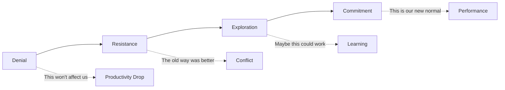

# First Principle #3: Human Behavior

> "Culture eats strategy for breakfast." - Peter Drucker

## Definition

Human Behavior is the recognition that all business outcomes flow through people. It's the science and art of understanding, motivating, and aligning human actions toward shared goals. For engineering leaders, this means creating environments where talented people can do their best work, sustainably.

## The Human Reality in Engineering

### The Paradox
Engineers build logical systems but are themselves emotional beings. The best technical solution often fails because it ignored human factors: resistance to change, ego, fear, ambition, burnout, or simple miscommunication.

### The Multiplier Effect
```
Individual Capability × Motivation × Collaboration = Team Output
                    × Trust × Psychological Safety
```

A 10x engineer isn't someone who codes 10x faster—it's someone who makes their team 10x more effective.

## Core Concepts of Human Behavior

### 1. Motivation Theory

#### Intrinsic vs. Extrinsic Motivation

| Type | Examples | Duration | Quality |
|------|----------|----------|---------|
| **Intrinsic** | Mastery, Purpose, Autonomy | Long-lasting | Deep engagement |
| **Extrinsic** | Salary, Title, Perks | Short-term | Surface compliance |

**Engineering Application**: Design work that maximizes intrinsic motivators:
- **Mastery**: Challenging problems, learning opportunities
- **Purpose**: Connect code to customer impact
- **Autonomy**: Ownership over solutions, not just tasks

### 2. Psychological Safety (Amy Edmondson)

The belief that one can speak up without risk of punishment or humiliation.

#### The Four Stages
1. **Inclusion Safety**: I belong
2. **Learner Safety**: I can ask questions
3. **Contributor Safety**: I can offer ideas
4. **Challenger Safety**: I can question status quo

**Engineering Manifestation**:
```
Low Psychological Safety:
- "That's a stupid question"
- Hiding mistakes
- Silent disagreement
- Hero culture

High Psychological Safety:
- "I don't know, let's figure it out"
- Blameless post-mortems
- Productive conflict
- Team ownership
```

### 3. Trust Dynamics

#### The Trust Equation
```
Trust = (Credibility + Reliability + Intimacy) / Self-Orientation
```

Where:
- **Credibility**: Technical competence
- **Reliability**: Consistent delivery
- **Intimacy**: Safe to be vulnerable
- **Self-Orientation**: Focus on team vs. self

### 4. Change Management

#### The Change Curve (Kübler-Ross adapted)


## Behavioral Patterns in Engineering Teams

### Pattern 1: The Brilliant Jerk
**Situation**: Technically excellent but toxic to team dynamics
**Human Reality**: Destroys psychological safety, drives attrition
**Leadership Response**: No amount of technical skill justifies cultural damage

### Pattern 2: The Imposter Syndrome Epidemic
**Situation**: High performers doubting their abilities
**Human Reality**: Especially acute in fast-changing tech
**Leadership Response**: Normalize learning, celebrate growth over perfection

### Pattern 3: The Burnout Cycle
**Situation**: Sustained crunch leading to exhaustion
**Human Reality**: Humans aren't machines; recovery is productive
**Leadership Response**: Sustainable pace, mandatory time off

### Pattern 4: The Communication Breakdown
**Situation**: Engineers talking past each other
**Human Reality**: Curse of knowledge, different mental models
**Leadership Response**: Structured communication, visual artifacts

## Frameworks for Managing Human Behavior

### 1. The SCARF Model (David Rock)

People's behavior is driven by five domains:
- **Status**: Relative importance
- **Certainty**: Ability to predict
- **Autonomy**: Sense of control
- **Relatedness**: Safety with others
- **Fairness**: Just exchanges

**Application**: Design processes that enhance, not threaten, each domain.

### 2. Situational Leadership (Blanchard & Hersey)

Match leadership style to individual readiness:

| Competence | Commitment | Leadership Style | Actions |
|------------|------------|------------------|---------|
| Low | Low | **Directing** | Clear instructions, close supervision |
| Low | High | **Coaching** | Explain decisions, develop skills |
| High | Low | **Supporting** | Listen, facilitate, rebuild confidence |
| High | High | **Delegating** | Hand off responsibility, stay available |

### 3. The Five Dysfunctions of a Team (Lencioni)

Build from the foundation up:
```
       Inattention to Results
              ↑
        Avoidance of Accountability
              ↑
         Lack of Commitment
              ↑
         Fear of Conflict
              ↑
         Absence of Trust
```

## Practical Human Behavior Tools

### 1. One-on-Ones That Matter

Structure for maximum human connection:
```markdown
## One-on-One Template
1. **Check-in** (5 min): How are you really?
2. **Accomplishments** (10 min): What are you proud of?
3. **Challenges** (15 min): What's blocking you?
4. **Growth** (15 min): Where do you want to develop?
5. **Feedback** (10 min): Both directions
6. **Action Items** (5 min): Clear next steps
```

### 2. Team Health Metrics

Beyond velocity and bugs:
- **Psychological Safety Survey** (quarterly)
- **Team Morale Pulse** (bi-weekly)
- **Work-Life Balance Score** (monthly)
- **Learning & Growth Index** (quarterly)

### 3. Conflict Resolution Framework

When humans clash:
1. **Acknowledge emotions**: "I see this is frustrating"
2. **Find shared goals**: "We both want reliable systems"
3. **Separate positions from interests**: "Why is this important to you?"
4. **Generate options together**: "What if we..."
5. **Agree on experiments**: "Let's try X for 2 weeks"

## The Dark Side: Organizational Dysfunction

### Politics and Power Dynamics
- **Shadow org charts**: Who really makes decisions?
- **Information as currency**: Hoarding vs. sharing
- **Empire building**: Optimizing for turf, not value

### Cognitive Biases in Teams
- **Groupthink**: Conformity over truth
- **Confirmation bias**: Seeing only supporting data
- **Fundamental attribution error**: "They're incompetent" vs. "The system failed"

### Toxic Behaviors
- **Passive aggression**: "Sure, whatever you say"
- **Gaslighting**: "That's not what happened"
- **Weaponized incompetence**: Strategic helplessness

## Building Human-Centric Engineering Culture

### Core Practices

1. **Blameless Post-Mortems**
   - Focus on systems, not people
   - Celebrate error discovery
   - Share learnings widely

2. **Inclusive Meetings**
   - Round-robin input
   - Anonymous idea submission
   - Devil's advocate rotation

3. **Growth Mindset Rituals**
   - "Failure parties" for bold attempts
   - Learning budgets (time & money)
   - Internal tech talks

4. **Well-being Programs**
   - Flexible hours
   - Mental health support
   - Burnout prevention protocols

### Measuring Cultural Health

#### Leading Indicators
- Meeting participation rates
- Code review tone analysis
- Internal mobility rates
- Psychological safety scores

#### Lagging Indicators
- Voluntary attrition
- Employee NPS
- Glassdoor ratings
- Referral rates

## Interview Applications

### Demonstrating Human Behavior Mastery

#### Story Categories
1. **Building psychological safety** after team trauma
2. **Motivating** during challenging projects
3. **Resolving conflict** between strong personalities
4. **Managing up** to protect team
5. **Scaling culture** through rapid growth

#### Power Phrases
- "I recognized the human element was key..."
- "To address the underlying psychological dynamic..."
- "I created space for people to..."
- "The team's emotional state told me..."
- "Beyond the technical solution, people needed..."

### Sample Answer Structure

```
Situation: Team demoralized after failed project
Human Insight: Recognized signs of learned helplessness
Intervention: 
- Facilitated retrospective focused on learning
- Implemented small wins strategy
- Paired struggling members with mentors
- Created "innovation time" for autonomy
Result: Team morale scores improved 40%, shipped next project early
Learning: Technical recovery requires emotional recovery first
```

## Connection to Other Principles

- **Value Creation**: Motivated humans create more value
- **Decision-Making**: Emotions drive decisions, not just logic  
- **Systems Thinking**: Humans are part of the system
- **Integrity**: Trust is the foundation of human cooperation

## Self-Development Plan

### This Week
- Conduct one-on-ones focused on human, not task
- Notice and name emotions in technical discussions
- Practice active listening without solving

### This Month
- Read "The Five Dysfunctions of a Team"
- Implement one team ritual for psychological safety
- Get 360 feedback on your human impact

### This Quarter
- Complete emotional intelligence assessment
- Design team charter with behavioral norms
- Measure and improve team psychological safety

---

*Next: Discover how [Systems Thinking](../systems-thinking/) reveals the hidden connections between human behavior and organizational outcomes.*