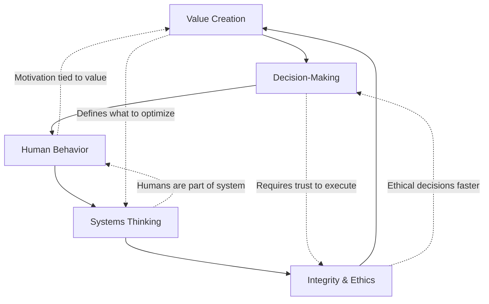

# Level I: First Principles - The Foundational "Why"

> These universal laws govern effective leadership and business. They are the ultimate justification for any action you take as an engineering leader.

## Overview

First Principles are the immutable truths that transcend industries, technologies, and organizational structures. Mastering these principles allows you to reason from foundational truths rather than by analogy, leading to breakthrough insights and decisions.

## The Five Universal Principles

### 1. [Value Creation](value-creation/)
**The Prime Directive**: Business exists to solve real customer problems profitably.

Every line of code, every hire, every decision must ultimately create value for customers in a way that sustains the business. This principle anchors all others.

### 2. [Decision-Making](decision-making/) 
**The Engine of Progress**: Progress requires timely, informed choices under uncertainty.

Perfect information never exists. Great leaders develop frameworks for making high-quality decisions quickly, distinguishing reversible from irreversible choices.

### 3. [Human Behavior](human-behavior/)
**The Execution Multiplier**: Culture and motivation determine the quality of execution.

Systems are built by humans, for humans. Understanding and optimizing human behavior is not "soft"—it's the hardest and most leveraged part of leadership.

### 4. [Systems Thinking](systems-thinking/)
**The Hidden Architecture**: Organizations are interdependent, feedback-rich systems.

Local optimizations often create global failures. Leaders must see and design for the whole system, including delayed effects and unintended consequences.

### 5. [Integrity & Ethics](integrity-ethics/)
**The Trust Foundation**: Sustained trust is the ultimate competitive advantage.

In a world of infinite games, reputation and trust compound. Ethical behavior isn't just right—it's the optimal long-term strategy.

## Why First Principles Matter for Engineering Leaders

### 1. **Navigate Ambiguity**
When facing novel problems without precedent, first principles provide a compass. Should we rebuild or refactor? First principles of value creation and decision-making guide you.

### 2. **Resolve Conflicts**
When stakeholders disagree, returning to first principles creates common ground. Everyone can agree on creating value and maintaining integrity.

### 3. **Scale Judgment**
As you grow from managing 5 to 500 people, you can't make every decision. First principles create aligned autonomous decision-making.

### 4. **Interview Differentiation**
Most candidates recite tactics. Those who reason from first principles demonstrate executive thinking.

## How These Principles Interconnect

## Applying First Principles: A Case Study

**Scenario**: Your team discovers a critical security vulnerability on Friday afternoon.

**Without First Principles**: Panic, blame, hero-mode fixes, burnout.

**With First Principles**:
1. **Value Creation**: What creates most value for customers? (Security > Features)
2. **Decision-Making**: Is this reversible? What's the cost of delay? (Not reversible, high cost)
3. **Human Behavior**: How do we maintain team morale while responding? (Rotation, recognition)
4. **Systems Thinking**: What allowed this? How do we prevent recurrence? (Process, not people)
5. **Integrity**: How do we communicate transparently? (Immediate disclosure with fix timeline)

**Result**: Principled response that fixes the issue while strengthening culture and processes.

## Learning Path Through First Principles

### Week 1-2: Deep Dive Each Principle
- Read the detailed guide for each principle
- Identify 2-3 personal examples for each
- Practice explaining each in plain language

### Week 3-4: Integration Practice
- Take current challenges and analyze through all 5 principles
- Build mental models connecting principles
- Start embedding principle language in communication

### Week 5-6: Interview Preparation
- Map your best stories to multiple principles
- Practice "principle hooks" in answers
- Develop your personal principle framework

## Common Misconceptions

❌ **"First principles are too theoretical"**
✅ They're the most practical tools you have—they apply everywhere

❌ **"Business principles don't apply to engineering"**
✅ Engineering exists to serve business value creation

❌ **"I can skip to tactics"**
✅ Tactics without principles create fragile, context-dependent knowledge

❌ **"This is just common sense"**
✅ Common sense isn't common practice—mastery requires deliberate study

## Self-Assessment Questions

Before diving deeper, reflect on these:

1. Can you trace your recent decisions back to first principles?
2. Which principle do you most naturally embody? Which needs work?
3. How would your team describe your principles?
4. Can you teach these principles to others?
5. Do your actions align with your stated principles?

## The Path Forward

Mastering first principles is a career-long journey. Start by deeply understanding each principle, then focus on integration and application. Remember: 

**Knowing the principles = Manager**  
**Living the principles = Leader**  
**Teaching the principles = Executive**

## Cross-Principle Integration

The power of first principles comes from their interconnection:

- **[Value Creation](value-creation/) + [Decision-Making](decision-making/)**: Every decision should maximize value
- **[Decision-Making](decision-making/) + [Human Behavior](human-behavior/)**: Great decisions need buy-in to succeed
- **[Human Behavior](human-behavior/) + [Systems Thinking](systems-thinking/)**: People adapt to system incentives
- **[Systems Thinking](systems-thinking/) + [Integrity](integrity-ethics/)**: Ethical systems produce ethical outcomes
- **[Integrity](integrity-ethics/) + [Value Creation](value-creation/)**: Trust enables sustainable value

## Next Steps

### For New Engineering Managers
1. Start with [Human Behavior](human-behavior/) - your biggest challenge will be people
2. Add [Decision-Making](decision-making/) - learn to make quality decisions quickly
3. Study [Value Creation](value-creation/) - connect your work to business impact

### For Senior Managers
1. Focus on [Systems Thinking](systems-thinking/) - see the bigger picture
2. Deepen [Value Creation](value-creation/) - quantify and maximize impact
3. Master [Integrity & Ethics](integrity-ethics/) - build lasting trust

### For Directors and Above
1. Lead with [Integrity & Ethics](integrity-ethics/) - set the cultural tone
2. Apply [Systems Thinking](systems-thinking/) - design organizational systems
3. Integrate all principles in your leadership philosophy

### Interview Preparation Path
1. **Week 1**: Read all five principles, identify personal examples
2. **Week 2**: Map your best stories to multiple principles
3. **Week 3**: Practice using principle language in mock interviews
4. **Week 4**: Refine and polish your principle-based narratives

---

*Ready to dive deep? Choose a principle to explore, or continue to [Level II: Core Business Concepts](../level-2-core-business/) to see how these principles become actionable disciplines. For hands-on application, jump to [Level III: Engineering Applications](../level-3-applications/).*