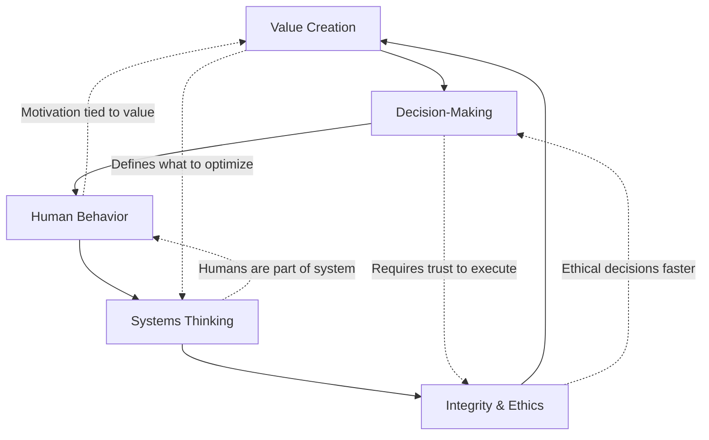
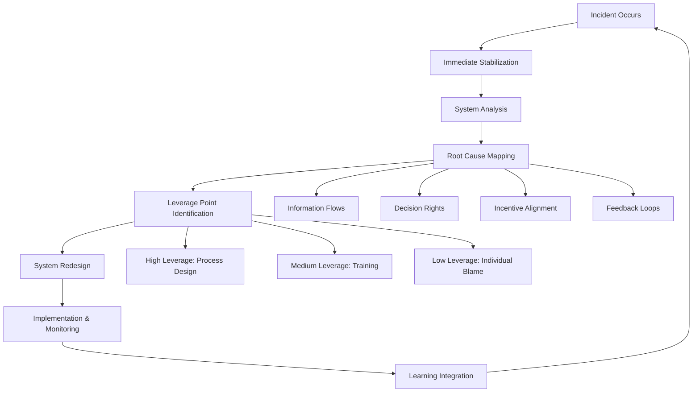

# Level I: First Principles - The Foundational "Why"

> These universal laws govern effective leadership and business. They are the ultimate justification for any action you take as an engineering leader.

## Overview

First Principles are the immutable truths that transcend industries, technologies, and organizational structures. Mastering these principles allows you to reason from foundational truths rather than by analogy, leading to breakthrough insights and decisions.

## The System's View: The Meta-Principle

Before exploring the five principles, understand the foundational lens through which great leaders see the world: **Organizations as Complex Adaptive Systems**.

<div class="axiom-box">
<strong>Core Insight:</strong> Behavior Emerges from Structure

Individual heroics are symptoms of systemic problems. Lasting change comes from designing systems that naturally produce desired behaviors, not from trying to change people directly.
</div>

### Organizations as Living Systems

Think of your organization not as a machine to be optimized, but as a living ecosystem with:

- **Feedback loops** that amplify or dampen behaviors
- **Emergent properties** that arise from interactions between parts
- **Adaptive capacity** that responds to environmental changes
- **Network effects** where relationships matter more than hierarchy

### System Mapping: The Leader's Diagnostic Tool

Great leaders mentally map their organization's system using these questions:

**Structure Mapping:**
- Where are the decision points and information flows?
- What metrics drive behavior at each level?
- Which processes create bottlenecks or delays?

**Relationship Mapping:**
- Who has formal vs. informal influence?
- Where do conflicts regularly emerge?
- Which relationships enable or block progress?

**Feedback Loop Identification:**
- What behaviors get rewarded (often unintentionally)?
- Where do problems recur despite individual fixes?
- Which metrics create unintended consequences?

### System Archetypes: Common Organizational Patterns

Recognize these recurring patterns in your organization:

| Archetype | Pattern | Leadership Response |
|-----------|---------|-------------------|
| **Fixes That Fail** | Quick fixes create bigger problems later | Address root causes, not symptoms |
| **Shifting the Burden** | Teams depend on heroes instead of building capability | Invest in systems and training |
| **Limits to Growth** | Growth hits invisible constraints | Identify and address limiting factors |
| **Success to the Successful** | Winners get more resources, creating inequality | Design for equitable resource distribution |

### High-Leverage Intervention Points

Systems thinker Donella Meadows identified where leaders can create maximum change:

1. **Paradigms** - The shared mental models that create the system
2. **Goals** - The purpose or function of the system  
3. **Power Distribution** - Who gets to make the rules
4. **Rules** - The incentives, constraints, and formal/informal policies
5. **Information Flow** - Who has access to what information when

*Lower leverage: budgets, organizational charts, individual performance*

## The Five Universal Principles

<div class="principles-overview">

### 1. [Value Creation](../../engineering-leadership/level-1-first-principles/value-creation/index.md)
**The Prime Directive**: Business exists to solve real customer problems profitably.

Every line of code, every hire, every decision must ultimately create value for customers in a way that sustains the business. This principle anchors all others.

*Systems View*: Value flows through your organization like energy through an ecosystem. Map the value streams to understand where energy is created, stored, or dissipated.

### 2. [Decision-Making](../../engineering-leadership/level-1-first-principles/decision-making/index.md) 
**The Engine of Progress**: Progress requires timely, informed choices under uncertainty.

Perfect information never exists. Great leaders develop frameworks for making high-quality decisions quickly, distinguishing reversible from irreversible choices.

*Systems View*: Decision-making is a distributed capability, not a centralized function. Design information flows and decision rights to enable good choices throughout the system.

### 3. [Human Behavior](../../engineering-leadership/level-1-first-principles/human-behavior/index.md)
**The Execution Multiplier**: Culture and motivation determine the quality of execution.

Systems are built by humans, for humans. Understanding and optimizing human behavior is not "soft"—it's the hardest and most leveraged part of leadership.

*Systems View*: People adapt rationally to the system you've designed. If you see "people problems," look for system design issues. Behavior emerges from structure.

### 4. [Systems Thinking](../../engineering-leadership/level-1-first-principles/systems-thinking/index.md)
**The Hidden Architecture**: Organizations are interdependent, feedback-rich systems.

Local optimizations often create global failures. Leaders must see and design for the whole system, including delayed effects and unintended consequences.

*Systems View*: This is your core leadership capability—seeing the organization as a complex adaptive system and designing interventions that leverage natural system dynamics.

### 5. [Integrity & Ethics](../../engineering-leadership/level-1-first-principles/integrity-ethics/index.md)
**The Trust Foundation**: Sustained trust is the ultimate competitive advantage.

In a world of infinite games, reputation and trust compound. Ethical behavior isn't just right—it's the optimal long-term strategy.

*Systems View*: Trust is the lubricant that makes all other systems function efficiently. Without it, you need expensive control mechanisms and lose adaptive capacity.

</div>

## Practical Applications: System Mapping Toolkit

### System Mapping Exercises

Use these tools to diagnose and design organizational systems:

**Tool 1: Value Stream Mapping (using Miro/Kumu)**
```
Customer Need → Requirements → Development → Testing → Deployment → Value Delivery
     ↑              ↑             ↑           ↑           ↑            ↑
Track delays,    Decision      Code        Quality    Release    Customer
feedback loops,  bottlenecks   quality     gates      cycles     satisfaction
waiting time
```

**Tool 2: Influence Network Analysis**
- Map formal reporting lines (org chart)
- Map informal influence networks (who really makes decisions?)
- Identify key connectors, bottlenecks, and isolated nodes
- Look for misalignment between formal authority and actual influence

**Tool 3: Feedback Loop Identification**
1. Pick a recurring problem in your organization
2. Trace the symptom back to its source
3. Follow the delayed effects that might reinforce the problem
4. Map the reinforcing and balancing loops
5. Identify leverage points for intervention

### Diagnostic Toolkit: Recognizing System Patterns

**Pattern Recognition Questions:**

*Fixes That Fail:*
- What problems keep coming back despite repeated fixes?
- Where do teams apply band-aids instead of addressing root causes?
- Which "solutions" create new problems downstream?

*Shifting the Burden:*
- Who are the heroes that everyone depends on?
- What capabilities should be distributed but aren't?
- Where does the organization avoid building systematic solutions?

*Limits to Growth:*
- What constraint currently limits your team's growth?
- Which resources become scarce as you scale?
- What worked at small scale but breaks at larger scale?

### First Experiments: Testing System Changes

Before major interventions, run small experiments:

**Experiment Design Framework:**
1. **Hypothesis**: "If we change X, we expect Y behavior change because Z"
2. **Measure**: Define leading and lagging indicators
3. **Scope**: Start small, single team or process
4. **Timeline**: Short cycles (2-4 weeks) with clear checkpoints
5. **Learning**: What surprised you? What would you do differently?

**Example Experiments:**
- Change meeting structure to test decision-making speed
- Modify metrics to test behavior changes
- Adjust information sharing to test collaboration
- Experiment with feedback mechanisms

## Why First Principles Matter for Engineering Leaders

### 1. **Navigate Ambiguity with Systems Lens**
When facing novel problems without precedent, first principles provide a compass. Should we rebuild or refactor? Apply value creation and systems thinking: What creates most value for the whole system, not just your team?

### 2. **Resolve Conflicts Through System Design**
When stakeholders disagree, return to first principles and system view. Often conflicts arise from misaligned incentives or information asymmetries—design solutions that address the system, not the symptoms.

### 3. **Scale Judgment Through System Architecture**
As you grow from managing 5 to 500 people, you can't make every decision. Design systems where good decisions emerge naturally from clear principles, information flows, and incentive alignment.

### 4. **Interview Differentiation Through Systems Thinking**
Most candidates recite tactics or blame individuals. Those who demonstrate systems thinking—seeing patterns, designing interventions, thinking in feedback loops—show executive-level thinking.

## How These Principles Interconnect



## Applying First Principles: A Systems-Informed Case Study

**Scenario**: Your team discovers a critical security vulnerability on Friday afternoon.

**Without Systems Thinking**: Panic, blame individuals, hero-mode fixes, burnout, recurring vulnerabilities.

**With Systems + First Principles Approach**:

**Immediate Response (Systems View: Stabilize before optimizing)**:
1. **Value Creation**: What creates most value for customers right now? (Security > Features)
2. **Decision-Making**: Apply decision framework - irreversible, high cost of delay, act now
3. **Human Behavior**: Activate incident response system, not individual heroes

**System Analysis (Root Cause Investigation)**:
4. **Systems Thinking**: Map the system that allowed this:
   - Where in the development process did this slip through?
   - What information flows were missing?
   - Which feedback loops failed?
   - What incentives encouraged speed over security?

**System Design (Prevention)**:
5. **Integrity**: Transparent communication + systematic prevention
   - Immediate: Disclose with timeline and interim measures
   - Long-term: Design systems that prevent recurrence

**System Intervention Points**:
- **Information Flow**: Security reviews earlier in pipeline
- **Rules**: Security gates that can't be bypassed
- **Goals**: Balance speed and security metrics
- **Paradigm**: Shift from "security is QA's job" to "security is everyone's job"

**Result**: Not just a fixed vulnerability, but a more resilient system that prevents future occurrences while maintaining team sustainability.

### Systems Thinking in Action

This case demonstrates the leader's role as **system architect**:



**Key Insight**: Great leaders don't just solve problems—they redesign systems to prevent problem classes.

## Learning Path Through First Principles

### Week 1-2: Systems Foundation + Deep Dive Each Principle
- **Start with systems view**: Practice seeing organizations as complex adaptive systems
- Read the detailed guide for each principle
- For each principle, identify current system patterns in your organization
- Practice system mapping exercises with current challenges

### Week 3-4: Integration + System Mapping Practice
- Take current challenges and analyze through all 5 principles AND systems lens
- Build mental models connecting principles with system dynamics
- Practice system mapping exercises using digital tools (Miro, Kumu)
- Identify high-leverage intervention points in your current role

### Week 5-6: Interview Preparation + Systems Demonstration
- Map your best stories to multiple principles AND systems thinking
- Practice explaining how you've designed systems, not just managed people
- Develop your personal principle framework with systems architecture examples
- Prepare examples of system interventions and their results

## Common Misconceptions

❌ **"First principles are too theoretical"**
✅ They're the most practical tools you have—they apply everywhere

❌ **"Business principles don't apply to engineering"**
✅ Engineering exists to serve business value creation

❌ **"I can skip to tactics"**
✅ Tactics without principles create fragile, context-dependent knowledge

❌ **"This is just common sense"**
✅ Common sense isn't common practice—mastery requires deliberate study

## Self-Assessment Questions

Before diving deeper, reflect on these systems-informed questions:

**First Principles Mastery:**
1. Can you trace your recent decisions back to first principles?
2. Which principle do you most naturally embody? Which needs work?
3. How would your team describe your principles?

**Systems Thinking Application:**
4. Can you map the systems that create recurring problems in your organization?
5. Do you intervene at high-leverage points or just treat symptoms?
6. Can you identify feedback loops and unintended consequences in your decisions?

**Integration Assessment:**
7. Do you see "people problems" or "system design problems"?
8. Can you teach both principles and systems thinking to others?
9. Do your interventions create lasting change or temporary fixes?

**Leadership Systems Design:**
10. Have you designed systems that naturally produce good decisions?
11. Do you optimize locally (your team) or globally (the whole organization)?
12. Can you predict how changes will ripple through your organizational system?

## The Path Forward

Mastering first principles through a systems lens is a career-long journey. Start by deeply understanding each principle, then focus on systems integration and application. Remember: 

**Knowing the principles = Manager**  
**Living the principles = Leader**  
**Teaching the principles = Executive**  
**Designing systems that embody the principles = Systems Architect**

The ultimate leadership capability is designing organizational systems that naturally produce:
- Value-creating decisions at every level
- High-quality choices under uncertainty
- Motivated, aligned human behavior
- Systemic thinking and learning
- Trustworthy, ethical outcomes

This is not about controlling people—it's about architecting systems where the right things happen naturally.

## Cross-Principle Integration

The power of first principles comes from their interconnection:

- **[Value Creation](../../engineering-leadership/level-1-first-principles/value-creation/index.md) + [Decision-Making](../../engineering-leadership/level-1-first-principles/decision-making/index.md)**: Every decision should maximize value
- **[Decision-Making](../../engineering-leadership/level-1-first-principles/decision-making/index.md) + [Human Behavior](../../engineering-leadership/level-1-first-principles/human-behavior/index.md)**: Great decisions need buy-in to succeed
- **[Human Behavior](../../engineering-leadership/level-1-first-principles/human-behavior/index.md) + [Systems Thinking](../../engineering-leadership/level-1-first-principles/systems-thinking/index.md)**: People adapt to system incentives
- **[Systems Thinking](../../engineering-leadership/level-1-first-principles/systems-thinking/index.md) + [Integrity](../../engineering-leadership/level-1-first-principles/integrity-ethics/index.md)**: Ethical systems produce ethical outcomes
- **[Integrity](../../engineering-leadership/level-1-first-principles/integrity-ethics/index.md) + [Value Creation](../../engineering-leadership/level-1-first-principles/value-creation/index.md)**: Trust enables sustainable value

## Next Steps

### For New Engineering Managers
1. Start with [Human Behavior](../../engineering-leadership/level-1-first-principles/human-behavior/index.md) - your biggest challenge will be people
2. Add [Decision-Making](../../engineering-leadership/level-1-first-principles/decision-making/index.md) - learn to make quality decisions quickly
3. Study [Value Creation](../../engineering-leadership/level-1-first-principles/value-creation/index.md) - connect your work to business impact

### For Senior Managers
1. Focus on [Systems Thinking](../../engineering-leadership/level-1-first-principles/systems-thinking/index.md) - see the bigger picture
2. Deepen [Value Creation](../../engineering-leadership/level-1-first-principles/value-creation/index.md) - quantify and maximize impact
3. Master [Integrity & Ethics](../../engineering-leadership/level-1-first-principles/integrity-ethics/index.md) - build lasting trust

### For Directors and Above
1. Lead with [Integrity & Ethics](../../engineering-leadership/level-1-first-principles/integrity-ethics/index.md) - set the cultural tone
2. Apply [Systems Thinking](../../engineering-leadership/level-1-first-principles/systems-thinking/index.md) - design organizational systems
3. Integrate all principles in your leadership philosophy

### Interview Preparation Path
1. **Week 1**: Read all five principles, identify personal examples
2. **Week 2**: Map your best stories to multiple principles
3. **Week 3**: Practice using principle language in mock interviews
4. **Week 4**: Refine and polish your principle-based narratives

---

*Ready to dive deep? Choose a principle to explore, or continue to [Level II: Core Business Concepts](../../engineering-leadership/level-2-core-business/index.md) to see how these principles become actionable disciplines. For hands-on application, jump to [Level III: Engineering Applications](../../engineering-leadership/level-3-applications/index.md).*