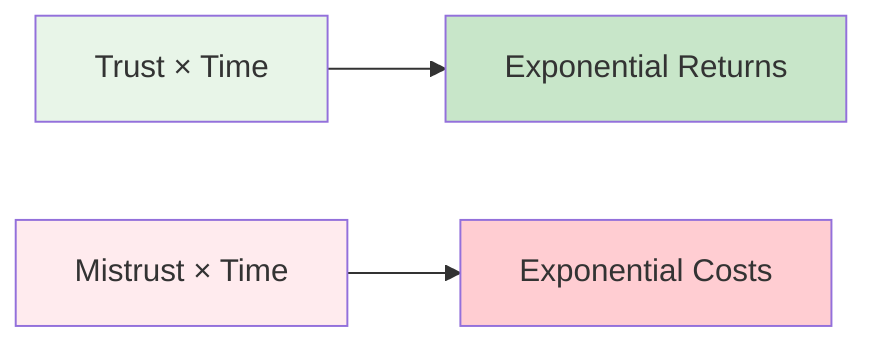
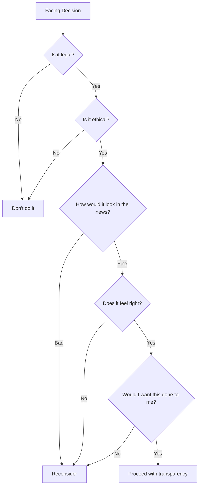
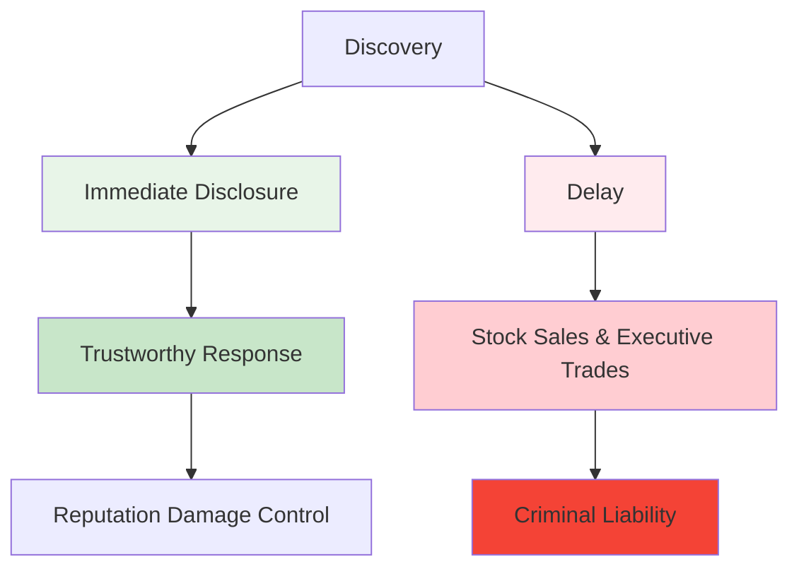
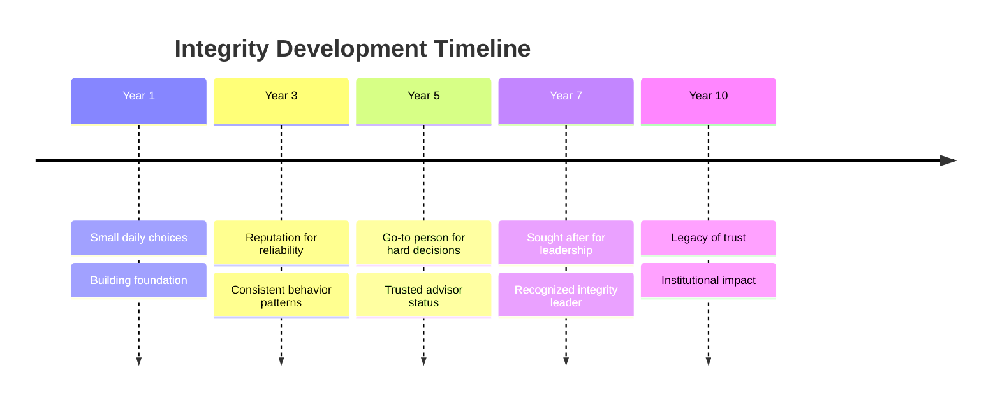

# First Principle #5: Integrity & Ethics

> "In looking for people to hire, you look for three qualities: integrity, intelligence, and energy. And if they don't have the first, the other two will kill you." - Warren Buffett

## Definition

Integrity & Ethics is the commitment to doing what's right, especially when it's costly. It's the foundation of trust, and trust is the foundation of all sustainable business. For engineering leaders, this means building systems and cultures that are not just efficient and innovative, but also ethical, transparent, and worthy of trust.

## The Business Case for Integrity

### Trust as Competitive Advantage

| Trust Level | Metric | Impact |
|-------------|--------|---------|
| **High Trust** | Performance | 2.5x more likely to be high-performing |
| | Stress | 74% less stress for employees |
| | Productivity | 50% higher productivity |
| | Health | 13% fewer sick days |
| | Engagement | 76% more engagement |
| **Low Trust** | Regulatory Risk | 3x more likely to face regulatory action |
| | Turnover | 2x employee turnover |
| | Efficiency | 4x more time spent on CYA activities |
| | Innovation | Reduced (fear of failure) |

### The Compound Effect of Trust



One lie can destroy years of credibility. One ethical stand can define a career.

## Core Dimensions of Integrity

### 1. Technical Integrity

**Definition**: Building systems that do what they claim, reliably and safely.

**Manifestations:**

- Accurate metrics and monitoring
- Honest technical debt assessment
- Realistic timeline estimates
- Transparent about limitations
- Proper error handling and user communication

**Anti-patterns:**

- "Resume-driven development"
- Hiding system problems
- Overpromising capabilities
- Security through obscurity

### 2. Data Ethics

**The New Responsibility**: With great data comes great responsibility.

| Ethical Dimension | Questions to Ask | Engineering Actions |
|-------------------|------------------|---------------------|
| **Privacy** | What data do we actually need? | Data minimization, purpose limitation |
| **Security** | How do we protect what we collect? | Encryption, access controls, audit logs |
| **Transparency** | Do users understand what we do? | Clear privacy policies, data flow diagrams |
| **Fairness** | Does our system discriminate? | Bias testing, diverse training data |
| **Accountability** | Can we explain our decisions? | Interpretable models, decision logs |

### 3. Organizational Integrity

**Definition**: Aligning actions with stated values.

**The Say-Do Gap:**

| What We Say | What We Do |
|-------------|------------|
| "People are our greatest asset" | First to cut in downturns |
| "We value work-life balance" | Reward only those who work weekends |
| "We embrace failure" | Punish those who take risks |

### 4. Personal Integrity

**The Leadership Mirror**: Your team will follow your example, not your words.

**Daily Tests:**

- Taking credit vs. giving credit
- Admitting mistakes vs. blame-shifting
- Hard conversations vs. avoidance
- Promise keeping vs. convenient forgetting
- Speaking truth to power vs. political safety

## Ethical Frameworks for Engineering Leaders

### 1. The Ethical Decision Tree



### 2. The Stakeholder Impact Analysis

For any decision, consider impact on:

1. **Users/Customers**: Privacy, safety, value
2. **Employees**: Fairness, growth, well-being
3. **Company**: Reputation, sustainability
4. **Society**: Broader implications
5. **Environment**: Resource usage, sustainability

### 3. The Front Page Test

"How would I feel if this decision and my reasoning were published on the front page of the New York Times?"

If the answer makes you uncomfortable, reconsider.

### 4. The Future Self Test

"Will I be proud of this decision in 10 years?"

Short-term gains from ethical compromises rarely age well.

## Real-World Integrity & Ethics Stories

### Case Study 1: Patagonia's "Don't Buy This Jacket" - When Integrity Drives Profits

**Context**: 2011, Black Friday. Every company was pushing maximum consumption. Patagonia did something radical.

**The Pressure:**

- Black Friday = biggest revenue day of year
- Board expected maximum sales push
- Marketing team had campaigns ready
- Competitors were all promoting heavy discounts

**The Integrity Decision**: Patagonia ran a full-page New York Times ad: "Don't Buy This Jacket" - encouraging customers to buy only what they needed and repair what they had.

**The Business Case Against:**

- Could reduce sales by 30-50%
- Shareholders might revolt
- Marketing team thought it was insane
- Wall Street analysts predicted disaster

**The Long-Term Thinking**: CEO Yvon Chouinard said: "Our mission is to save the planet. Selling more stuff doesn't save the planet. Building products that last and encouraging responsible consumption does."

**The Results** (5-year impact):

- Sales increased 30% (customers trusted the brand more)
- Customer loyalty scores became industry-leading
- Brand value increased $1B+
- Attracted top talent who wanted to work for ethical company
- Became case study taught in business schools worldwide

**Wisdom from the Field**: "When your integrity aligns with your mission, customers don't just buy your product - they join your cause."

### Case Study 2: The Facebook Data Science Team's A/B Test Ethics Crisis

**Context**: 2014, Facebook's data science team wanted to test emotional contagion - whether seeing negative posts made users post negative content.

**The Experiment:**

- Manipulated 689,000 users' news feeds
- Showed some users more negative content
- Showed others more positive content
- Measured emotional response in their posts
- No consent, no notification

**The Business Pressure:**

- Could unlock billions in targeted advertising
- Competitors were doing similar research
- Legal team said it was technically allowed
- Research could "improve user experience"

**The Ethical Dilemma:**

- Users didn't consent to psychological experimentation
- Could cause real emotional harm
- Violated trust relationship with users
- Set precedent for future manipulation

**What Happened**: The study was published, public outrage followed, regulators investigated, and user trust plummeted.

**The Integrity Alternative** (what could have been done):

1. **Transparent Consent**: "We'd like to study emotional responses to content. Opt in?"
2. **Ethical Review Board**: External review of experiment ethics
3. **User Benefit Focus**: "How can we help users feel better?" not "How can we manipulate emotions?"
4. **Harm Prevention**: Built-in safeguards for vulnerable users

**The Actual Cost of the Integrity Failure:**

- $119B stock value lost in following months
- Congressional hearings and regulatory scrutiny
- Years of reputation repair
- Talent retention issues (engineers didn't want to build manipulation tools)
- Industry-wide backlash against tech companies

**The Engineering Leader's Reflection**: "We optimized for what we could measure (engagement) instead of what we should value (user wellbeing). Technical capability without ethical constraint is just sophisticated harm."

**Wisdom from the Field**: "Just because you can collect data doesn't mean you should. Just because an experiment is technically legal doesn't make it morally right."

### Case Study 3: The Equifax Breach - When Integrity Failures Compound

**Context**: 2017, Equifax discovered a massive data breach affecting 147 million Americans. The engineering team faced a cascade of integrity choices.

**The Initial Integrity Failure:**

- Vulnerability existed for 2 months before discovery
- Patch was available but not applied
- Security team understaffed and under-resourced
- Executives prioritized features over security

**The Cover-Up Temptation**: Once discovered, leadership faced:

- Regulatory requirements to disclose within 72 hours
- Stock price would crater (executives had planned stock sales)
- Customer trust would be destroyed
- Competitive advantage would be lost

**The Integrity Choice Tree**:


**What Actually Happened** (the integrity failures):

- Delayed disclosure by 6 weeks
- Executives sold $1.8M in stock before disclosure
- Hired external firm to minimize legal liability
- Blamed "sophisticated attackers" instead of basic security failures

**The Compounding Costs:**

- $4B+ in fines and settlements
- CEO, CTO, and CSO forced to resign
- Congressional investigation
- Criminal charges for executives
- Company reputation permanently damaged
- Industry regulation increased

**The Integrity Alternative** (what should have happened):

1. **Immediate Disclosure**: "We discovered a breach, here's what we know, here's what we're doing"
2. **Full Transparency**: "This was our security failure, not a sophisticated attack"
3. **Customer-First Response**: Free credit monitoring, identity theft protection
4. **System Overhaul**: Complete security architecture rebuild
5. **Executive Accountability**: Leadership takes responsibility, implements changes

**The Engineering Leader's Learning**: "Every integrity shortcut created a bigger integrity crisis. The cover-up was worse than the crime, and both were preventable with a culture that valued security and transparency."

**Wisdom from the Field**: "In crisis, your integrity is tested not by the initial mistake, but by how you respond to it. Transparency early is painful; transparency late is catastrophic."

## Common Ethical Dilemmas in Engineering

### Frequent Scenarios Engineering Leaders Face

| Dilemma Category | Common Scenarios | Ethical Tension |
|------------------|------------------|----------------|
| **Technical Debt** | Ship buggy feature vs. miss deadline | Short-term pressure vs. long-term quality |
| **Data Privacy** | Collect useful data vs. respect privacy | Business value vs. user rights |
| **Resource Allocation** | Feature development vs. security/accessibility | Revenue generation vs. responsible development |
| **Team Pressure** | Unrealistic deadlines vs. sustainable pace | Business demands vs. human wellbeing |
| **Algorithmic Fairness** | Optimize for engagement vs. prevent bias | Performance metrics vs. social responsibility |

## Building Ethical Engineering Cultures

### Structural Supports

1. **Blameless Post-Mortems**
   - Psychological safety for truth-telling
   - Focus on systems, not scapegoats
   - Widely shared learnings

2. **Anonymous Reporting Channels**
   - Safe escalation paths
   - Regular reviews
   - Visible actions on feedback

3. **Ethics Training**
   - Regular scenarios and discussions
   - Not just compliance checkboxes
   - Led by leadership

4. **Clear Policies**
   - Data handling standards
   - Conflict of interest guidelines
   - Open source contribution rules
   - Moonlighting policies

### Cultural Practices

1. **Radical Transparency**
   - Open architecture decisions
   - Visible project status
   - Honest retrospectives
   - Public post-mortems

2. **Accountability Structures**
   - Clear ownership
   - Regular reviews
   - Consequence management
   - Recognition for integrity

3. **Ethical Role Models**
   - Celebrate integrity choices
   - Share stories of doing right
   - Make heroes of truth-tellers

## The Cost of Integrity Failures

### Technical Debt Analogy
**Ethical Debt = Shortcuts in Integrity**

- Compounds faster than technical debt
- Harder to refactor
- Can bankrupt suddenly
- Affects entire system

### Case Studies in Engineering Ethics Failures

1. **Volkswagen Dieselgate**
   - Engineers programmed deception
   - $33B in fines
   - Jail time for executives
   - Brand damage: Priceless

2. **Theranos**
   - Faked technical capabilities
   - Endangered lives
   - Company worth $0
   - Founder imprisoned

3. **Boeing 737 MAX**
   - Hid system behavior
   - 346 deaths
   - $2.5B criminal penalty
   - Lost market leadership

### The Recovery Pattern
1. **Denial** → More damage
2. **Admission** → Beginning of recovery
3. **Accountability** → Taking responsibility
4. **Systemic Change** → Preventing recurrence
5. **Consistent Action** → Rebuilding trust (years)

## Practical Integrity Tools

### 1. The Pre-Mortem Ethics Check

Before launching/deciding:
```markdown
## Ethics Pre-Mortem
- What could go ethically wrong?
- Who might be harmed?
- What pressures might compromise us?
- What safeguards can we build?
- How will we handle ethical issues if they arise?
```

### 2. The Regular Integrity Audit

Monthly team discussion:
- Have we compromised integrity anywhere?
- Are we being fully transparent?
- What uncomfortable truths are we avoiding?
- Where are we feeling pressure to bend rules?

### 3. The Integrity Ladder

Build integrity through progressive challenges:
1. **Personal**: Keep all commitments for a week
2. **Team**: Admit a mistake publicly
3. **Organizational**: Challenge a questionable decision
4. **Industry**: Stand for right when costly

## Interview Applications

### Demonstrating Integrity

#### Story Categories
1. **Standing up** for what's right despite pressure
2. **Admitting failure** and taking responsibility
3. **Protecting** user privacy/safety over profit
4. **Transparently communicating** bad news
5. **Building trust** after it was broken

#### Power Phrases
- "The right thing was clear, even though it was costly..."
- "I had to have a difficult conversation with..."
- "We chose transparency even though..."
- "Long-term trust mattered more than..."
- "I took responsibility for..."

### The Integrity Story Framework

```
Context: High-pressure situation with ethical dimension
Temptation: The easy wrong vs. hard right
Decision Process: How you weighed options
Action: What you did (specifics matter)
Resistance: Pushback you faced
Result: Immediate and long-term outcomes
Learning: How it shaped your leadership
```

### Real Interview Example: The Algorithmic Bias Discovery

```
Situation: Three weeks before launch of our new credit scoring AI, 
I discovered our model was effectively redlining - denying loans to 
certain zip codes that correlated with race. $50M in VC funding 
depended on this launch.

Ethical Analysis Framework Applied:
1. Legal Test: Likely violating Fair Lending Act (federal crime)
2. Front Page Test: "Tech Startup Builds Racist AI" (career-ending)
3. Future Self Test: Would I be proud of this in 10 years? (Absolutely not)
4. Stakeholder Impact: 
   - Users: Discriminatory harm to underrepresented communities
   - Company: Regulatory risk, reputation damage
   - Industry: Contributing to AI bias problem
   - Society: Perpetuating systemic inequality

Integrity Decision Process:
- Immediate escalation to CEO with concrete data
- Proposed 6-week delay to completely rebuild model
- Recommended external AI ethics audit
- Suggested diverse review board for all AI decisions

The Pressure Campaign:
- Sales: "We'll miss the quarter, VCs will pull funding"
- Board: "Competitors will get to market first"
- Engineering: "We can fix it post-launch with updates"
- CEO: "Are you sure this is really bias, not just correlation?"

Integrity Response Strategy:
1. **Data-Driven**: Showed clear evidence of discriminatory outcomes
2. **Risk-Focused**: Calculated potential regulatory fines ($100M+)
3. **Solution-Oriented**: Presented detailed remediation plan
4. **Team-Aligned**: Got senior engineers to support delay
5. **Value-Anchored**: Connected decision to company values

Resistance Management:
- Created war room to fix bias issues in 6 weeks instead of 12
- Brought in external AI ethics consultant
- Made bias testing part of standard ML pipeline
- Communicated transparently with investors about delay

Outcome:
- Fixed model actually had 12% better accuracy
- Became Harvard Business School case study
- Attracted top AI talent who wanted to work ethically
- Set new industry standard for AI development
- VCs increased funding (impressed by ethical leadership)
- Won "AI Ethics in Practice" award

Career Impact:
- Team respected the courage to delay
- CEO promoted me to Chief AI Officer
- Speaking opportunities at AI ethics conferences
- Reputation as leader who does right thing under pressure

Key Learning: Integrity isn't just about avoiding harm - it's about 
actively building systems that create fair outcomes. The short-term 
pain of doing right is always less than the long-term cost of doing wrong.

Wisdom Gained: "When you're building technology that affects people's lives, 
'technically correct' isn't enough. It has to be morally correct too. 
The most dangerous phrase in AI is 'the model is working as designed' - 
because the question is whether it's designed to be fair."
```

## Red Flags: Integrity at Risk

### Personal Warning Signs

- Rationalizing questionable decisions
- "Everyone else is doing it"
- Hiding information from stakeholders
- Feeling need to document CYA
- Dreading discovery

### Organizational Warning Signs

- Shooting messengers
- Reward systems misaligned with values
- High turnover in ethics-related roles
- Legal team busier than product team
- Fear-based culture

## Building Your Integrity Practice

### Daily Habits

- Start meetings with integrity check
- End day with reflection: "Am I proud?"
- Document decisions and reasoning
- Seek opposing views actively
- Admit one thing you don't know

### Weekly Rituals

- Team integrity temperature check
- Review decisions against values
- Celebrate integrity wins
- Address integrity concerns

### Monthly Investments

- Ethics scenario training
- Cross-functional integrity reviews
- Update policies based on learnings
- Recognize integrity champions

## The Long Game

### Integrity Compounds



### The Ultimate Test

Not "What did you achieve?" but "How did you achieve it?"

Not "What did you build?" but "What foundation did you build on?"

## Connection to Other Principles

- **[Value Creation](../../engineering-leadership/level-1-first-principles/value-creation/)**: Sustainable value requires trust - shortcuts destroy long-term value
- **[Decision-Making](../../engineering-leadership/level-1-first-principles/decision-making/)**: Ethics guide tough choices - integrity makes decisions clearer
- **[Human Behavior](../../engineering-leadership/level-1-first-principles/human-behavior/)**: People follow integrity examples - culture flows from leadership ethics
- **[Systems Thinking](../../engineering-leadership/level-1-first-principles/systems-thinking/)**: Ethics must be systemic, not individual - build integrity into structures

## Application in Other Levels

### Level II: Core Business Concepts
- **[Leadership](../../engineering-leadership/level-2-core-business/leadership/)**: Ethical leadership creates followership
- **[Risk & Governance](../../engineering-leadership/level-2-core-business/risk-governance/)**: Integrity as risk mitigation
- **[Finance](../../engineering-leadership/level-2-core-business/finance/)**: Ethical financial practices

### Level III: Engineering Applications
- **[People Management](../../engineering-leadership/level-3-applications/people-management/)**: Building trust with teams
- **[Technical Leadership](../../engineering-leadership/level-3-applications/technical-leadership/)**: Ethical technology decisions
- **[Business Acumen](../../engineering-leadership/level-3-applications/business-acumen/)**: Balancing profit with principles

### Level IV: Interview Execution
- **[Culture Fit](../../engineering-leadership/level-4-interview-execution/culture-values/)**: Demonstrating value alignment
- **[Behavioral Stories](../../engineering-leadership/level-4-interview-execution/behavioral/)**: Integrity under pressure

## Integrity & Ethics Interview Toolkit

### Five Essential Integrity Stories to Prepare

1. **Standing Up Under Business Pressure**
   - Example: Delaying launch for security fix, refusing to ship buggy feature
   - Shows: Courage to do right thing when costly

2. **Transparent Communication of Bad News**
   - Example: Production incident, project delay, budget overrun
   - Shows: Honesty even when painful

3. **Protecting User Privacy/Safety Over Profit**
   - Example: Refusing to implement invasive tracking, fixing accessibility issues
   - Shows: User-first mindset

4. **Taking Responsibility for Failures**
   - Example: Owning team mistakes, system design flaws, missed deadlines
   - Shows: Accountability and learning from failure

5. **Building Ethical Systems**
   - Example: Implementing bias testing, creating transparency tools, designing inclusive features
   - Shows: Proactive integrity, not just reactive

### Integrity Power Phrases for Interviews

- "The right thing was clear, even though the cost was high..."
- "I had to have a difficult conversation about..."
- "We chose long-term trust over short-term profit by..."
- "When I discovered this ethical issue, I..."
- "To ensure our system was fair, we..."
- "I took full responsibility for..."
- "The integrity principle that guided my decision was..."

### The "Integrity Under Pressure" Framework

For each story, demonstrate:

1. **Ethical Recognition**: How did you identify the integrity issue?
2. **Stakeholder Analysis**: Who would be affected by different choices?
3. **Pressure Points**: What forces pushed you toward compromise?
4. **Decision Framework**: What ethical principles guided you?
5. **Courage Moment**: What made it hard to do the right thing?
6. **Implementation**: How did you execute the ethical choice?
7. **Outcome**: What were the short and long-term results?
8. **Learning**: How did this shape your integrity framework?

### Red Flags Interviewers Look For

❌ **Avoid These:**

- "I've never faced an ethical dilemma" (shows lack of awareness)
- "I just follow company policy" (shows lack of moral reasoning)
- "Everyone was doing it" (shows weakness under pressure)
- "I didn't want to rock the boat" (shows lack of courage)
- "It wasn't technically illegal" (shows minimum ethical standard)

✅ **Show These Instead:**

- Clear ethical reasoning process
- Courage to do right thing despite cost
- Proactive integrity (building ethical systems)
- Learning from integrity challenges
- Balancing stakeholder interests fairly

## Next Steps

1. **Today**: Identify one integrity compromise you're tolerating
2. **This Week**: Have one difficult integrity conversation
3. **This Month**: Implement one structural integrity improvement
4. **For Interviews**: Prepare 5 integrity stories using the toolkit above
5. **Advanced**: Practice the "Integrity Under Pressure" framework on past situations
6. **Pro Level**: Develop your personal integrity decision-making framework

---

*Congratulations on completing Level I: First Principles. Ready to see how these principles become actionable? Continue to [Level II: Core Business Concepts](../../engineering-leadership/level-2-core-business/) to learn the disciplines that operationalize these principles.*