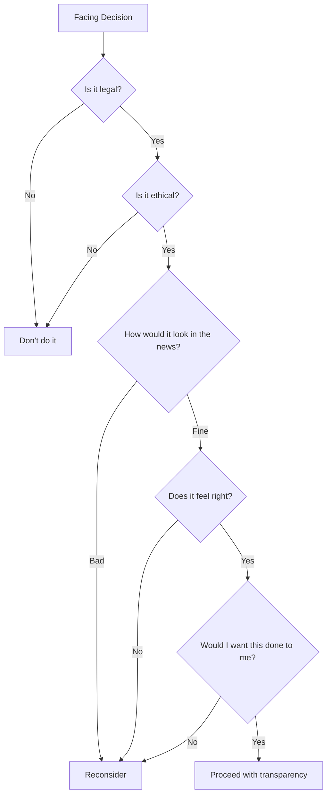

# First Principle #5: Integrity & Ethics

> "In looking for people to hire, you look for three qualities: integrity, intelligence, and energy. And if they don't have the first, the other two will kill you." - Warren Buffett

## Definition

Integrity & Ethics is the commitment to doing what's right, especially when it's costly. It's the foundation of trust, and trust is the foundation of all sustainable business. For engineering leaders, this means building systems and cultures that are not just efficient and innovative, but also ethical, transparent, and worthy of trust.

## The Business Case for Integrity

### Trust as Competitive Advantage

```
High Trust Organizations:
- 2.5x more likely to be high-performing
- 74% less stress for employees
- 50% higher productivity
- 13% less sick days
- 76% more engagement

Low Trust Organizations:
- 3x more likely to face regulatory action
- 2x employee turnover
- 4x more time spent on CYA activities
- Reduced innovation (fear of failure)
```

### The Compound Effect of Trust

```
Trust × Time = Exponential Returns
Mistrust × Time = Exponential Costs
```

One lie can destroy years of credibility. One ethical stand can define a career.

## Core Dimensions of Integrity

### 1. Technical Integrity

**Definition**: Building systems that do what they claim, reliably and safely.

**Manifestations**:
- Accurate metrics and monitoring
- Honest technical debt assessment
- Realistic timeline estimates
- Transparent about limitations
- Proper error handling and user communication

**Anti-patterns**:
- "Resume-driven development"
- Hiding system problems
- Overpromising capabilities
- Security through obscurity

### 2. Data Ethics

**The New Responsibility**: With great data comes great responsibility.

| Ethical Dimension | Questions to Ask | Engineering Actions |
|-------------------|------------------|---------------------|
| **Privacy** | What data do we actually need? | Data minimization, purpose limitation |
| **Security** | How do we protect what we collect? | Encryption, access controls, audit logs |
| **Transparency** | Do users understand what we do? | Clear privacy policies, data flow diagrams |
| **Fairness** | Does our system discriminate? | Bias testing, diverse training data |
| **Accountability** | Can we explain our decisions? | Interpretable models, decision logs |

### 3. Organizational Integrity

**Definition**: Aligning actions with stated values.

**The Say-Do Gap**:
```
What We Say: "People are our greatest asset"
What We Do: First to cut in downturns

What We Say: "We value work-life balance"  
What We Do: Reward only those who work weekends

What We Say: "We embrace failure"
What We Do: Punish those who take risks
```

### 4. Personal Integrity

**The Leadership Mirror**: Your team will follow your example, not your words.

**Daily Tests**:
- Taking credit vs. giving credit
- Admitting mistakes vs. blame-shifting
- Hard conversations vs. avoidance
- Promise keeping vs. convenient forgetting
- Speaking truth to power vs. political safety

## Ethical Frameworks for Engineering Leaders

### 1. The Ethical Decision Tree



### 2. The Stakeholder Impact Analysis

For any decision, consider impact on:
1. **Users/Customers**: Privacy, safety, value
2. **Employees**: Fairness, growth, well-being
3. **Company**: Reputation, sustainability
4. **Society**: Broader implications
5. **Environment**: Resource usage, sustainability

### 3. The Front Page Test

"How would I feel if this decision and my reasoning were published on the front page of the New York Times?"

If the answer makes you uncomfortable, reconsider.

### 4. The Future Self Test

"Will I be proud of this decision in 10 years?"

Short-term gains from ethical compromises rarely age well.

## Common Ethical Dilemmas in Engineering

### 1. The Launch Pressure Dilemma

**Situation**: Critical security vulnerability discovered days before major launch
**Pressure**: "We've announced it, customers are waiting, revenue depends on it"
**Integrity Response**: Delay and fix. Short-term pain, long-term trust.

### 2. The Data Monetization Temptation

**Situation**: Sitting on valuable user data that could be monetized
**Pressure**: "Competitors are doing it, we're leaving money on the table"
**Integrity Response**: Honor privacy commitments. Trust > quick revenue.

### 3. The Whistleblower's Dilemma

**Situation**: Discovering systematic problems being hidden
**Pressure**: "Don't be a troublemaker, think of your career"
**Integrity Response**: Escalate appropriately, document everything.

### 4. The Performance Review Politics

**Situation**: Pressure to rate based on politics, not performance
**Pressure**: "Play the game, protect your people"
**Integrity Response**: Fair assessments with documentation.

### 5. The Technical Debt Cover-up

**Situation**: System held together with duct tape
**Pressure**: "Don't scare executives, we'll fix it later"
**Integrity Response**: Transparent risk communication with mitigation plans.

## Building Ethical Engineering Cultures

### Structural Supports

1. **Blameless Post-Mortems**
   - Psychological safety for truth-telling
   - Focus on systems, not scapegoats
   - Widely shared learnings

2. **Anonymous Reporting Channels**
   - Safe escalation paths
   - Regular reviews
   - Visible actions on feedback

3. **Ethics Training**
   - Regular scenarios and discussions
   - Not just compliance checkboxes
   - Led by leadership

4. **Clear Policies**
   - Data handling standards
   - Conflict of interest guidelines
   - Open source contribution rules
   - Moonlighting policies

### Cultural Practices

1. **Radical Transparency**
   - Open architecture decisions
   - Visible project status
   - Honest retrospectives
   - Public post-mortems

2. **Accountability Structures**
   - Clear ownership
   - Regular reviews
   - Consequence management
   - Recognition for integrity

3. **Ethical Role Models**
   - Celebrate integrity choices
   - Share stories of doing right
   - Make heroes of truth-tellers

## The Cost of Integrity Failures

### Technical Debt Analogy
```
Ethical Debt = Shortcuts in Integrity
- Compounds faster than technical debt
- Harder to refactor
- Can bankrupt suddenly
- Affects entire system
```

### Case Studies in Engineering Ethics Failures

1. **Volkswagen Dieselgate**
   - Engineers programmed deception
   - $33B in fines
   - Jail time for executives
   - Brand damage: Priceless

2. **Theranos**
   - Faked technical capabilities
   - Endangered lives
   - Company worth $0
   - Founder imprisoned

3. **Boeing 737 MAX**
   - Hid system behavior
   - 346 deaths
   - $2.5B criminal penalty
   - Lost market leadership

### The Recovery Pattern
1. **Denial** → More damage
2. **Admission** → Beginning of recovery
3. **Accountability** → Taking responsibility
4. **Systemic Change** → Preventing recurrence
5. **Consistent Action** → Rebuilding trust (years)

## Practical Integrity Tools

### 1. The Pre-Mortem Ethics Check

Before launching/deciding:
```markdown
## Ethics Pre-Mortem
- What could go ethically wrong?
- Who might be harmed?
- What pressures might compromise us?
- What safeguards can we build?
- How will we handle ethical issues if they arise?
```

### 2. The Regular Integrity Audit

Monthly team discussion:
- Have we compromised integrity anywhere?
- Are we being fully transparent?
- What uncomfortable truths are we avoiding?
- Where are we feeling pressure to bend rules?

### 3. The Integrity Ladder

Build integrity through progressive challenges:
1. **Personal**: Keep all commitments for a week
2. **Team**: Admit a mistake publicly
3. **Organizational**: Challenge a questionable decision
4. **Industry**: Stand for right when costly

## Interview Applications

### Demonstrating Integrity

#### Story Categories
1. **Standing up** for what's right despite pressure
2. **Admitting failure** and taking responsibility
3. **Protecting** user privacy/safety over profit
4. **Transparently communicating** bad news
5. **Building trust** after it was broken

#### Power Phrases
- "The right thing was clear, even though it was costly..."
- "I had to have a difficult conversation with..."
- "We chose transparency even though..."
- "Long-term trust mattered more than..."
- "I took responsibility for..."

### The Integrity Story Framework

```
Context: High-pressure situation with ethical dimension
Temptation: The easy wrong vs. hard right
Decision Process: How you weighed options
Action: What you did (specifics matter)
Resistance: Pushback you faced
Result: Immediate and long-term outcomes
Learning: How it shaped your leadership
```

### Example Answer

```
Situation: Discovered our AI model discriminated against certain zip codes, 
effectively redlining. Launch was next week, millions in revenue lined up.

Ethical Analysis:
- Legal: Possibly violating Fair Lending Act
- Moral: Perpetuating historical discrimination
- Reputation: Major scandal if discovered later
- Right thing: Fix it properly

Action:
- Immediately escalated to CEO with data
- Proposed 6-week delay to rebuild model
- Created diverse review board
- Implemented bias testing in CI/CD

Resistance:
- Sales furious about missed quarter
- Board questioned my judgment
- Team worried about their bonuses

Result:
- Fixed model, actually improved accuracy
- Became industry case study in AI ethics
- Team prouder of ethical stand than any launch
- Set new company standard for AI development

Learning: Integrity isn't just about avoiding wrong; 
it's about actively building systems that do right.
```

## Red Flags: Integrity at Risk

### Personal Warning Signs
- Rationalizing questionable decisions
- "Everyone else is doing it"
- Hiding information from stakeholders
- Feeling need to document CYA
- Dreading discovery

### Organizational Warning Signs
- Shooting messengers
- Reward systems misaligned with values
- High turnover in ethics-related roles
- Legal team busier than product team
- Fear-based culture

## Building Your Integrity Practice

### Daily Habits
- Start meetings with integrity check
- End day with reflection: "Am I proud?"
- Document decisions and reasoning
- Seek opposing views actively
- Admit one thing you don't know

### Weekly Rituals
- Team integrity temperature check
- Review decisions against values
- Celebrate integrity wins
- Address integrity concerns

### Monthly Investments
- Ethics scenario training
- Cross-functional integrity reviews
- Update policies based on learnings
- Recognize integrity champions

## The Long Game

### Integrity Compounds

```
Year 1: Small daily choices
Year 3: Reputation for reliability
Year 5: Go-to person for hard decisions
Year 7: Sought after for leadership
Year 10: Legacy of trust
```

### The Ultimate Test

Not "What did you achieve?" but "How did you achieve it?"

Not "What did you build?" but "What foundation did you build on?"

## Connection to Other Principles

- **Value Creation**: Sustainable value requires trust
- **Decision-Making**: Ethics guide tough choices
- **Human Behavior**: People follow integrity examples
- **Systems Thinking**: Ethics must be systemic, not individual

---

*Congratulations on completing Level I: First Principles. Ready to see how these principles become actionable? Continue to [Level II: Core Business Concepts](../../level-2-core-business/).*