# First Principle #4: Systems Thinking

> "A system is never the sum of its parts. It's the product of their interactions." - Russell Ackoff

## Definition

Systems Thinking is the discipline of seeing wholes rather than parts, relationships rather than isolated entities, and patterns rather than snapshots. For engineering leaders, it means understanding that every technical and organizational decision creates ripple effects throughout a complex, interconnected system.

## Why Systems Thinking Is Critical

### The Iceberg Model
```
Events (What happened?) ←── 10% Visible
    ↓
Patterns (What trends emerge?)
    ↓
Structures (What rules create patterns?)
    ↓
Mental Models (What beliefs drive structures?) ←── 90% Hidden
```

Most leaders react to events. Systems thinkers reshape mental models.

### The Engineering System Reality

Your organization is not just code—it's:
- **Technical Architecture** (services, databases, networks)
- **Team Topology** (who talks to whom)
- **Process Flows** (how work moves)
- **Incentive Structures** (what gets rewarded)
- **Information Flows** (how knowledge spreads)
- **Power Dynamics** (who decides what)

Change any element, and the entire system responds—often unpredictably.

## Real-World Systems Thinking Stories

### Case Study 1: The Knight Capital $440M Algorithm - When Local Optimization Kills the Company

**Context**: August 2012, Knight Capital deployed new trading software to capture more market share. Each server was optimized for maximum trading speed.

**The Local Optimization**: 
- Each trading server was individually tuned for performance
- Each server had independent failover logic
- Each server optimized for speed over safety
- No system-wide kill switch or monitoring

**The System Failure**: 
- One server didn't get the software update
- Old server started executing trades using obsolete logic
- In 45 minutes: 4 million transactions, $440M loss
- Each local system was "working perfectly"
- No single point of failure - except the system as a whole

**Systems Thinking Analysis**: 
The problem wasn't technical skill - it was systems design:
- **Locally optimal**: Each server maximized its performance
- **Globally catastrophic**: No system-wide safety mechanisms
- **Emergent behavior**: Individual server optimization created systemic risk
- **Feedback loops**: By the time humans noticed, damage was done

**The Bankruptcy**: Knight Capital was out of business within days. Perfect local optimization killed the entire system.

**Wisdom from the Field**: "When every part of your system is optimized, your system itself might be catastrophically broken."

### Case Study 2: Amazon's "Two Pizza Rule" - Systems Design for Human Scale

**Context**: 2000s, Amazon was growing rapidly but innovation was slowing. Bezos noticed teams were spending more time coordinating than creating.

**The Systems Problem**: 
- Linear team growth = exponential communication overhead
- Conway's Law: Team structure was creating monolithic software
- Decision-making was getting slower as teams got bigger
- Innovation was trapped in coordination

**Systems Thinking Applied**: 
Bezos realized this wasn't a people problem - it was a systems design problem. The constraint wasn't talent; it was team topology.

**The "Two Pizza Rule"**: 
- No team should be larger than can be fed by two pizzas (~8-10 people)
- Each team owns their entire service (no handoffs)
- Teams communicate through APIs, not meetings
- Each team can deploy independently

**System-Level Results**: 
- Development velocity increased 300%
- Feature deployment went from quarterly to daily
- Teams started innovating independently
- Microservices architecture emerged naturally
- AWS was born from this systems thinking

**The Multiplier Effect**: This systems design decision:
- Enabled Amazon's massive scale
- Created AWS ($70B+ annual revenue)
- Changed how entire industry thinks about team structure
- Became foundation of modern DevOps

**Wisdom from the Field**: "When you change how teams are structured, you change what they can build. System architecture follows team architecture, not the other way around."

### Case Study 3: Netflix's Chaos Engineering - Designing Antifragile Systems

**Context**: 2010, Netflix was moving to AWS but traditional testing couldn't simulate real-world system failures.

**Traditional Approach**: 
- Test individual components thoroughly
- Assume if parts work, system works
- React to failures when they happen
- Focus on preventing failures

**Systems Thinking Insight**: Netflix realized failures were emergent properties. You can't predict how a complex system will fail by testing its parts.

**The Chaos Monkey Experiment**: 
- Randomly kill production servers during business hours
- Force system to adapt and heal itself
- Make failure normal, not exceptional
- Build systems that get stronger from stress

**Results**: 
- System reliability improved from 99% to 99.9%+
- Mean time to recovery dropped from hours to minutes
- Team confidence in system increased
- Innovation accelerated (less fear of breaking things)

**The Systems Learning**: 
- **Feedback Loops**: Continuous small failures prevented big failures
- **Emergence**: System behavior couldn't be predicted from components
- **Antifragility**: System got stronger from controlled stress
- **Cultural Change**: Failure became learning opportunity

**Industry Impact**: Chaos Engineering is now standard practice. Netflix's systems thinking created entire discipline.

**Wisdom from the Field**: "In complex systems, the question isn't whether failures will happen - it's how your system learns and adapts when they do."

## Core Systems Thinking Concepts

### 1. Feedback Loops

#### Reinforcing Loops (Positive Feedback)
Amplify change in the same direction:
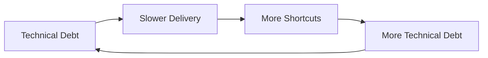

#### Balancing Loops (Negative Feedback)
Push back against change:
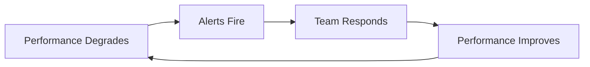

### 2. System Archetypes with Engineering Examples

#### Fixes That Fail

| Element | Description |
|---------|-------------|
| **Pattern** | Quick fix creates short-term improvement but generates long-term problems |
| **Engineering Example** | Hot-patching production bug without proper testing - fixes immediate issue but introduces instability |
| **System Structure** | Problem symptom → Quick fix → Temporary improvement → Bigger problem emerges |
| **Real Case** | Facebook's 2021 outage caused by BGP configuration change that "fixed" capacity issues but broke global routing |
| **Warning Signs** | Same problems recurring worse, increased system fragility, firefighting culture |
| **Intervention Strategy** | Build time for proper solutions into roadmaps, measure long-term system health, reward sustainable fixes |

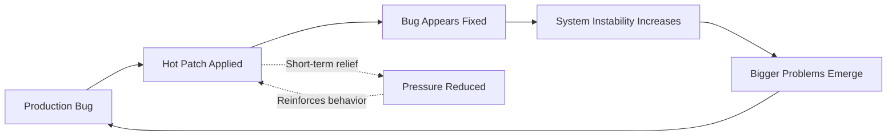

#### Shifting the Burden (Hero Developers)

| Element | Description |
|---------|-------------|
| **Pattern** | Team relies on quick fixes from experts instead of building systemic capability |
| **Engineering Example** | Senior developer always fixes critical bugs instead of teaching team debugging skills |
| **System Structure** | Problem → Expert intervention → Team capability atrophies → More dependency |
| **Real Case** | Netflix's early days - few "platform heroes" handled all scaling issues until team burned out |
| **Warning Signs** | Knowledge silos, single points of failure, team learned helplessness, expert burnout |
| **Intervention Strategy** | Document solutions, pair programming, rotate responsibilities, measure team capability growth |

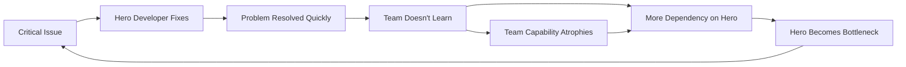

#### Limits to Growth (Communication Overhead)

| Element | Description |
|---------|-------------|
| **Pattern** | System growth hits fundamental constraint that throttles further growth |
| **Engineering Example** | Team grows from 5 to 20 people, but communication overhead makes everyone slower |
| **System Structure** | Growth → Success → More growth → Constraint hit → Performance degrades |
| **Real Case** | WhatsApp kept team at 50 engineers serving 900M users by eliminating communication overhead |
| **Warning Signs** | Diminishing returns from adding resources, increasing coordination costs, decision paralysis |
| **Intervention Strategy** | Identify constraints early, design for scale, create autonomous units, measure efficiency per person |

```mermaid
graph LR
    A[Team Size Increases] --> B[More Communication Needed]
    B --> C[Less Time for Actual Work]
    C --> D[Productivity Decreases]
    D --> E[Add More People to Compensate]
    E --> A
    B --> F[O(n²) Meeting Overhead]
    F --> C
```

#### Tragedy of the Commons

| Element | Description |
|---------|-------------|
| **Pattern** | Shared resource depleted by individual optimization |
| **Engineering Example** | Everyone using the production database for testing because "it's just a small query" |
| **System Structure** | Shared resource → Individual benefit → Collective cost → Resource degrades |
| **Real Case** | GitHub's MySQL database overload from individual teams optimizing their own queries |
| **Warning Signs** | Resource contention, performance degradation, blame games, "not my problem" mentality |
| **Intervention Strategy** | Create individual quotas, provide alternatives, make costs visible, align incentives |

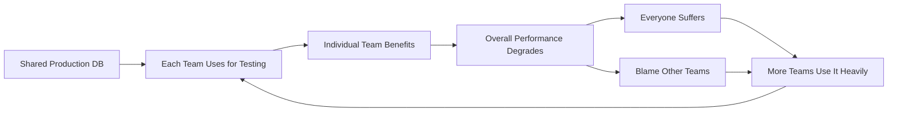

#### Success to the Successful

| Element | Description |
|---------|-------------|
| **Pattern** | Initial winners get more resources, making future winning easier |
| **Engineering Example** | Well-documented services get more adoption, funding, and talent, while others atrophy |
| **System Structure** | Initial success → More resources → Better performance → More success |
| **Real Case** | AWS services - popular ones get more investment, while niche ones get deprecated |
| **Warning Signs** | Growing gaps between teams/services, talent hoarding, innovation stagnation in some areas |
| **Intervention Strategy** | Redistribute resources intentionally, create "innovation budgets" for struggling areas |

#### Accidental Adversaries

| Element | Description |
|---------|-------------|
| **Pattern** | Two parties trying to help each other create mutually harmful dynamics |
| **Engineering Example** | Backend team "helps" frontend by adding more API endpoints, creating cognitive overload |
| **System Structure** | Party A helps → Party B struggles more → Party B reciprocates help → Party A struggles more |
| **Real Case** | Microservices proliferation where each team "helps" by creating more services |
| **Warning Signs** | Increasing complexity despite good intentions, mutual frustration, analysis paralysis |
| **Intervention Strategy** | Shared understanding, joint planning, measure mutual outcomes |

#### Growth and Underinvestment

| Element | Description |
|---------|-------------|
| **Pattern** | Growth demand exceeds capacity, but capacity investment is delayed |
| **Engineering Example** | Service usage grows 10x but monitoring/alerting systems aren't upgraded |
| **System Structure** | Demand grows → Capacity strained → Performance degrades → Less investment appetite |
| **Real Case** | Twitter's early scaling issues - growth outpaced infrastructure investment |
| **Warning Signs** | Performance degradation during growth, technical debt accumulation, reactive investments |
| **Intervention Strategy** | Proactive capacity planning, leading indicators, dedicated infrastructure investment |

### 3. Emergence

Properties that arise from interactions, not components:

| Emergent Property | Source | Engineering Impact |
|-------------------|--------|-------------------|
| **Conway's Law** | Team communication patterns | System architecture mirrors org structure |
| **Culture** | Daily interactions and decisions | Determines what behaviors are rewarded |
| **Technical Debt** | Accumulated shortcuts | Slows future development velocity |
| **Innovation** | Psychological safety + slack time | Enables breakthrough solutions |

### 4. Leverage Points (Donella Meadows)

Where to intervene in a system (ordered by increasing impact):

| Level | Leverage Point | Engineering Example | Impact |
|-------|----------------|--------------------|---------|
| 1 | **Numbers** | Server capacity, timeouts | Least |
| 2 | **Material flows** | Code access, deployment permissions | Low |
| 3 | **Regulating loops** | Code reviews, CI/CD pipelines | Medium |
| 4 | **Information flows** | Metrics dashboards, post-mortems | Medium-High |
| 5 | **Rules** | Development standards, incentives | High |
| 6 | **Distributing power** | Decision rights, team autonomy | Very High |
| 7 | **Goals** | Product vision, success metrics | Very High |
| 8 | **Paradigms** | Engineering culture, mental models | Highest |

## Systems Thinking in Engineering Leadership

### Architectural Systems

#### Microservices: A Systems View
```
Decomposition Benefits:
+ Team autonomy
+ Independent deployment
+ Fault isolation
+ Technology diversity

System Costs:
- Network complexity
- Data consistency challenges
- Operational overhead
- Cognitive load

Emergent Properties:
* Distributed systems failures
* Organizational silos
* Innovation at edges
* Integration nightmares
```

### Organizational Systems

#### Team Topology Patterns

**Stream-Aligned Teams**
- Own full value stream
- Direct customer feedback loop
- Risk: Local optimization

**Platform Teams**
- Provide internal services
- Enable stream teams
- Risk: Ivory tower syndrome

**Enabling Teams**
- Spread practices
- Break silos
- Risk: Lack of ownership

**Complicated Subsystem Teams**
- Deep expertise
- Handle complexity
- Risk: Knowledge bottlenecks

### Process Systems

#### The DevOps Feedback System
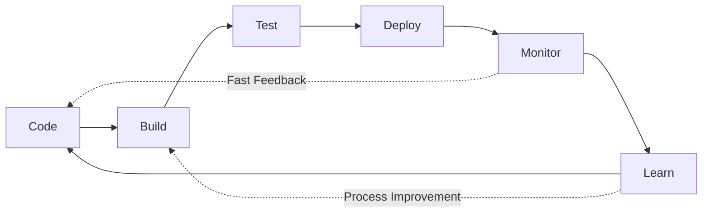

Optimize the whole flow, not individual stages.

## Common Systems Failures

### 1. Local Optimization
**Symptom**: Each team hits their metrics, company fails
**Example**: QA finds all bugs (metric met) by making releases impossible
**Fix**: Align metrics to global outcomes

### 2. Unintended Consequences
**Symptom**: Solution creates worse problems
**Example**: Forcing code coverage leads to meaningless tests
**Fix**: Consider second-order effects

### 3. Policy Resistance
**Symptom**: System pushes back against changes
**Example**: Mandating documentation that no one reads
**Fix**: Understand why system resists

### 4. Delayed Feedback
**Symptom**: Cause and effect separated by time
**Example**: Technical debt impact shows up years later
**Fix**: Create faster feedback loops

## Practical System Mapping Techniques

### 1. Value Stream Mapping for Engineering

Map the entire flow from idea to customer value:

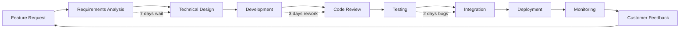

**Value Stream Mapping Steps**:
1. **Walk the Gemba**: Follow actual work flow, not official process
2. **Measure Wait Times**: Time between handoffs (often 80% of total time)
3. **Identify Rework Loops**: Where does work come back?
4. **Calculate Value-Add Ratio**: Actual work time / Total cycle time
5. **Find the Constraint**: Bottleneck that limits entire system

**Tools for Value Stream Mapping**:
- **Miro/Mural**: Collaborative online mapping
- **Lucidchart**: Professional process diagrams
- **Lean Toolkit**: Physical sticky notes and timers
- **JIRA Analytics**: Automatic cycle time measurement

### 2. Feedback Loop Identification

Systematic approach to finding system dynamics:

#### The OODA Loop for Systems Analysis
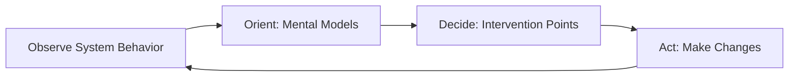

#### Feedback Loop Mapping Process
1. **Identify Variables**: What changes over time?
2. **Draw Connections**: How does A affect B?
3. **Add Delays**: How long before effect appears?
4. **Mark Polarities**: Does A increase (+) or decrease (-) B?
5. **Find Loops**: Trace paths back to origin
6. **Classify**: Reinforcing (R) or Balancing (B)?

#### Example: Technical Debt Reinforcing Loop
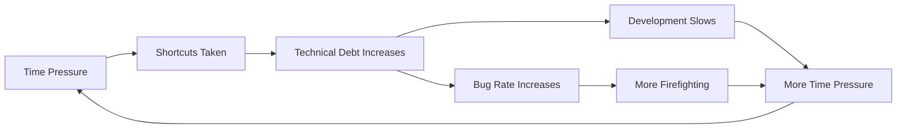

### 3. Bottleneck Analysis Using Theory of Constraints

#### The Five Focusing Steps
1. **Identify the Constraint**: What limits system throughput?
2. **Exploit the Constraint**: Get maximum from current bottleneck
3. **Subordinate Everything**: Align other processes to constraint
4. **Elevate the Constraint**: Increase constraint capacity
5. **Prevent Inertia**: Don't let constraint become non-constraint

#### Practical Tools
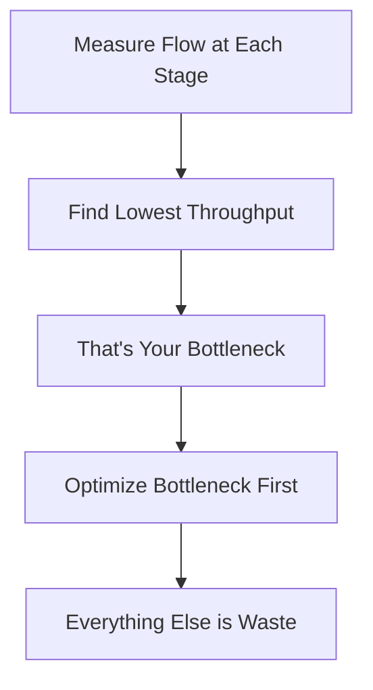

**Bottleneck Measurement Techniques**:
- **Little's Law**: Throughput = Work In Progress / Cycle Time
- **Drum-Buffer-Rope**: Bottleneck sets pace, others adapt
- **Theory of Constraints Metrics**:
  - Throughput ($ per time unit)
  - Inventory (work in progress)
  - Operating Expense (cost to convert inventory)

### 4. Advanced Mapping Tools

#### Kumu (kumu.io)
- **Best For**: Complex network visualization
- **Engineering Use**: Service dependency mapping, team interaction analysis
- **Features**: Interactive exploration, social network analysis, system metrics

#### Loopy (ncase.me/loopy)
- **Best For**: Simple causal loop diagrams
- **Engineering Use**: Understanding feedback dynamics
- **Features**: Drag-and-drop, animated simulations, sharing

#### Systems Thinking Workbook Method
1. **Rich Picture**: Draw messy diagram of everything involved
2. **Root Definitions**: CATWOE analysis (Customers, Actors, Transformation, Worldview, Owners, Environment)
3. **Conceptual Models**: How should system work ideally?
4. **Comparison**: Current vs. ideal state
5. **Change Design**: How to move from current to ideal

### 5. Stakeholder Ecosystem Mapping

#### Three-Layer Stakeholder Analysis

**Layer 1: Direct Participants**
- People who directly use or build the system
- Primary feedback loops and interactions

**Layer 2: Indirect Influencers**
- People who affect system constraints or resources
- Secondary effects and dependencies

**Layer 3: Context Shapers**
- Broader environment, regulations, market forces
- Tertiary effects and external pressures

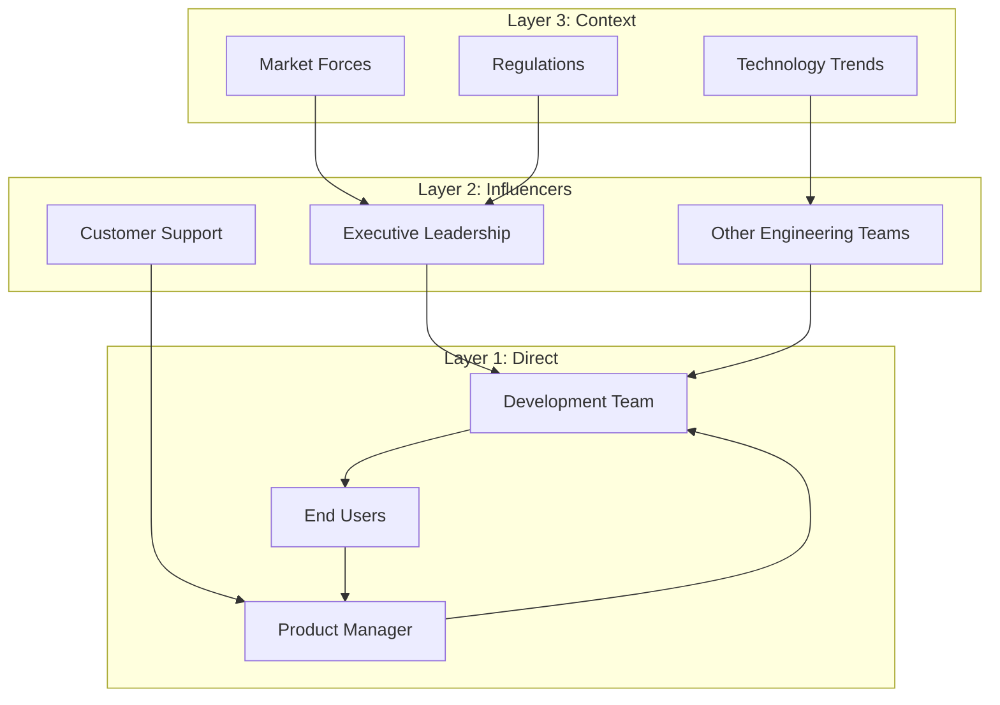

## Systems Thinking Tools

### 1. Causal Loop Diagrams

Map relationships and feedback loops:
```
[Team Stress] ─(+)→ [Errors] ─(+)→ [Rework]
      ↑                              │
      └──────────(+)─────────────────┘
```

**Power Notation**:
- **+** (Same direction): More A leads to more B
- **-** (Opposite direction): More A leads to less B
- **||** (Delay): Effect takes time to appear
- **R** (Reinforcing): Loop amplifies change
- **B** (Balancing): Loop seeks equilibrium

### 2. Stock and Flow Models

Track accumulations and rates:
- **Stock**: Technical debt (accumulation)
- **Inflow**: New shortcuts taken
- **Outflow**: Refactoring completed

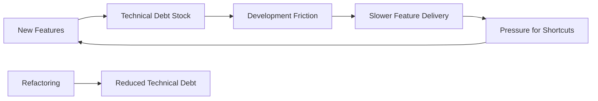

### 3. Systems Mapping Exercise

For any initiative:
1. **Identify stakeholders** (who's affected?)
2. **Map interactions** (who influences whom?)
3. **Find feedback loops** (what reinforces/balances?)
4. **Locate leverage points** (where's maximum impact?)
5. **Anticipate resistance** (what will push back?)

### 4. The Five Whys (Systems Version)

Traditional:
1. Why did service fail? → Memory leak
2. Why memory leak? → Poor code
3. Why poor code? → Rushed deadline
4. Why rushed? → Bad estimation
5. Why bad estimation? → No historical data

Systems Thinking Addition:
6. Why no data? → No learning culture
7. What reinforces this? → Blame for failures
8. What would change it? → Psychological safety

### 5. Cynefin Framework for System Context

Determine what type of system you're dealing with:

| Context | Characteristics | Approach | Engineering Example |
|---------|----------------|----------|-------------------|
| **Simple** | Best practices exist | Sense → Categorize → Respond | Database backups |
| **Complicated** | Good practices exist | Sense → Analyze → Respond | Performance optimization |
| **Complex** | Emergent practices | Probe → Sense → Respond | Team dynamics |
| **Chaotic** | Novel practices | Act → Sense → Respond | Production outages |
| **Disorder** | Unknown context | Break down → Categorize | New technology adoption |

## Applying Systems Thinking

### Case Study: Uber's "God View" - When Systems Create Unintended Behaviors

**Context**: 2014, Uber created an internal tool called "God View" that showed real-time location of all riders and drivers. It was designed for operational efficiency.

**The Original Intent** (Local Optimization):
- Operations team could optimize driver positioning
- Customer service could locate delayed rides
- Business intelligence could analyze usage patterns
- Each use case was legitimate and valuable

**The Systems Reality** (Emergent Behavior):
- Employees began tracking specific individuals
- Journalists and critics were monitored
- Personal data became entertainment
- Privacy violations became systemic
- Company culture shifted toward surveillance

**Systems Analysis Using the Iceberg Model**:

**Events**: Privacy violations discovered
- Employees tracking celebrities
- Surveillance of journalists
- Personal data misuse

**Patterns**: Behavioral drift over time
- Initially legitimate use cases
- Gradual boundary expansion
- Normalization of surveillance
- Lack of usage auditing

**Structures**: System design enabled abuse
- No access controls on sensitive data
- No audit logging of data access
- No clear usage policies
- Performance reviews didn't include privacy metrics

**Mental Models**: Underlying beliefs
- "Data is just data" (not personal)
- "We're helping customers" (ends justify means)
- "We're all trustworthy" (culture over controls)
- "Move fast, ask forgiveness later"

**The Systems Failure**: Well-intentioned local optimizations created systemically toxic behavior.

**Systems Intervention Applied**:
1. **Structural Changes**: Implemented role-based access controls
2. **Process Changes**: Added audit logging and regular reviews
3. **Metrics Changes**: Added privacy metrics to performance reviews
4. **Cultural Changes**: Privacy training and clear ethical boundaries
5. **Mental Model Shift**: "Privacy by design" became core principle

**Result**: 
- Privacy violations stopped
- Trust with regulators improved
- Employee behavior aligned with values
- System design reinforced ethical behavior

**The Broader Learning**: Systems create incentives that shape behavior. If you want ethical outcomes, you must design ethical systems.

**Wisdom from the Field**: "Every system perfectly produces the behavior you observe. If you don't like the behavior, change the system, not the people."

### Decision Framework: Systems Impact Analysis

Before any major decision:

```markdown
## Systems Impact Checklist
- [ ] Who are all stakeholders?
- [ ] What processes will change?
- [ ] What new feedback loops created?
- [ ] What existing loops disrupted?
- [ ] Where might resistance emerge?
- [ ] What are 2nd/3rd order effects?
- [ ] How will we know if it's working?
- [ ] What's our rollback plan?
```

## Interview Applications

### Systems Thinking Demonstration

#### Story Types That Show Systems Mastery

1. **Fixing root causes** not symptoms
2. **Predicting unintended consequences** and mitigating
3. **Designing feedback loops** for continuous improvement
4. **Breaking reinforcing negative cycles**
5. **Aligning systems** (technical, organizational, incentive)

#### Power Phrases
- "Looking at the system holistically..."
- "I recognized this was a systems problem when..."
- "To avoid unintended consequences..."
- "The feedback loops told us..."
- "By changing the underlying structure..."

### Example Answer

```
Situation: Deployment failures increasing, teams blamed each other

Systems Analysis:
- Mapped deployment process end-to-end
- Found 7 handoffs between 4 teams
- Each optimized their part, overall system failed
- No shared metrics or feedback loops

Intervention:
- Created cross-functional deployment team
- Shared ownership of deployment success metric
- Built automated feedback at each stage
- Weekly system-wide retrospectives

Result: 
- Deployment failures dropped 85%
- Mean time to deploy improved 3x
- Teams started collaborating proactively

Learning: Conway's Law in action - we had to restructure 
teams to fix the technical system
```

## Developing Systems Thinking

### Practices for Leaders

1. **Draw the System**
   - Visualize any problem as boxes and arrows
   - Look for loops, not just linear flows

2. **Extend Time Horizons**
   - Ask "then what happens?" repeatedly
   - Consider 2nd and 3rd order effects

3. **Find the Constraint**
   - Theory of Constraints: improve the bottleneck
   - Everything else is waste

4. **Question Boundaries**
   - Systems nest inside larger systems
   - Problems often come from boundary definitions

### Team Exercises

1. **Causal Loop Mapping**
   - Pick a recurring problem
   - Map all contributing factors
   - Find reinforcing loops
   - Identify intervention points

2. **Systems Storytelling**
   - Share stories of unintended consequences
   - Analyze what system dynamics created them

3. **Bottleneck Hunting**
   - Map value stream
   - Measure flow at each stage
   - Fix bottleneck, repeat

## Connection to Other Principles

- **[Value Creation](../../../engineering-leadership/level-1-first-principles/value-creation/index.md)**: Value flows through systems - optimize the whole value stream, not local parts
- **[Decision-Making](../../../engineering-leadership/level-1-first-principles/decision-making/index.md)**: Decisions have system-wide impacts - consider ripple effects before choosing
- **[Human Behavior](../../../engineering-leadership/level-1-first-principles/human-behavior/index.md)**: Humans adapt to system incentives - design systems that bring out the best in people
- **[Integrity & Ethics](../../../engineering-leadership/level-1-first-principles/integrity-ethics/index.md)**: Systems must be designed ethically - embed fairness and transparency in structures

## Red Flags: When You're Not Thinking in Systems

- Solving the same problems repeatedly
- Surprises from "unexpected" consequences
- Teams optimizing metrics but company struggling
- Changes that make things worse
- Resistance you "didn't see coming"

## Modern Systems Thinking Perspectives

### Complex Adaptive Systems Theory

Complex adaptive systems (CAS) are networks of interacting agents that adapt and evolve based on experience. Engineering organizations are quintessential CAS.

#### Characteristics of Engineering CAS
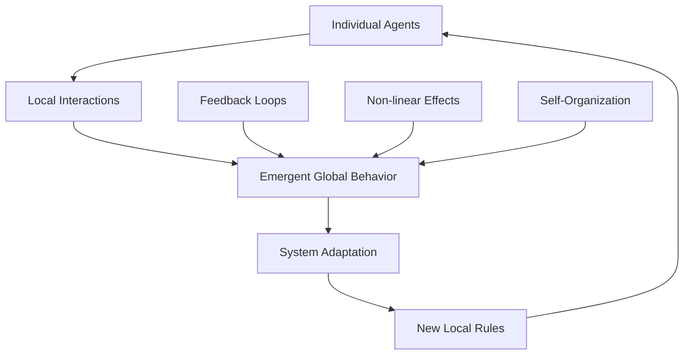

| CAS Property | Engineering Manifestation | Management Implication |
|--------------|--------------------------|----------------------|
| **Emergence** | Team culture develops from daily interactions | Can't mandate culture, must shape conditions |
| **Non-linearity** | Small code change breaks entire system | Invest in understanding system interdependencies |
| **Adaptation** | Teams evolve practices based on feedback | Create feedback-rich environments |
| **Self-organization** | Microservices architecture emerges naturally | Enable autonomy within clear constraints |
| **Co-evolution** | Teams and technology co-evolve | Design org structure and tech architecture together |

#### Emergent Behaviors in Engineering Teams

**Network Effects in Code Quality**
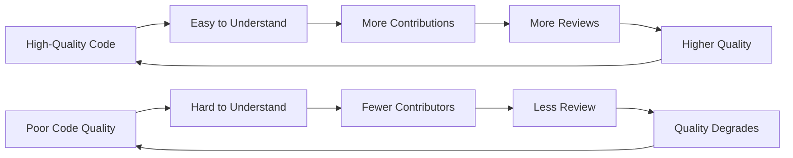

**Innovation Emergence Patterns**
- **Local Experimentation**: Individual developers try new approaches
- **Selective Retention**: Successful approaches spread through team
- **Amplification**: Team adopts and standardizes successful practices
- **Cross-pollination**: Practices spread to other teams

#### Managing Complex Adaptive Systems

**Enable, Don't Control**
- Set clear boundaries and constraints
- Provide rich feedback mechanisms
- Create spaces for experimentation
- Amplify positive emergent behaviors

**Practical CAS Management Tools**:
- **Open Space Technology**: Self-organizing team meetings
- **Liberating Structures**: Interaction patterns that unleash innovation
- **Complexity-aware Retrospectives**: Focus on system patterns vs. individual blame

### Leverage Points for System Change (Donella Meadows Expanded)

Extended analysis of where to intervene in engineering systems:

#### Level 1-3: Parameters and Physical Structure
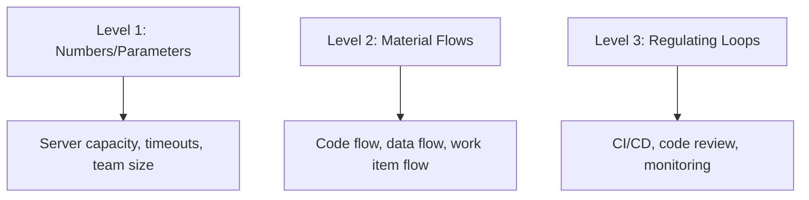
**Impact**: Low to Medium
**Engineering Focus**: Operational improvements, process optimization

#### Level 4-5: Information and Rules
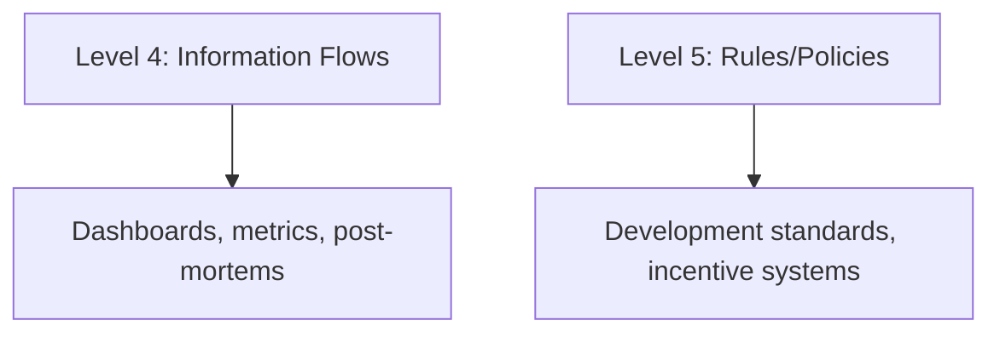
**Impact**: Medium to High
**Engineering Focus**: Cultural and process transformation

#### Level 6-8: System Structure and Purpose
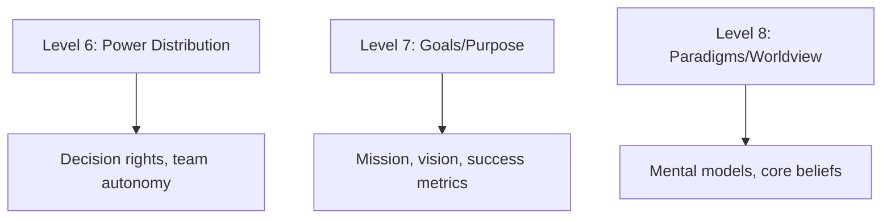
**Impact**: Highest
**Engineering Focus**: Strategic organizational transformation

### The Role of AI in System Visualization

#### AI-Enhanced Systems Analysis

**Pattern Recognition in Complex Systems**
- **ML-powered Incident Analysis**: AI identifies systemic patterns in outage data
- **Predictive System Modeling**: AI predicts system behavior under different constraints
- **Automated Root Cause Analysis**: AI traces causal chains through complex systems

#### AI Tools for Systems Thinking

| Tool Category | AI Application | Engineering Use Case |
|---------------|----------------|---------------------|
| **System Mapping** | Natural language processing of system documentation | Automatic dependency discovery |
| **Pattern Detection** | Machine learning on operational data | Identify recurring failure patterns |
| **Simulation** | Monte Carlo modeling of system behavior | Predict impact of architectural changes |
| **Optimization** | Genetic algorithms for system design | Optimize team topology and service boundaries |

#### AI-Powered Feedback Loops
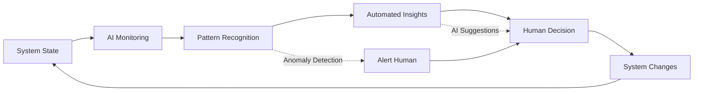

#### The Meta-System: AI Changing Systems Thinking

**Emergence of AI-Human Hybrid Intelligence**
- AI handles routine pattern recognition
- Humans focus on ethical implications and creative solutions
- New feedback loops between human intuition and AI analysis

**Systems Risks of AI Integration**
- **Algorithm Bias**: AI perpetuates systemic biases in engineering decisions
- **Over-Automation**: Loss of human system intuition and judgment
- **Brittleness**: AI-optimized systems may be fragile to novel conditions

### Antifragile Engineering Systems

Systems that benefit from stressors, shocks, and volatility.

#### Building Antifragile Engineering Organizations

**Stress-Testing Culture**
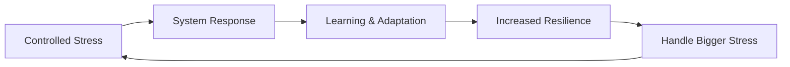

**Antifragile Design Principles**:
1. **Redundancy with Variation**: Multiple different solutions to same problem
2. **Optionality**: Many small experiments, few big bets
3. **Overcompensation**: System bounces back stronger than before
4. **Barbell Strategy**: Extremely safe + extremely risky, nothing in between

#### Practical Antifragile Engineering

**Chaos Engineering Evolution**
- Traditional: Break things to test resilience
- Antifragile: Break things to discover new capabilities
- Meta-antifragile: Build systems that create their own positive stress

**Team Antifragility**
- Cross training creates redundancy with variation
- Blameless post-mortems turn failures into organizational learning
- Regular rotation builds adaptive capacity

## Advanced Systems Concepts

### Requisite Variety (Ashby's Law)
A system must have as much variety as the environment it's controlling.
**Implication**: Your incident response must be as complex as potential incidents.

### Antifragility (Taleb)
Systems that gain from disorder.
**Engineering**: Chaos engineering, failure injection.

### Complex Adaptive Systems
Systems with emergent properties that can't be predicted from components.
**Examples**: Market dynamics, large-scale software systems, organizational culture.

## Application in Other Levels

### Level II: Core Business Concepts
- **[Strategy](../../../engineering-leadership/level-2-core-business/strategy/index.md)**: Strategic thinking requires systems perspective
- **[Operations](../../../engineering-leadership/level-2-core-business/operations/index.md)**: Operational excellence through systems optimization
- **[Risk & Governance](../../../engineering-leadership/level-2-core-business/risk-governance/index.md)**: Managing systemic risks

### Level III: Engineering Applications
- **[Organizational Design](../../../engineering-leadership/level-3-applications/organizational-design/index.md)**: Designing organizations as systems
- **[Technical Leadership](../../../engineering-leadership/level-3-applications/technical-leadership/index.md)**: Architecture as system design
- **[Business Acumen](../../../engineering-leadership/level-3-applications/business-acumen/index.md)**: Understanding business as a system

### Level IV: Interview Execution
- **[System Design](../../../engineering-leadership/level-4-interview-execution/system-org-design/index.md)**: Demonstrating systems thinking live
- **[Technical Leadership](../../../engineering-leadership/level-4-interview-execution/technical-leadership/index.md)**: Showing architectural systems mastery

## Interview-Ready Systems Thinking Framework

### How to Discuss System Dynamics in Interviews

#### The SYSTEMS Framework for Interview Stories

**S**ituation: Set the system context
**Y**stem Mapping: How you visualized the whole system  
**S**takeholders: Who was affected beyond the obvious
**T**ensions: What feedback loops were creating problems
**E**ntry Points: Where you chose to intervene and why
**M**itigation: How you anticipated unintended consequences
**S**uccess: How you measured system-level changes

### Real-World Engineering System Problems for Interviews

#### Problem Type 1: The Microservices Coordination Nightmare

**Situation**: Company with 200+ microservices, deploy times increased from 10 minutes to 4 hours

**Systems Analysis Questions**:
- What system archetype is this? (Limits to Growth)
- Where are the feedback loops?
- What's the actual constraint?
- How would you map this system?

**Systems Thinking Solution Path**:
1. Map service dependencies (not just technical, but team dependencies)
2. Identify the constraint (probably coordination, not technology)
3. Apply Theory of Constraints: optimize the bottleneck first
4. Design feedback loops for early detection of coordination problems

#### Problem Type 2: The Technical Debt Death Spiral

**Situation**: Team velocity decreasing 20% each quarter despite adding engineers

**Systems Analysis**:
```mermaid
graph LR
    A[Pressure to Deliver] --> B[Shortcuts Taken]
    B --> C[Technical Debt Accumulates]
    C --> D[Development Slows]
    D --> E[More Pressure]
    E --> A
    
    C --> F[More Bugs]
    F --> G[More Time Firefighting]
    G --> E
    
    D --> H[Add More Engineers]
    H --> I[More Coordination Overhead]
    I --> D
```

**Interview Demonstration**: Show how you'd break the reinforcing loops

#### Problem Type 3: The Remote Team Communication Breakdown

**Situation**: Remote team collaboration degraded, decision-making slowed, innovation dropped

**Systems Perspective**:
- Information flows disrupted
- Informal feedback loops broken
- Trust degradation reinforcing cycle
- Solution requires systemic design, not just tools

### Framework for System Analysis in Live Interviews

#### The 5-Minute Systems Analysis

When given a system problem in an interview:

**Minute 1: Quick System Sketch**
- Draw boxes for major components
- Show key relationships with arrows
- Identify inputs and outputs

**Minute 2: Stakeholder Mapping**
- Primary (directly affected)
- Secondary (indirectly affected)  
- Tertiary (context/environment)

**Minute 3: Feedback Loop Hunt**
- Look for reinforcing cycles (problems getting worse)
- Look for balancing mechanisms (what's trying to fix it)
- Identify delays (where cause/effect are separated)

**Minute 4: Leverage Point Selection**
- Use Donella Meadows' hierarchy
- Explain why you're choosing this intervention point
- Anticipate what might resist your change

**Minute 5: Second-Order Effects**
- What could go wrong with your solution?
- What positive emergent behaviors might arise?
- How would you measure success?

### Systems Thinking Power Phrases for Interviews

#### Demonstrating Systems Perspective
- "Looking at this systemically, I need to understand the whole before optimizing parts..."
- "I mapped the system first to understand how changes would ripple through..."
- "The root cause was structural, not individual performance..."

#### Showing Second-Order Thinking
- "The second-order effects I anticipated were..."
- "To avoid unintended consequences, I considered..."
- "This could create a new bottleneck at..."

#### Demonstrating Leverage Point Understanding
- "Rather than changing individual behavior, I focused on changing the system structure..."
- "By modifying the information flows, we enabled better decisions..."
- "The highest leverage point was changing the incentive structure..."

#### Complex Systems Awareness
- "This was a complex adaptive system, so I couldn't predict outcomes, only create conditions..."
- "The emergent behavior told me the system was adapting in unexpected ways..."
- "Conway's Law was manifesting - we needed to change team structure to change the architecture..."

### Advanced Systems Interview Techniques

#### The Systems Storytelling Structure

**Hook**: Start with the surprising system behavior
> "Despite hiring 10 senior engineers, our delivery speed actually decreased..."

**Context**: Set the system boundaries
> "We had 5 teams, each optimizing their local metrics..."

**Analysis**: Show your systems thinking
> "I mapped the dependencies and found 23 handoffs between teams..."

**Intervention**: Explain your leverage point selection
> "Rather than fixing individual handoffs, I changed how teams were structured..."

**Results**: Demonstrate system-level change
> "Not only did delivery speed increase 3x, but teams started proactively collaborating..."

**Learning**: Show evolved mental model
> "This taught me that organizational problems often require organizational solutions, not technical ones..."

#### Handling Systems Thinking Probes

**"How do you prevent unintended consequences?"**
- Map second and third-order effects
- Start with small experiments
- Create rapid feedback loops
- Have rollback plans

**"How do you know if a problem is systemic?"**
- Same problems recurring despite fixes
- Good people getting bad results
- Solutions that work temporarily then fail
- Local optimization causing global problems

**"How do you change complex systems?"**
- Find leverage points (structure over events)
- Enable emergence rather than controlling
- Change constraints and boundaries
- Focus on feedback loops

### Five Essential Systems Thinking Stories to Master

#### 1. The Local Optimization That Broke the System
```
Situation: Each team hitting their OKRs but company missing targets

System Analysis: Teams optimized locally without considering 
system-wide effects. Marketing drove leads that Sales couldn't 
close that Engineering couldn't deliver.

Intervention: Created shared metrics across the value stream. 
Changed from team OKRs to outcome OKRs.

Result: Company performance improved 40% as teams aligned on 
global optimization.

Learning: Local optimization can destroy global performance. 
Measure what matters to the whole system.
```

#### 2. The Unintended Consequences Story
```
Situation: Implemented mandatory code reviews to improve quality

System Analysis: Quality improved but velocity dropped 60%. 
Reviews became bottlenecks. Junior developers stopped contributing.

Unintended Effects: 
- Psychological safety decreased
- Innovation slowed (everything scrutinized)
- Knowledge silos increased (only seniors reviewing)

Course Correction: Changed to pair programming and async reviews 
with clear approval criteria.

Learning: Every solution creates new problems. Design for the 
system you want, not just the problem you're solving.
```

#### 3. The Root Cause Analysis That Changed Everything
```
Situation: Monthly production outages despite heroic incident response

Surface Analysis: Various technical failures (memory leaks, 
network issues, database locks)

Systems Analysis: Used "Five Whys Plus Systems":
1. Why outages? → Various technical issues
2. Why various issues? → Lack of monitoring
3. Why no monitoring? → No time to build it
4. Why no time? → Always firefighting
5. Why firefighting? → Outages happening
→ What system enables this? Reactive culture
→ What reinforces reactive culture? Hero worship

Intervention: Changed incentives to reward prevention over reaction. 
Allocated 20% of sprint to monitoring and tooling.

Result: Outages dropped 85%. Team satisfaction increased. 
Innovation accelerated.

Learning: Symptoms recur until you change underlying system structure.
```

#### 4. The Feedback Loop Design Success
```
Situation: Customer complaints taking weeks to reach engineering

System Design: Created automated feedback loops:
- Customer support → Product → Engineering (24hr max)
- Production metrics → Slack alerts → Immediate triage
- Customer satisfaction scores → Weekly eng team reviews

Balancing Loops Added:
- Too many alerts → Alert fatigue → Reduced response
- Solution: Alert prioritization system that learns

Result: Customer issues addressed 10x faster. Product quality 
improved as feedback loops shortened.

Learning: Fast feedback loops create self-correcting systems. 
Design for feedback, not just forward flow.
```

#### 5. The Conway's Law Experience
```
Situation: Monolithic architecture making feature development slow

Traditional Approach: Break up the monolith technically

Systems Approach: Realized architecture reflects team structure. 
If we kept same team structure, we'd recreate the monolith.

Intervention:
1. First reorganized teams around business capabilities
2. Then each team extracted their services
3. Teams owned entire vertical slice (frontend, backend, data)

Result: Not just microservices, but truly autonomous teams. 
Development velocity increased 4x.

Learning: Conway's Law works both ways. Change team structure 
to change system architecture.
```

### Systems Thinking Power Evaluation Criteria

Interviewers look for:

#### Level 1: Basic Systems Awareness
- Recognizes interconnections
- Considers multiple stakeholders
- Thinks beyond immediate cause/effect

#### Level 2: Systems Analysis Skills
- Maps system relationships
- Identifies feedback loops
- Understands emergence and delays

#### Level 3: Systems Intervention Mastery
- Selects appropriate leverage points
- Anticipates unintended consequences
- Designs self-correcting systems

#### Level 4: Complex Systems Leadership
- Enables emergence rather than controlling
- Changes paradigms and mental models
- Builds antifragile systems

## Next Steps: Building Systems Thinking Mastery

### Immediate Actions (Today)
1. **Draw Your Current System**: Map your team's work flow from idea to customer value
2. **Identify One Reinforcing Loop**: Find a problem that keeps recurring despite fixes
3. **Practice the 5-Minute Analysis**: Use any current challenge with the framework above

### Weekly Development (This Week)
1. **Map One System Archetype**: Choose a recurring pattern and draw the system structure
2. **Find Your Leverage Point**: Pick one problem and identify the highest-impact intervention point
3. **Conduct Systems 5 Whys**: Go beyond root cause to system cause on one incident

### Monthly Mastery (This Month)
1. **Lead Systems Mapping Session**: Facilitate team exercise using value stream mapping
2. **Design Feedback Loop**: Create one automated feedback mechanism in your system
3. **Teach One Systems Concept**: Share causal loops or system archetypes with colleagues

### Interview Preparation (Next 2 Weeks)
1. **Master the SYSTEMS Framework**: Practice on 3 past experiences
2. **Prepare Your 5 Stories**: Polish the essential systems thinking narratives
3. **Practice Live Analysis**: Time yourself doing 5-minute systems breakdowns
4. **Learn the Power Phrases**: Integrate systems thinking language naturally

### Advanced Systems Leadership (3-6 Months)
1. **Design Antifragile Systems**: Build systems that benefit from stress
2. **Enable Emergence**: Create conditions for innovation rather than controlling
3. **Change Mental Models**: Help teams shift from event-thinking to systems-thinking
4. **Measure System Health**: Develop metrics for feedback loops, emergence, and resilience

### Systems Thinking Study Plan

#### Week 1: Foundation
- Read: "Thinking in Systems" by Donella Meadows
- Practice: Map 3 different systems in your environment
- Apply: Use system archetypes to understand recurring problems

#### Week 2: Tools & Techniques
- Learn: Kumu or Loopy for system mapping
- Practice: Value stream mapping on current process
- Apply: Design one feedback loop improvement

#### Week 3: Complex Systems
- Study: Complex adaptive systems theory
- Practice: Identify emergent behaviors in your organization
- Apply: Design intervention that enables rather than controls

#### Week 4: Interview Mastery
- Polish: Your 5 essential systems stories
- Practice: Live systems analysis with timer
- Master: Systems thinking power phrases and evaluation criteria

### Assessment Checklist

Before your next systems discussion or interview, verify you can:

**Basic Systems Thinking**:
- [ ] Draw system diagrams with feedback loops
- [ ] Identify system archetypes in real situations
- [ ] Explain the difference between events, patterns, structures, and mental models
- [ ] Use the leverage points hierarchy to select intervention strategies

**Applied Systems Analysis**:
- [ ] Conduct value stream mapping of complex processes
- [ ] Design feedback loops that create self-correcting systems
- [ ] Anticipate second and third-order effects of changes
- [ ] Facilitate systems thinking discussions with teams

**Advanced Systems Leadership**:
- [ ] Enable emergence in complex adaptive systems
- [ ] Change system paradigms and mental models
- [ ] Build antifragile systems that benefit from stress
- [ ] Integrate AI and human intelligence in system design

**Interview Excellence**:
- [ ] Tell compelling systems stories using the SYSTEMS framework
- [ ] Perform 5-minute live systems analysis under pressure
- [ ] Use systems thinking power phrases naturally
- [ ] Demonstrate all four levels of systems thinking mastery

---

*Continue your journey: Explore how [Integrity & Ethics](../../../engineering-leadership/level-1-first-principles/integrity-ethics/index.md) provides the moral foundation for sustainable systems, or see how [Operations](../../../engineering-leadership/level-2-core-business/operations/index.md) applies systems thinking to execution.*