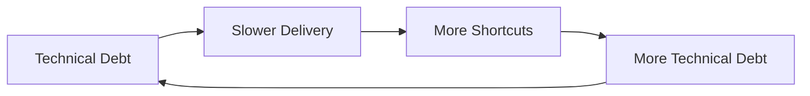
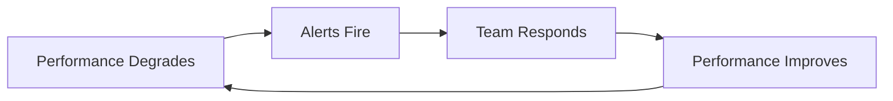
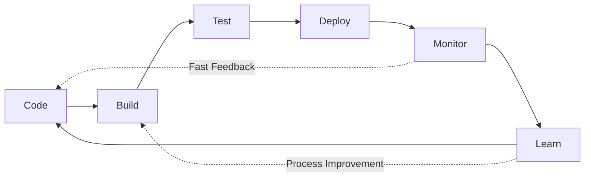

# First Principle #4: Systems Thinking

> "A system is never the sum of its parts. It's the product of their interactions." - Russell Ackoff

## Definition

Systems Thinking is the discipline of seeing wholes rather than parts, relationships rather than isolated entities, and patterns rather than snapshots. For engineering leaders, it means understanding that every technical and organizational decision creates ripple effects throughout a complex, interconnected system.

## Why Systems Thinking Is Critical

### The Iceberg Model
```
Events (What happened?) ←── 10% Visible
    ↓
Patterns (What trends emerge?)
    ↓
Structures (What rules create patterns?)
    ↓
Mental Models (What beliefs drive structures?) ←── 90% Hidden
```

Most leaders react to events. Systems thinkers reshape mental models.

### The Engineering System Reality

Your organization is not just code—it's:
- **Technical Architecture** (services, databases, networks)
- **Team Topology** (who talks to whom)
- **Process Flows** (how work moves)
- **Incentive Structures** (what gets rewarded)
- **Information Flows** (how knowledge spreads)
- **Power Dynamics** (who decides what)

Change any element, and the entire system responds—often unpredictably.

## Real-World Systems Thinking Stories

### Case Study 1: The Knight Capital $440M Algorithm - When Local Optimization Kills the Company

**Context**: August 2012, Knight Capital deployed new trading software to capture more market share. Each server was optimized for maximum trading speed.

**The Local Optimization**: 
- Each trading server was individually tuned for performance
- Each server had independent failover logic
- Each server optimized for speed over safety
- No system-wide kill switch or monitoring

**The System Failure**: 
- One server didn't get the software update
- Old server started executing trades using obsolete logic
- In 45 minutes: 4 million transactions, $440M loss
- Each local system was "working perfectly"
- No single point of failure - except the system as a whole

**Systems Thinking Analysis**: 
The problem wasn't technical skill - it was systems design:
- **Locally optimal**: Each server maximized its performance
- **Globally catastrophic**: No system-wide safety mechanisms
- **Emergent behavior**: Individual server optimization created systemic risk
- **Feedback loops**: By the time humans noticed, damage was done

**The Bankruptcy**: Knight Capital was out of business within days. Perfect local optimization killed the entire system.

**Wisdom from the Field**: "When every part of your system is optimized, your system itself might be catastrophically broken."

### Case Study 2: Amazon's "Two Pizza Rule" - Systems Design for Human Scale

**Context**: 2000s, Amazon was growing rapidly but innovation was slowing. Bezos noticed teams were spending more time coordinating than creating.

**The Systems Problem**: 
- Linear team growth = exponential communication overhead
- Conway's Law: Team structure was creating monolithic software
- Decision-making was getting slower as teams got bigger
- Innovation was trapped in coordination

**Systems Thinking Applied**: 
Bezos realized this wasn't a people problem - it was a systems design problem. The constraint wasn't talent; it was team topology.

**The "Two Pizza Rule"**: 
- No team should be larger than can be fed by two pizzas (~8-10 people)
- Each team owns their entire service (no handoffs)
- Teams communicate through APIs, not meetings
- Each team can deploy independently

**System-Level Results**: 
- Development velocity increased 300%
- Feature deployment went from quarterly to daily
- Teams started innovating independently
- Microservices architecture emerged naturally
- AWS was born from this systems thinking

**The Multiplier Effect**: This systems design decision:
- Enabled Amazon's massive scale
- Created AWS ($70B+ annual revenue)
- Changed how entire industry thinks about team structure
- Became foundation of modern DevOps

**Wisdom from the Field**: "When you change how teams are structured, you change what they can build. System architecture follows team architecture, not the other way around."

### Case Study 3: Netflix's Chaos Engineering - Designing Antifragile Systems

**Context**: 2010, Netflix was moving to AWS but traditional testing couldn't simulate real-world system failures.

**Traditional Approach**: 
- Test individual components thoroughly
- Assume if parts work, system works
- React to failures when they happen
- Focus on preventing failures

**Systems Thinking Insight**: Netflix realized failures were emergent properties. You can't predict how a complex system will fail by testing its parts.

**The Chaos Monkey Experiment**: 
- Randomly kill production servers during business hours
- Force system to adapt and heal itself
- Make failure normal, not exceptional
- Build systems that get stronger from stress

**Results**: 
- System reliability improved from 99% to 99.9%+
- Mean time to recovery dropped from hours to minutes
- Team confidence in system increased
- Innovation accelerated (less fear of breaking things)

**The Systems Learning**: 
- **Feedback Loops**: Continuous small failures prevented big failures
- **Emergence**: System behavior couldn't be predicted from components
- **Antifragility**: System got stronger from controlled stress
- **Cultural Change**: Failure became learning opportunity

**Industry Impact**: Chaos Engineering is now standard practice. Netflix's systems thinking created entire discipline.

**Wisdom from the Field**: "In complex systems, the question isn't whether failures will happen - it's how your system learns and adapts when they do."

## Core Systems Thinking Concepts

### 1. Feedback Loops

#### Reinforcing Loops (Positive Feedback)
Amplify change in the same direction:


#### Balancing Loops (Negative Feedback)
Push back against change:


### 2. System Archetypes

#### Tragedy of the Commons
**Pattern**: Shared resource depleted by individual optimization
**Engineering Example**: Everyone using the production database for testing
**Solution**: Create sustainable policies and alternatives

#### Shifting the Burden
**Pattern**: Quick fixes prevent addressing root causes
**Engineering Example**: Constantly restarting services instead of fixing memory leaks
**Solution**: Invest in permanent solutions despite short-term pain

#### Limits to Growth
**Pattern**: Growth creates constraints that limit further growth
**Engineering Example**: Monolith grows until deploy time makes iteration impossible
**Solution**: Recognize and address constraints before they bind

### 3. Emergence

Properties that arise from interactions, not components:
- **Conway's Law**: System architecture mirrors organizational structure
- **Culture**: Emerges from thousands of daily interactions
- **Technical Debt**: Emerges from accumulated shortcuts
- **Innovation**: Emerges from psychological safety + slack time

### 4. Leverage Points (Donella Meadows)

Where to intervene in a system (increasing impact):
1. **Numbers** (constants, parameters) - Least impact
2. **Material flows** (who can access what)
3. **Regulating loops** (controls and feedback)
4. **Information flows** (who knows what when)
5. **Rules** (incentives, constraints)
6. **Distributing power** (who makes rules)
7. **Goals** (purpose of system)
8. **Paradigms** (mindset creating system) - Most impact

## Systems Thinking in Engineering Leadership

### Architectural Systems

#### Microservices: A Systems View
```
Decomposition Benefits:
+ Team autonomy
+ Independent deployment
+ Fault isolation
+ Technology diversity

System Costs:
- Network complexity
- Data consistency challenges
- Operational overhead
- Cognitive load

Emergent Properties:
* Distributed systems failures
* Organizational silos
* Innovation at edges
* Integration nightmares
```

### Organizational Systems

#### Team Topology Patterns

**Stream-Aligned Teams**
- Own full value stream
- Direct customer feedback loop
- Risk: Local optimization

**Platform Teams**
- Provide internal services
- Enable stream teams
- Risk: Ivory tower syndrome

**Enabling Teams**
- Spread practices
- Break silos
- Risk: Lack of ownership

**Complicated Subsystem Teams**
- Deep expertise
- Handle complexity
- Risk: Knowledge bottlenecks

### Process Systems

#### The DevOps Feedback System


Optimize the whole flow, not individual stages.

## Common Systems Failures

### 1. Local Optimization
**Symptom**: Each team hits their metrics, company fails
**Example**: QA finds all bugs (metric met) by making releases impossible
**Fix**: Align metrics to global outcomes

### 2. Unintended Consequences
**Symptom**: Solution creates worse problems
**Example**: Forcing code coverage leads to meaningless tests
**Fix**: Consider second-order effects

### 3. Policy Resistance
**Symptom**: System pushes back against changes
**Example**: Mandating documentation that no one reads
**Fix**: Understand why system resists

### 4. Delayed Feedback
**Symptom**: Cause and effect separated by time
**Example**: Technical debt impact shows up years later
**Fix**: Create faster feedback loops

## Systems Thinking Tools

### 1. Causal Loop Diagrams

Map relationships and feedback loops:
```
[Team Stress] ─(+)→ [Errors] ─(+)→ [Rework]
      ↑                              │
      └──────────(+)─────────────────┘
```

### 2. Stock and Flow Models

Track accumulations and rates:
- **Stock**: Technical debt (accumulation)
- **Inflow**: New shortcuts taken
- **Outflow**: Refactoring completed

### 3. Systems Mapping Exercise

For any initiative:
1. **Identify stakeholders** (who's affected?)
2. **Map interactions** (who influences whom?)
3. **Find feedback loops** (what reinforces/balances?)
4. **Locate leverage points** (where's maximum impact?)
5. **Anticipate resistance** (what will push back?)

### 4. The Five Whys (Systems Version)

Traditional:
1. Why did service fail? → Memory leak
2. Why memory leak? → Poor code
3. Why poor code? → Rushed deadline
4. Why rushed? → Bad estimation
5. Why bad estimation? → No historical data

Systems Thinking Addition:
6. Why no data? → No learning culture
7. What reinforces this? → Blame for failures
8. What would change it? → Psychological safety

## Applying Systems Thinking

### Case Study: Uber's "God View" - When Systems Create Unintended Behaviors

**Context**: 2014, Uber created an internal tool called "God View" that showed real-time location of all riders and drivers. It was designed for operational efficiency.

**The Original Intent** (Local Optimization):
- Operations team could optimize driver positioning
- Customer service could locate delayed rides
- Business intelligence could analyze usage patterns
- Each use case was legitimate and valuable

**The Systems Reality** (Emergent Behavior):
- Employees began tracking specific individuals
- Journalists and critics were monitored
- Personal data became entertainment
- Privacy violations became systemic
- Company culture shifted toward surveillance

**Systems Analysis Using the Iceberg Model**:

**Events**: Privacy violations discovered
- Employees tracking celebrities
- Surveillance of journalists
- Personal data misuse

**Patterns**: Behavioral drift over time
- Initially legitimate use cases
- Gradual boundary expansion
- Normalization of surveillance
- Lack of usage auditing

**Structures**: System design enabled abuse
- No access controls on sensitive data
- No audit logging of data access
- No clear usage policies
- Performance reviews didn't include privacy metrics

**Mental Models**: Underlying beliefs
- "Data is just data" (not personal)
- "We're helping customers" (ends justify means)
- "We're all trustworthy" (culture over controls)
- "Move fast, ask forgiveness later"

**The Systems Failure**: Well-intentioned local optimizations created systemically toxic behavior.

**Systems Intervention Applied**:
1. **Structural Changes**: Implemented role-based access controls
2. **Process Changes**: Added audit logging and regular reviews
3. **Metrics Changes**: Added privacy metrics to performance reviews
4. **Cultural Changes**: Privacy training and clear ethical boundaries
5. **Mental Model Shift**: "Privacy by design" became core principle

**Result**: 
- Privacy violations stopped
- Trust with regulators improved
- Employee behavior aligned with values
- System design reinforced ethical behavior

**The Broader Learning**: Systems create incentives that shape behavior. If you want ethical outcomes, you must design ethical systems.

**Wisdom from the Field**: "Every system perfectly produces the behavior you observe. If you don't like the behavior, change the system, not the people."

### Decision Framework: Systems Impact Analysis

Before any major decision:

```markdown
## Systems Impact Checklist
- [ ] Who are all stakeholders?
- [ ] What processes will change?
- [ ] What new feedback loops created?
- [ ] What existing loops disrupted?
- [ ] Where might resistance emerge?
- [ ] What are 2nd/3rd order effects?
- [ ] How will we know if it's working?
- [ ] What's our rollback plan?
```

## Interview Applications

### Systems Thinking Demonstration

#### Story Types That Show Systems Mastery

1. **Fixing root causes** not symptoms
2. **Predicting unintended consequences** and mitigating
3. **Designing feedback loops** for continuous improvement
4. **Breaking reinforcing negative cycles**
5. **Aligning systems** (technical, organizational, incentive)

#### Power Phrases
- "Looking at the system holistically..."
- "I recognized this was a systems problem when..."
- "To avoid unintended consequences..."
- "The feedback loops told us..."
- "By changing the underlying structure..."

### Example Answer

```
Situation: Deployment failures increasing, teams blamed each other

Systems Analysis:
- Mapped deployment process end-to-end
- Found 7 handoffs between 4 teams
- Each optimized their part, overall system failed
- No shared metrics or feedback loops

Intervention:
- Created cross-functional deployment team
- Shared ownership of deployment success metric
- Built automated feedback at each stage
- Weekly system-wide retrospectives

Result: 
- Deployment failures dropped 85%
- Mean time to deploy improved 3x
- Teams started collaborating proactively

Learning: Conway's Law in action - we had to restructure 
teams to fix the technical system
```

## Developing Systems Thinking

### Practices for Leaders

1. **Draw the System**
   - Visualize any problem as boxes and arrows
   - Look for loops, not just linear flows

2. **Extend Time Horizons**
   - Ask "then what happens?" repeatedly
   - Consider 2nd and 3rd order effects

3. **Find the Constraint**
   - Theory of Constraints: improve the bottleneck
   - Everything else is waste

4. **Question Boundaries**
   - Systems nest inside larger systems
   - Problems often come from boundary definitions

### Team Exercises

1. **Causal Loop Mapping**
   - Pick a recurring problem
   - Map all contributing factors
   - Find reinforcing loops
   - Identify intervention points

2. **Systems Storytelling**
   - Share stories of unintended consequences
   - Analyze what system dynamics created them

3. **Bottleneck Hunting**
   - Map value stream
   - Measure flow at each stage
   - Fix bottleneck, repeat

## Connection to Other Principles

- **[Value Creation](../value-creation/)**: Value flows through systems - optimize the whole value stream, not local parts
- **[Decision-Making](../decision-making/)**: Decisions have system-wide impacts - consider ripple effects before choosing
- **[Human Behavior](../human-behavior/)**: Humans adapt to system incentives - design systems that bring out the best in people
- **[Integrity & Ethics](../integrity-ethics/)**: Systems must be designed ethically - embed fairness and transparency in structures

## Red Flags: When You're Not Thinking in Systems

- Solving the same problems repeatedly
- Surprises from "unexpected" consequences
- Teams optimizing metrics but company struggling
- Changes that make things worse
- Resistance you "didn't see coming"

## Advanced Systems Concepts

### Requisite Variety (Ashby's Law)
A system must have as much variety as the environment it's controlling.
**Implication**: Your incident response must be as complex as potential incidents.

### Antifragility (Taleb)
Systems that gain from disorder.
**Engineering**: Chaos engineering, failure injection.

### Complex Adaptive Systems
Systems with emergent properties that can't be predicted from components.
**Examples**: Market dynamics, large-scale software systems, organizational culture.

## Application in Other Levels

### Level II: Core Business Concepts
- **[Strategy](../../level-2-core-business/strategy/)**: Strategic thinking requires systems perspective
- **[Operations](../../level-2-core-business/operations/)**: Operational excellence through systems optimization
- **[Risk & Governance](../../level-2-core-business/risk-governance/)**: Managing systemic risks

### Level III: Engineering Applications
- **[Organizational Design](../../level-3-applications/organizational-design/)**: Designing organizations as systems
- **[Technical Leadership](../../level-3-applications/technical-leadership/)**: Architecture as system design
- **[Business Acumen](../../level-3-applications/business-acumen/)**: Understanding business as a system

### Level IV: Interview Execution
- **[System Design](../../level-4-interview-execution/system-org-design/)**: Demonstrating systems thinking live
- **[Technical Leadership](../../level-4-interview-execution/technical-leadership/)**: Showing architectural systems mastery

## Systems Thinking Interview Toolkit

### Five Essential Systems Thinking Stories to Prepare

1. **The Local Optimization That Broke the System**
   - Example: Team optimizing their metrics while company metrics suffered
   - Shows: Understanding of system-wide thinking vs. local optimization

2. **The Unintended Consequences Story**
   - Example: Technical solution that created new problems elsewhere
   - Shows: Second-order thinking, impact analysis

3. **The Root Cause Analysis That Changed Everything**
   - Example: Going beyond surface symptoms to systemic causes
   - Shows: Iceberg model thinking, structural solutions

4. **The Feedback Loop Design Success**
   - Example: Creating systems that self-correct and improve
   - Shows: Understanding of reinforcing vs. balancing loops

5. **The Conway's Law Experience**
   - Example: Changing team structure to improve system architecture
   - Shows: Understanding of org design impact on technical outcomes

### Systems Thinking Power Phrases for Interviews

- "Looking at this systemically, I realized..."
- "The second-order effects I anticipated were..."
- "To break the negative feedback loop, I..."
- "The constraint wasn't technical - it was structural..."
- "By changing the system incentives, we..."
- "The emergent behavior told me that..."
- "Conway's Law was manifesting as..."

### The "Systems Impact Analysis" Framework

For every story, demonstrate:
1. **System Mapping**: How did you visualize the whole system?
2. **Stakeholder Analysis**: Who was affected beyond the obvious?
3. **Feedback Loop Identification**: What was reinforcing the problem?
4. **Leverage Point Selection**: Where did you intervene for maximum impact?
5. **Unintended Consequences**: What could go wrong with your solution?
6. **Measurement Strategy**: How did you track system-level changes?
7. **Learning Integration**: How did this change your systems thinking?

### Example Systems Interview Answer

```
Situation: Our deployment success rate was 60%, and teams were 
blaming each other. QA blamed Dev for bugs, Dev blamed Ops for 
infrastructure, Ops blamed QA for inadequate testing.

Systems Analysis:
I mapped the entire deployment flow and found 12 handoffs between 
4 teams. Each team optimized their local metrics:
- Dev: Lines of code shipped
- QA: Bugs found
- Ops: System uptime
- Product: Features delivered

Nobody owned the end-to-end success metric.

Systems Intervention:
1. Created cross-functional "Deployment Success" team
2. Single shared metric: "Successful deployments per week"
3. Weekly system-wide retrospectives (not team-specific)
4. Rotated people between teams to break silos
5. Implemented automated feedback loops at each handoff

Second-Order Effects Anticipated:
- Teams might resist losing local autonomy
- Managers might worry about accountability
- Some people might prefer specialized roles

Mitigation:
- Kept specialized teams but added shared accountability
- Made deployment success a company-wide metric
- Celebrated system wins, not just team wins

Results:
- Deployment success rate improved from 60% to 94%
- Cross-team collaboration increased 300%
- Teams started proactively solving each other's problems
- Overall development velocity increased 40%

Systems Learning: Conway's Law in reverse - by changing team 
interaction patterns, we improved the technical system. 
The problem was never technical skills; it was system design.
```

## Next Steps

1. **Today**: Draw a system diagram of your current challenge
2. **This Week**: Identify one negative feedback loop to break
3. **This Month**: Teach systems thinking to your team
4. **For Interviews**: Prepare 5 systems stories using the toolkit above
5. **Advanced**: Practice the "Systems Impact Analysis" framework on past decisions

---

*Continue your journey: Explore how [Integrity & Ethics](../integrity-ethics/) provides the moral foundation for sustainable systems, or see how [Operations](../../level-2-core-business/operations/) applies systems thinking to execution.*