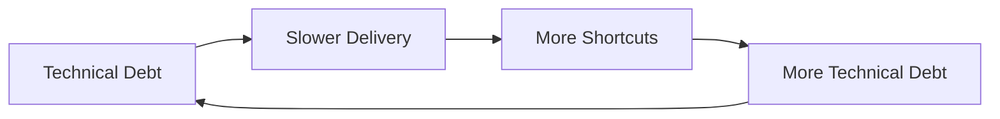
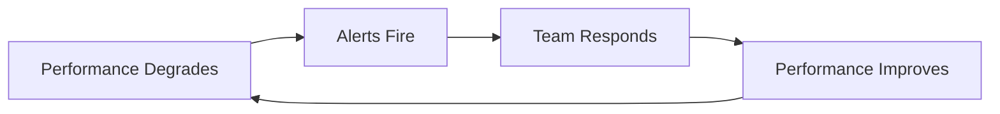
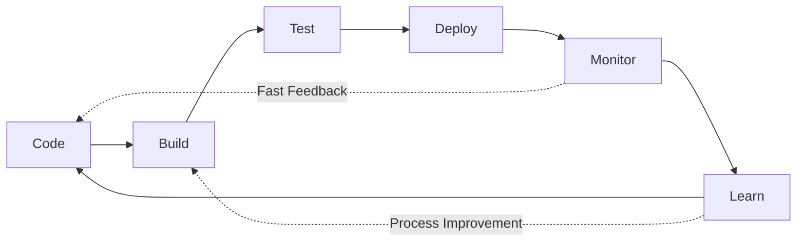

# First Principle #4: Systems Thinking

> "A system is never the sum of its parts. It's the product of their interactions." - Russell Ackoff

## Definition

Systems Thinking is the discipline of seeing wholes rather than parts, relationships rather than isolated entities, and patterns rather than snapshots. For engineering leaders, it means understanding that every technical and organizational decision creates ripple effects throughout a complex, interconnected system.

## Why Systems Thinking Is Critical

### The Iceberg Model
```
Events (What happened?) ←── 10% Visible
    ↓
Patterns (What trends emerge?)
    ↓
Structures (What rules create patterns?)
    ↓
Mental Models (What beliefs drive structures?) ←── 90% Hidden
```

Most leaders react to events. Systems thinkers reshape mental models.

### The Engineering System Reality

Your organization is not just code—it's:
- **Technical Architecture** (services, databases, networks)
- **Team Topology** (who talks to whom)
- **Process Flows** (how work moves)
- **Incentive Structures** (what gets rewarded)
- **Information Flows** (how knowledge spreads)
- **Power Dynamics** (who decides what)

Change any element, and the entire system responds—often unpredictably.

## Core Systems Thinking Concepts

### 1. Feedback Loops

#### Reinforcing Loops (Positive Feedback)
Amplify change in the same direction:


#### Balancing Loops (Negative Feedback)
Push back against change:


### 2. System Archetypes

#### Tragedy of the Commons
**Pattern**: Shared resource depleted by individual optimization
**Engineering Example**: Everyone using the production database for testing
**Solution**: Create sustainable policies and alternatives

#### Shifting the Burden
**Pattern**: Quick fixes prevent addressing root causes
**Engineering Example**: Constantly restarting services instead of fixing memory leaks
**Solution**: Invest in permanent solutions despite short-term pain

#### Limits to Growth
**Pattern**: Growth creates constraints that limit further growth
**Engineering Example**: Monolith grows until deploy time makes iteration impossible
**Solution**: Recognize and address constraints before they bind

### 3. Emergence

Properties that arise from interactions, not components:
- **Conway's Law**: System architecture mirrors organizational structure
- **Culture**: Emerges from thousands of daily interactions
- **Technical Debt**: Emerges from accumulated shortcuts
- **Innovation**: Emerges from psychological safety + slack time

### 4. Leverage Points (Donella Meadows)

Where to intervene in a system (increasing impact):
1. **Numbers** (constants, parameters) - Least impact
2. **Material flows** (who can access what)
3. **Regulating loops** (controls and feedback)
4. **Information flows** (who knows what when)
5. **Rules** (incentives, constraints)
6. **Distributing power** (who makes rules)
7. **Goals** (purpose of system)
8. **Paradigms** (mindset creating system) - Most impact

## Systems Thinking in Engineering Leadership

### Architectural Systems

#### Microservices: A Systems View
```
Decomposition Benefits:
+ Team autonomy
+ Independent deployment
+ Fault isolation
+ Technology diversity

System Costs:
- Network complexity
- Data consistency challenges
- Operational overhead
- Cognitive load

Emergent Properties:
* Distributed systems failures
* Organizational silos
* Innovation at edges
* Integration nightmares
```

### Organizational Systems

#### Team Topology Patterns

**Stream-Aligned Teams**
- Own full value stream
- Direct customer feedback loop
- Risk: Local optimization

**Platform Teams**
- Provide internal services
- Enable stream teams
- Risk: Ivory tower syndrome

**Enabling Teams**
- Spread practices
- Break silos
- Risk: Lack of ownership

**Complicated Subsystem Teams**
- Deep expertise
- Handle complexity
- Risk: Knowledge bottlenecks

### Process Systems

#### The DevOps Feedback System


Optimize the whole flow, not individual stages.

## Common Systems Failures

### 1. Local Optimization
**Symptom**: Each team hits their metrics, company fails
**Example**: QA finds all bugs (metric met) by making releases impossible
**Fix**: Align metrics to global outcomes

### 2. Unintended Consequences
**Symptom**: Solution creates worse problems
**Example**: Forcing code coverage leads to meaningless tests
**Fix**: Consider second-order effects

### 3. Policy Resistance
**Symptom**: System pushes back against changes
**Example**: Mandating documentation that no one reads
**Fix**: Understand why system resists

### 4. Delayed Feedback
**Symptom**: Cause and effect separated by time
**Example**: Technical debt impact shows up years later
**Fix**: Create faster feedback loops

## Systems Thinking Tools

### 1. Causal Loop Diagrams

Map relationships and feedback loops:
```
[Team Stress] ─(+)→ [Errors] ─(+)→ [Rework]
      ↑                              │
      └──────────(+)─────────────────┘
```

### 2. Stock and Flow Models

Track accumulations and rates:
- **Stock**: Technical debt (accumulation)
- **Inflow**: New shortcuts taken
- **Outflow**: Refactoring completed

### 3. Systems Mapping Exercise

For any initiative:
1. **Identify stakeholders** (who's affected?)
2. **Map interactions** (who influences whom?)
3. **Find feedback loops** (what reinforces/balances?)
4. **Locate leverage points** (where's maximum impact?)
5. **Anticipate resistance** (what will push back?)

### 4. The Five Whys (Systems Version)

Traditional:
1. Why did service fail? → Memory leak
2. Why memory leak? → Poor code
3. Why poor code? → Rushed deadline
4. Why rushed? → Bad estimation
5. Why bad estimation? → No historical data

Systems Thinking Addition:
6. Why no data? → No learning culture
7. What reinforces this? → Blame for failures
8. What would change it? → Psychological safety

## Applying Systems Thinking

### Case Study: Performance Crisis

**Event**: Application response time degrades

**Pattern Analysis**:
- Happens every 3-4 months
- Correlates with feature releases
- Affects customer satisfaction

**Structure Investigation**:
- No performance testing in CI/CD
- Features prioritized over maintenance
- Performance not in team metrics

**Mental Model Discovery**:
- "Performance is Ops problem"
- "Features drive revenue"
- "We'll optimize later"

**Systems Intervention**:
1. Add performance to Definition of Done
2. Create performance budget
3. Make teams own their service performance
4. Celebrate performance improvements
5. Show performance→revenue correlation

**Result**: Self-reinforcing performance culture

### Decision Framework: Systems Impact Analysis

Before any major decision:

```markdown
## Systems Impact Checklist
- [ ] Who are all stakeholders?
- [ ] What processes will change?
- [ ] What new feedback loops created?
- [ ] What existing loops disrupted?
- [ ] Where might resistance emerge?
- [ ] What are 2nd/3rd order effects?
- [ ] How will we know if it's working?
- [ ] What's our rollback plan?
```

## Interview Applications

### Systems Thinking Demonstration

#### Story Types That Show Systems Mastery

1. **Fixing root causes** not symptoms
2. **Predicting unintended consequences** and mitigating
3. **Designing feedback loops** for continuous improvement
4. **Breaking reinforcing negative cycles**
5. **Aligning systems** (technical, organizational, incentive)

#### Power Phrases
- "Looking at the system holistically..."
- "I recognized this was a systems problem when..."
- "To avoid unintended consequences..."
- "The feedback loops told us..."
- "By changing the underlying structure..."

### Example Answer

```
Situation: Deployment failures increasing, teams blamed each other

Systems Analysis:
- Mapped deployment process end-to-end
- Found 7 handoffs between 4 teams
- Each optimized their part, overall system failed
- No shared metrics or feedback loops

Intervention:
- Created cross-functional deployment team
- Shared ownership of deployment success metric
- Built automated feedback at each stage
- Weekly system-wide retrospectives

Result: 
- Deployment failures dropped 85%
- Mean time to deploy improved 3x
- Teams started collaborating proactively

Learning: Conway's Law in action - we had to restructure 
teams to fix the technical system
```

## Developing Systems Thinking

### Practices for Leaders

1. **Draw the System**
   - Visualize any problem as boxes and arrows
   - Look for loops, not just linear flows

2. **Extend Time Horizons**
   - Ask "then what happens?" repeatedly
   - Consider 2nd and 3rd order effects

3. **Find the Constraint**
   - Theory of Constraints: improve the bottleneck
   - Everything else is waste

4. **Question Boundaries**
   - Systems nest inside larger systems
   - Problems often come from boundary definitions

### Team Exercises

1. **Causal Loop Mapping**
   - Pick a recurring problem
   - Map all contributing factors
   - Find reinforcing loops
   - Identify intervention points

2. **Systems Storytelling**
   - Share stories of unintended consequences
   - Analyze what system dynamics created them

3. **Bottleneck Hunting**
   - Map value stream
   - Measure flow at each stage
   - Fix bottleneck, repeat

## Connection to Other Principles

- **[Value Creation](../value-creation/)**: Value flows through systems - optimize the whole value stream, not local parts
- **[Decision-Making](../decision-making/)**: Decisions have system-wide impacts - consider ripple effects before choosing
- **[Human Behavior](../human-behavior/)**: Humans adapt to system incentives - design systems that bring out the best in people
- **[Integrity & Ethics](../integrity-ethics/)**: Systems must be designed ethically - embed fairness and transparency in structures

## Red Flags: When You're Not Thinking in Systems

- Solving the same problems repeatedly
- Surprises from "unexpected" consequences
- Teams optimizing metrics but company struggling
- Changes that make things worse
- Resistance you "didn't see coming"

## Advanced Systems Concepts

### Requisite Variety (Ashby's Law)
A system must have as much variety as the environment it's controlling.
**Implication**: Your incident response must be as complex as potential incidents.

### Antifragility (Taleb)
Systems that gain from disorder.
**Engineering**: Chaos engineering, failure injection.

### Complex Adaptive Systems
Systems with emergent properties that can't be predicted from components.
**Examples**: Market dynamics, large-scale software systems, organizational culture.

## Application in Other Levels

### Level II: Core Business Concepts
- **[Strategy](../../level-2-core-business/strategy/)**: Strategic thinking requires systems perspective
- **[Operations](../../level-2-core-business/operations/)**: Operational excellence through systems optimization
- **[Risk & Governance](../../level-2-core-business/risk-governance/)**: Managing systemic risks

### Level III: Engineering Applications
- **[Organizational Design](../../level-3-applications/organizational-design/)**: Designing organizations as systems
- **[Technical Leadership](../../level-3-applications/technical-leadership/)**: Architecture as system design
- **[Business Acumen](../../level-3-applications/business-acumen/)**: Understanding business as a system

### Level IV: Interview Execution
- **[System Design](../../level-4-interview-execution/system-org-design/)**: Demonstrating systems thinking live
- **[Technical Leadership](../../level-4-interview-execution/technical-leadership/)**: Showing architectural systems mastery

## Next Steps

1. **Today**: Draw a system diagram of your current challenge
2. **This Week**: Identify one negative feedback loop to break
3. **This Month**: Teach systems thinking to your team
4. **For Interviews**: Prepare 3-5 stories showing systems mastery

---

*Continue your journey: Explore how [Integrity & Ethics](../integrity-ethics/) provides the moral foundation for sustainable systems, or see how [Operations](../../level-2-core-business/operations/) applies systems thinking to execution.*